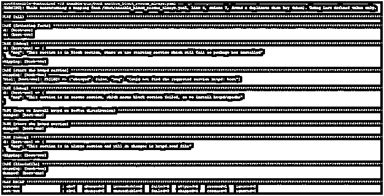

# 易变块

> 原文：<https://www.educba.com/ansible-block/>

## Ansible 块简介

在 Ansible，我们有很多这样的功能，可以让你的工作变得容易。一个这样的特性是 block，它使您能够通过对任务进行分组来运行一组任务，并提供了可用于错误处理的功能。几乎所有可以用任务完成的事情，都可以用块来完成，这样你就不用编写代码来为不同的任务部分设置任何数据或指令。对于错误处理，它提供了像 rescue 和 always **、**这样的特性，这些特性对于剧本的成功运行非常有用。在本文中，我们将通过深入研究 Ansible 块的细节和例子来了解它。

### 什么是 Ansible Block？

Ansible block 是一个使任务分组成为可能的特性，它可以像 Ansible 系统处理任务一样被处理。这意味着我们可以为任务设置数据或导数或任何其他特征参数，就像我们可以对 Ansible block 所做的那样。除此之外，我们还有使错误处理成为可能的参数。以下是在 Ansible 块中使用的关键字:–

<small>网页开发、编程语言、软件测试&其他</small>

*   **块:**在此参数下，我们定义了任务以及其他与任务相关的参数。一个块下的所有任务被视为一个组，因此，我们可以在此基础上设置特征参数
*   **Rescue:** 在此参数下，我们定义了当闭塞区段发生故障时需要执行的所有此类任务。这使得剧本继续运行，而不是在失败时暂停，但请注意，错误的语法或无法访问的主机是不可挽救的。
*   **Always:** 在此参数下，我们定义了所有那些无论程序块成功或失败都将运行的任务。

### Ansible 块是如何工作的？

为了使 Ansible block 成功运行，我们需要更加注意语法和缩进，因为一个特征参数将根据它在剧本中的缩进来实现。所有的条件句，变成等。任务级定义的相关参数将在该级运行，块级定义的所有参数将在按块分组的所有任务上实现。如果在任务级和块级都有定义，则优先考虑任务级。

**语法:**

`tasks:
- name: Few tasks will be executed block:
- name: Task 1
shell: <command to execute>
- name: Task 2
command: <commans to execute >
when: ansible_facts['distribution'] == 'RedHat' become_user: root
become: true`

对于错误处理，我们有一个 rescue 部分，当 block 部分处于 failed 状态时将调用该部分。如果 block 部分成功，那么 rescue 部分将不被调用。

语法如下所示:-

`tasks:
- name: Handling the error/failue status block:
- debug:
msg: 'This task is successful'
- name: This will force failue command: /bin/false
- debug:
msg: 'This task will not be executed' rescue:
- debug:
msg: 'As there was a failure in block section, rescue section will run'`

当我们有一个或一组无论如何都需要运行的任务时，不管 block 部分的状态如何。我们可以使用 always **，**，它们的语法如下:-

`tasks:
- name: Handling the error/failue status block:
- debug:
msg: 'This task is successful'
- name: This will force failue command: /bin/false
- debug:
msg: 'This task will not be executed' always:
- debug:
msg: 'I will run always'`

在 Ansible 的最新版本中，我们引入了一些变量，这些变量在处理 block 部分的故障时很有帮助

*   **ansible_failed_task** :获取失败并被触发的任务。
*   **ansible_failed_result** :捕获失败的失败结果。

在本节中，我们将通过看一些例子来学习如何测试 Ansible 块的功能。此外，在继续本部分之前，我们应该了解实验室环境。

这里我们有一个名为 ansible-controller **的 Ansible 控制器节点。**作为目标节点，我们有两台远程机器。第一台机器是名为 host-one 的 Red Hat Enterprise Linux 机器，第二台机器是名为 host-two 的 Ubuntu 机器。我们将在 Ansible 控制器机器上运行我们的剧本，并在远程目标机器上进行修改。

### 在 Ansible 中使用 Block 的示例

下面是可转换块的例子:

#### 示例#1

在本例中，我们将创建一个块，在名为 host-one 的远程主机上安装并启动 httpd 服务。为此，我们将创建一个包含以下内容的行动手册，并以非管理员 ec2 用户的身份运行。然后，我们将使用成为一个方法来运行命令作为根用户。此外，我们使用了一个条件来检查 Linux 发行版是否是 RedHat，然后只有它会运行。

**代码:**

`---
- hosts: host-one tasks:
- name: Install and Start HTTPD block:
- name: Install HTTPD yum:
name: httpd state: installed
- name: Start HTTPD service and enable service:
name: httpd state: started enabled: True
when: ansible_facts['distribution'] == 'RedHat' ignore_errors: yes
become_user: root become: true`

如下所示运行该行动手册将给出输出，您可以看到 httpd 服务首先安装在 host-one 上，然后在该主机上启动。服务启动需要服务器上的特权，所以这是通过 sudo 方法成为 root 用户来完成的。

`ansible-playbook ansible_block.yaml -v`

**输出:**

#### 实施例 2

在这个例子中，我们看到了 Ansible block、rescue 和 always 的错误处理功能。我们有一个如下的剧本:

**代码:**

`---
- hosts: all tasks:
- name: Here we are starting a service. block:
- debug:
msg: "This section is in Block section, where we are starting service which will fail as package not installed"
- name: start the httpd service service:
name: httpd state: started
when: ansible_distribution == "RedHat" rescue:
- debug:
msg: "This section is in rescue section, which means block section failed, so we install httpd/apache"
- name: here we install httpd on RedHat distribution yum:
name: httpd
state: installed
- name: start the httpd service service:
name: httpd state: started
when: ansible_distribution == "RedHat" always:
- debug:
msg: "This section is in always section and will do changes in httpd.conf file"
- lineinfile:
path: /etc/httpd/conf/httpd.conf regexp: '^Listen '
insertafter: '^#Listen ' line: Listen 8080
when: ansible_distribution == "RedHat"`

现在运行这个剧本将给出下面的输出，我们可以看到当条件满足时，检查 Linux 发行版等于 RedHat。Ansible 尝试在远程主机上启动该服务，但由于远程主机上未安装 httpd 包而失败。因此，发生了错误并调用了 rescue 部分，在那里安装了包并启动了服务，然后在 always 部分中，对 httpd.conf 进行了更改。

`ansible-playbook ansible_block_rescue_always.yaml`

**输出:**

### 结论

正如我们在本文中看到的，Ansible Block 可能是您的 Ansible 技能的重要组成部分，您必须拥有它才能高效地工作，尤其是在生产环境中，在生产环境中，错误处理和成功运行是重中之重。所以先学习它，然后最大限度地使用它。

### 推荐文章

这是一个关于 Ansible Block 的指南。在这里，我们讨论什么是 Ansible Block 及其语法，以及示例和代码实现。您也可以浏览我们推荐的其他文章，了解更多信息——

1.  [ansi ble 命令简介](https://www.educba.com/ansible-commands/)
2.  [Terraform 与 ansi ble–主要差异](https://www.educba.com/terraform-vs-ansible/)
3.  [十大可回答的面试问题](https://www.educba.com/ansible-interview-questions/)
4.  可变滤镜|如何工作？

