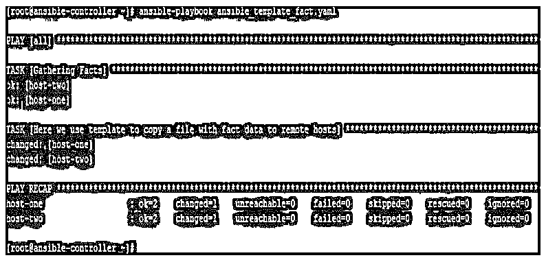
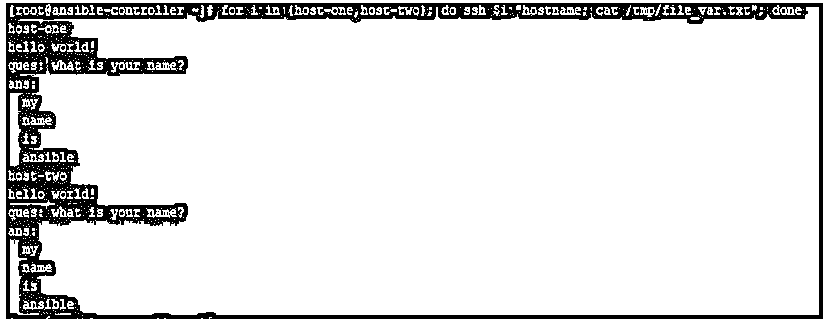

# 可转换模板

> 原文：<https://www.educba.com/ansible-template/>

## Ansible 模板简介

Ansible 提供了一个非常有用的名为 template 的模块，它使您能够使用模板，在这里您可以利用可用的变量，使用条件来生成特定的案例数据，使用过滤器、语句和注释来为模板用户提供更多的信息。然后使用该模板将一串数据从控制器节点复制或发送到远程节点，并且当变量在从每个远程节点获取后存储事实值时，可以基于远程节点生成该数据。对于 Windows，同样可以通过 win_template 模块实现，差别不大。

### 什么是 Ansible 模板？

在 Ansible 中，模板模块用于将数据从控制器节点复制到远程主机，这些数据是基于 jinja2 模板生成的。在 jinja2 模板中，我们可以给出纯文本，它将按原样传输到远程主机。除了纯文本之外，我们还可以给出变量，这些变量可以是默认变量，如可回答的事实，也可以在行动手册中定义，或者包含在行动手册的变量文件中。模板由 jinja2 模板引擎处理。此外，这些模板的格式化方式也是一个重要的方面。

<small>网页开发、编程语言、软件测试&其他</small>

### Ansible 模板是如何工作的？

在使用 ansible 模板模块时，我们至少需要使用以下两个参数:

*   **src** :相对或绝对路径的模板文件的来源。
*   **dest** :远程主机上要复制这个模板的目的地。如果只给出目录路径，那么将创建一个与模板同名的文件。

下面给出了可用于 ansible template 模块以及 src 和 dest 的其他参数。

*   **强制:**默认情况下，该参数设置为“是”。这意味着如果目标位置上存在现有文件，并且文件模板任务将要创建的文件存在一些差异，则目标文件将被覆盖。如果您将该参数设置为‘否**’**，那么它不会替换现有文件。
*   **模式:**如果你想明确的设置目的文件的权限，那么你可以使用这个参数，在这个下赋予权限。
*   **备份:**如果文件已经存在，并且您不想替换它，则使用该参数并设置为“是”。这样，每次从控制器节点推送具有相同名称的新文件时，远程主机上的旧文件将被重命名，并且名称将包含其被重命名的日期和时间。
*   **所有者:**设置远程主机上文件的所有者。
*   **group:** 设置远程主机上文件的组所有者。
*   **newline_sequence:** 指定用于模板文件的换行符序列。可接受的值是\n，\r，\r\n，对于 win_template，\r\n 是默认值。
*   **变量:{{ and}}之间提到的**。
*   **selevel、serole、setype 和 seuser:** 它们与 SELinux 文件上下文相关。

### Ansible 模板示例

下面是提到的例子:

现在，通过使用示例，我们将看到一个可行的模板，我们可能要在日常操作中使用它。这里我们有一台名为 ansible-controller 的 Ansible 控制机器和两台名为 host-one 和 host-two 的远程 Linux 主机。我们将创建剧本，在 ansible-controller 节点上运行 ansible 命令，并管理远程主机。

#### 示例#1

在这个例子中，我们将使用一个 jinja2 模板来看看它如何被转换成字符串并被复制到 remotehosts 上的一个文件中。

为此，创建一个包含以下内容的行动手册:

**代码:**

`hosts:
all
tasks:
name: Here we use template to copy a plain text file to remotehosts template:
src: plain.j2
dest: /tmp/file.txt`

jinja2 模板文件只有如下内容的纯文本:

**代码:**

`This is just a sample.`

部署本行动手册后，我们将获得如下输出:

**输出:**

#### 实施例 2

在这个例子中，我们将使用一个 jinja2 模板来看看它如何被转换成字符串并被复制到远程主机上的一个文件中。

为此，创建一个包含以下内容的行动手册:

**代码:**

`hosts:
all
tasks:
name: Here we use template to copy a file with fact data to remotehosts template:
src: fact.j2
dest: /tmp/file_fact.txt`

jinja2 模板文件包含以下内容，我们在这些内容中使用了 ansible 事实:

**代码:**

`the hostname of this file is {{ ansible_hostname }} and its ip address is {{ ansible_all_ipv4_addresses }}`

部署本行动手册后，我们将获得如下输出:

**输出:**

#### 实施例 3

在这个例子中，我们将使用一个 jinja2 模板来看看它如何被转换成字符串并被复制到远程主机上的一个文件中。

为此，创建一个包含以下内容的行动手册，并定义变量:

**代码:**

`hosts:
all vars:
var1:
"hello"
var2:
"my"
"name"
"is"
"ansible"
tasks:
name: Here we used the variables defined in playbook in jinja2 template template:
src: template_var.j2
dest: /tmp/file_var.txt`

jinja2 模板文件有以下内容:

**代码:**

`{{ var1 }} world!
ques: what is your name? ans:

{{ vars }}
`

部署本行动手册后，我们将获得如下输出:

**输出:**

这里，请注意在 jinja2 模板中，endfor 如下。我们在“%”后面加了一个“-”

**代码:**

``

如果我们不把它和下面一样只作:

**代码:**

``

输出如下所示:

**输出:**

因此，这里的'-'用于删除块尾的空白。

### 结论

在 Ansible 中，我们可以使用模板模块高效地工作并产生可量化的结果。当你不想使用 Jinja2 模板时，也有其他的模块，比如复制模块，它提供了模板模块的一些特性。但是，使用更多的功能配备模块使任务执行顺利，并充分利用功能，使您能够用更少的代码做更多的任务。

### 推荐文章

这是一个 Ansible 模板的指南。在这里，我们讨论什么是可行的模板与工作和各自的例子。您也可以看看以下文章，了解更多信息–

1.  [可变循环](https://www.educba.com/ansible-loop/)
2.  [可翻译版本](https://www.educba.com/ansible-versions/)
3.  YAML
4.  [可旋转拱顶](https://www.educba.com/ansible-vault/)

