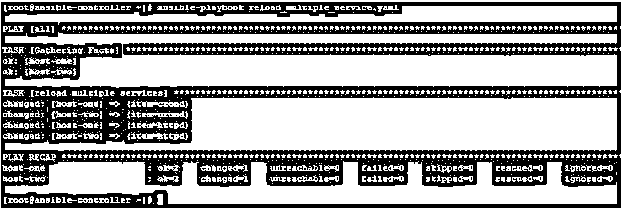
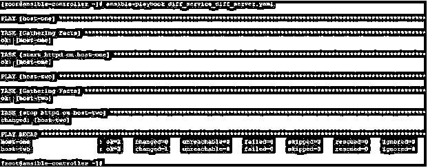

# 可变服务模块

> 原文：<https://www.educba.com/ansible-service-module/>

## Ansible 服务模块简介

Ansible 有许多内置模块，您可以根据需要创建许多自定义模块。模块的重要性取决于它们所做的工作和你要推动改变的节点。对于 Unix/Linux 远程主机来说，一个重要的模块是服务模块，它支持 systemd、sysV、BSD init、OpenRC 等 init 系统。在本文中，我们将尝试理解 ansible 服务模块，它的各种选项和工作方式。

### 什么是可行的服务模块？

由于服务模块用于 Unix/Linux 机器，类似地，对于 windows，有一个类似的模块，名为 win_service module。此外，如果远程主机使用 systemd 来管理其上的服务，那么有另一个名为 system 的模块可用于从一个可控制节点管理远程主机上的服务。像任何其他模块一样，Ansible 服务模块带有一些参数，这些参数有自己的选项或可接受的值。使用这些带有所需值的参数，我们可以通过停止、启动、重新加载等操作来管理服务。在远程主机上。我们将在本文的后续部分看到这些操作。

<small>网页开发、编程语言、软件测试&其他</small>

### 可变服务模块的参数和选项

在 Ansible 中，以下是可用于管理远程主机上的服务的可用参数:–

**1。Enable:** 设置开机时是否启动服务。以下是可以接受的

*   **是**:如果应该的话。
*   **否**:如果不应该。

**2。名称:**服务的名称。它接受字符串作为服务。

**3。Sleep:** 如果使用了 restart，那么这个值将是服务停止和开始之间的等待时间。但是系统不支持。它接受整数值作为等待睡眠的秒数。

**4。状态**:定义所需的服务状态，如果不是所需的状态，则使用服务进行操作。这接受以下值:–

*   **已启动**:如果没有启动服务。
*   **停止**:如果没有停止服务。
*   **重启**:通过弹跳重启服务。
*   **reloaded** :重新加载一个服务意味着如果还没有开始就开始。

**5。使用:**如果在远程主机上有服务管理器的首选项，则这可以是其他方式，默认情况下，服务模块使用 ansible_service_mgr 事实来自动检测远程主机上的服务管理器。

**6。模式:**如果状态命令没有响应给定的服务名。然后，您可以使用一个子字符串作为模式来检查 ps 命令的输出，然后检查远程主机上的匹配过程以获得该模式值。如果找到匹配，则服务被假定为

### 可行服务模块的示例

在我们开始之前，让我们先了解一下我们在这里使用的环境。我们有两个名为 host- one 和 host-two 的节点，它们由 Ansible Control 服务器 ansible-controller 管理。

#### <u>1。启动服务</u>

 <u>使用 ansible 命令启动服务，但是输出将是 JSON 格式等等

`ansible all -m service -a "name=httpd state=started"`

类似地，为了使用 ansible-playbook 完成相同的任务，您需要创建一个如下所示的文件:

**代码:**

`- hosts: all tasks:
- name: starting a service service:
name: httpd state: started`

然后使用下面的命令运行它，这将在目标节点上启动 httpd 服务。

`ansible-playbook start_service.yaml`

**输出:**

#### <u>2。停止服务</u>

 <u>使用 ansible 命令停止服务:

`ansible all -m service -a "name=crond state=stopped"`

类似地，为了使用 ansible-playbook 完成相同的任务，您需要创建一个如下所示的文件:

**代码:**

`- hosts: all tasks:
- name: stopping a service service:
name: httpd state: stopped`

然后使用下面的命令运行它，这将在目标节点上启动 httpd 服务。

`ansible-playbook stop_service.yaml`

**输出:**

#### <u>3。重新启动服务</u>

 <u>使用 ansible 命令重新启动服务:

`ansible all -m service -a "name=httpd state=restarted"`

类似地，为了使用 ansible-playbook 完成相同的任务，您需要创建一个如下所示的文件:

**代码:**

`- hosts: all tasks:
- name: restarting a service service:
name: httpd state: restarted`

然后使用下面的命令运行它，这将在目标节点上启动 httpd 服务。

`ansible-playbook restart_service.yaml`

**输出:**

#### 4.启动并启用服务

使用 ansible 命令启动并启用服务，以便该服务将在服务器上自动启动:

`ansible all -m service -a "name=httpd state=started enabled=yes"`

类似地，为了使用 ansible-playbook 完成相同的任务，您需要创建一个如下所示的文件:

**代码:**

`- hosts: all tasks:
- name: starting and enabling a service service:
name: httpd state: started enabled: yes`

然后使用下面的命令运行它，这将在目标节点上启动 httpd 服务。

`ansible-playbook start_enable_service.yaml`

**输出:**

#### <u>5。在一个行动手册中处理多个服务</u>

 <u>为了使用 ansible-playbook 完成这项任务，您需要创建一个如下所示的文件:

**代码:**

`-hosts: all tasks:
-name: reload multiple services service:
name: "{{ item }}" state: reloaded with_items:
-crond
-httpd`

然后使用下面的命令运行它，这将在目标节点上启动 httpd 服务。

`ansible-playbook reload_multiple_service.yaml`

**输出:**

#### 

#### 6.在不同的服务器上工作方式不同

为了使用 ansible- playbook 完成这项任务，您需要创建一个如下所示的文件:

**代码:**

`hosts: host-one tasks:
name: start httpd on host-one service:
name: httpd state: started
hosts: host-two tasks:
name: stop httpd on host-two service:
name: httpd state: stopped`

然后使用下面的命令运行它，这将在目标节点上启动 httpd 服务。

`ansible-playbook diff_service_diff_server.yaml`

**输出:**

#### <u>7。捕捉输出&显示</u>

 <u>为了使用 ansible-playbook 完成这项任务，您需要创建一个如下所示的文件:

**代码:**

`hosts: host-one tasks:
- name: start service crond service:
name: crond state: started enabled: true
register: service_output
debug: var=service_output.state`

然后使用下面的命令运行它，这将在目标节点上启动 httpd 服务。

`ansible-playbook service_operation_status.yaml`

**输出:**

### 结论

Ansible service module 是远程自动化基础架构配置管理时经常需要的模块之一。虽然它没有太多的选项和参数，但由于这是基本模块之一，所以在生产环境中需要您的实际操作经验。

### 推荐文章

这是一份关于 Ansible 服务模块的指南。在这里，我们讨论什么是 Ansible 服务模块及其不同的参数，以及示例和代码实现。您也可以浏览我们推荐的其他文章，了解更多信息——

1.  [可执行的命令](https://www.educba.com/ansible-commands/)
2.  [可行的架构](https://www.educba.com/ansible-architecture/)
3.  [可变滤波器](https://www.educba.com/ansible-filters/)
4.  [Ansible Debug](https://www.educba.com/ansible-debug/)

</u></u></u></u></u>