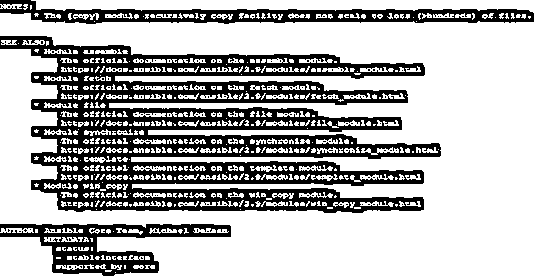
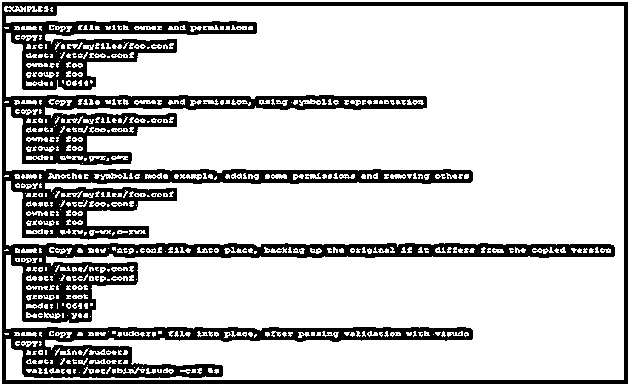
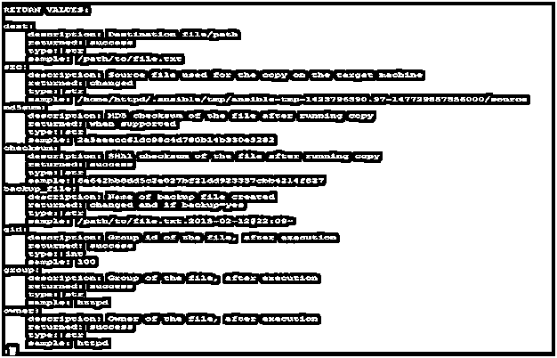
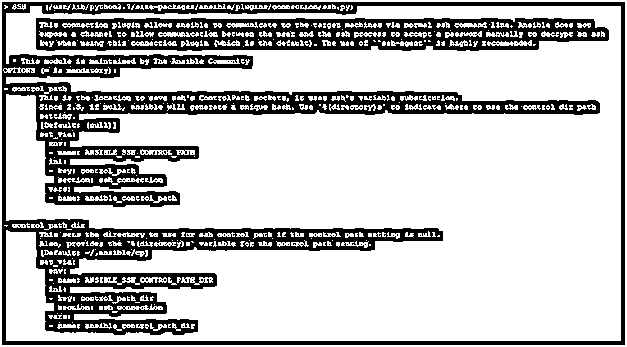
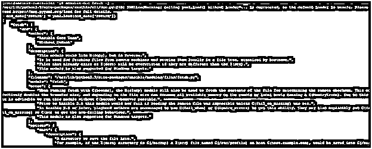
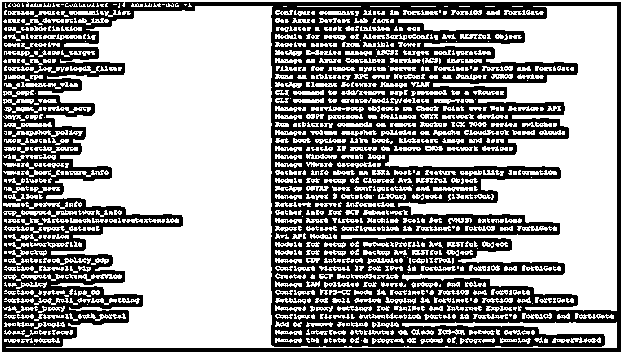

# 可回答文档

> 原文：<https://www.educba.com/ansible-doc/>

## ansible-doc 简介

Ansible-doc 是由核心 Ansible 包提供的一个工具，它包含了与 Ansible 库中安装的模块和插件相关的所有文档。这相当于命令行提示符下的一个命令。这个工具/命令可以通过提供关于插件和模块的文档、它们的使用、简短描述、可用参数和相关选项来指导您。除此之外，Ansible-doc 还提供了大多数可用模块和插件的示例片段，可以直接在剧本中使用。此外，对于定制的或自建的非默认模块，当我们必须通过文档提供相关信息时，Ansible-doc 被设置为用于从库中读取该文档。

### 语法和参数

Ansible-doc 作为 Linux/Unix 命令工作。存在某些参数和相关的可接受以及默认选项。下面是其中的一些参数，如果不是全部的话。使用 Ansible-doc 时必须记住这些。还要指出的是，如果您不知道如何使用它或者在某个时刻忘记了它，只需记得运行下面的命令来获得关于这个命令行工具的详细信息。

<small>网页开发、编程语言、软件测试&其他</small>

**语法:**

`ansible-doc -h`

**或**

`ansible-doc ---help`

对于语法，我们必须提供相关的模块名来获取所有相关的文档。比如下面:—

`ansible-doc <module name>`

类似地，对于插件，我们必须像下面这样使用来获得插件的细节:-

`ansible-doc –type <plugin type>`

以下是可用参数和相关可用选项的列表。

*   **-v "**或**"–版本":**显示已安装 Ansible 的版本
*   **"-F"** 或**"列表 _ 文件":**显示插件的名称及其相关源代码
*   **"-M"** 或**"—模块路径":**指定模块库路径，如果有多个，则分开，默认为' ~/'。ansi ble/plugins/modules:/usr/share/ansi ble/plugins/modules '。
*   **-j "**或**"-json ":**以 JSON 显示输出
*   **-l "**或**"–列表":**显示可用列表
*   **-s "**或【T2 " snippet ":指定外挂显示剧本
*   **【t】**或**【类型】:**选择插件类型；默认为模块；可用的插件有 vars、strategy、module、shell、netconf、lookup、inventory、httpapi、connection、cliconf、callback、cache、become。

### ansible-doc 的工作

Ansible module 是一个命令行工具，它就像 Linux 上的另一个命令一样工作。当我们正在创建一个剧本并且不确定任何模块或插件时，我们将使用 ansible-doc 来阅读相关插件或模块的文档。这让我们理解插件或模块的洞察力以及使用它们的相关可能性。

此外，在使用 ansible-doc 时，必须了解以下几点:

*   ANSIBLE-CONFIG 变量被定义为覆盖默认配置
*   对于默认配置,/etc/ansible/ansible.cfg 或~/.ansible.cfg 文件将是
*   应该正确配置环境，以便使用 Ansible-doc。
*   Ansible-doc 命令有手册页和信息页可供参考
*   当您创建自定义模块时，文档部分是一个重要的方面，其语法如下:

`DOCUMENTATION = '''
---
module: sample_module short_description: Description of module # ... continue below with other fields ... '''`

### ansible-doc 的示例

在本节中，我们将看到一些使用 ansible-doc 的实际例子，以及如何在实际环境中使用它。为此，我们有一个实验室设置，其中有我们的 Ansible 控制器节点，我们从这里运行行动手册或 Ansible 命令。命令行工具 ansible-doc 将不会在远程目标机器上运行，但我们将仅在 ansible 控制器节点上使用它，因为这是一个提供文档的工具，而不是在远程主机上执行任何更改。

#### 示例#1

在这个例子中，我们将看到如何获取 Ansible 模块副本**的文档。**为此，我们将运行下面的命令并查看输出。

**命令:**

`ansible-doc copy`

在输出中，我们可以看到下面的内容

*   描述
*   因素
*   可用选项和默认值

**输出:**

*   笔记
*   在线的
*   作者

**例题**

**返回值**

#### 实施例 2

在这个例子中，我们将看到如何获得插件的细节/文档。插件列表包括变量、策略、模块、shell、netconf、查找、库存、httpapi、连接、cliconf、回调、缓存、成为插件。我们将运行如下命令来检查连接插件的使用情况:

**命令:**

`ansible-doc -t connection -l`

输出如下所示，在这里我们可以看到这个插件下的可用特性:

**输出:**

现在，为了展示 ssh 插件的用法和更多细节，我们可以运行如下命令:

**命令:**

`ansible-doc -t connection -s ssh`

**输出:**

#### 实施例 3

在本例中，我们将只看到模块的可用参数。这是不同的，因为在这里我们只看到小的细节，而不是其他信息，如参考，例子等。为此，我们使用“-s”来代表代码片段。在这里，我们正在检查易重启模块的输出。

**命令:**

`ansible-doc -s reboot`

在输出中，我们可以看到只显示了参数的小细节:

**输出:**

#### 实施例 4

出于某种原因，如果您想看到 JSON 格式的输出，那么您可以使用选项"-j "来实现。就像下面的命令一样，我们看到的是 JSON 格式。

**命令:**

`ansible-doc fetch -j`

**输出:**

#### 实施例 5

在本例中，我们将使用 ansible-doc 检查控制器系统上安装的 Ansible 包配置。为此我们有如下命令:

**命令:**

`ansible-doc --version`

输出如下，我们可以看到已安装的 Ansible 版本、配置文件、模块搜索路径、python 模块位置、python 的可执行文件位置和 python 版本。

**输出:**

#### 实施例 6

在这个例子中，我们可以看到列出所有可用模块的方法。为此，我们使用参数“-l”。

**命令:**

`ansible-doc -l`

**输出:**

同样，我们可以使用"-F "参数来获取所有带有源文件位置的模块:

**命令:**

`ansible-doc -F`

**输出:**

### 结论

正如我们在这篇文章中看到的，ansible-doc 是一个非常有用的工具，可以用来理解 ansible 的技术诀窍和现状。当您在脱机环境中工作并且没有其他参考可用时，此工具会对您有所帮助。因此，掌握如何使用 Ansible-doc 搜索信息的知识会让你变得自立。所以先学了再用。

### 推荐文章

这是 ansible-doc 的指南。在这里，我们讨论 ansible-doc 的介绍及其语法和参数，以及示例和不同的命令。您也可以浏览我们推荐的其他文章，了解更多信息——

1.  [ansi ble 命令简介](https://www.educba.com/ansible-commands/)
2.  [Terraform 与 ansi ble–主要差异](https://www.educba.com/terraform-vs-ansible/)
3.  [十大可回答的面试问题](https://www.educba.com/ansible-interview-questions/)
4.  可变滤镜|如何工作？

