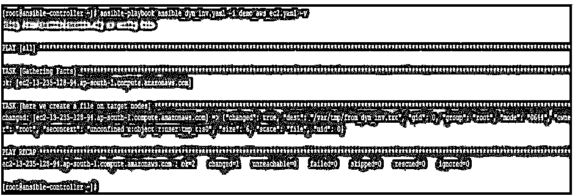
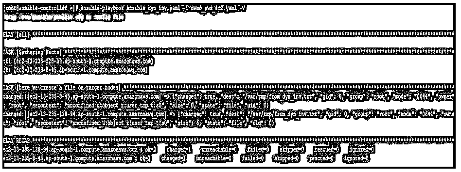

# 可变动态库存

> 原文：<https://www.educba.com/ansible-dynamic-inventory/>

## 静态动态库存简介

下面的文章提供了一个关于 Ansible 动态库存的概要。Ansible 需要库存文件来获取目标节点信息，以便在其上运行任务或游戏。库存文件可以是静态的，也可以是动态的。我们非常清楚，在大多数生产环境中，使用静态库存是不现实的。因为静态文件是手动管理的，但实际上，基础设施环境会非常频繁地不断变化。我们总是创建新的节点并删除不需要的节点，这种做法非常普遍，而且经常发生，尤其是在云和容器环境中。因此，在这种情况下，我们需要动态清单，它根据某些标准实时从基础架构环境中获取节点列表。

### 什么是动态库存？

对于业务需求，我们需要非常频繁地创建、删除和修改基础架构环境中的主机，并且通过 Ansible 管理这些节点，需要非常频繁地更新清单文件。所以，静态库存文件是不合适的。在这种情况下，我们需要一个可以自我更新的库存文件。

<small>网页开发、编程语言、软件测试&其他</small>

这种类型的库存文件称为动态库存文件，它具有动态内容。在我们的环境中，主机节点的来源可以是 AWS、OpenStack、Cobbler、LDAP 系统。这些系统有它们的节点列表和 Ansible 支持来集成这样的外部动态清单。

在 Ansible 中，我们有两种方式连接到外部动态库存:

*   **Via Scripts:** 这是比较老的方式，保证了向后兼容性。但是不要在最新版本中使用它。
*   **使用插件:**这比动态清单的脚本更推荐，因为插件用 Ansible 核心代码更新以利用它。

除了这两个，如果有人想使用 GUI，那么可以使用 RedHat Ansible Tower 或 AWX 的免费版本，这些与远程主机的源代码集成，并提供了图形库存编辑器的良好视图。

### Ansible 动态库存是如何工作的？

在 Ansible 中，动态清单是由用 python、php 等编程语言编写的脚本生成的。或者使用可用的库存插件。使用脚本时，他们从目标源环境获取所有实时数据，如云平台 AWS、OpenStack、GCP 等。Ansible 社区已经为 AWS、OpenStack、GCP 等大多数平台开发了这样的脚本。这样的剧本也可以由你来写。但是使用脚本并没有很好的记录，而且每次使用脚本时都不成功，我们必须为源环境下载脚本并根据脚本设置 env 变量。

这些脚本由 Ansible 社区维护。大多数脚本都是用 python 编写的，命名为 ec2.py，open-stack_inventory.py。除了这些 python 脚本之外，还有设置环境所需的 ini 文件。但是这完全取决于您使用的脚本。在 Ansible 中，我们有一组可用的清单插件，它们与 Ansible 包打包在一起。同样，您可以创建自己的插件，以满足您的需求和远程节点的来源。库存以 JSON 格式返回商品列表。Ansible 提供了一系列清单插件，你可以使用它们来获得目标主机的列表，在这些主机上你可以运行任何任务或游戏。

使用以下命令，您可以获得可用清单插件的列表:

**代码:**

`ansible-doc -t inventory -l`

从这个列表中，你可以选择适合你的源环境的插件。

然后，您可以使用如下命令获得关于该插件的详细信息或文档:

**代码:**

`ansible-doc -t inventory <plugin name>`

下面是 Ansible 2.9.7 可用的清单插件列表。这个列表可能会在 Ansible 的未来版本中更新。

*   nmap
*   主机列表
*   icloud
*   openstack
*   填妥了吗
*   aws_ec2
*   cloudscale
*   virtualbox(虚拟方块)
*   建造
*   k8s
*   发电机
*   脚本
*   vmware _ 虚拟机 _ 库存
*   利诺德
*   码头 _ 机器
*   亚姆
*   在线的
*   azure_rm
*   docker_swarm
*   高级主机列表
*   领班
*   汽车
*   库伯维特
*   gitlab_runners
*   网络盒子
*   gcp_compute
*   aws_rds
*   openshift
*   汤姆
*   塔
*   scaleway
*   初始化设置文件的后缀名

要使用一个插件，你必须启用它，默认情况下在 ansible.cfg 中我们有 enable_plugins 参数定义它。此外，auto 被设置为默认值，它可以根据提供的文件识别要解析的正确插件。

但是要启用一个特定的清单插件，你必须给它一个完全限定的名字，就像下面 ansible.cfg 中的一样。

**代码:**

`[inventory] enable_plugins = namespace.collection_name.inventory_plugin_name`

启用插件后，我们必须向系统提供一个清单源来解析它。这是一个与库存或行动手册相对路径相同的文件。

**Note:** Ansible plugin inventory source file have specifications for it. So, documentation should be properly followed. Ansible uses listed plugins in the order they are mentioned against the inventory sources provided and once a source is matched any remaining enabled inventory plugins will not be considered for that source.

### 可变动态库存的例子

下面给出了可行的动态库存的例子:

由于这是 Ansible 中的一个高级特性，我们将使用一个非常有用且常见的清单插件 aws_ec2。

#### 示例#1

为此，我们创建一个名为 demo_aws_ec2.yaml 的源文件。

**代码:**

`plugin: aws_ec2 regions:
ap-south-1 filters:
tag:tagtype: testing`

此外，我们需要设置和导出至少以下 env 变量，以便与 AWS 环境建立连接。

这些值是您的帐户的访问密钥 ID 和秘密访问密钥。

*   AWS_ACCESS_KEY_ID
*   AWS_SECRET_ACCESS_KEY

完成上述操作后，您必须对您的 Ansible 控制器节点有以下要求:

*   Boto3
*   botocore

现在，在我们的环境中，我们有不同标记的 EC2 实例。

我们尝试使用如下标签获得相同的列表:

**代码**

`ansible-inventory -i demo_aws_ec2.yaml –graph`

**输出:**

我们将得到如下输出，因为我们只有一个 ec2 实例，它有一个与源文件匹配的标记:

#### 实施例 2

现在，我们像下面这样更新这个源文件，以使用匹配的 EC2 实例的私有 ipv4 地址:

**代码:**

`plugin: aws_ec2 regions:
ap-south-1 filters:
tag:tagtype: testing compose:
ansible_host: private_ip_address`

我们有一个样例剧本，用于在目标节点上创建一个文件，内容如下:

**代码:**

`hosts:
all tasks:
name: here we create a file on target nodes file:
state: touch
path: /var/tmp/from_dyn_inv.txt`

**代码:**

`ansible-playbook ansible_dyn_inv.yaml -i demo_aws_ec2.yaml -v`

**输出:**

#### 实施例 3

现在，当我们有了另一个 EC2，它具有与源文件匹配的条件，如相同的标记，理想情况下，剧本现在也应该自动在该主机上运行。

在更新另一个 EC2 实例的标记值后，首先检查匹配 EC2 实例的列表，如下所示:

**代码:**

`ansible-inventory -i demo_aws_ec2.yaml --graph`

**输出:**

#### 实施例 4

现在，当我们对此清单运行相同的行动手册时，将在两台主机上创建示例文件。

**代码:**

`ansible-playbook ansible_dyn_inv.yaml -i demo_aws_ec2.yaml -v`

**输出:**

### 结论

我们看到，使用和设置可变动态清单是一项复杂的任务，并且依赖于您设置它的环境。但是一旦设置完成，我们开始获得目标节点的实时列表，那么您至少可以从您的日常任务清单中去掉更新清单的任务。

### 推荐文章

这是一个可行的动态库存指南。这里我们讨论一下入门，什么是 ansible 动态库存？ansible 动态库存是如何工作的？还有例子。您也可以看看以下文章，了解更多信息–

1.  [可行的架构](https://www.educba.com/ansible-architecture/)
2.  [可翻译版本](https://www.educba.com/ansible-vault/)
3.  YAML
4.  [可执行的命令](https://www.educba.com/ansible-commands/)

