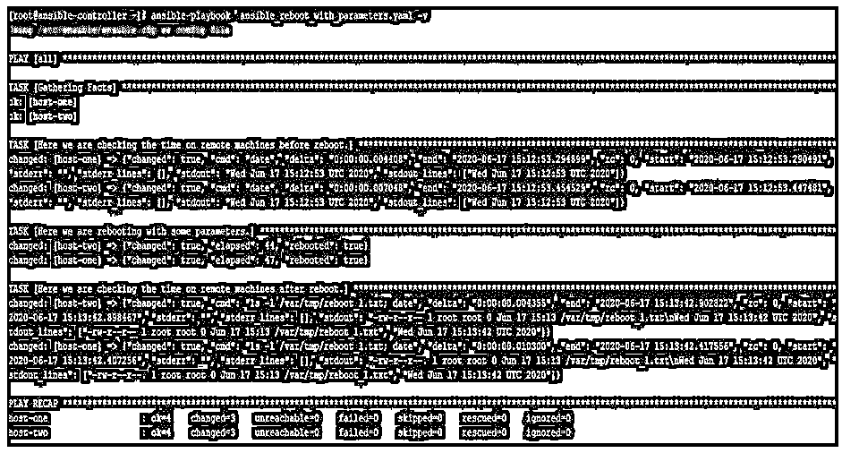

# 可恢复重启

> 原文：<https://www.educba.com/ansible-reboot/>

## Ansible Reboot 简介

Ansible 提供了大量的模块，这些模块可以直接替换我们的 Unix/Linux 命令，但是可以以比在脚本中使用类似命令更好的方式工作。一个这样的模块是可重启模块。这个模块代替了 Linux/Unix 系统上的 reboot 命令，但是可以以更好的方式工作。这意味着，我们可以重启远程目标机器，在重启前后进行一些检查和额外的延迟。对于 Microsoft Windows 环境，我们有一个名为 win_reboot 的类似模块。

### 什么是可重启？

该模块主要用于重启机器，等待成功停止和启动然后响应测试命令，以确认重启成功。在 Linux/Unix 机器上，它主要调用/sbin、/usr/sbin、/usr/local/sbin 路径下的 shutdown 命令。关机命令的路径可以通过参数 path 手动提供。

<small>网页开发、编程语言、软件测试&其他</small>

### Ansible Reboot 是如何工作的？

与任何其他 Ansible 模块一样，Ansible reboot 模块配备了一组参数和可接受的值。其中一些参数具有默认值，即使您没有在行动手册中提及相关参数，这些默认值也会在您的行动手册中体现出来。因此，了解这些变得更加重要。

下面列出了所有可用的参数以及相关的可接受值或默认值。

*   **test_command:** 该参数用于在重新启动任务后，在重新启动的主机上发出命令，并期望成功，以确认机器是否准备好执行剧本中的下一个任务。默认命令是“whoami”。
*   **search_paths:** 给出在远程目标机器上搜索关机命令的位置。使用此选项时，PATH 环境变量将默认为/sbin、/usr/sbin 和/local/usr/sbin。
*   **reboot_timeout:** 该时间以秒为单位，用于指定等待机器重启和响应测试命令的时间。这将单独评估验证和测试命令是否成功。这意味着执行的最大时间是这个值的两倍。默认情况下，它被设置为 600 秒。
*   **pre_reboot_delay:** 重新启动前等待的时间，这将被设置为基于*nix 的机器上重新启动的参数，这是以分钟为基础计算的，意味着秒被转换为分钟并向下取整。如果少于 1 分钟，则取为 0。默认值为 0。
*   **post_reboot_delay:** 这是重新启动后等待的时间，以秒为单位。在尝试验证系统重启之前。如果你想在重启后解决一些事情，这是很有用的。默认值为 0。
*   **connect_timeout:** 重启后重试前等待成功连接的时间，以秒为单位。
*   **消息:**默认消息是“Ansible 启动重启”。这是为了指定在重新启动前向工作用户显示的消息。

下面给出了返回值:

*   **经过的时间:**等待重启所经过的时间。
*   **重新启动:**如果机器成功重新启动，则为真。

### 可恢复重启的示例

下面是提到的例子:

这里我们有一个名为 ansible-controller 的 Ansible 控制器节点。作为目标节点，我们有两台远程机器。第一台机器是名为 host-one 的 Red Hat Enterprise Linux 机器，第二台机器是名为 host-two 的 Ubuntu 机器。我们将在 Ansible controller 机器上运行我们的剧本，并在远程目标机器上进行修改。

#### 示例#1

在本例中，我们有一个如下所示的剧本，其中我们只是重启目标机器。

**代码:**

`---
- hosts:
all
tasks:
- name: Here we are rebooting the remote machines. reboot:`

运行本行动手册，如下所示，略显冗长:

`ansible-playbook ansible_reboot.yaml -v`

在输出中，我们可以看到所有的输出和返回值，以计算出花费了多少时间以及重启是否成功。

`ansible-playbook --syntax-check ansible_reboot.yaml`

**输出:**
T3】

#### 实施例 2

在本例中，我们有一个如下所示的行动手册，其中我们以一定的前置和后置延迟重新启动目标计算机，然后使用一个命令来测试服务器是否已启动并准备好执行下一个任务。这里我们使用 test 命令作为“uptime”而不是默认的“whoami”。

**代码:**

`---
-hosts:
all
tasks:
-name: Here we are checking the time on remote machines before shell: date
-name: Here we are rebooting with some reboot:
pre_reboot_delay: 10
post_reboot_delay: 10 test_command: uptime
-name: Here we are checking the time on remote machines after shell: date`

运行本行动手册，如下所示，略显冗长:

`ansible-playbook ansible_reboot_with_parameters.yaml -v`

在输出中，我们可以看到所有的输出和返回值，以计算出测试命令的输出花费了多少时间。

**输出:**
T3】

#### 实施例 3

在这个例子中，我们有一个如下的剧本，其中我们使用一个测试命令来重新启动目标机器，以便在远程机器上创建一个样本文件。这是为了验证是否执行了测试命令来验证重启。

**代码:**

`---
-hosts:
all
tasks:
-name: Here we are checking the time on remote machines before shell: date
-name: Here we are rebooting with some reboot:
test_command: touch /var/tmp/reboot_1.txt
-name: Here we are checking the time on remote machines after shell: "ls -l /var/tmp/reboot_1.txt; date"`

现在按如下方式运行该行动手册:

`ansible-playbook ansible_reboot_with_parameters.yaml -v`

在下面的输出中，我们可以看到重启前后捕获的所有时间，以及作为重启验证创建的文件。

**输出:**

### 结论

正如我们在本文中看到的，Ansible Reboot 是一个您在日常管理或变更管理任务中肯定需要的模块。该模块使您能够灵活地重新启动。但是由于该模块将重新启动远程机器，这可能导致停机或中断。所以你只能在计划好的活动中使用它。所以先学了再用。

### 推荐文章

这是一个可重启的指南。这里我们讨论什么是可能的重启？ansible reboot 是如何工作的？还有例子。您也可以看看以下文章，了解更多信息–

1.  [可变组变量](https://www.educba.com/ansible-group_vars/)
2.  [可行的查找](https://www.educba.com/ansible-lookup/)
3.  可变防火墙
4.  [可转换的文件模块](https://www.educba.com/ansible-file-module/)

