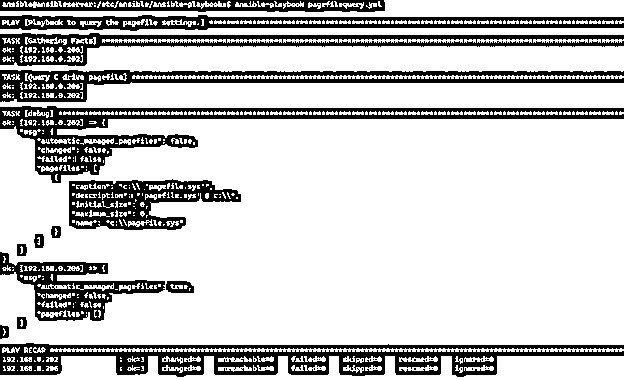
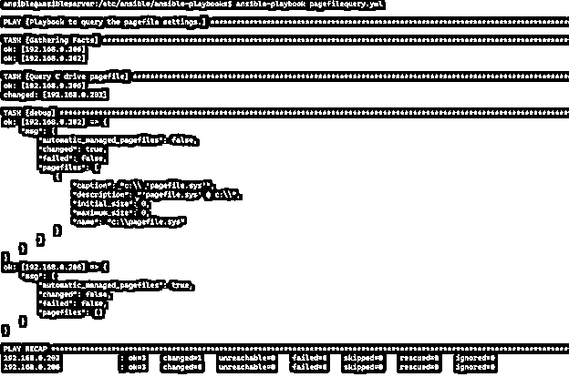

# Ansible 更改时间

> 原文：<https://www.educba.com/ansible-changed_when/>

## Ansible 简介 changed_when

Ansible changed_when 属性或参数定义为处理特定任务的输出。一旦任务在远程节点上被触发，根据返回代码或输出，我们可以确定任务是否应该在 Ansible 统计中报告，或者是否需要使用触发器来处理条件，条件可以用运算符连接，如“and”表示仅当满足多个条件时才触发任务，当满足任何条件时用“or”运算符连接。

**语法**

<small>网页开发、编程语言、软件测试&其他</small>

此命令的语法在{\\ F3 \\ F3 \\ F3 }时发生变化。

### ansible 中的 **changed_when** 命令是如何工作的？

当我们希望在输出已经基于条件改变的情况下执行任务时，我们使用 changed_when 命令。为了理解 changed_when 是如何工作的，我们将使用下面的例子。

我们有下面的 ansible-playbook，它从文本文件中获取内容。在本行动手册中，我们提到了不存在的文件。下面是剧本。

`---
- name: Ansible playbook to test changed_when condition
hosts: winservers
tasks:
- name: Get the content from the file
win_shell: gc c:\temp\servers22.txt`

剧本执行，

`ansible-playbook servicepb.yml`

**输出:**

如果我们看到输出，任务显示它失败了，这是意料之中的。所以让我们添加 ignore_errors 参数来忽略这个错误。

`tasks:
- name: Get the content from the file
win_shell: gc c:\temp\servers22.txt
ignore_errors: true
Playbook execution,
ansible-playbook servicepb.yml`

**输出:**

如果我们检查输出，在忽略错误后，playbook 输出说有所改变，但实际上，什么都没有改变。我们可以用 changed_when 参数来处理更改后的值。首先，我们需要知道任务的输出，为此，我们需要使用 register 参数将输出存储到变量中，并使用 debug 任务检索输出，如下所示。

`tasks:
- name: Get the content from the file
win_shell: gc c:\temp\servers22.txt
register: dirvar
ignore_errors: true
- debug:
msg: "{{ dirvar}}"`

**输出:**

一旦您检查了输出，我们就可以使用变量 output 来过滤我们的结果。我们可以应用 changed_when 来改变输出，如下所示。

`tasks:
- name: Get the content from the file
win_shell: gc c:\temp\servers22.txt
register: dirvar
ignore_errors: true
changed_when: "'Cannot find path' not in dirvar.stderr"
Playbook execution,
ansible-playbook servicepb.yml`

**输出:**

如果我们检查 play recap 部分的输出，它现在是 OK，而不是 changed，因为我们已经指定，如果“找不到路径”不在输出中，它将突出显示已更改的输出。

changed_when 命令不同于 when 和 failed_when 条件，在这两种情况下，我们使用“when”条件来运行任务，仅满足某些条件，而使用“failed_when”可以在满足某些或所有条件时使任务失败。

### Ansible changed_when 示例

以下是 Ansible changed_when 的示例:

#### 示例#1

如果文件内容不匹配，则更改剧本输出。

在本例中，剧本将从远程 windows 服务器检索文本文件内容，如下所示。

`---
- name: Ansible playbook to test changed_when condition
hosts: winservers
tasks:
- name: Get the content from the file
win_shell: gc c:\temp\servers.txt
register: dirvar
ignore_errors: true
- debug:
msg: "{{dirvar.stdout}}"
Playbook execution,
ansible-playbook servicepb.yml`

**输出:**

其输出改变= 1；我们需要，如果 servers.txt 文件包含“AD ”,那么只有输出应该显示为已更改；不然应该是可以的。所以我们将把 changed_when 条件放在任务中。

`tasks:
- name: Get the content from the file
win_shell: gc c:\temp\servers.txt
register: dirvar
ignore_errors: true
changed_when: dirvar.stdout.find('AD')==0
- debug:
msg: "{{dirvar.stdout}}"`

一旦我们运行输出服务器，. 202 不应该改变值，因为它不包含“AD”，但服务器. 206 服务器包含，它可以在下面的输出中看到。

剧本执行，

`ansible-playbook servicepb.yml`

#### 实施例 2

具有多个条件时发生变化。

我们可以在多个条件中使用 changed_when 参数，如本例中所述。

`---
- name: Ansible playbook to test changed_when condition
hosts: winservers
tasks:
- name: Check the spooler service
win_shell: get-service spooler | Select Status, StartType
register: servicevar
ignore_errors: true
changed_when: (servicevar.stdout.find("Stopped")==40) and (servicevar.stdout.find("Manual")==52)`

在上面的例子中，我们使用了多个条件，并用“and”操作符将它们组合起来。因此，如果假脱机服务停止并处于手动模式，那么服务输出会发生变化；不然就 OK 了。

我们也可以使用 or 操作符，因此如果任何条件为真，输出也为真。

`changed_when: (servicevar.stdout.find("Stopped")==40) or (servicevar.stdout.find("Manual")==52)`

您还可以提供如下所示的多个条件。它类似于“或”条件。

`tasks:
- name: Check the spooler service
win_shell: get-service spooler | Select Status, StartType
register: servicevar
ignore_errors: true
changed_when:
- servicevar.stdout.find("Stopped")==40
- servicevar.stdout.find("Manual")==52`

#### 实施例 3

windows 上页面文件设置的 changed_when 示例。

在本例中，我们在远程 windows 服务器上查询页面文件，如下所示。

`---
- name: Playbook to query the pagefile settings.
hosts: winservers
tasks:
- name: Query C drive pagefile
win_pagefile:
drive: c
register: pagevar
- debug:
msg: "{{ pagevar }}"`

剧本执行，

`ansible-playbook pagefilequery.yml`

**输出:**

我们这里需要当页面文件的 initial_size 和 maximum_size 都是 0；那么我们需要的任务应该突出“改变”的价值。因此，我们将使用 JSON 查询并修改剧本，如下所示。

`tasks:
- name: Query C drive pagefile
win_pagefile:
drive: c
register: pagevar
changed_when: (pagevar | json_query('pagefiles[*].initial_size | [0]') == 0) and (pagevar | json_query('pagefiles[*].maximum_size | [0]') == 0)
- debug:
msg: "{{pagevar}}"`

剧本执行，

`ansible-playbook pagefilequery.yml`

**输出:**

你可以看到服务器**。** 202 更改值高亮显示。

### 结论

Ansible changed_when 条件在我们需要做出与任务输出相关的正确决策时非常有用。例如，有时，我们需要任务应该根据输出显示变化，即使它不做任何事情，反之亦然。所以即使任务说结果还可以，但是我们没有得到想要的结果，那么我们也可以使用 changed_when 参数。

### 推荐文章

这是一个 Ansible changed_when 的指南。这里我们讨论 changed_when 命令在 ansible 中是如何工作的，并给出例子。您也可以看看以下文章，了解更多信息–

1.  [可变变量](https://www.educba.com/ansible-variables/)
2.  [可重启](https://www.educba.com/ansible-reboot/)
3.  [Ansible 创建目录](https://www.educba.com/ansible-create-directory/)
4.  [Ansible add_host](https://www.educba.com/ansible-add_host/)

