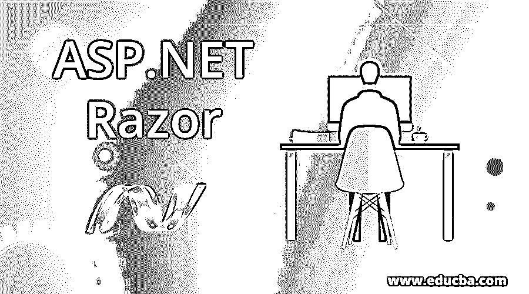
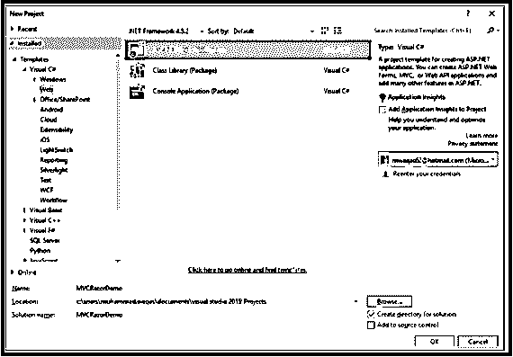
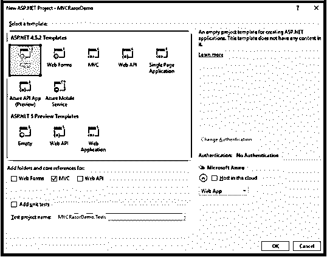
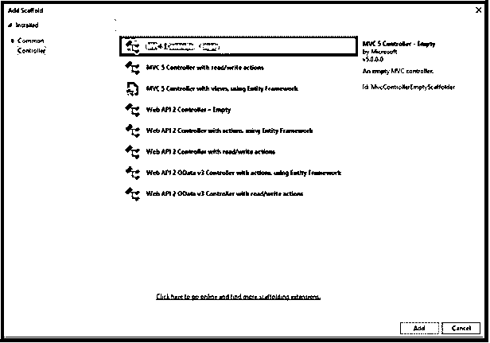
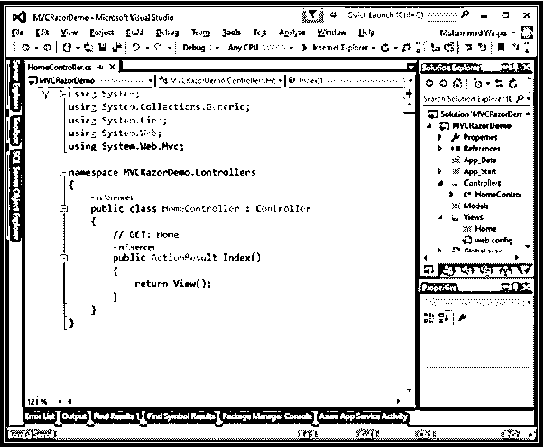
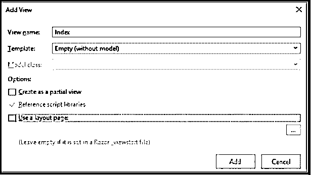
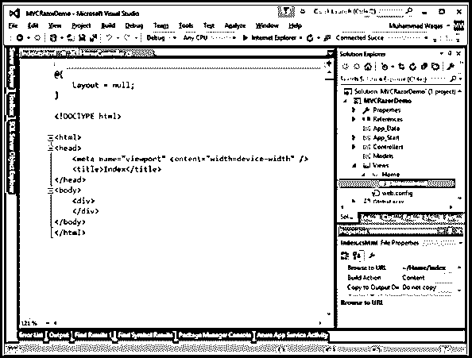
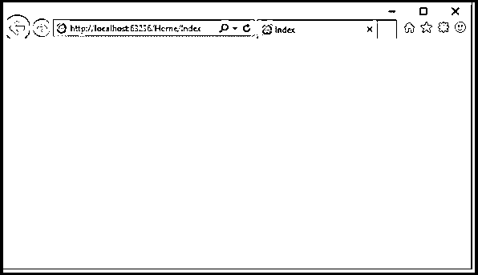
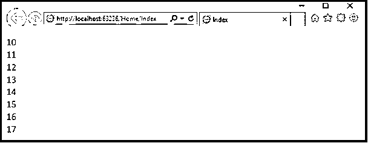

# ASP.NET 剃刀

> 原文：<https://www.educba.com/asp-dot-net-razor/>




## ASP.NET 剃刀简介

ASP.NET 剃刀根本不是一种编程语言。它是一种服务器端的标记语言。它让我们可以使用像 VB.NET 和 C#这样的语言将服务器端代码嵌入到网页中。我们可以在任何地方使用它来产生 HTML 输出。Razor 允许我们在 Visual Basics 和 C#加 HTML 的帮助下编写服务器端代码。Razor View 如果是 Visual Basic 就有. vbhtml 文件扩展名，如果是 C#，就有. cshtml 文件扩展名的语法。在这个话题中，我们将学习 ASP.NET 剃刀。


<small>网页开发、编程语言、软件测试&其他</small>

因此，我们将拥有一个模板文件、一组文字文本和部分代码。当这与数据或某些特定模型结合时，我们将得到输出。

### ASP.NET 剃须刀关键词

ASP.NET 剃刀中的某些关键字需要在用户代码中避免，导致在特定场景中的意外行为。以下是一些保留在 razor 视图上下文中的关键字。

*   页
*   使用
*   命名空间
*   注射
*   部分
*   继承
*   模型
*   addTagHelper
*   removeTagHelper

### 句法

在 Razor 语法的帮助下，我们可以从' @ '符号开始，从 C#代码开始。然后，razor 会自动解析切换到解析语句。

```
@foreach (var item in Model) {
<tr>
<td>
@Html.ActionLink("Edit", "Edit", new { id = item.ID }) |
@Html.ActionLink("Details", "Details", new { id = item.ID }) |
@Html.ActionLink("Delete", "Delete", new { id = item.ID })
</td>
<td>
@item.Name
</td>
<td>
@String.Format("{0,g}", item.JoiningDate)
</td>
</tr>
}
```

然而，当我们完成 foreach 语句时，我们可以从 HTML 开始。Razor parser 会自动在 C#代码和 HTML 之间切换，并在需要时切换回 C#代码。Razor 版本更容易读写。

### C#的主要 Razor 语法规则

*   razor 的一个非常重要的部分是代码块，必须用@{......}花括号。
*   代码语句必须以分号结束。
*   变量和函数是内联表达式，将以@开头。
*   字符串用引号括起来。
*   更重要的一点是 C#代码是区分大小写的。所以写的时候要小心。
*   Var 关键字在我们需要声明变量的时候使用。
*   C#文件有扩展名。cshtml

### VB 的主要 Razor 语法规则

*   Razor 代码块必须用@Code… End Code 括起来
*   Visual basics 代码不像 c#那样区分大小写。
*   字符串总是用引号括起来
*   作为内联表达式的变量和函数必须以@开头
*   使用 Dim 关键字变量需要声明。
*   的确如此。vbhtml 作为 VB 文件的扩展。

### 它是如何工作的？

如果我们是初学者，这很容易学，而且会让我们更有效率。Razor 语法使用非常简化的语法。Razor web 页面中有两种内容，被描述为 HTML，即 HTML 内容和 2。剃刀密码。

在将 HTML 页面发送到浏览器之前，当服务器读取页面时，它将首先运行 Razor 代码。然后，在服务器上执行的代码可以执行该任务。但是，这不能在浏览器中完成。在访问服务器数据库的情况下，也是一样的。在它发送到浏览器之前，服务器代码可以同时主动 HTML 内容。正如我们从浏览器端看到的，服务器代码生成的 html 和静态 HTML 内容没有区别。

### ASP.NET 剃刀的例子

让我们用剃刀创建一个视图。

**第一步:**首先创建一个新的 ASP.NET MVC 实体项目。提供名称，然后单击确定。




**步骤 2:** 从复选框中选择 MVC，点击空模板。单击 OK 后，它将创建一个简单的 MVC 项目，包含最少的预定义内容。




**步骤 3:** 现在，我们需要添加 HomeController，因为我们从一个空应用程序开始，没有任何控制器。因此，要添加控制器，在解决方案资源管理器中右键单击控制器文件夹，并选择 add controller。这将显示在对话框下方。




**第四步:**选择 MVC 控制器-空选项后，点击添加，会出现添加控制器对话框。将名称设置为 HomeController，然后单击添加按钮。


**Step6** :我们可以看到一个新的‘home Controller . cs’，controller 文件夹中的一个新 c#文件。




**第 7 步**:右键点击索引动作后，选择添加视图。现在从模板下拉列表中选择 empty，然后单击 add 按钮。现在，visual studio 将创建一个 index.cshtml 文件，该文件位于 view/Home 文件夹中。




**Step8** :我们可以看到在文件的顶部显式地将 layout 属性设置为 null。




**注意:**如果我们用 HTML 帮助构建我们的应用程序，Razor 视图将有一个 CSHTML 扩展。如果我们使用 Visual basics，那么扩展将是 VBHTML。




当我们运行这个应用程序时，我们可以看到空白页，因为我们已经从一个空模板创建了一个视图。

**步骤** **9** :现在，我们将添加一些 C#代码。首先，我们必须在 razor 视图中编写 C#代码。然后，我们需要键入“@”符号，以便解析器对代码执行操作。

```
@{
Layout = null;
}
<!DOCTYPE html>
<html>
<head>
<meta name = "viewport" content = "width = device-width" />
<title>Index</title>
</head>
<body>
<div>
@for (int index = 10; index < 18; index++){
<div>@index </div>
}
</div>
</body>
</html>
```

使用 for 循环，我们在花括号内指定' @i ',这对于告诉剃刀输入 I 的值很重要。

**输出**:




**VB 的例子:**

@Code dim myMessage = "问候我们" End Code
<！–内联表达式或变量—>
<p>祝您愉快 EduCba 用户:@myMessage < /p >
<！多语句块>
@ Code
dim Courses = " EduCba 团队欢迎你！"
昏暗工作日=日期时间。现在。day ofweek
dim Courses message = Courses
End Code
<p>所有的课程在这里都有。@CoursesMessage < /p >

**输出:**


### 结论

首先，许多人认为 razor 是生成 HTML 的另一种方式。然而，这个例子清楚地显示了我们如何在模板中嵌入 C#或 Visual basics 并获得 HTML 输出。另外，razor 比标记语法更简单。

### 推荐文章

这是 ASP.NET 剃刀指南。在这里，我们讨论 ASP.NET 剃刀的关键字和它是如何工作的，以及例子。您也可以看看以下文章，了解更多信息–

1.  [ASP.NET 数据网格](https://www.educba.com/asp-dot-net-datagrid/)
2.  [ASP.NET 的特色](https://www.educba.com/features-of-asp-dot-net/)
3.  [ASP.NET 链接按钮](https://www.educba.com/asp-dot-net-linkbutton/)
4.  [ASP.NET 的单选按钮](https://www.educba.com/radio-button-in-asp-dot-net/)