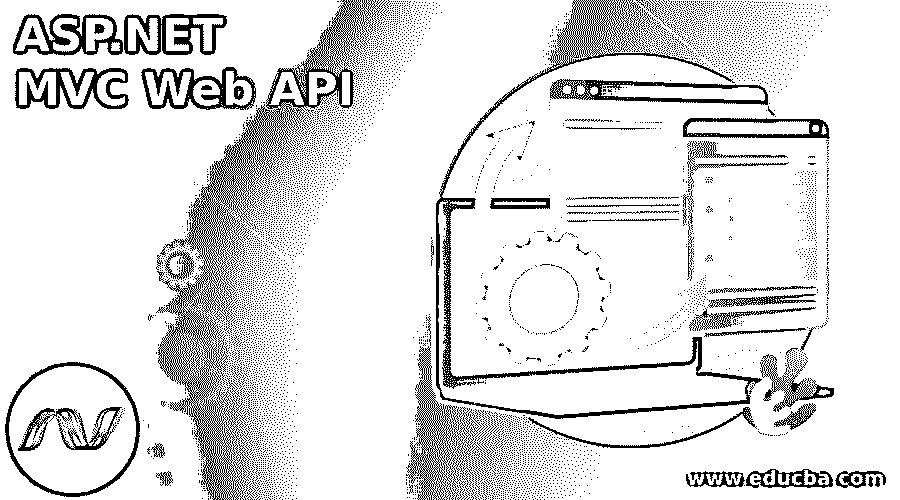
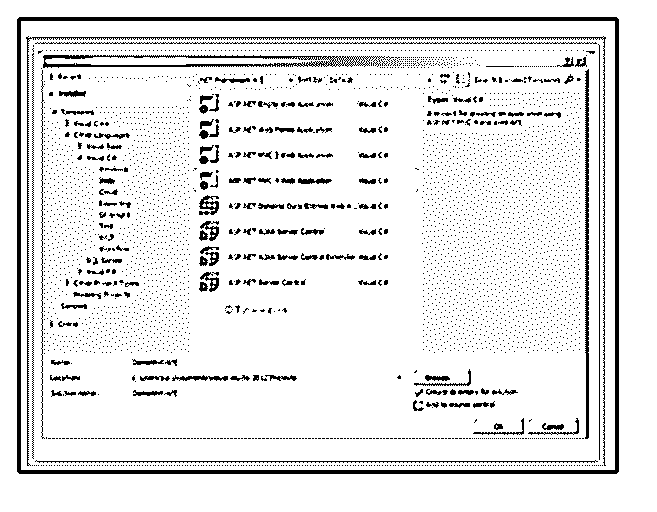
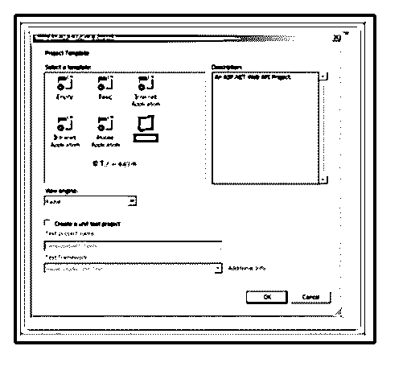
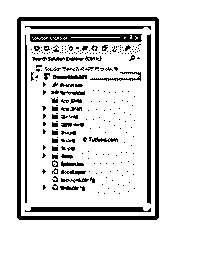
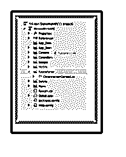
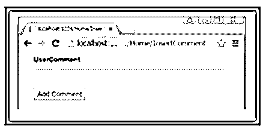

# ASP.NET MVC web API

> 原文：<https://www.educba.com/asp-dot-net-mvc-web-api/>

## ASP.NET MVC Web API 简介

ASP.NET MVC Web API 是创建 RESTful 应用程序的理想平台；在 Web 上创建 API 时，会有各种各样的方法来创建 API。ASP.NET Web API 是一个构建 HTTP 服务的简单框架，该服务可以到达广泛的客户端，包括移动设备、浏览器等等。此外，它支持自托管或 IIS 托管。

### 什么是 ASP.NET MVC Web API？

ASP.NET Web API 是构建 HTTP 服务的框架，HTTP 服务覆盖广泛的客户端，包括浏览器、移动设备等。与 WCF 服务相比，创建 ASP.NET Web API 很简单。ASP.NET Web API 是创建 RESTful 应用程序的优秀平台。

<small>网页开发、编程语言、软件测试&其他</small>

### Web API 的使用

*   NET Web API 支持使用 HTTP 动词的 CRUD 操作，如 GET、POST、DELETE 和 PUT。
*   Web API 的响应有一个 Accept 头和 HTTP 状态代码。
*   Web API 支持非 SOAP 服务，如各种文本格式，如 XML 和 JSON，或者可以使用自定义的 MediaTypeFormatter。
*   Web API 接受并构建非面向对象的内容，如图像、PDF 内容等。
*   它支持自托管或 IIS 托管。
*   Web API 支持 MVC 特性，如控制器、动作结果、路由、依赖注入、过滤器、IOC 容器或移动绑定器。
*   通过在控制器方法中包含新的[Queryable]属性来支持 OData。它返回 IQueryable，客户使用该方法进行 OData 查询合成。

### 创建 ASP.NET MVC Web API

让我们看看新的 ASP.NET MVC 应用程序 Open Visual Studio 的创建，

**档案** **至** **新** **至** **项目。**

从新建对话框中选择模板、项目类型和 ASP.NET MVC 4 Web 应用程序。接下来，给项目起一个合适的名字，并选择 Ok。

给定一个合适的名称后，选择 Web API 模板，将引擎视为 Razor。最后，单击确定。

完成所有过程后，单击 OK，项目结构将如下所示。

创建项目后，我们将看到一个类似于 MVC 的普通文件夹结构。但是，首先，打开文件夹控制器，如果我们想看到一个区别。它有两个控制器。

文件夹结构类似于 MVC 文件夹结构；要查看差异，请单击控制器；将有两个控制器；他们是

*   **home Controller**——由控制器派生而来
*   **values controller**–它源自 ApiController

在 ASP.NET Web API 中包含新模型

让我们把新的模型名称看作注释；在解决方案浏览器中，只需右键单击 Models 文件夹并添加新类，将其命名为 Comment，最后单击 Add 创建一个新模型。

**评论类**

`public class Comment
{
[Key] public int CommentID { get; set; }
public string UserComment { get; set; }
public DateTime? Commentdate { get; set; }
}`

一旦包含了注释模型，添加文件夹存储库；在这个应用程序中，我们使用代码优先的方法来访问数据库，然后包含从 DbContext 继承的 DbConnectiuonContext 类，如下所示。

一旦包含了 DbconnectionContext 类，查看包含如下所示代码的类，

`public class DbconnectionContext : DbContext
{
public DbconnectionContext()
: base("DefaultConnection")
{
}
public DbSet<Comment> Comment { get; set; }
}`

在 Web 文件中添加连接字符串。配置到提及数据库创建的位置，

`<connectionStrings>
<add name=" " providerName="System.Data.SqlClient" connectionString=" " />
</connectionStrings>`

在添加了 Repositories 文件夹和 DbconnectionContext 类之后，我们将在 Repositories 文件夹中添加名为 IComments.cs 的接口。

添加完类和接口后，让我们在 Icomment 接口中声明一个方法。我们将向该接口添加两个方法，一个用于插入注释，另一个用于显示注释。

包含 DbconnectionContext 类和 Repositories 文件夹后，我们在 Repositories 文件夹中添加了名为 IComments.cs 的接口。

`interface IComments
{
void InsertComment(Comment Comment); // to insert the data
IEnumerable<Comment> ListofComment(); // to display the List of Comment
}`

存储库文件夹看起来像

现在，我们将创建一个从 IComments 接口继承的 comments 类，并实现它。

使注释类从 IComments 接口继承并实现为

`public class Comments : IComments
{
public void InsertComment(Comment Comment)
{
using (DbconnectionContext db_context = new DbconnectionContext())
{
db_context.Comment.Add(Comment);
db_context.SaveChanges();
}
}
public IEnumerable<Comment> ListofComment()
{
using (DbconnectionContext db_context = new DbconnectionContext())
{
var _list = from comments in db_context.Comment
Select comments;
return _list;
}
}
}`

让我们从 API 控制器[ValuesController]开始代码。打开 ValuesControllers，并使用 Post 和 GetAllData 等方法进行编码

`public class ValuesController : ApiController
{
IComments CommentObj;
public ValuesController()
{
CommentObj = new Comments();
}
// GET api/values
publicIEnumerable<Comment> GetAlldata()
{
return CommentObj.ListofComment();
}
// GET api/values/5
public string Get(int id)
{
return "value";
}
// POST api/values
public void Post([FromBody]Comment Comment)
{
CommentObj.InsertComment(Comment);
}
// PUT api/values/5
public void Put(int id, [FromBody]string value)
{
}
// DELETE api/values/5
public void Delete(int id)
{
}
}`

在 HomeController 中，我们添加了与类名[HomeController]同名的构造函数；在里面，我们使用接口来继承类。操作方法(InsertComment)处理 HTTP GET 请求。让我们看看下面给出的 HomeController 代码，

`public class HomeController : Controller
{
IComments CommentObj;
public HomeController()
{
CommentObj = new Comments();
}
[HttpGet] public ActionResult InsertComment()
{
return View(new Comment());
}
}`

下面是 ASP.NET MVC Web API 应用程序代码中 InsertComment 的视图部分，

`@model DemoWebAPI.Models.Comment
@{
ViewBag.Title = "InsertComment";
Layout = null;
}

<link href="~/bootstrap/css/bootstrap.min.css" rel="stylesheet"/>

@using (Html.BeginForm())
{
@Html.ValidationSummary(true)

@Html.LabelFor(model => model.UserComment)

@Html.TextBoxFor(model => model.UserComment, new { @class = "form-control" })
@Html.ValidationMessageFor(model => model.UserComment)

<input type="button" onclick="PostData();" value="Add Comment"/>

}
@section Scripts {
@Scripts.Render("~/bundles/jqueryval")
}`

最后，保存应用程序并使用如下 URL 执行应用程序

“http://localhost:____/home/InsertComment”

### 结论

本文解释了 Web API 的特性和它们的用法，并看到了 ASP.NET Web API 服务的创建以及如何在 ASP.NET MVC 应用程序中使用它。希望文章有助于理解。

### 推荐文章

这是一个 ASP.NET MVC Web API 的指南。在这里，我们将讨论 Web API 的特性及其用法，并了解 ASP.NET Web API 服务的创建。您也可以阅读以下文章，了解更多信息——

1.  [ASP.NET 安全](https://www.educba.com/asp-dot-net-security/)
2.  [ASP.NET 视图状态](https://www.educba.com/asp-dot-net-viewstate/)
3.  [ASP.NET 认证](https://www.educba.com/authentication-in-asp-dot-net/)
4.  [ASP.NET 更新面板](https://www.educba.com/asp-dot-net-updatepanel/)