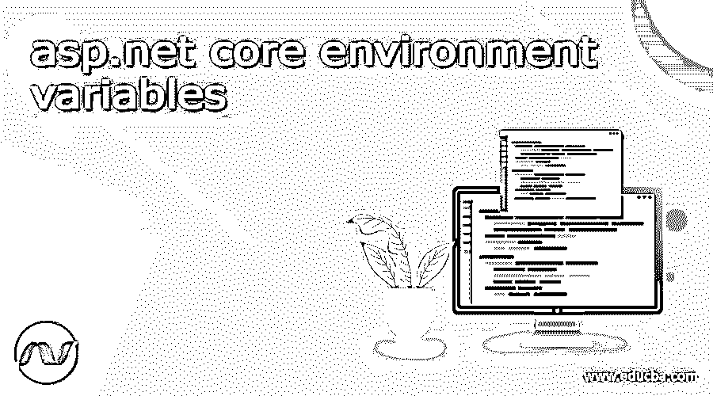
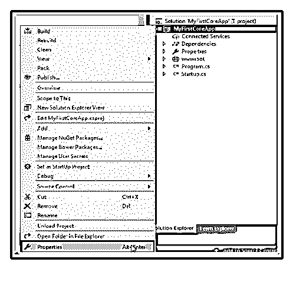
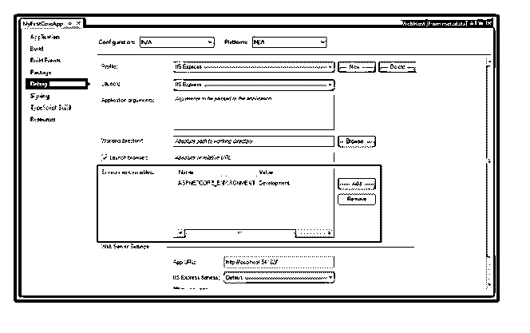
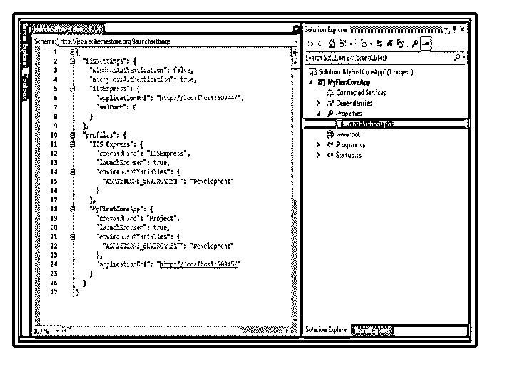
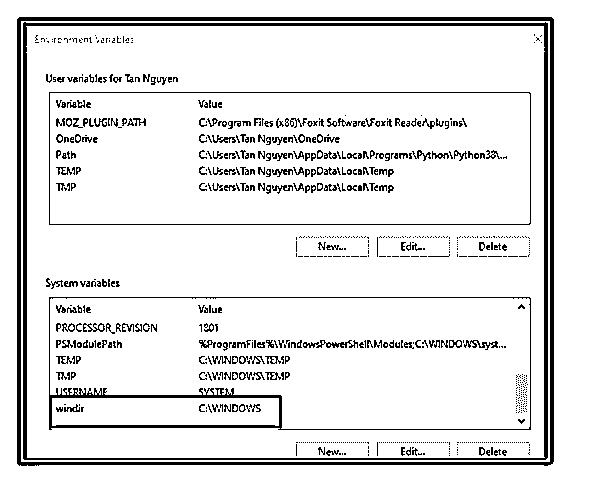
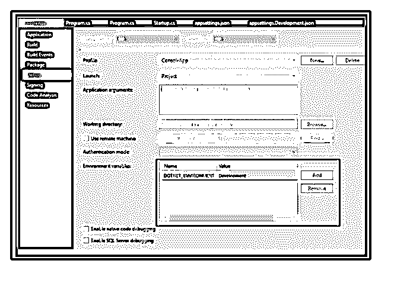

# ASP.NET 核心环境变量

> 原文：<https://www.educba.com/asp-dot-net-core-environment-variables/>

## ASP.NET 核心环境变量介绍

ASP.NET 核心环境变量使用名为 ASPNETCORE_ENVIRONMENT 的变量，该变量指向运行时环境。这个变量的值可以根据需求而定，但通常是生产、试运行和开发。环境变量定义了应用程序当前运行的运行时环境。对于 Windows 和 Mac OS，该值不区分大小写，但是对于 Linux，该值区分大小写。

### ASP.NET 核心环境变量概述

ASP.NET 核心提供了管理应用程序各种环境的选项。在将应用程序部署到生产或实际用户之前，企业或专业应用程序有几个环境或阶段。各种环境，如试运行、生产和开发环境。环境变量定义了应用程序当前运行的运行时环境。

<small>网页开发、编程语言、软件测试&其他</small>

ASP.NET 核心应用程序使用一个名为 ASPNETCORE_ENVIRONMENT 的环境变量，该变量指示应用程序当前正在。您可以根据需要为变量提供任何值，但是通常可以使用开发、生产或登台的环境值。环境名称不区分大小写；让我们考虑一个例子，如果我们将变量设置为 DEVELOPMENT 或 development 或 Development，最终结果将是相同的。

在 ASP.NET 核心中，将增强对围绕生产、试运行和开发等环境管理应用程序的支持。环境变量主要用于指定应用程序正在执行的环境，使应用程序能够对其进行配置。

出于约定的目的，将使用三个值；这些变量可以设置为您喜欢的任何值，它们是开发、生产、暂存。

**开发**

该流程将在应用程序开发过程中使用；使用 Visual Studio 时，该设置将在项目的调试中表示，如 IIS Express 等。

**分期**

试运行环境是一个预生产环境，用于在部署前完成应用程序时进行测试。

**生产**

当应用程序在最终用户正在使用的实时流程中执行时，将使用生产环境。此过程配置为应用程序健壮性，基于性能且安全可靠。一些生产环境会随着发展而变化，

*   允许生产记录和控制
*   缓存-打开
*   诊断错误页面–关闭
*   确保从 CDN 安全地提供整个客户端资源。

**让下面的代码:**

*   当 ASPNETCORE_ENVIRONMENT 设置为 Development 时，它调用 UserDeveloperExceptionPage。
*   当 ASPNETCORE_ENVIRONMENT 的值设置为 Production、Staging 或 Staging_2 时，它调用 UserExceptionHandler。
*   它将 IWebHostEnvironment 注入到 Startup.Configure 中。当应用程序需要更改启动时，此方法起作用。根据具体环境，为一些代码差异最小的环境进行配置。

### ASP.NET 核心环境变量司令部

要使用命令设置宿主环境，根据对 WebHostBuilder 的配置，我们可以通过提供命令行参数来指定环境。为了利用 ConfigurationBuilder，它使用了微软的 AddCommandLine()扩展方法。extensions . configuration . command line 包。现在，使用 UseConfiguration(config)将配置传递给 WebHostBuilder:

`Var config= new ConfigurationBuilder()
.AddCommandLine(args).Build();
Var host=new WebHostBuilder().UserConfiguration (config)
. UseContentRoot (Directory.GetCurrentDirectory ())
. UseKestrel()
. UseIISIntegration()
. UseStartup<Startup>().Build().
. Build();It enables to specify the environment hosting during runtime by using the environment argument, àdotnet run – environment "Staging"`

### 项目，然后选择“属性”

ASP.NET 核心使用称为 ASPNETCORE_ENVIRONMENT 的环境变量，它指示运行时环境。这个变量的值可以根据需求而定，但通常是生产、试运行和开发。环境变量定义了应用程序当前运行的运行时环境。对于 Windows 和 Mac OS，该值不区分大小写，但是对于 Linux，该值区分大小写。

查看以下屏幕，打开 Visual Studio，并在项目属性的 debug 选项卡中设置 ASPNETCORE_ENVIRONMENT。只需在解决方案资源管理器中右键单击项目并选择属性，

打开项目属性后，将会打开属性页，只需单击 Debug 选项卡，查看环境变量，如下所示。

*   它包含配置文件设置
*   它仅在本地开发机器上使用
*   它没有部署

看下面这个 JSON，描绘了 ASP.NET 核心 Web 项目的 launchSetting.json 文件，命名为 EnvironmentSample 用 Visual Studio 或 dotnet new 创建，

`JSON Code – launchSetting.json`

我们还可以直接在 launchSetting.json 中的环境变量中进行更改。

### asp.NET 核心如何支持环境配置

环境变量定义了应用程序当前运行的运行时环境。它使静态类可以访问系统命名空间中的环境变量环境。让我们看看下面给出的变量，

`using System;
namespace Application
{
class SampleProgram
{
static void Main(string[] args)
{
var environment = Environment.GetEnvironmentVariable("windir");
Console.WriteLine("windir path: " + environment);
Console.ReadKey();
}
}
}`

**输出:**

您可以通过“C:\WINDOWS”查看“windir”环境变量的值。

使用 VISUAL STUDIO 时，可以在开发过程中在项目的调试文件中指定环境变量；让我们看看下面的例子。

### ASP.NET 核心环境变量示例

ASP.NET 核心提供了管理应用程序各种环境的选项。获取代码中环境变量的值，以便根据某个值执行额外的代码。IHostingEnvironment 服务，它包括 EnvironmentName 属性，该属性包含 ASPNETCORE_ENVIRONMENT 变量的值，它还包括用于验证环境的扩展方法，如 IsDevelopment()、isenvenvironment ` ent()、IsStaging()和 ISProduction()。让我们看看下面所示的示例代码，

**样本代码**

公共 void 配置(IApplicationBuilder 应用程序，IHostingEnvironment 环境)

`{
if (env.IsEnvironment("Development"))
{
// Development Environment - Code Execution
}
if (env.IsDevelopment())
{
// Development Environment - Code Execution
}
if (env.IsStaging())
{
// Staging Environment - Code Execution
}
if (env.IsProduction())
{
// Production Environment - Code Execution
}
}`

### 结论

本文展示了 ASP.NET 核心环境变量，它表明在运行时环境期间。环境变量定义了应用程序当前运行的运行时环境。我希望这篇文章能帮助你理解这个概念。

### 推荐文章

这是 ASP.NET 核心环境变量指南。这里我们讨论 ASP.NET 核心环境变量，它指示运行时环境期间。您也可以看看以下文章，了解更多信息–

1.  [ASP.NET 安全](https://www.educba.com/asp-dot-net-security/)
2.  [ASP.NET 国家管理](https://www.educba.com/asp-dot-net-state-management/)
3.  [ASP.NET 的计时器](https://www.educba.com/timer-in-asp-dot-net/)
4.  [ASP.NET 正则表达式验证器](https://www.educba.com/asp-dot-net-regularexpressionvalidator/)