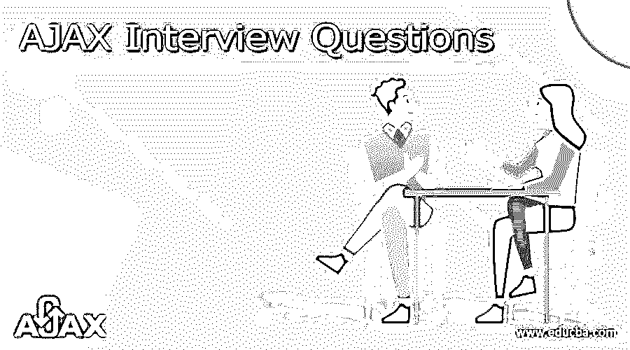

# AJAX 面试问题

> 原文：<https://www.educba.com/ajax-interview-questions/>

## AJAX 面试问答介绍

AJAX 被称为“异步 JavaScript 和 XML ”,是一组 web 技术或标准，在 web 页面开发领域，大多数 web 技术都使用这些技术或标准，以获得丰富的用户体验，并减少显示内容的服务器负载。数据交换格式可以是 XML 或 JSON，其中 JavaScript 是 JSON 的原生格式(JavaScript Object Notation)，大多数现代 web 应用程序使用 JSON 作为与数据库服务器交互的数据格式。AJAX 并不局限于单一技术，它由一组技术组成，也可以用于 HTML、T2、CSS 和不同的 JS 库。AJAX 的主要功能是在后台与服务器通信，中断或重新加载现有的网页，为应用程序的客户端或最终用户提供丰富的用户体验。

**以下是 AJAX 面试问答列表:**

<small>网页开发、编程语言、软件测试&其他</small>

所以你终于在 AJAX 中找到了你的梦想工作，但是想知道如何破解 AJAX 面试，以及可能的 AJAX 面试问题。每次面试都不一样，工作范围也不一样。牢记这一点，我们设计了最常见的 AJAX 面试问题和答案，以帮助您在面试中取得成功。该列表分为以下两部分:

*   [第 1 部分 AJAX 面试问题(基础)](#1)
*   [第二部分 AJAX 面试问题(高级)](#2)

### 第 1 部分——AJAX 面试问题(基础)

第一部分包括基本的面试问题和答案

#### 1.什么是 AJAX 并解释一下？

**答案:**
AJAX(Asynchronous JavaScript and XML)是一组用于在后台加载页面内容而不扰乱或改变网页现有状态的技术。浏览器树中的 DOM(文档对象模型)API(应用编程接口)可以被操作来提供动态功能或者动态地改变网页的内容。异步通信是 AJAX 的另一个重要特性，它可以通过使用 XMLHTTPRequest 对象来实现，XMLHTTPRequest 对象是一个以对象形式存在的 API，它是由 WHATWG (Web 超文本应用技术工作组)给出的标准，后来被转移到 W3C(万维网联盟)。

#### 2.AJAX 使用了哪些不同的技术？

**答:**
AJAX 涉及不同的技术，如 HTML(和 XHTML)、CSS(用于表示层)、JSON、XML 或 XSLT(用于 web 服务器和客户端之间的数据交换)、JavaScript 和其他用于异步通信的 API。AJAX 用于创建动态网页。使用 AJAX 的网站有谷歌、Gmail、YouTube、脸书等。AJAX 是基于互联网标准的标准，符合全球所有的浏览器和网络。

让我们进入下一个 AJAX 面试问题。

#### 3.AJAX 中的同步请求是什么？

**答:**
AJAX 中的同步和异步类型请求是基于 web 服务器请求的请求优先级使用的，应该仔细配置，使服务器根据用户需求响应用户。同步请求在发出请求后等待服务器的响应，以继续执行脚本的下一部分，这在快速响应机制中是至关重要的，并且应该经常避免这种情况，以使服务器具有高响应性。只要同步请求机制是必不可少或不可避免的，就应该使用它。

#### 4.AJAX 中的异步请求是什么？

**答:**
异步请求被定义为脚本执行，它允许在请求后继续下一行执行，而不考虑来自 web 服务器的响应，这可以在收到来自 web 服务器的响应后进行处理。异步是在没有任何延迟的情况下向用户提供响应的最重要的机制，其中用户仍然可以与网页进行交互，而不管服务器对先前请求的响应如何。

#### 5.AJAX 中有哪些不同的就绪状态？

**答:**
就绪状态是 XMLHTTPRequest 对象中存在的属性，它保存 XMLHttpRequest 的状态。不同类型的状态改变从 0 到 4 是可用的，它们被定义为 0(请求未初始化)、1(与服务器建立的连接)、2(接收到请求)、3(处理请求)4(请求完成且响应就绪)。当状态为 4 时，状态可以描述为 HTTP status 200 (OK ),这意味着请求成功，响应就绪。

### 第 2 部分——AJAX 面试问题(高级)

现在让我们来看看高级面试问题。

#### 6.AJAX 就绪状态有哪些不同的阶段和过程？

**答案:**
不同的状态及其流程在 AJAX 中初始化、请求、处理并完成。当在对象上调用 open 方法时，状态将变为 1。当调用发送方法时，状态变为 2。从服务器收到响应后，当请求结束时，状态变为 4。

#### 7.什么是 XMLHTTPRequest 对象？

**答案:**
XMLHTTPRequest (XHR)是一个浏览器级 API(应用程序编程接口)，使用 JavaScript 处理服务器-客户端请求。XMLHTTPRequest 对象以 API 的形式存在，用于在服务器和浏览器客户端之间建立通信。XMLHTTPRequest 用于在不重新加载的情况下更新页面内容，即使在完全加载页面之后，也可以从服务器请求和接收数据响应，在后台请求和接收来自服务器的响应，而不会对用户造成任何中断。

让我们转到下一个 AJAX 面试问题。

#### 8.AJAX 中 XMLHTTPRequest 对象有哪些用途？

**答:**
可以基于就绪状态改变状态发送 XMLHTTPRequest。可以通过调用构造函数 new XMLHTTPRequest()来创建 XMLHTTPRequest 对象。XMLHTTPRequest 处理跨源资源共享(CORS)。如果 XMLHTTPRequest 对象的状态为打开状态或处于加载、超时、中止、错误、加载结束、readystatechange 和进度状态，则不得在该对象中进行垃圾收集。XMLHTTPRequest 支持不同类型的事件处理程序。

#### 9.web 开发中的 AJAX 应用有哪些？

**答:**
AJAX 技术的不同应用包括异步调用、用户友好、高速访问等。目前使用 AJAX 的实时应用或网站有谷歌、Gmail、[、谷歌地图](https://www.educba.com/career-in-google-maps/)、亚马逊公司等。向用户显示内容，而无需重新加载整个网页。其他应用程序包括即时发生的数据验证，在提交之前验证网页上的表单，根据最初键入的单词自动完成字段中的数据，刷新动态数据，如板球比分、时间、天气、广告加载、股票等。

让我们转到下一个 AJAX 面试问题。

#### 10.实时 AJAX web 应用有哪些？

**答:**
不同类型的实时应用包括安全认证，安全认证可以应用于服务器端和客户端的 AJAX web 应用。AJAX 中的 XML 使用最少，而 JSON 是跨不同来源交换信息时使用最多的数据格式。AJAX 还提供了使用 XMLHTTPRequest 对象的 Fetch API 获取资源的特性。

### 推荐文章

这是一个 AJAX 面试问题与答案的指南。在这里，我们涵盖了一些常见的 AJAX 面试问题及其详细答案，以便帮助候选人轻松应对面试。您也可以阅读以下文章，了解更多信息——

1.  [棱角分明的 JS 面试问题](https://www.educba.com/angular-js-interview-questions/)
2.  [常见面试问答](https://www.educba.com/common-interview-questions-answers/)
3.  [大数据面试问题](https://www.educba.com/big-data-interview-questions/)

