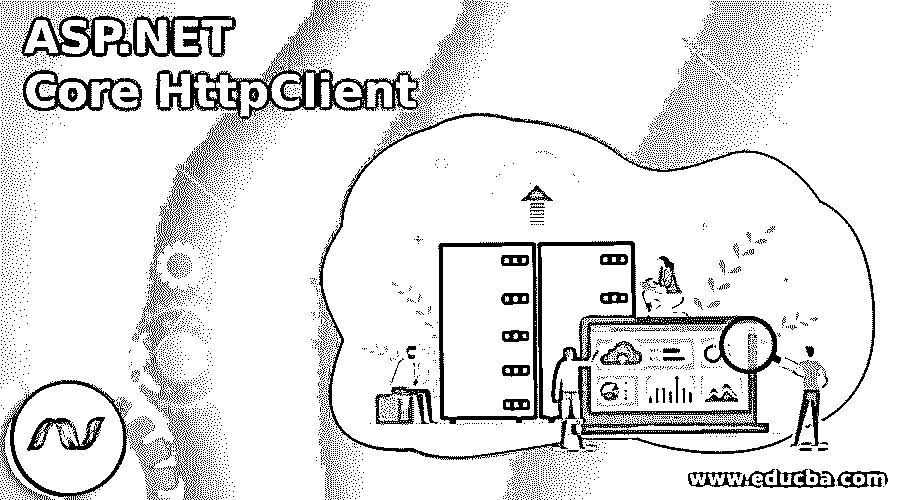
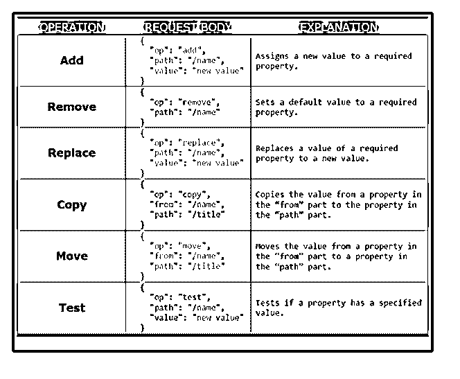
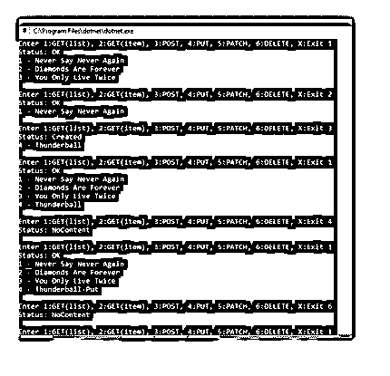

# ASP.NET 核心 http 客户端

> 原文：<https://www.educba.com/asp-dot-net-core-httpclient/>

## ASP.NET 核心 HttpClient 简介

ASP.NET 核心 HttpClient 用于发送 HTTP 补丁请求。通过使用 HttpClient，我们可以发送 HTTP 补丁请求来完成资源的更新，从而提高应用程序的性能。此外，为了提高内存使用和性能，我们可以通过 HttpClient 利用流。

### 什么 ASP.NET 核心 HttpClient？

ASP.NET 核心 HttpClient 类，它允许发送 HTTP 请求并从 URI 获得 HTTP 响应(URI 在其中标识资源)。通过使用该类，我们可以发送完整类型的 HTTP 请求，如 PATCH、GET、DELETE、POST、PUT，并且它接受来自服务器的响应。

<small>网页开发、编程语言、软件测试&其他</small>

HttpClient 使用 HTTP 消息处理程序，用于发送请求和获得响应，这是默认消息处理程序的基本工作。虽然我们可以使用多个消息处理程序并创建一个管道，但是这个 HttpClient 只使用一个消息处理程序。有几个处理程序只处理请求的头部，很少处理超时等问题。

### 如何使用 ASP.NET 核心 HttpClient？

ASP.NET 核心 HttpClient 用于发送 HTTP 补丁请求。通过使用 HttpClient，我们可以发送 HTTP 补丁请求来完成资源的更新。作为 JSON 数组的一部分，补丁请求由几个操作执行。我们来看看下面的补丁操作，

这里，请求包含了一个 JSON 对象数组，这些对象指定了各种操作。用 op 属性指定的操作，path 部分表示对象属性的路径，我们可以在这种情况下修改 name 属性。最后，值部分表示用于替换 name 属性的前一个值的新值。

### ASP.NET 核心 http 客户端应用程序

在 ASP.NET 核心 HttpClient 应用程序中，将各种应用程序分成以下几个部分，它们如下:

*   使用 http client ASP.NET 核心发送 POST 请求
*   使用 http client ASP.NET 核心发送 PUT 请求
*   使用 HttpClient 发送删除请求

**使用 http client ASP.NET 核心发送 POST 请求**

为了使用 http client ASP.NET 核心发送 POST 请求，我们在应用程序 CompanyEmployees 中有一个 HttpClientCrudService 类。客户端，它包含了一些方法，我们添加了新的方法来发送 POST 请求到应用程序。

`private async Task CreateCompany()
{
var companyForCreation = new CompanyForCreationDto
{
Name = "ABC Limited.",
Country = "INDIA",
Address    = "Spencer Plaza"
};
var _comp = JsonSerializer.Serialize(companyForCreation);
var req_content = new StringContent(_comp, Encoding.UTF8, "application / json");
var response = await _httpClient.PostAsync("companies", req_content);
response.EnsureSuccessStatusCode();
var content = await response.Content.ReadAsStringAsync();
var createdCompany = JsonSerializer.Deserialize<CompanyDto>(content, _options);
}`

让我们创建用于创建和序列化方法的 company 对象。创建新的 StringContent 对象，以提供序列化公司、媒体类型参数和编码类型。然后，使用 PostAsync 方法，该方法用于发送应用程序的 POST 请求。一旦收到响应，检查它是否成功。使用 ReadAsStringAsync 方法读取内容，以便通过使用 JsonSerializerOptionsargument 参数反序列化内容。要确保调用该方法的客户端应用程序，

`public async Task Execute()
{
await CreateCompany();
}`

通过设置断点并查看应用程序来查看 CreateCompany 方法。

通过使用 HttpRequestMessage 类发送 POST 请求，名为 PostAsync 的方法封装了 HttpRequestMessage 类。为了更好地控制我们的请求，它显式地设置了各种请求选项，如 header，以利用 HttpRequestMessageClass，

`private async Task CreateCompanyWithHttpRequestMessage()
{
var companyForCreation = new CompanyForCreationDto
{
Name = "ABC Ltd,",
Country = "INDIA",
Address = "Spencer Plaza - 65"
};
var company = JsonSerializer.Serialize(companyForCreation);
var request = new HttpRequestMessage(HttpMethod.Post, "companies");
request.Headers.Accept.Add(new MediaTypeWithQualityHeaderValue("application/json"));
request.Content = new StringContent(company, Encoding.UTF8);
request.Content.Headers.ContentType = new MediaTypeHeaderValue("application/json");
var response = await _httpClient.SendAsync(request);
response.EnsureSuccessStatusCode();
var content = await response.Content.ReadAsStringAsync();
var createdCompany = JsonSerializer.Deserialize<CompanyDto>(content, _options);
}`

从 companyForCreation 对象及其序列化开始，创建一个新的 HttpRequestMessage 对象，并给出请求类型和端点地址。然后，使用 StringContent 类展开请求的内容，并提供编码类型和序列化的 company 对象。最后，用 ContentType 属性表示请求的媒体类型。

### 用于发送上传请求的 http client ASP.NET 核心

下面是 ASP.NET 核心的 HttpClient，用于发送 PUT 请求；在这段代码中，仅提及我们的应用程序 UpdateCompany 操作返回 NoContent 响应。因此，将没有反序列化客户端的内容。要在 HttpClientCrudService 类中包含新方法，

`private async Task UpdateCompany()
{
var updatedCompany = new CompanyForUpdateDto
{
Name = "ABC Ltd,",
Country = "INDIA",
Address = "Spencer Plaza -5321- Updated"
};
var _comp = JsonSerializer.Serialize(updatedCompany);
var req_Content = new StringContent(_comp, Encoding.UTF8, "application/json");
var uri = Path.Combine("companies", "fc12c11e-33a3-45e2-f11e-08d8bdb38ded");
var response = await _httpClient.PutAsync(uri, req_Content);
response.EnsureSuccessStatusCode();
}`

在包含的新方法中，使用更改后的 Address 属性构建 updateCompany 对象。然后在方法中，CreateCompany 序列化对象并构建新的 StringContent，它提供序列化的对象、媒体类型和编码类型。最后，创建 URI 到控制器的动作，它假定期望公司的 ID，我们更新了它。

使用 PutAsync 发送 PUT 请求，并确保收到成功的状态代码。无内容状态代码将是代码 204。更改后的执行方法将是

`public async Task Execute()
{
...
await UpdateCompany();
}`

通过设置断点并查看应用程序来查看 UpdateCompany 方法。

### 使用 HttpClient 发送删除请求

让我们用一个叫做 DeleteAsync 方法的快捷方法发送删除请求，

`private async Task DeleteCompany()
{
var uri = Path.Combine("companies", "fc12c11e-33a3-45e2-f11e-08d8bdb38ded");
var response = await _httpClient.DeleteAsync(uri);
response.EnsureSuccessStatusCode();
}`

为了执行该方法以从如下的 Execute 方法进行调用，

`public async Task Execute()
{
...
await DeleteCompany();
}`

当执行客户端应用程序时，我们将得到 204 响应；这是对删除操作的适用响应。

### ASP.NET 核心 HttpClient 示例

让我们通过使用 HttpClient 来查看 ASP.NET 核心应用程序，创建包装 HttpClient 功能的库，利用构建器模式，并添加包含存储 http client 的方法的类。

`public class HttpRequestBuilder
{
private HttpMethod method = null;
private string requestUri = "";
private HttpContent content = null;
private string bearerToken = "";
private string acceptHeader = "application/json";
private TimeSpan timeout = new TimeSpan(0, 0, 15);
public HttpRequestBuilder()
{
}
public HttpRequestBuilder AddMethod(HttpMethod method)
{
this.method = method;
return this;
}
public HttpRequestBuilder AddRequestUri(string requestUri)
{
this.requestUri = requestUri;
return this;
}
public HttpRequestBuilder AddContent(HttpContent content)
{
this.content = content;
return this;
}
public HttpRequestBuilder AddBearerToken(string bearerToken)
{
this.bearerToken = bearerToken;
return this;
}
public HttpRequestBuilder AddAcceptHeader(string acceptHeader)
{
this.acceptHeader = acceptHeader;
return this;
}
public HttpRequestBuilder AddTimeout(TimeSpan timeout)
{
this.timeout = timeout;
return this;
}`

请参见下面的如下输出:

### 结论

本文解释了如何在核心应用程序中使用 HttpClient，并学习了如何从应用程序中删除、放置和提交请求。希望文章有助于理解。

### 推荐文章

这是一个 ASP.NET 核心 HttpClient 的指南。这里我们讨论 HttpClient，比如如何在核心应用程序中使用它，并了解了请求。您也可以看看以下文章，了解更多信息–

1.  [在 ASP.NET 验证](https://www.educba.com/validation-in-asp-net/)
2.  [ASP.NET 国家管理](https://www.educba.com/asp-dot-net-state-management/)
3.  [ASP.NET 网络控件](https://www.educba.com/asp-net-web-controls/)
4.  [ASP.NET 的数据集](https://www.educba.com/dataset-in-asp-dot-net/)