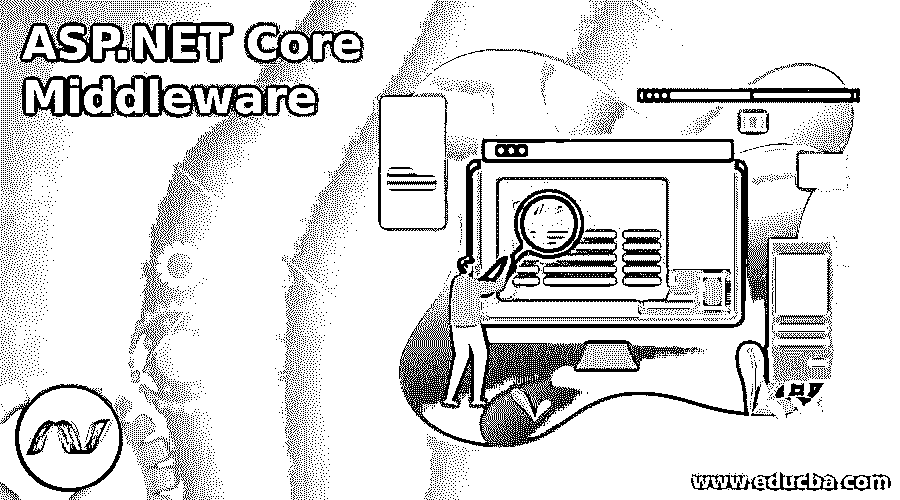
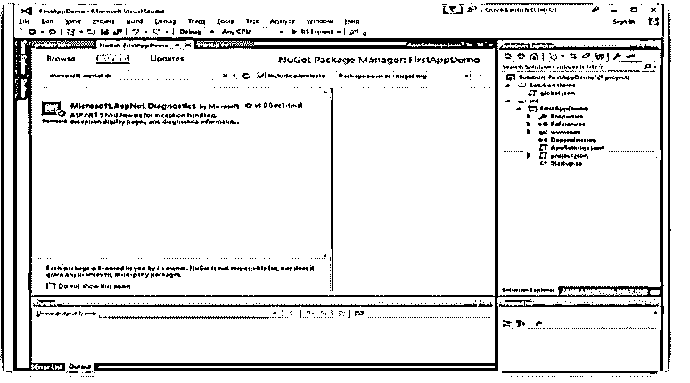
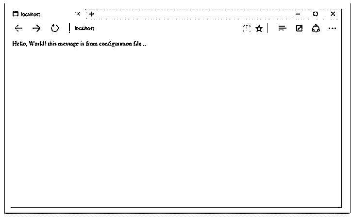
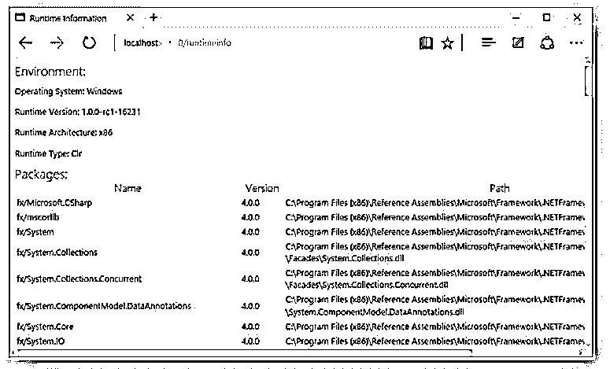
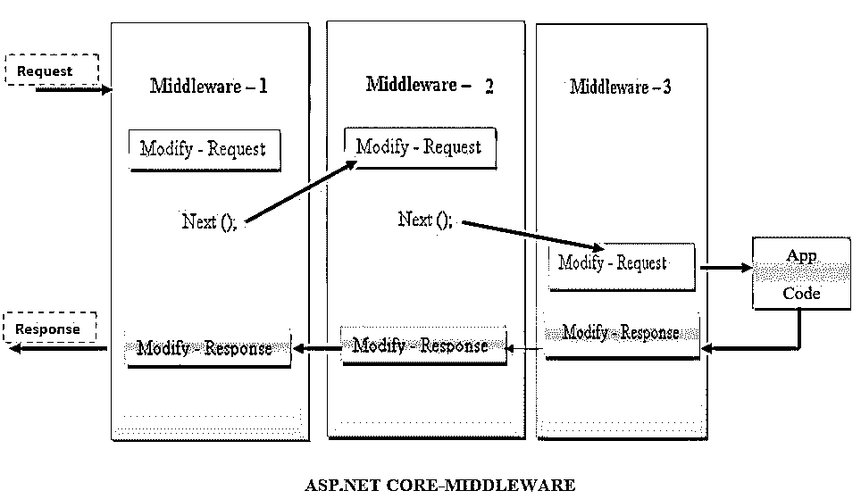

# ASP.NET 核心中间件

> 原文：<https://www.educba.com/asp-net-core-middleware/>

## ASP.NET 核心中间件简介

ASP.NET 核心引入了一个叫做中间件的创新概念。它们是软件模块，被集中到应用程序管道来处理传递的响应和请求。ASP.NET 核心中间件维护应用程序如何响应 HTTP 请求。中间件是认证和授权用户完成准确操作的关键部分。如果出现任何错误，它还会管理应用程序。ASP.NET 核心中中间件的每个部分都是一个对象，每个部分都有特定的目的。

### 什么是 ASP.NET 核心中间件？

*   ASP.NET 核心中间件是一个软件组件，它被组合到应用程序管道来处理请求和响应。中间件是在 ASP.NET 核心应用程序中根据每个请求实现的组件或类。因此，每个组件都决定选择是否将请求传递给管道中的后续组件。
*   假设我们有中间件组件来处理错误。另一个中间件认证用户，另一个中间件提供静态文件，如 CSS 文件、图像、JavaScript 文件等。

### ASP.NET 核心请求处理

在 ASP.NET 中，有称为 HttpHandlers 和 HttpModules 的请求管道，它们类似于中间件，都需要在每个请求中配置和实现。ASP.NET 核心中间件维护应用程序如何响应 HTTP 请求。中间件是认证和授权用户完成特定操作的关键部分。

<small>网页开发、编程语言、软件测试&其他</small>

总的来说，ASP.NET 核心网络应用中有大量的中间件。这些中间件有两种类型，可能是自己定制的中间件，也可能是通过 NuGet 添加的框架中间件。在请求的管道中，我们可以按顺序定位中间件。每个中间件添加和改变 HTTP 请求，并且优选地将控制传递给后续的中间件组件。

中间件构建了请求管道，它描述了 ASP.NET 核心请求处理。

### 如何添加另一个 ASP.NET 核心中间件？

ASP.NET 核心中间件维护应用程序如何响应 HTTP 请求。因此，中间件是认证和授权用户完成特定操作的关键部分。

让我们来看看包含附加中间件的以下步骤。

*   为了添加中间件，我们需要右键单击项目并选择 Manage NuGet Packages。
*   然后找微软。这是真正的 AspNet 核心中间件，用于异常显示页面、诊断信息和异常处理。这个选中的包包含了我们可以利用的中间件的各个部分。

*   如果您的项目中没有安装该软件包，请安装它。
*   安装名为 Microsoft 的软件包。如果项目中没有安装 AspNet.Diagnostics。
*   然后，转到 Configure()方法并调用应用程序。使用 WelcomePage 中间件。

`// the Configure () method will be called during runtime
public void Configure(IApplicationBuilder app)
{
app.UseIISPlatformHandler();
app.UseWelcomePage();
// by using the method to configure the HTTP Request pipeline
app.Run(async (context) =>
{
var msg = Configuration["Message"];
await context.Response.WriteAsync(msg);
});
}
}`

*   最后，执行应用程序并查看如下屏幕。

上面的屏幕只是欢迎页面；让我们通过给出下面的代码来使用 RuntimeInfoPage。

`// the Configure () method will be called during runtime
public void Configure(IApplicationBuilder app)
{
app.UseIISPlatformHandler();
app.UseRuntimeInfoPage(); //here the UseRuntimeInfoPage() method
app.Run(async (context) =>
{
var msg = Configuration["message"];
await context.Response.WriteAsync(msg);
});
} // by using the method to configure the HTTP Request pipeline`

*   更新 Startup.cscode 页面，保存它，刷新浏览器，然后看到下面的屏幕。

RuntimeInfoPage 是响应特定 URL 请求的中间件。如果传入的请求与 URL 不匹配，那么中间件部分只是将请求传递给中间件的下一部分。然后，请求通过 IISPlatformHandler 中间件；之后，它会转到 UseRuntimeInfoPage()中间件。最后会上 app。运行并只显示字符串。

*   最后，在 URL 的末尾添加“/runtimeinfo ”,现在查看由 RuntimeInfoPage 中间件生成的页面。

然后看看响应，它给出了运行时环境的一些细节，如操作系统、运行时版本、它们的类型、体系结构以及您正在使用的整个包等等。

### 运行方法

运行扩展方法是包含中间件；让我们来看看下面用于 Run 方法()的 format 方法。

`public static void Run(this IApplicationBuilder app, RequestDelegate handler)`

在这个 Run 方法()中，它是 IApplicationBuilder 上的一个扩展方法，也接受 RequestDelegate 的属性。这个 RequestDelegate 是一种处理请求的委托方法。

让我们看看下面的 RequestDelegate 格式如下。

`public delegate Task RequestDelegate(HttpContext context);`

Run 方法()接受该方法作为属性，并且它们的语法与 RequestDelegate 匹配。因此该方法符合 HTTPContext 属性并返回任务。所以我们可以在 Run 方法()中使用特定的 Lambda 表达式或特定的函数。

让我们通过使用 await 和 async 来实现异步，以增强性能和可伸缩性。

`app.Run(async context => await context.Response.WriteAsync("Hello World!"));
//or else make use of
app.Run(async (context) =>
{
await context.Response.WriteAsync("Hello World!");
});`

### ASP.NET 核心中间件示例

中间件是在 ASP.NET 核心应用程序中根据每个请求实现的组件或类。ASP.NET 核心中间件是一个软件组件，它被组合到应用程序管道来处理请求和响应。每个组件都决定选择是否将请求传递给管道中的后续组件。

让我们看看下面的图表，它描述了中间件组件的实现。

### 结论

本文展示了 ASP.NET 核心中间件组件如何处理请求处理管道，以及它如何控制我们的应用程序 HTTP 请求响应。ASP.NET 核心中的每个中间件组件都可以访问传入的请求和传出的响应。

### 推荐文章

这是 ASP.NET 核心中间件指南。在这里我们讨论介绍，如何添加另一个 ASP.NET 核心中间件？运行方法和实例。您也可以看看以下文章，了解更多信息–

1.  [在 ASP.NET 验证](https://www.educba.com/validation-in-asp-net/)
2.  [ASP.NET 安全](https://www.educba.com/asp-dot-net-security/)
3.  [ASP.NET 生命周期](https://www.educba.com/asp-dot-net-life-cycle/)
4.  [ASP.NET 网络控件](https://www.educba.com/asp-net-web-controls/)