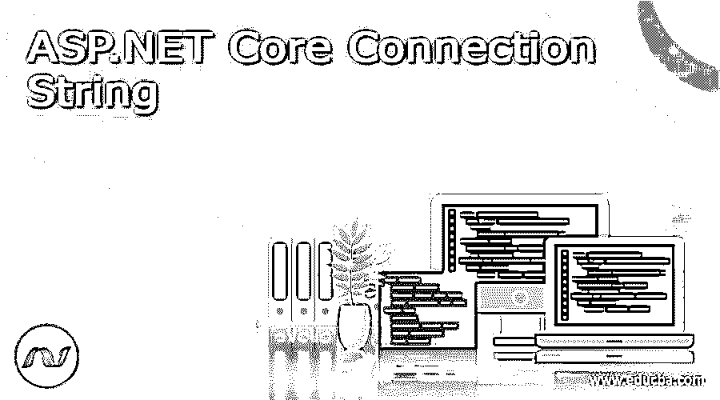
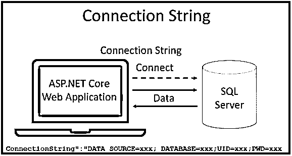
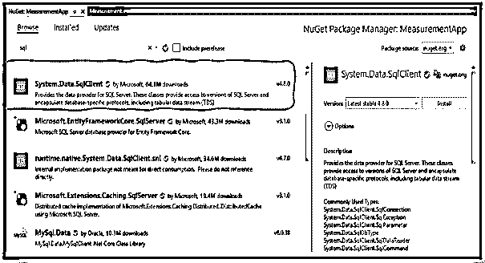
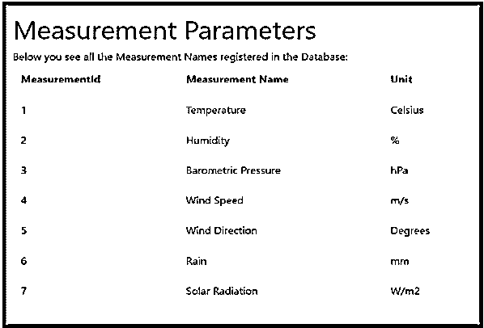
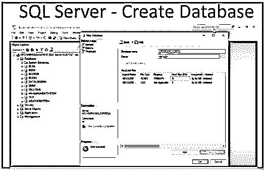

# ASP.NET 核心连接字符串

> 原文：<https://www.educba.com/asp-dot-net-core-connection-string/>




## ASP.NET 岩心连接管柱介绍

ASP.NET 核心连接字符串主要用于连接数据库，可以存储在 appsetting.json 中，大多数数据库提供者需要某种类型的连接字符串来建立数据库连接。连接字符串包含要求最安全的感知信息。要更改连接字符串，我们需要在生产、开发和测试环境之间移动应用程序。

### ASP.NET 核心连接字符串概述

ASP.NET 核心配置系统特别灵活，其中连接字符串存储在 appsettigs.json 中，用户存储 secret、一个环境变量和配置源。

<small>网页开发、编程语言、软件测试&其他</small>




### 如何管理 ASP.NET 核心连接字符串？

在 ASP.NET 核心，我们不需要使用网络。config 文件，我们需要使用其他方法，如下所示，

**硬编码连接字符串**

最初，要在 startup.cs 文件中硬编码连接字符串，如下所示，

```
var _conString = @"Data Source=ATIQ;Initial Catalog=UserDB;Integrated Security=False;Persist Security Info=False;
User ID=sa;Password=******";
services.AddDbContext<MyDbContext>(options => options.UseSqlServer(connection));
Connection String from the appSetting.json
services.AddDbContext<MyDbContext>(options =>
options.UseSqlServer(Configuration.GetConnectionString("DefaultConnection")));
```

这里，默认连接是在应用程序的根目录下的 appSetting.json 中定义的

```
{
"Logging": {
"LogLevel": {
"Default": "Information",
"Microsoft": "Warning",
"Microsoft.Hosting.Lifetime": "Information"
}
},
"AllowedHosts": "*",
"ConnectionStrings": {
"DefaultConnection":
"DATA SOURCE=xxx\\SQLEXPRESS;DATABASE=xxx;UID=sa;PWD=xxx"
}
}
```

**来自 dataSetting.json 的连接字符串——这是自定义的 json 文件**

下一个方法是从 JSON 自定义方法中获取连接字符串，并反序列化以获取连接字符串的值，如下所示:

```
var _settings = new DataSettingsManager().LoadSettings();
var _connection = _settings.DataConnectionString.ToString(); services.AddDbContext<MyDbContext>(options => options.UseSqlServer(_connection));
```

这里，MyDbContext 是数据上下文，DataSettingsManager 是另一个用于存储对象 DataSettings 中连接字符串的序列化值的类。让我们看下面的代码如下，

```
public class MyDbContext: DbContext
{
public MyDbContext(DbContextOptions<MyDbContext> options)
: base(options)
{ }
public DbSet<MyUser> MyUser { get; set; }
}
public class DataSettingsManager
{
private const string _dataSettingsFilePath = "App_Data/dataSettings.json";
public virtual DataSettings LoadSettings()
{
var text = File.ReadAllText(_dataSettingsFilePath);
if (string.IsNullOrEmpty(text))
return new DataSettings();
//here we getting the data setting from the JSON File
DataSettings settings = JsonConvert.DeserializeObject<DataSettings>(text);
return settings;
}
}
public class DataSettings
{
public string DataConnectionString { get; set; }
}
```

以“App_Data”命名在根目录下创建文件夹，以“dataSetting.json”构建 JSON 文件，下面的代码如下，

```
{
"DataConnectionString": "Data Source=ATIQ;Initial Catalog=UserDB;Integrated Security=False;
Persist Security Info=False;User ID=sa;Password=******"
}
```

### ASP.NET 核心连接字符串配置

在 ASP.NET 核心 Web 应用程序 appSettings.json 是这里使用的配置文件。这样做的主要目的是用来存储数据库的连接字符串。但是，它也用于存储我们可以在应用程序中使用的各种其他设置。
ASP.NET 核心有几家配置提供商；配置提供程序从几个配置源读取配置数据，如键值对；我们来看看下面的方法如下，

环境变量
App setting . JSON，设置文件
Comman-line arguments
Azure Key Vault
Azure App 配置
目录文件
自定义提供程序，创建/安装
内存中的对象。网

上述主题提供了有关 ASP.NET 核心配置的信息。

### ASP.NET 核心连接字符串 web 应用程序

让我们看一个 ASP.NET 核心中的 web 应用程序的例子，确保要在 NuGet 中安装所需的包，我们需要使用
系统。Data.SqlClient




Our appSetting.json string will be as follows,

```
{
"Logging": {
"LogLevel": {
"Default": "Information",
"Microsoft": "Warning",
"Microsoft.Hosting.Lifetime": "Information"
}
},
"AllowedHosts": "*",
"ConnectionStrings": {
"ConnectionString":
"DATA SOURCE=xxx\\SQLEXPRESS;DATABASE=xxx;UID=sa;PWD=xxx"
}
}
```

我们需要在 Startup.cs 文件中添加一些内容，如下所示:

```
public void ConfigureServices(IServiceCollection services)
{
services.AddRazorPages();
services.AddSingleton<IConfiguration>(Configuration);
}
```

我们还添加了，

```
services.AddSingleton<IConfiguration>(Configuration);
```

让我们创建数据库类，首先在解决方案资源管理器中创建模型类，然后创建名为 Measurement 的类。cs 最后代码，用于从数据库中检索数据。下面的代码如下:

```
using System.Data.SqlClient;
namespace MeasurementApp.Model
{
public class Measurement
{
public int Msmt_Id { get; set; }
public string Msmt_Name { get; set; }
public string Msmt_Unit { get; set; }
public List<Measurement> Get_MeasurmentParameters(string connectionString)
{
List<Measurement> msmt_List = new List<Measurement>();
SqlConnection con = new SqlConnection(connectionString);
string sqlQuery = "select Msmt_Id, Msmt_Name, Msmt_Unit from MEASUREMENT";
con.Open();
SqlCommand cmd = new SqlCommand(sqlQuery, con);
SqlDataReader dr = cmd.ExecuteReader();
if (dr != null)
{
while (dr.Read())
{
Measurement _msmtParameter = new Measurement();
_msmtParameter.Msmt_Id = Convert.ToInt32(dr["Msmt_Id"]);
_msmtParameter.Msmt_Name = dr["Msmt_Name"].ToString();
_msmtParameter.Msmt_Unit = dr["Msmt_Unit"].ToString();
msmt_List.Add(_msmtParameter);
}
}
return msmt_List;
}
}
}
```

这个 ASP.NET 核心网页包含两个代码:“Database.cshtml”和“Database.cshtml.cs”。下面我们来看看上面两个代码，

**Database.cshtml.cs**

```
using Microsoft.Extensions.Configuration;
using AppSettingsApp.Models;
namespace AppSettingsApp.Pages
{
public class DatabaseModel : PageModel
{
readonly IConfiguration _configuration;
public List<Measurement> measurementParameterList = new List<Measurement>();
public string connectionString;
public DatabaseModel(IConfiguration configuration)
{
_configuration = configuration;
}
public void OnGet()
{
GetData();
}
void GetData()
{
Measurement _msmt = new Measurement();
connectionString = _configuration.GetConnectionString("ConnectionString");
measurementParameterList = _msmt.Get_MeasurmentParameters(connectionString);
}
}
}
```

**Database.cshtml**

```
<div>
<h1>Measurement Parameters</h1>
Below you see all the Measurement Names registered in the Database:
<table class="table">
<thead>
<tr>
<th>MeasurementId</th>
<th>Measurement Name</th>
<th>Unit</th>
</tr>
</thead>
<tbody>
@foreach (var measurement in Model.msmt_List)
{
<tr>
<td> @measurement.Msmt_Id</td>
<td> @measurement.Msmt_Name</td>
<td> @measurement.Msmt_Unit</td>
</tr>
}
</tbody>
</table>
</div>
```




### ASP.NET 核心连接字符串示例

在这个例子中，我们将使用 SQL Server 作为我们的数据库。




```
CREATE TABLE [MEASUREMENT]
(
[Msmt_Id] int NOT NULL IDENTITY ( 1,1 ) Primary Key,
[Msmt_Name] varchar(100) NOT NULL UNIQUE,
[Msmt_Unit] varchar(50) NULL
)
Go
```

创建表格后，为了检索数据，请根据测量表格中的属性手动添加/输入数据。
startup . cs 文件中的连接字符串如下所示，

```
var _conString = @"Data Source=ATIQ;Initial Catalog=UserDB;Integrated Security=False;Persist Security Info=False;
User ID=sa;Password=******";
```

### 结论

在本文中，我们看到了 ASP.NET 核心连接字符串，其主要目的是将连接字符串存储到数据库中，它还用于存储我们可以在应用程序中使用的各种其他设置。我希望这篇文章能帮助你理解连接字符串的用法和各种使用方法。

### 推荐文章

这是一个 ASP.NET 核心连接字符串的指南。在这里，我们讨论的介绍，概述，如何管理 ASP.NET 核心连接字符串的例子与代码实现。您也可以看看以下文章，了解更多信息–

1.  [ASP.NET 的数据集](https://www.educba.com/dataset-in-asp-dot-net/)
2.  [在 ASP.NET 验证](https://www.educba.com/validation-in-asp-net/)
3.  [ASP.NET 生命周期](https://www.educba.com/asp-dot-net-life-cycle/)
4.  [ASP.NET 安全](https://www.educba.com/asp-dot-net-security/)


