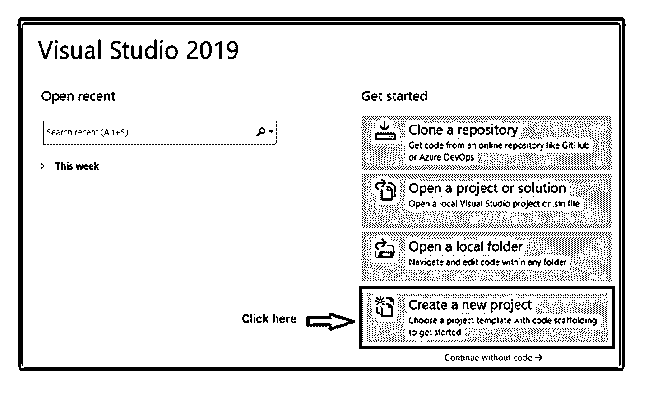
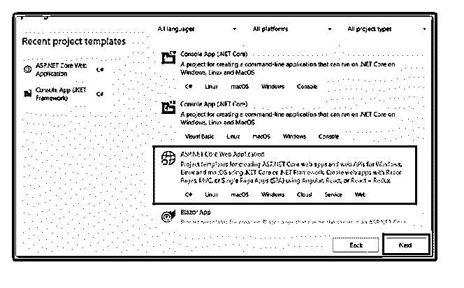
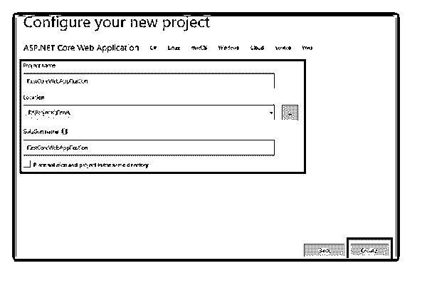
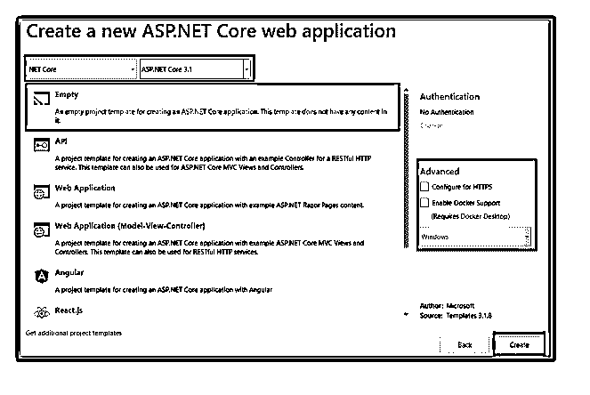
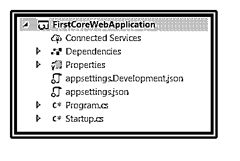
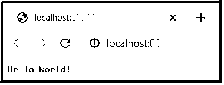

# ASP.NET 核心网络应用

> 原文：<https://www.educba.com/asp-dot-net-core-web-application/>

## ASP.NET 核心网应用简介

ASP.NET 核心应用程序是云优化的开源 Web 框架，用于构建现代 Web 应用程序，可以在跨平台的 Windows、Mac 和 Linux 上执行和开发。完整执行的 ASP.NET 核心应用程序。NET 框架和。网芯。一般来说，它是为灵活性和跨平台工作而设计的。

### 什么是 ASP.NET 核心应用程序？

ASP.NET 核心是用于创建最新应用程序的开源框架，具有高性能、支持云、连接互联网、跨平台的支持应用程序。通过使用 ASP.NET 核心，我们可以开发移动后端、Web 应用和服务以及物联网(IoT)。核心经过重新设计，可以在灵活、快速、现代的各种平台上工作。例如，我们可以编写应用程序来创建、查看和编辑数据库中的数据。

<small>网页开发、编程语言、软件测试&其他</small>

### 创建 ASP.NET 核心应用程序

要构建一个新的项目 ASP.NET 核心应用程序，打开 Visual Studio，然后选择创建如下所示的新项目，

当选择创建新项目时，它会打开“创建新项目”窗口。它包括各种各样的。NET 核心模板应用程序。在这里，我们正在创建简单的 Web 应用程序，因此我们需要选择 ASP.NET 核心 Web 应用程序模板，并单击下一步按钮，如下图所示。

然后选择 Next 按钮，这将打开 Configure Your New Project 窗口。现在，我们需要为项目设置一个合适的名称，并设置我们需要开发这个项目的位置，如 ASP.NET 核心网应用程序的解决方案名称。在本例中，我们将名称命名为“FirstCoreWebApplication ”,并选择“创建”按钮，如下所示。

单击“创建”按钮后，将打开“创建新的 ASP.NET 核心 Web 应用程序”，如下所示。这里需要选择合适的 ASP.NET 核心 Web 应用模板如 Empty、API、Web application、Web Application (MVC)、Angular 等。在本演示中，我们将使用空模板，以便您了解如何将不同的组件组合在一起开发 ASP.NET 核心应用程序。此外，请确保您选择了合适的。网络核心和 ASP.NET 核心版本(最新 3.1)。接下来，确保取消选中高级部分的所有复选框，最后单击创建按钮，如下图所示。

选择“创建”按钮后，窗口就像创建一个新的 ASP.NET 核心 Web 应用程序一样。在这方面，我们需要为 ASP.NET 核心 Web 应用选择合适的模板，如 Empty、Web Application(MVC)、Web Application、Angular 等等。在下面展示的演示项目中，我们选择了空模板，因此很容易理解各种组件如何协同工作来构建 ASP.NET 核心的应用程序。确保取消选中高级部分的所有复选框，并确保仅选择。NET 核心和 ASP.NET 核心版本，最后，选择创建按钮，如下所示。

当选择 create 按钮时，它会在 VS 中自动创建一个新的 ASP.NET 核心 Web 项目，并恢复这个项目中的包。这意味着它会自动包含从项目中的 NuGet 包配置的添加、删除或更新的依赖项。让我们在 VS 解决方案资源管理器中查看下面的项目文件夹结构和文件，

要执行 Web 应用程序，只需在 IIS Express 上选择按 F5 调试或 Ctr+F5 不进行调试；最后，它显示如下所示:

输出是“Hello World”，它来自 Startup.cs 文件中出现的 Startup 类的方法 Configure，只需打开 Startup.cs 文件，然后将它更改为 Hello World 字符串，然后返回应用程序，应用程序会返回相应的结果。

### ASP.NET 核心应用程序配置设置

核心 ASP.NET 应用程序支持各种配置方法。这些配置存储在名称-值对中，它在运行时从应用程序的不同部分读取。名称-值对分组到多级层次结构中，那些应用程序配置数据来自各种东西，它们如下:

*   环境变量
*   自定义提供程序
*   像 XML、JSON 和 INI 这样的文件
*   在内存集合中
*   命令行参数

ASP.NET 堆芯的配置系统是由过去版本的 ASP.NET 重新组织的。系统。旧版本中使用了配置命名空间；它读取 XML 配置文件，如 Web.Config。通过键值格式访问的最新模型，它检索不同的源，如 XML、JSON 和 INI ASP.NET 核心支持。

让我们看看使用 JSON 提供者读取配置的例子

一般来说，配置仍然像键值格式或层次结构的外部文件；让我们看看 appsetting.json 文件

**appsetting.json**

`{
"status" : "Status from appSettings.json file",
"ConnectionStrings": {
"DefaultConnection": "Server=.\\sqlexpress;Database=Test;Trusted_Connection=True;MultipleActiveResultSets=true"
}
}`

它读取 JSON 配置文件，其中包含“Microsoft。扩展。配置”和“Microsoft 扩展。配置文件”作为依赖库。依赖部分需要两个 package.json 行，

*   “微软。扩展.配置”:1.0.0
*   “微软。extensions . configuration . JSON ":1 . 0 . 0

要读取 JSON 配置文件，我们需要添加“Microsoft。扩展。配置”和“微软。Extensions.Configuration.Json”库作为依赖项。此外，需要在 dependency 部分的 package.json 文件中添加以下两行。

1.  “微软。扩展。配置":" 1.0.0 ",
2.  “微软。extensions . configuration . JSON ":" 1 . 0 . 0 "

**Startup.cs**

`using Microsoft.AspNetCore.Builder;
using Microsoft.AspNetCore.Http;
using Microsoft.Extensions.Configuration;
using Microsoft.Extensions.DependencyInjection;
namespace Sample_WebApplication
{
public class Startup {
public IConfiguration Configuration { get; set; }
public Startup() {
var_builder = new ConfigurationBuilder()
.AddJsonFile("appSettings.json");
Configuration = _builder.Build();
}
public void ConfigureServices(IServiceCollection services)
{
services.AddMvc();
}
public void Configure(IApplicationBuilder app){
app.UseMvc();
app.Run(context => {
var get_status = Configuration["status"];
var get_connectionString = Configuration["ConnectionStrings:DefaultConnection"];
context.Response.WriteAsync("Default Connection" + get_connectionString);
context.Response.WriteAsync(" ");
return context.Response.WriteAsync("Status " + get_status);
});
}
}
}`

**输出**

**运行 ASP.NET 核心应用**

让我们看看运行 ASP.NET 核心 Web 应用程序的各种方法如下:

*   Visual Studio F5 方法

这种方法是通过在你的 VS 开发项目中按 F5 键进行调试。

*   命令行“点网运行”

要通过调用 dotnet run from 文件夹从控制台执行此方法，该文件夹包含 project.json 文件。

*   点网发布方法

`àCd bin{....}\publishàdotnet YourProject.dll`

*   （同 ImmigrationInspectors 移民检查）

### 结论

在本文中，我们了解了核心 ASP.NET 应用程序，它提供了不同的灵活配置方法，支持以各种方式处理环境变量、基于文件等。我希望这篇文章能帮助您理解新 ASP.NET 核心应用程序的配置和创建。

### 推荐文章

这是 ASP.NET 核心网络应用的指南。这里我们讨论核心的 ASP.NET 应用程序，它给出了不同的灵活配置方法。您也可以看看以下文章，了解更多信息–

1.  [ASP.NET 生命周期](https://www.educba.com/asp-dot-net-life-cycle/)
2.  [ASP.NET 网络控件](https://www.educba.com/asp-net-web-controls/)
3.  [ASP.NET 的计时器](https://www.educba.com/timer-in-asp-dot-net/)
4.  [ASP.NET 的数据集](https://www.educba.com/dataset-in-asp-dot-net/)