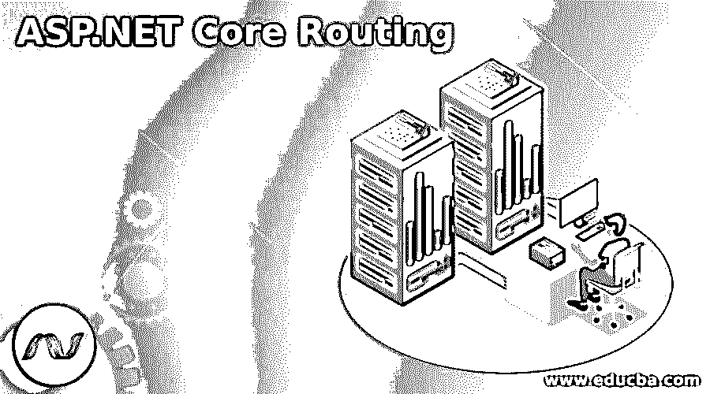
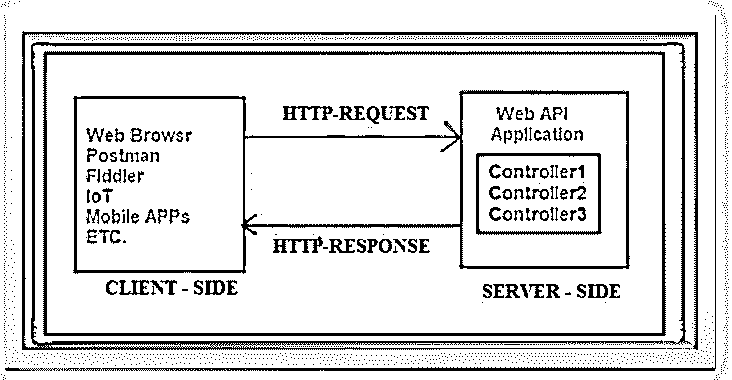
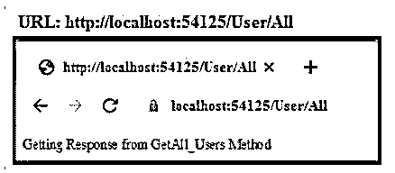
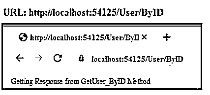

# ASP.NET 核心路由

> 原文：<https://www.educba.com/asp-dot-net-core-routing/>

## ASP.NET 核心路由简介

以下文章概述了 ASP.NET 核心路由。ASP.NET 核心路由只不过是一种模式匹配方法，它对收到的请求进行分类，并对这些请求进行处理。通常，路由是为用户请求提供响应的方法。路由负责匹配接收到的 HTTP 请求，并将这些请求传输到应用程序可执行端点。端点只不过是应用程序处理请求的可执行代码。这些端点是在应用程序最初启动时描述和配置的。然后，端点匹配过程从请求 URL 中提取值，并使这些值可用于处理请求。

### ASP.NET 核心路由概述

让我们假设服务器在右边，有了服务器，我们已经建立了 ASP.NET 核心 Web 应用程序。在应用程序内部，我们有控制器，每个控制器都包含几个动作方法。在左手边，会有一个用户；可能是邮差、网页浏览器、提琴手、移动应用、Swagger 等等。考虑从用户向浏览器发送请求；正如已经看到的，请求将通过请求处理管道。然后，ASP.NET 核心框架根据相关用户的动作方法绘制一条到控制器动作方法的路线，以获得响应。

<small>网页开发、编程语言、软件测试&其他</small>

重要的是要意识到应用程序是如何知道哪个请求与哪个控制器动作方法相关联的。通常，资源和 URL 之间的映射称为路由。

### 路由基础

路由的基础是表示端点，并将传入的 HTTP 请求连接到控制器动作方法。命名空间 Microsoft。路由负责处理请求和响应，连接端点，检查请求，并修改通过请求处理管道的请求和响应消息。路由在 Startup.Configure 的中间件管道中注册。

让我们看看下面的基本路由示例代码。

**代码:**

`// the Configure () method called during the runtime
// to configure the HTTP Request pipeline by using this method
public void Configure(IApplicationBuilder app, IWebHostEnvironment env)
{
if (env.IsDevelopment())
{
app.UseDeveloperExceptionPage();
}
app.UseRouting();
app.UseEndpoints(endpoints =>
{
endpoints.MapGet("/", async context =>
{
await context.Response.WriteAsync("WELCOME TO APPS!");
});
});
}`

路由使用由 UseEndpoints 和 UseRouting 注册的中间件对，

*   **UseEndpoints:** 包括对中间件管道的端点执行。它执行与特定端点连接的委托。
*   **user routing:**包含路由匹配中间件管道。该中间件查看应用程序中描述的一组端点，并根据请求选择最佳匹配。

在上面的代码中使用 MapGet 方法查看单个路由代码端点。

发送到根 URL /的 HTTP GET 请求:

所示的请求委托执行:

欢迎使用应用程序被写入 HTTP 响应；默认情况下，URL 根目录将是 https://localhost:4005/。

如果请求方法不是 GET，那么它返回 HTTP 404，并且没有路由匹配。

### ASP.NET 核心路由端点

端点路由是 ASP.NET 核心中包含的一个新特性，它使您能够向请求流程管道中的中间件提供有关路由的信息。端点路由将 HTTP 请求匹配到最后的中间件管道中的端点。ASP.NET 核心中的端点只不过是资源的 URL。

ASP.NET 核心端点如下:

*   可执行文件包含 RequestDelegate。
*   Extensible 包含元数据集合。
*   最后，Selectable 包含路由信息。
*   最后，Enumerable 是端点的集合，可以通过从 DI 接收 EndpointDataSource 来列出这些端点。

### ASP.NET 核心路由概念

一般来说，路由是对用户请求做出响应的方法。该路由负责匹配接收到的 HTTP 请求并将这些请求发送到应用程序可执行端点。在 ASP.NET 核心 Web 应用中，我们可以允许通过中间件进行路由；为了在 ASP.NET 核心中启用路由，我们必须包括以下两个中间件组件来处理 HTTP 请求管道。

*   **user routing:**这个中间件允许您启用到应用程序的路由；它不能将任何 URL 映射到任何资源。它包括路由匹配中间件管道。这些中间件查看应用程序中描述的一组端点，并根据请求选择最佳匹配。
*   **UseEndpoints:** 这个中间件将 URL 映射到资源。这里最重要的是，不仅要映射动作方法，我们还需要将静态文件资源映射到 URL。我们需要将 URL 映射到操作方法。它包括中间件管道的端点执行。它执行与特定端点连接的委托。

### ASP.NET 核心路由代码

ASP.NET 核心路由代码以各种方式包括:它们如下:

**1。通过使用 ASP.NET 核心中控制器级的属性路由**

控制器和动作方法都使用属性 routing 当我们在控制器级别应用路由属性时，路由对控制器的整个操作方法都是有效的。比如看下面的代码；在 DefaultController 类中，通过为操作方法指定路由模板，默认路由被多次使用。代码段解释了如何为操作方法指定路由模板；它只是解释了如何在控制器级别指定各种路由属性，以便于在属性路由中使用。

**代码:**

`[Route("Default")] public class DefaultController : Controller
{
[Route("")] [Route("Index")] public ActionResult Index()
{
return new EmptyResult();
}
[HttpGet] Route("Default/GetDetails_By_ID/{id}")] public ActionResult GetDetails_By_ID (int id)
{
string str_data = string.Format("The Parameter ID is : {0}", id);
return Ok(str_data);
}
}`

通过使用路由属性，路由模板在控制器层应用的动作和控制器方法层被假装为在动作方法中详述的路由模板。

**2。通过在 ASP.NET 核心**中使用动作方法级别的属性路由

看看 DefaultController 类；在 DefaultController 类的 Index 方法中将有三个路由。它涉及到调用 DefaultController 方法的 Index()操作方法的以下每个 URL。

http://localhost:10223
http://localhost:10223/home
http://localhost:10223/home/index

在基于常规的路由中，我们将指定基于属性的路由参数。在基于属性的路由中，它使您能够用参数指定路由属性。DefaultController 类的 GetDetails_By_ID 方法前面已经解释过，因为“{id}”指定了路由，它表示参数或占位符。

### ASP.NET 核心路由示例

我们来看看 ASP.NET 核心中的路由属性；通过使用路由属性，我们描述了 ASP.NET 核心应用中的路由，无论是在动作方法上还是在控制器方法上。

让我们来看看路由属性签名，如下所示:

在上面的示例中，Route Attribute 是从 Attribute 类和 IRouteTemplateProvider 接口继承的类。RouteAttribute 的构造函数将模板作为来自客户端的 URL 的输入参数，它不应该为 null。

UserController 类将有一个双动作方法；只需关注路由概念，而不是返回类型。我们使用 URL /User/All 调用 GetAll_Users()方法，使用 URL /User/ByID 调用 GetUser_ByID()方法。

**代码:**

`using Microsoft.AspNetCore;
namespace ASPNETCore_Routing.Controllers
{
public class UserController : ControllerBase
{
[Route("User/All")] public string GetAll_Users()
{
return "Getting Response from GetAll_Users Method";
}
[Route("User/ByID")] public string GetUser_ByID()
{
return "Getting Response from GetUser_ByID Method";
}
}
}`

最后，执行应用程序并使用我们配置的 URL 访问方法，如下所示:

**输出:**

### 结论

在本文中，我们看到了 ASP.NET 核心中的路由技术，它为我们提供了处理 URL 和端点的感知框架。路由表示端点和传入请求的映射，以利用路由。

### 推荐文章

这是 ASP.NET 核心路由指南。在这里，我们讨论简介、概述、路由基础知识、路由端点、概念和示例。您也可以看看以下文章，了解更多信息–

1.  [在 ASP.NET 验证](https://www.educba.com/validation-in-asp-net/)
2.  [ASP.NET 安全](https://www.educba.com/asp-dot-net-security/)
3.  [ASP.NET 生命周期](https://www.educba.com/asp-dot-net-life-cycle/)
4.  [ASP.NET 网络控件](https://www.educba.com/asp-net-web-controls/)