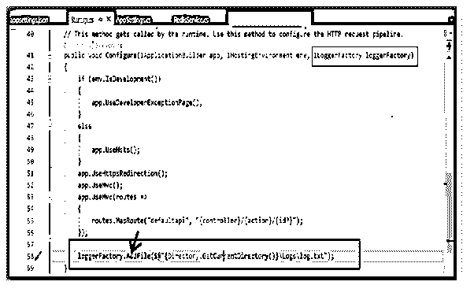
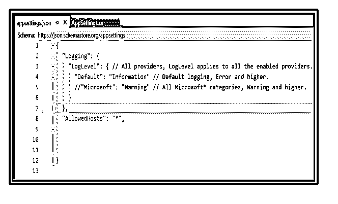
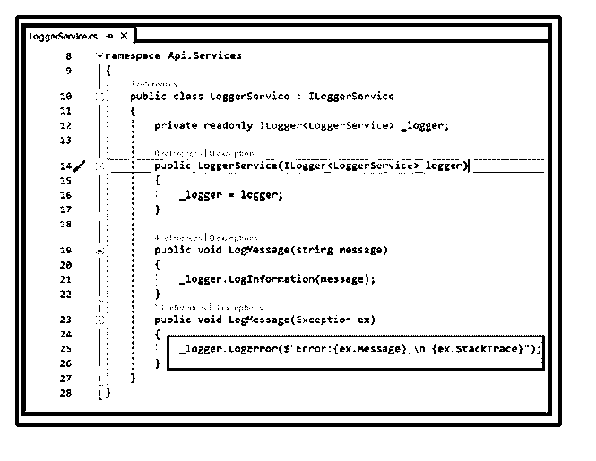
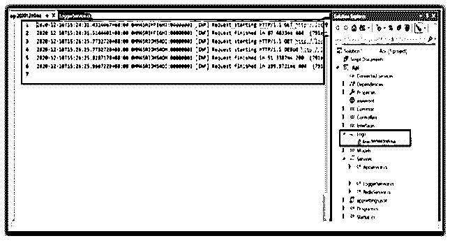

# ASP.NET 岩心记录到文件

> 原文：<https://www.educba.com/asp-dot-net-core-logging-to-file/>

## ASP.NET 岩心记录到文件简介

ASP.NET 岩心记录到文件基本上是在任何生产应用程序中；像这种方法一样，我们在 Web 应用程序中记录整个错误。这样，ASP.NET 核心以一种有用的方式提供并维护应用程序的输出日志。日志的完成借助于中间件的方法，这使得模块化库设计的帮助。ASP.NET 核心的 Web 应用程序中包含了几个库，还有几个是通过 NuGet 包管理器安装的第三方扩展。

### ASP.NET 岩心记录到文件概述

就像。NET 内核日志记录机制，反映了 ASP.NET 内核。微软的 API 记录器。日志记录与各种日志记录或内置的提供者一起工作。在 ASP.NET 核心应用程序中，我们需要安装名为 Microsoft 的软件包。扩展。日志和我们喜欢的几个日志提供者。

<small>网页开发、编程语言、软件测试&其他</small>

### ASP.NET 岩心录井是如何工作的？

ASP.NET 核心包含内置的日志框架，它不像第三方库那样丰富。所以我们转向一个叫做 SeriLog 的第三方。我们可以在 ASP.NET 内核包含的启动类的配置方法中找到 ILoggerFactory。我们可以在开发新的 ASP.NET 核心 Web 应用程序或 API 应用程序时看到初创类。

`Public void configure(IApplicationBuilder app, IHostingEnvironment env, ILoggerFactory loggerFactory)
{
loggerFactory.AddConsole(Configuration.GetSection("Logging"));
loggerFactory.AddDebug();
}`

让我们看看下面的 appsetting.json 的代码，它们的默认设置如下所示，

`{
"Logging":
{
"IncludeScopes": false,
"LogLevel":
{
// here the LogLevel applied to the entire enabled providers
"Default": "Information", // this was the default logging and error
"System": "Information",
"Microsoft": "Information"
}
}
}`

### 逐步将 ASP.NET 核心日志记录到文件

您可以通过三个步骤轻松地将消息、警告或错误记录到文本文件中。

在 ASP.NET 核心日志文件中，我们可以在三个步骤内将消息、错误或警告记录到文本文件中；它们如下。

*   在您的项目中，添加 SeriLog 扩展日志记录 NuGet 包。
*   在启动类中调用方法“AddFile”
*   在控制器中调用 ILogger 信息

让我们来看看下面的步骤，

#### 最初将 SeriLog 扩展包含到项目中

在解决方案浏览器中，只需右键单击并管理 NuGet 包，然后搜索 SeriLog。扩展名. Logging.File”并安装它。

在启动类中调用“AddFile”方法

ILoggerFactory 接口，它提供了在安装 SeriLog 扩展时反复调用 AddFile 的方法。在 AddFile 方法中，我们必须指出存储文本文件的位置。

这是 appsettings.json 的文件，默认配置如下:

在控制器中调用 ILogger。

在这一步中使用了 DI 调用的依赖注入 ILogger <t>Logger 服务类，它存储日志错误以及日志信息。</t>

### 测试结果

最后，在执行应用程序的同时，会在规定的位置创建日志文件；我们还可以在启动类 Configure 方法中设置位置。让我们看看下面这张描述它的图片，

### 添加 ASP.NET 核心日志记录提供程序

在 ASP.NET 核心中，我们需要在 LoggerFactory 中包含提供者。在 ASP.NET 核心 MVC 的应用中，调用 WebHost。SampleProgram.cs 中的 CreateDefaultBuilder(args)方法在内部包括 EventSource、Debug 和 Console 日志记录提供程序。

示例程序 1

`public class SampleProgram
{
public static void Main(string[] args)
{
CreateWebHostBuilder(args).Build().Run();
}
public static IWebHostBuilder CreateWebHostBuilder(string[] args) =>
WebHost.CreateDefaultBuilder(args)
.UseStartup<Startup>();
}`

示例程序 2

`public static IWebHostBuilder CreateWebHostBuilder(string[] args) =>
WebHost.CreateDefaultBuilder(args)
.ConfigureLogging(logBuilder =>
{
logBuilder.ClearProviders(); // in LoggerFactory eliminate the entire providers
logBuilder.AddConsole();
logBuilder.AddTraceSource("Information, ActivityTracing"); //to include the trace Listener Provider
})
.UseStartup<Startup>();`

上面的代码示例包含 ConfigureLogging()方法，该方法捕获对日志提供者配置的委托动作<ilogbuilder>。若要包含所选的日志记录提供程序，请通过使用 ClearProviders()和调用提供程序的扩展方法来排除默认提供程序，以包含添加跟踪侦听器提供程序的 AddTraceSource()和包含控制台日志记录提供程序的 AddConsole()方法。使用 Startup 类的 configure()方法中的 ILoggerFactory 配置日志提供程序。</ilogbuilder>

### 创建 ASP.NET 核心日志文件

要在控制器中创建日志，我们需要在使用 ASP.NET 核心依赖注入(DI)的应用程序中使用 ILoggerFactory 或 ILogger 让我们看看 HomeController 的以下示例。

示例代码:登录控制器

`namespace AspDotNetCoreMvcApp.Controllers
{
public class HomeController : Controller
{
private readonly ILogger _logger;
public HomeController(ILogger<HomeController> logger)
{
_logger = logger;
}
public IActionResult Index()
{
_logger.LogInformation("Messages of Logs in method Index()");
return View();
}
public IActionResult About()
{
_logger.LogInformation("Messages of Logs in method About()");
return View();
}
}
}`

在上面的示例代码中，构造函数中包含的 ILogger <homecontroller>的参数。ASP.NET 核心 DI 传递用于记录 Index()和 About()的操作方法的 ILogger 实例。</homecontroller>

将 HomeController 作为通用类型传递给将用作类别的 ILogger <homecontroller>。通过指定在名为 AspDotNetCoreMvpApp 的日志中显示限定名的 ILogger <homecontroller>。在日志中，让我们看看下面一行代码</homecontroller></homecontroller>

主要信息:AspDotNetCoreMvcApp。控制器. HomeController[0]

Index()方法中的日志消息，使用名为 LogInformation()的方法记录的信息，它以 like“info:”开头，带有日志创建位置的限定类名:AspDotNetCoreMvcApp。Controllers.HomeController[0]，这里的事件 id 是[0]。指定用于标识记录的事件 id，例如:页码、Id 或用于唯一标识日志的任何其他信息。如果我们没有指定任何事件 id，它被赋值为 0，下一行将是一个实际的日志消息，如“方法索引()中的日志消息”

我们可以绕过构造函数中的 ILoggerFactroy 来获得相同的数据。

`public class HomeController: Controller
{
private readonly ILogger _logger;
public HomeController(ILoggerFactory logFactory)
{
_logger = logFactory.CreateLogger<HomeController>();
}
public IActionResult Index()
{
_logger.LogInformation("Messages of Logs in method Index()");
return View();
}
public IActionResult About()
{
_logger.LogInformation("Messages of Logs in method About()");
return View();
}
}`

### 结论

本文解释了一些简单的步骤，比如使用第三方库 SeriLog 将错误和警告记录到文件中。我希望这篇文章能帮助你理解。

### 推荐文章

这是 ASP.NET 岩心记录到文件的指南。在这里，我们讨论使用第三方库 SeriLog 将错误和警告记录到文件中的步骤。你也可以看看下面的文章来了解更多-

1.  [在 ASP.NET 验证](https://www.educba.com/validation-in-asp-net/)
2.  [ASP.NET 网络控件](https://www.educba.com/asp-net-web-controls/)
3.  [ASP.NET 国家管理](https://www.educba.com/asp-dot-net-state-management/)
4.  [ASP.NET 更新面板](https://www.educba.com/asp-dot-net-updatepanel/)