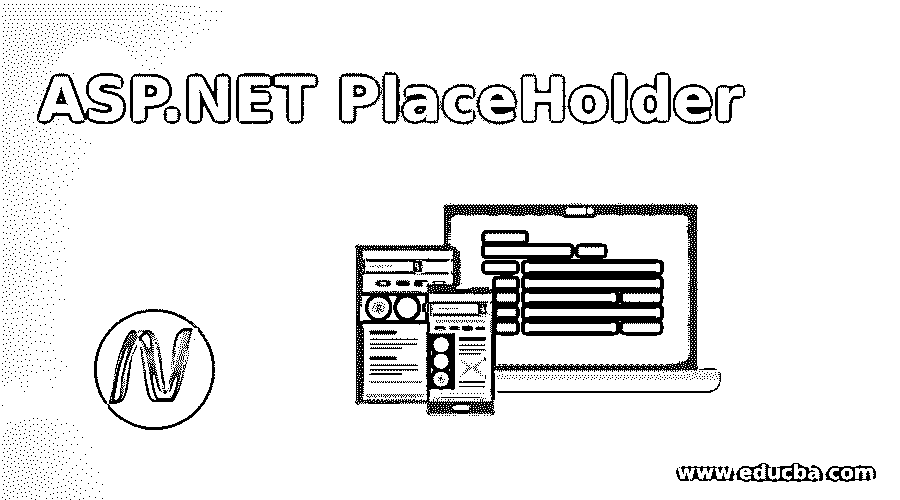
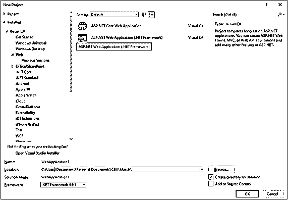
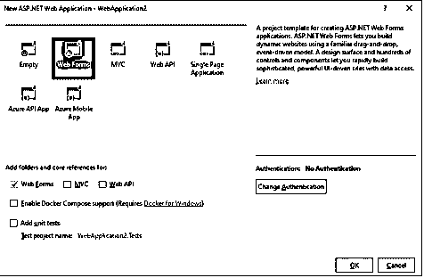
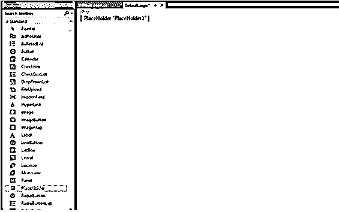

# ASP.NET 占位符

> 原文：<https://www.educba.com/asp-dot-net-placeholder/>

## ASP.NET 占位符介绍

ASP.NET 中的占位符控件是从 control 类继承的。这是 ASP.NET 框架中的一个控件，充当其他控件的调节控件，不在网页上产生任何输出。当然，占位符控件是不可见的，因为它对用户是不可见的，并且不产生任何 HTML。尽管如此，这个控件在开发动态网页时还是非常重要的。另一个名为 literal control 的控件与占位符控件有类似的工作，与不同的是，它不添加任何服务器控件；因此，它可以用来在网页上只显示静态文本或 HTML 标签。在这个主题中，我们将学习 ASP.NET 占位符。

**语法**

<small>网页开发、编程语言、软件测试&其他</small>

`<asp:PlaceHolder      EnableTheming="True|False"      EnableViewState="True|False"      ID="string"      OnDataBinding="DataBinding event handler"      OnDisposed="Disposed event handler"      OnInit="Init event handler"      OnLoad="Load event handler"
OnPreRender="Prerender event handler"      OnUnload="Unload event handler"      runat="server"      SkinID="string"      Visible="True|False” />`

**例子**

`<asp:PlaceHolder  EnableTheming="False"  EnableViewState="False"  ID="plc_HolderBox"  OnDisposed="plc_HolderBox_Disposed"  OnInit="plc_HolderBox_Init"  OnLoad="plc_HolderBox_Load" OnPreRender="plc_HolderBox_PreRender"  OnUnload="plc_HolderBox_Unload"  runat="server"      SkinID="string"      Visible="True" >
<asp:CheckBox ID="chkbx_ExampleBox" Text ="Check to say Yes" Checked ="false" BackColor="#33ccff" Font-Bold="true" runat="server" OnCheckedChanged="chkbx_ExampleBox_CheckedChanged" AutoPostBack="true"/>
</asp:PlaceHolder>`

上面的示例创建了一个名为 plc_HolderBox 的占位符，ID 属性设置控件的名称，并且可以使用 ID 属性在程序中的任何位置访问该控件。为了将数据绑定到占位符中的控件，名为“OnDataBinding”的属性。可以使用“OnDataBinding”事件将数据绑定过程绑定到事件处理程序。这种控制可以是单端控制或双端控制。要将控件添加到占位符中，可以将控件写成双结束标记 <placeholder></placeholder> 。CSS 可以使用诸如“EnableThemeing”、“SkinID”等属性应用于占位符。可以在开始和结束标签之间添加复选框按钮。

### ASP.NET 占位符的属性

通过使用 placeholder，还可以在运行时将控件添加到占位符控件中。若要在占位符中查找动态创建的控件，请使用占位符。FindControl 方法。放置在占位符控件中的控件充当单个实体，可在整个页面中访问。如果要隐藏窗体中的文本框和按钮，最好将所有内容都保留在占位符控件中，并将 visible 属性设置为 false。占位符控件无法调整大小，因为它不产生输出。调整控件大小的唯一选项是放置

标签，并根据需要使用所有样式。

*   **启用主题化**

指示主题是否可以添加到控件中。

*   **ID**

标识符用于控件在整个程序中访问它。

*   **SkinID**

返回需要应用于控件的外观 ID。

*   **可见**

上述属性可用于设置控件在整个页面中是否可见。

*   **视图状态**

返回可以跨多个请求存储和还原的信息。

*   **页面**

返回对包含服务器控件的页面的引用。

*   **加载**

此属性引发控件的 OnLoad 事件。

*   **语境**

此属性返回与当前网页的服务器控件关联的 HttpContext 对象。

*   **控件**

它返回表示当前页的子控件的 ControlCollection 对象。

*   **视图状态模式**

返回控件的视图状态模式。

*   **模板控制**

返回包含该控件的模板的引用。

*   **OnDispose**

当控件从内存中释放时，调用此事件进行指定的处理。

*   **波浪指数**

将数据绑定到控件时，会引发事件。

### ASP.NET 占位符示例

以下是 ASP.NET 占位符的示例:

*   打开 Visual Studio 2017 ->文件->项目->选择新的 ASP.NET 应用

*   选择 web forms，因为我们正在展示简单占位符控件的示例。

*   占位符控件可以从。使用以下代码创建网页的 aspx 部分。但是，占位符控件只能在“代码”视图中编辑，这与面板控件不同，面板控件也可以在“设计”视图中编辑。

`<%@PageLanguage="C#"AutoEventWireup="true"CodeBehind="Default.aspx.cs"Inherits="WebApplication2.Default"%>
<!DOCTYPEhtml>
<html>
<headrunat="server">
<title></title>
</head>
<body>
<formid="form1"runat="server">

<asp:PlaceHolderEnableTheming="False"EnableViewState="False” ID="plc_HolderBox"OnDisposed="plc_HolderBox_Disposed"OnInit="plc_HolderBox_Init"OnLoad="plc_HolderBox_Load"
OnPreRender="plc_HolderBox_PreRender"OnUnload="plc_HolderBox_Unload” runat="server"SkinID="string"Visible="True">
<asp:LabelID="Label1"Text="Please check the checkbox."runat="server"></asp:Label>
<asp:CheckBoxID="chkbx_ExampleBox"Text="Check to say Yes"Checked="false"BackColor="#33ccff"Font-Bold="true"runat="server"OnCheckedChanged="chkbx_ExampleBox_CheckedChanged"AutoPostBack="true"/>
</asp:PlaceHolder>

</form>
</body>
</html>`

此处的占位符控件将包含一个标签，上面写着“请选中复选框和名为“chbk_ExampleBox”的复选框”。占位符控件的 visible 属性在此处设置为 true 因此，内部子控件是可见的，如果占位符的 visible 属性设置为 false，内部子控件将被隐藏，用户将无法在网页上看到它们。此处占位符控件的 visible 属性覆盖标签和复选框按钮的 visible 属性(如果有)。

*   可以通过从 ASP.NET 工具箱中拖放控件来添加占位符控件。

*   上述不同的属性可以从 visual studio IDE 右侧的属性窗口中设置。

*   上述代码的输出将如下所示。即使控件标签和复选框按钮保留在占位符控件中，该输出也不会显示出明显的差异，因为控件不会产生任何输出。

选中该复选框后，将显示输出

### 结论

另一个名为 Panel control 的控件的作用与持有其他控件相同，但不产生任何 HTML。尽管如此，使用面板控件的一个主要缺点是，当涉及到渲染时，面板控件是；面板控制很重。因此，它需要呈现为空，而占位符控件只替换为子控件。占位符控件的另一个优点是它可以放在 HTML 页面的任何地方，比如在标记之间，但是面板控件只需要放在 ASP.NET web forms 标记中。

### 推荐文章

这是 ASP.NET 占位符指南。这里我们讨论 ASP.NET 占位符的例子以及属性和语法。您也可以看看以下文章，了解更多信息–

1.  [ASP.NET 会话 ID](https://www.educba.com/asp-net-sessionid/)
2.  [ASP.NET 验证摘要](https://www.educba.com/asp-dot-net-validationsummary/)
3.  [ASP.NET 版本](https://www.educba.com/asp-dot-net-versions/)
4.  [ASP.NET MVC 观看包](https://www.educba.com/asp-net-mvc-viewbag/)