# ASP.NET MVC

> 原文：<https://www.educba.com/asp-net-mvc/>

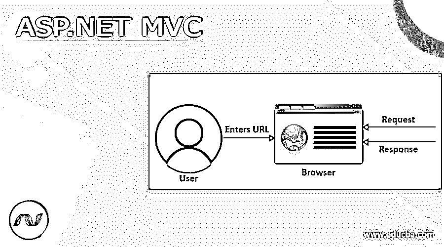

## ASP.NET MVC 简介

ASP.NET MVC 提供了清晰的代码分离，这是微软提供的 web 开发应用程序最具可扩展性和可定制性的框架。该框架基于描述模型-视图-控制器的 MVC 模式。ASP.NET MVC 是基于模型-视图-控制器架构的 web 框架，通过使用该框架开发者可以构建使用 CSS、HTML 和 JavaScript 的动态 Web 应用程序，MVC 框架允许干净分离，快速开发应用程序。

### 什么是 ASP.NET MVC？

ASP.NET MVC 是一个开源软件和 Web 开发框架，它结合了模型-视图-控制器(MVC)架构的特点和敏捷开发的最新技术。它是轻量级的，它将框架分为三个部分，如模型、视图和控制器，这样可以简单地控制应用程序的复杂性。

<small>网页开发、编程语言、软件测试&其他</small>

### ASP.NET MVC 框架

该框架基于描述模型-视图-控制器的 MVC 模式。MVC 代表模型、视图和控制器，它将应用程序分成三个部分。让我们看看这三个组件，

m 表示描述数据的模型，这里 C#中的类表示模型，模型对象存储数据并从数据库中获取数据。模型表示数据。

v 表示用于用户界面的视图，它主要用于向用户显示目的视图模型数据。视图中包含的代码是 Razor 语法 HTML、CSS，使得与模型和控制器的通信变得容易。视图表示用户界面。

c 代表控制器是用户请求，一般用户利用视图提出请求，请求由控制器处理。控制器是处理请求并返回合适的视图作为响应的主要工具。控制器表示请求处理器。

这是 MVC 架构，它在 ASP.NET MVC 中显示了用户请求的流程结构，

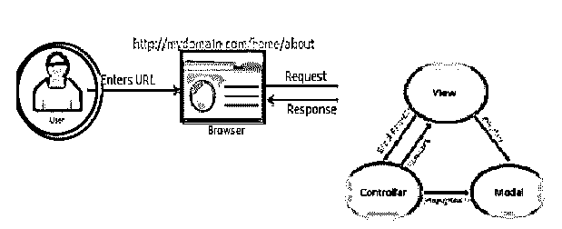

最初，用户输入浏览器的 URL。一旦进入，它将传递到 web 服务器并路由到控制器。然后，控制器使用合适的视图和模型执行请求，并构建响应，然后发送回浏览器。

### 创建 ASP.NET MVC

首先打开 Visual Studio 并选择文件新建项目

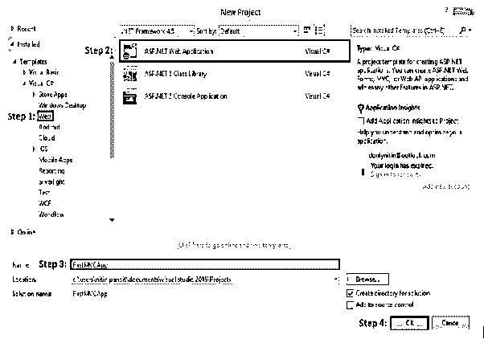

然后从新打开的窗口中选择选项，如图所示

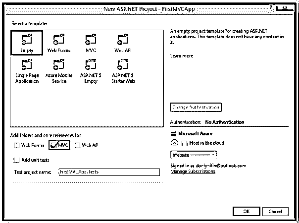

一旦点击“确定”按钮，新项目将被创建，只需查看解决方案资源管理器，它包含三个空文件夹，如模型，视图，控制器。

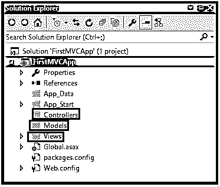

它有一个 APP_Start 文件夹，其中包含 RouteConfig.cs 这样的文件，在这里我们必须为 MVC 应用程序编写默认的路由路径，

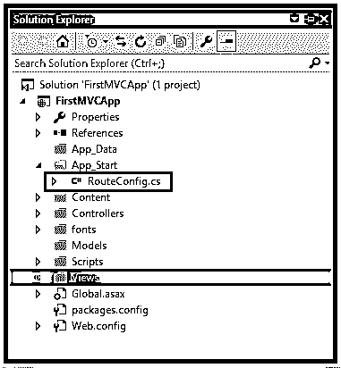

查看 MVC 应用程序中每个路由文件的默认代码，并通过右键单击特定文件夹并命名，在应用程序中添加新的控制器、模型和视图。添加控制器，

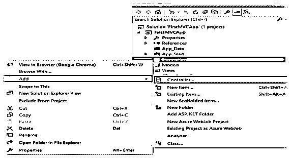

添加视图部件，

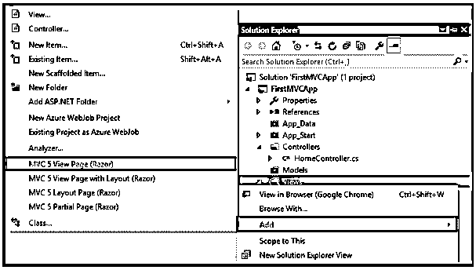

视图页面扩展类似于。cshtml 使用 Razor 视图引擎来呈现 html 页面，无论您想在这里显示什么，我们都需要编写如下代码，

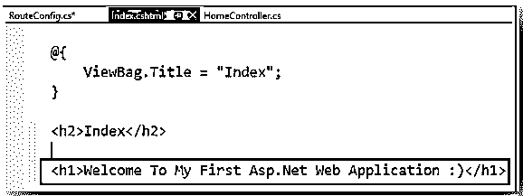

一旦执行应用程序，输出将如下所示，

### ASP.NET MVC 模式

ASP.NET MVC 应用程序中的模型描述了组件，它包含代表业务数据或领域数据的类的集合，也给出了控制业务数据的逻辑。ASP.NET MVC 中的简单模型，用于控制域数据，域数据表示应用程序在内存中的状态。我们可以将整个模型类存储到 MVC 应用程序的 Models 文件夹中。让我们看一个例子来更好地理解 MVC 中的模型，

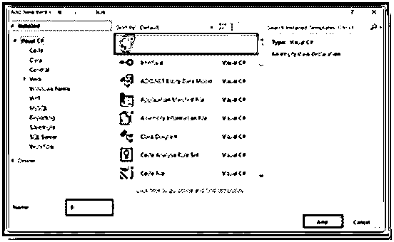

考虑到这里我们显示的是雇员信息，比如雇员姓名、ID、性别、地址等等。为了存储员工详细信息，我们使用 EmployeeModel 类，只需右键单击 models 文件夹并选择 Add Class 用适当的名称命名该类，最后单击 Add 按钮，如下所示。

一旦创建了如下所示的模型类代码，

`namespace Sample_MVC.Models
{
public class EmployeeClass
{
public int Employee_ID { get; set; }
public string Employee_Name { get; set; }
public string Employee_Address { get; set; }
public string Employee_City { get; set; }
public string Employee_Gender { get; set; }
public decimal Employee_Salary { get; set; }
}
}`

上面的代码是 Employee 模型类，它包含内存中的雇员数据，无论我们在模型中包含什么类，它也包含管理/控制业务数据的业务逻辑。

### MVC 架构模式

在 ASP.NET，MVC 包含架构模式，这是各种技术使用的设计模式。MVC 模式是一种模型-视图-控制器设计模式，用于构建用户界面。让我们看看下面模型、视图和控制器之间的交互，

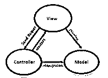

最初它被命名为事物-模型-视图-编辑器，后来它被简化为模型-视图-控制器。它定义了应用程序中编码的分离，例如模型文件夹中的业务数据和视图文件夹中的用户界面部分以及控制器文件夹中的业务逻辑。让我们将用户界面 UI 应用程序的模式分成如下三个部分:

*   模型–它包含应用程序的一组类，表示您正在处理的数据以及业务逻辑。
*   视图–它包含 UI 部分，比如应用程序如何显示内容，它包含决定应用程序外观的 HTML razor 语法。
*   控制器——它包含一组处理应用程序整体流程的类，以及它们的特定逻辑和来自用户的通信。

### MVC 的特点

让我们看看 MVC 的各种特性，

*   ASP.NET MVC 通过将应用程序分成三个部分，如模型、视图和控制器，来管理应用程序的复杂性。
*   没有使用视图状态或基于服务器的表单，这使得该框架对于控制应用程序行为的开发人员来说是轻量级的和至高无上的。
*   它为 TTD(测试驱动开发)提供了最好的支持，因为我们可以在某个时候只专注于某个特定的方面，而不用担心业务逻辑，我们可以专注于视图部分，这对于大规模的开发团队和 Web 应用程序来说也是完美的。
*   每个开发人员可以基于他们专业知识来处理应用程序的不同部分，就像一个人可以处理用户界面(UI)视图部分，而其他人可以专注于或处理控制器逻辑和建模业务数据。
*   包含了干净的 HTML 和与 jQuery 和 JavaScript 的简单集成。
*   这个 MVC 框架的主要特点是它的组件被设计成可扩展和可插入的，易于定制。
*   MVC 框架建立在 ASP.NET 框架之上，因此我们可以利用许多功能，如成员角色、认证、授权、会话和缓存等。
*   MVC 框架维护了占主导地位的 URL 路由机制，这是一种属性路由，有助于为应用程序创建 SEO 友好和用户友好的 URL。

### 结论

在这篇文章中，我们学习了 ASP.NET MVC 框架，它的模式和架构，以及 MVC 应用程序的创建，希望这篇文章能帮助你理解。

### 推荐文章

这是一个 ASP.NET MVC 的指南。这里我们讨论一下入门，什么是 ASP.NET MVC，创建 ASP.NET MVC，分别特点。您也可以看看以下文章，了解更多信息–

1.  [ASP.NET 的数据集](https://www.educba.com/dataset-in-asp-dot-net/)
2.  [ASP.NET 生命周期](https://www.educba.com/asp-dot-net-life-cycle/)
3.  [ASP.NET 安全](https://www.educba.com/asp-dot-net-security/)
4.  [ASP.NET 网络控件](https://www.educba.com/asp-net-web-controls/)