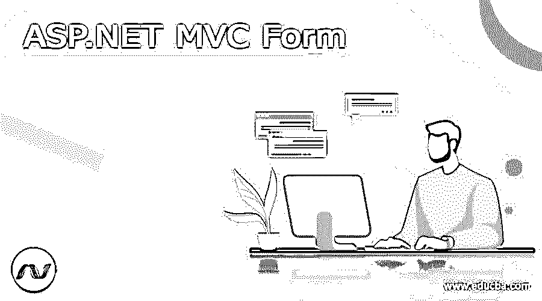
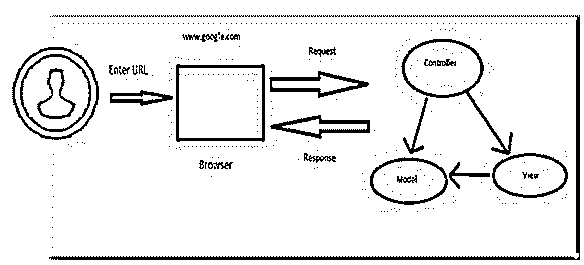
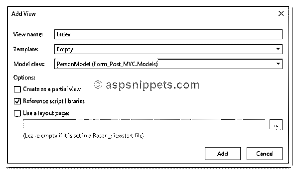
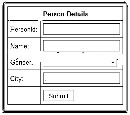

# ASP.NET MVC 表单

> 原文：<https://www.educba.com/asp-net-mvc-form/>

## ASP.NET MVC 表单介绍

ASP.NET MVC 模式是大多数程序员学习的最重要和最基本的东西。ASP.NET MVC 表单是 MVC 框架中的一个组件，建议使用表单。MVC 分为三种方式，侧重于关注点的分离。MVC 提供了应用程序和表单的基于方便、简单的设置和设计，并以快速的方式提供了现代的、响应性强的 UI 框架。

### ASP.NET MVC 表单

ASP.NET MVC 的主要目的是将内容从数据处理中分离出来，并将表示从内容中分离出来。MVC 代表模型-视图-控制器。MVC 将应用程序分成三个部分。

<small>网页开发、编程语言、软件测试&其他</small>

*   模型——模型用于表示数据的业务逻辑和形状。模型对象在数据库中存储和检索模型状态。它维护应用程序的数据。
*   视图–视图用于表示用户界面，它通过使用模型向用户显示数据，并允许修改数据。控制器——控制器主要用来处理用户的请求。

让我们看看 ASP.NET MVC 中用户请求的流程

让我们了解一下 MVC 结构的流程，

最初，用户在浏览器中输入 URL。一旦输入 URL，它就传递给服务器并调用控制器。然后，控制器使用期望的视图和模型来创建响应，并将它们发送回用户。控制器处理用户的请求，所以最重要的是首先创建控制器。

### 创建 ASP.NET MVC 表单

ASP.NET MVC 是无状态的，最初，它与控制器对话，控制器处理请求，从模型中获取所需的数据，并将数据传输到视图，最后，视图用于向最终用户显示数据。让我们使用模型类创建表单字段，并使用 ASP.NET MVC 中的模型类对象将数据从视图发送到控制器。

#### 模型

让我们创建一个名为 PersonModel 的模型类，它包含四个属性:人的 ID、人的名字、人的性别和人的城市。

`public class PersonModel
{
public int Person_ID { get; set; }
public string Person_Name { get; set; }
public string Person_Gender { get; set; }
public string Person_City { get; set; }
}`

#### 控制器

在控制器类中，将有两个名为 Index 的动作方法，一个用于处理 GET 操作，另一个用于处理 POST 操作。POST 操作的 Action 方法接受 PersonModel 类作为对象的参数，从视图内部的表单提交的值通过参数进行检索。让我们如下创建控制器类，

`using System;
using System.Collections.Generic;
using System.Linq;
using System.Web;
using System.Web.Mvc;
namespace MVC_Form
{
public class HomeController : Controller
{
// GET: Home
public ActionResult Index()
{
return View();
}
[HttpPost] public ActionResult Index(PersonModel person)
{
int person_Id = person.Person_ID;
string person_name = person.Person_Name;
string person_gender = person.Person_Gender;
string person_city = person.Person_City;
return View();
}
}
}`

#### 视角

一旦创建了模型和控制器类，接下来添加控制器的视图，同时添加控制器的视图，我们需要选择所需的模型类这里我们选择我们已经创建的 PersonModel 类，

在视图中，模型类 PersonModel 是为视图声明的。视图由使用 Html 开发的 HTML 表单组成。具有以下参数 BeginForm 方法，

*   Action name–这里的操作名称是 Index
*   Controller name——这里控制器的名称是 Home
*   FormMethod-在这里它指定了被称为 GET 或 POST 的表单方法，在这里它将被设置为 POST。

在这里，视图模型类 PersonModel 被声明为 View，视图由使用 Html 开发的 HTML 表单组成。带参数的 BeginForm 方法，

`@model Form_Post_MVC.Models.PersonModel
@{
Layout = null;
}
<!DOCTYPE html>
<html>
<head>
<meta name="viewport" content="width=device-width"/>
<title>Index</title>
</head>
<body>
@using (Html.BeginForm("Index", "Home", FormMethod.Post))
{
<table cellpadding="0" cellspacing="0">
<tr>
<th colspan="2" align="center">Person Details</th>
</tr>
<tr>
<td>PersonId: </td>
<td>
@Html.TextBoxFor(m => m.Person_ID)
</td>
</tr>
<tr>
<td>Name: </td>
<td>
@Html.TextBoxFor(m => m.Person_Name)
</td>
</tr>
<tr>
<td>Gender: </td>
<td>
@Html.DropDownListFor(m => m.Person_Gender, new List<SelectListItem>
{ new SelectListItem{Text="Male", Value="M"},
new SelectListItem{Text="Female", Value="F"}}, "Please select")
</td>
</tr>
<tr>
<td>City: </td>
<td>
@Html.TextBoxFor(m => m.Person_City)
</td>
</tr>
<tr>
<td></td>
<td><input type="submit" value="Submit"/></td>
</tr>
</table>
}
</body>
</html>`

让我们看看输出屏幕中的表单，

### ASP.NET MVC 表单类型

ASP.NET MVC 模式是大多数程序员学习的最重要和最基本的东西。同样，MVC 模式也是大多数程序员做他们自己的事情的一个非常重要的东西。用 easy way 创建 ASP.NET MVC 表单有四种不同的方法，它们如下:

弱类型(同步类型)
强类型(同步类型)
强类型 AJAX(异步类型)
HTML、AJAX 和 JQuery

### ASP.NET MVC 表单示例

让我们看看上面的表单及其字段，

在用户界面视图中，将有文本框字段和提交按钮，它包含三个文本框字段，创建这些字段是为了使用 Html 获取人员的 ID、姓名和城市的值。TextBoxFor 方法。为了得到这个人的性别值，DropDownList 在 Html 的帮助下提供了可用的选项。函数的 DropDownListFor。将有提交按钮在表单的最后，一旦按钮被点击，整个表单得到提交。

对于文本框，代码如下所示，

`Getting the user ID
@Html.TextBoxFor(m => m.Person_ID)
Getting the user Name
@Html.TextBoxFor(m => m.Person_Name)
Getting the user Gender
@Html.DropDownListFor(m => m.Person_Gender, new List<SelectListItem>
{ new SelectListItem{Text="Male", Value="M"},
new SelectListItem{Text="Female", Value="F"}}, "Please select")
Getting the User City
@Html.TextBoxFor(m => m.Person_City)
For Submit button, once getting the entire form values finally submit the form.
<input type="submit" value="Submit"/>`

### 结论

在这篇文章中，我们已经创建了新的 ASP.NET MVC 表单，包括表单域和向控制器提交数据，我们还看到了各种类型的表单方法。希望这篇文章能帮助你在 MVC 中创建一个简单的表单。

### 推荐文章

这是一个 ASP.NET MVC 形式的指南。这里我们讨论 ASP.NET MVC 中用户请求的介绍、流程，以及代码实现的例子。你也可以看看下面的文章来了解更多-

1.  [ASP.NET 核心过滤器](https://www.educba.com/asp-dot-net-core-filter/)
2.  [ASP.NET 核心 JWT 认证](https://www.educba.com/asp-net-core-jwt-authentication/)
3.  [ASP.NET 核心环境变量](https://www.educba.com/asp-dot-net-core-environment-variables/)
4.  [ASP.NET 核心实体框架](https://www.educba.com/asp-dot-net-core-entity-framework/)