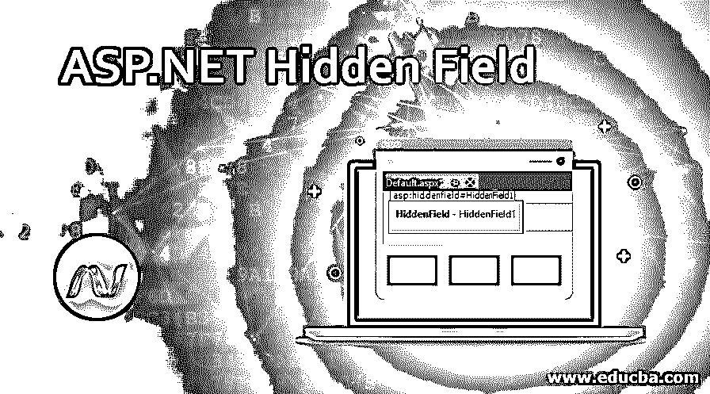
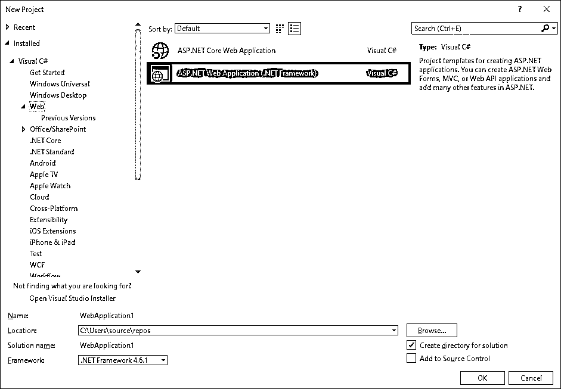
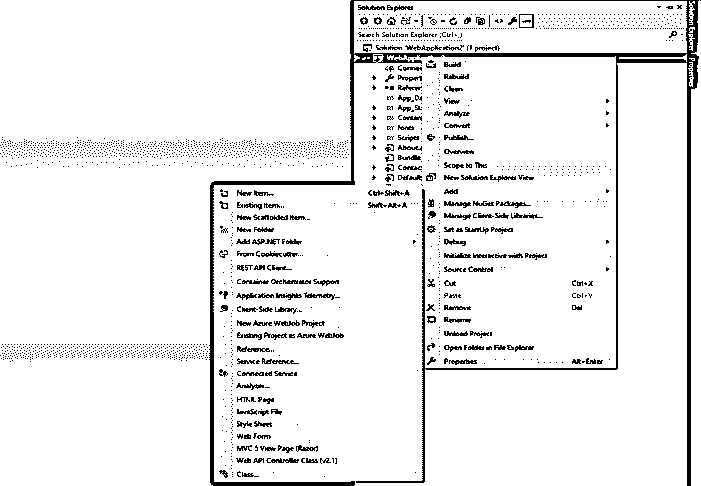
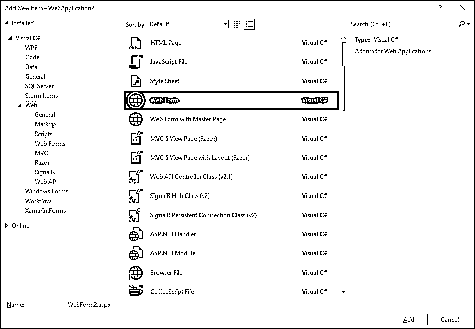
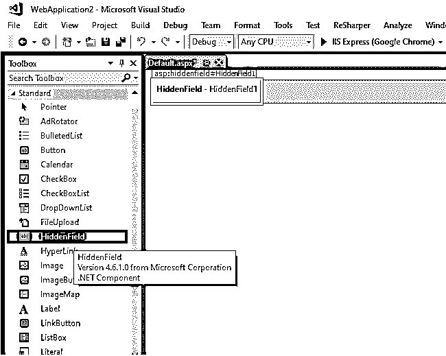
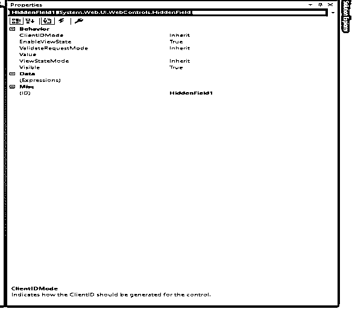

# ASP.NET 隐藏场

> 原文：<https://www.educba.com/asp-dot-net-hidden-field/>

## ASP.NET 隐藏场简介

隐藏字段控件是从系统继承的。Web.UI.WebControls 类是一个对用户不可见的控件，它存储需要在服务器往返过程中保持的信息。存储在隐藏字段控件中的细节可以通过查看文档的源代码来简单地看到。

### 带有属性的语法

下面是一个语法:

<small>网页开发、编程语言、软件测试&其他</small>

**语法:**

`<asp:HiddenField    EnableTheming="True|False"    EnableViewState="True|False"    ID="string"    OnDataBinding="DataBinding event handler"    OnDisposed="Disposed event handler”   OnInit="Init event handler"
OnLoad="Load event handler"    OnPreRender="PreRender event handler"    OnUnload="Unload event handler” OnValueChanged="ValueChanged event handler"    runat="server"    SkinID="string"    Value="string"
Visible="True|False" />`

下面的代码创建一个 ID 为“HdbFldDemo”的隐藏字段，该字段在其 value 属性中存储值“要存储的值”。该属性将在用户的浏览器中保存该值，即使在页面被发送到服务器并返回信息之后。OnDataBinding 事件调用方法将控件绑定到数据库表，在调用此事件时将从数据库表中检索数据。调用 OnDisposed 事件来释放附加到控件的任何对象。OnPreRender 事件用于在浏览器中呈现页面之前设置任何属性。

`<asp:HiddenField    EnableTheming="True "    EnableViewState="True "    ID="HdbFldDemo"    OnDataBinding="DataBinding event handler"    OnDisposed="Disposed event handler”  OnInit="Init event handler"
OnLoad="Load event handler"    OnPreRender="PreRender event handler"    OnUnload="Unload event handler” OnValueChanged="ValueChanged event handler"    runat="server"    SkinID="SkinDemo"    Value="value to be stored"
Visible="false" />`

从代码隐藏文件中提取并存储隐藏字段中的值

`HdbFldDemo.Value = abc
Label.Text = Convert.ToString(HdbFldDemo.Value);`

**属性:**

隐藏字段具有以下属性

*   **EnableTheming:** 这个布尔属性决定主题是否应该应用于这个控件。
*   ID: 这个 string 属性存储控件的值，通过这个值，可以在整个程序中访问它。
*   string 属性获取或设置皮肤属性的名称。
*   **值:**字符串存储隐藏字段将保存的实际值。
*   **Visible:** 布尔属性设置控件是否在网页上呈现
*   **ViewStateMode:** 视图状态模式属性设置或返回控件的当前视图状态模式。
*   **Parent:** 返回对父控件的引用，如果页面上有父控件的话。
*   **EnableViewState:** 将值设置为 true 以设置控件的视图状态，或者可用于返回当前设置的值。
*   **Context:** 返回网页控件的当前 HTTPContextObject。

### ASP.NET 隐藏场的例子

1.启动 Visual Studio ->新建->项目-> ASP.NET 网站。

2.在属性窗口中右键单击项目->选择添加->单击添加新项。

3.添加 Web 表单。将其重命名为 Default.aspx

4.在 Default.cs 文件中，如下所示。

`<%@ Page Language="C#" AutoEventWireup="true" CodeBehind="Default.aspx.cs" Inherits="WebApplication2.Default" %>
<!DOCTYPE html>
<html >
<head runat="server">
<title></title>
</head>
<body>
<form id="form1" runat="server">

<asp:HiddenField ID ="HiddenFieldDemo"  Visible="false" runat="server"/>

</form>
</body>
</html>`

5.隐藏字段也可以通过从 ASP.NET 工具箱拖放隐藏字段控件以声明方式添加。

6.属性的值可以在“属性”窗口中设置为:

7.向将显示隐藏字段值的代码添加一个标签。

`<%@ Page Language="C#" AutoEventWireup="true" CodeBehind="Default.aspx.cs" Inherits="WebApplication2.Default" %>
<!DOCTYPE html>
<html >
<head runat="server">
<title></title>
</head>
<body>
<form id="form1" runat="server">

<asp:HiddenField ID ="HiddenFieldDemo" runat ="server"/>
<label id ="lblTime" runat="server"></label>

</form>
</body>
</html>`

8.在代码隐藏文件中，添加包含添加到隐藏字段控件的 value 属性中的当前日期和时间的代码。

`using System;
using System.Collections.Generic;
using System.Linq;
using System.Web;
using System.Web.UI;
using System.Web.UI.WebControls;
namespace WebApplication2
{
public partial class Default : System.Web.UI.Page
{
protected void Page_Load(object sender, EventArgs e)
{
HiddenFieldDemo.Value = DateTime.Now.ToString();
lblTime.Text = Convert.ToString(HiddenFieldDemo.Value);
}
}
}`

当前日期和时间将存储在 Page_Load 事件的隐藏字段中，然后显示在 label 控件的 text 属性中。

### 结论

隐藏字段控件是 ASP.NET 使用的客户端状态管理技术的一部分。所有的 web 应用程序都使用无状态的 HTTP 协议。术语无状态意味着一旦信息被发送到服务器，控件的状态就丢失了。为了确保发送多个请求的客户端使用状态管理技术。客户端状态管理将数据存储在用户的浏览器上，这有助于提高 web 服务器的可伸缩性。由于这些隐藏字段是非可视控件，并且具有加密功能或受到任何保护，因此建议不要使用隐藏字段来存储任何重要数据，如视图状态、密码、帐户详细信息等。

### 推荐文章

这是 ASP.NET 隐藏领域的指南。在这里，我们讨论了 ASP.NET 隐藏字段的介绍、语法和参数，以及示例和代码实现。您也可以看看以下文章，了解更多信息–

1.  [ASP.NET 要求现场验证器](https://www.educba.com/asp-dot-net-requiredfieldvalidator/)
2.  [ASP.NET MVC 观看包](https://www.educba.com/asp-net-mvc-viewbag/)
3.  [ASP.NET 图像](https://www.educba.com/asp-dot-net-image/)
4.  [ASP.NET 标签](https://www.educba.com/asp-dot-net-label/)