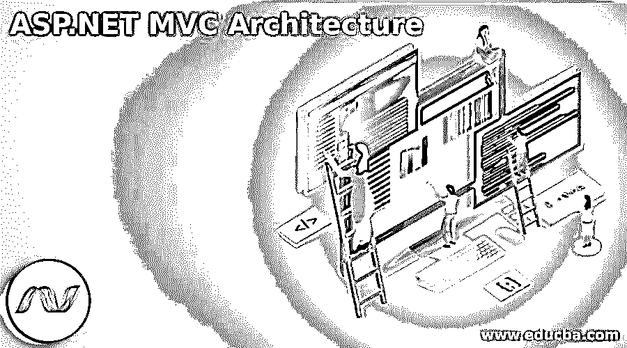
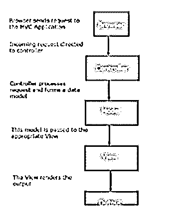
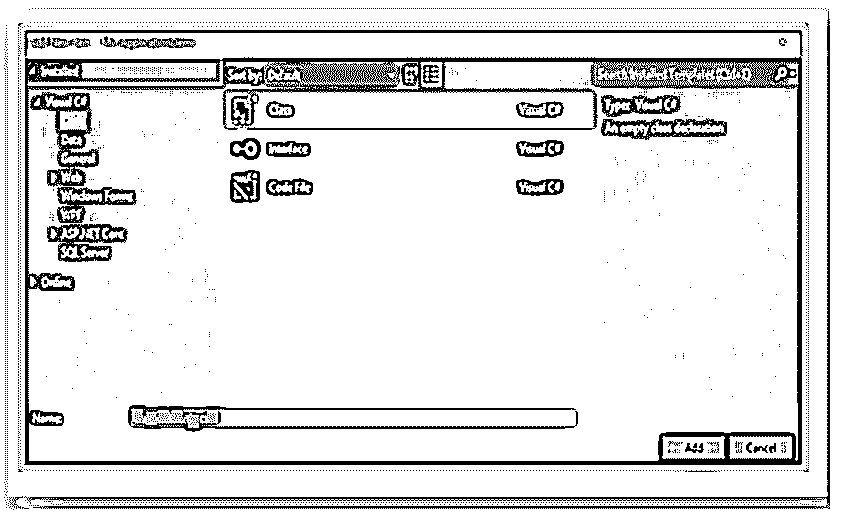
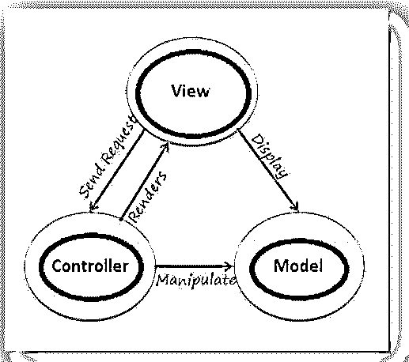
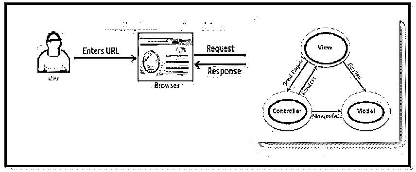

# ASP.NET MVC 架构

> 原文：<https://www.educba.com/asp-dot-net-mvc-architecture/>

## ASP.NET MVC 架构介绍

ASP.NET MVC 架构提供了一个清晰的关注点分离。整个类和对象是独立的，因为单独测试它们很容易。MVC 架构通过将应用程序分成三个单元(模型、视图和控制器)来帮助避免复杂性。MVC 框架为开发基于 MVC 的 Web 应用程序提供了一个到 Based Web 表单模式的交换。

### ASP.NET MVC 架构概述

在 ASP.NET MVC 架构中，我们已经看到了 MVC 框架的高层架构流程。

<small>网页开发、编程语言、软件测试&其他</small>

我们来看看当客户端有请求时，MVC 应用程序的执行流程。

让我们来看看 MVC 架构的流程图:

最初，浏览器发送请求这里的浏览器是指客户端向 MVC 应用程序发送请求。然后，Global.ascx 检索请求，并通过使用 RouteTable、RouteData、UrlRoutingModel 和 MVCRouteHandler 的对象，基于传入请求的 URL 执行路由。最后，路由操作对适当控制器的调用，并使用 IControllerFactory 对象和 MvcHandler 对象执行方法来执行它们。

控制器使用模型类处理数据，并使用 ControllerActionInvoker 对象调用所需的方法。最后，处理后的模型传递给视图的用户界面部分，呈现最终的输出。

### ASP.NET MVC 架构模式

ASP.NET MVC 架构模式是在逻辑上将应用程序分成三个部分的 MVC:模型、视图和控制器。这三个组件的开发是为了处理应用程序的特定开发方面。MVC 架构是用于构建可扩展和可伸缩项目的基本工业标准开发框架之一。

让我们看看每个组件:

*   **模型:**模型组件对应用户使用的逻辑相关数据；它表示控制器和视图组件或任何与数据相关的业务逻辑之间传输的数据。让我们看一个例子:Customer 对象从数据库中检索客户的信息，并操作、更新数据返回到数据库。
*   **视图:**是视图的用户界面部分，主要用于应用的 UI。让我们看一个例子，用户视图，它包括 UI 的组件，包括下拉框、文本框、复选框等等；最后，用户与表单进行交互。
*   **Controller:** 它表示整个业务逻辑的流程，并提出请求，使用模型组件操纵数据，并与视图交互，从而呈现最终的输出。控制器是视图和模型组件之间的接口。让我们看一个例子。假设从客户的角度处理整个交互和输入的客户控制器也使用客户模型更新数据库。最后，客户数据由同一个控制器查看。

### ASP.NET MVC 架构模型

在 ASP.NET MVC 架构中，模型是包含应用程序业务逻辑的类。模型类也用于访问数据库中的数据。模型类包含类的属性，不包含 HTML 代码，并且不直接处理来自浏览器的输入。模型主要是指用于实现业务应用程序的逻辑数据的对象。控制器的进程与模型交互，获取数据，操作，最后将数据传递给视图。让我们创建一个示例模型类。

向项目添加新模型；每个模型都包含一个 getter 和 setter 属性。要添加新模型，右键单击项目的模型文件夹，并执行如下操作:

模型–添加–新项目–选择类别并添加。

默认代码如下所示:

**代码:**

`CustomerDetails.cs
using System;
using System.Collections.Generic;
using System.Linq;
using System.Web;
namespace MvcApplicationDemo.Models
{
public class CustomerDetails
{
}
}`

在这里，我们可以在模型中包含任意数量的属性和方法。

让我们创建一些属性和方法，如下所示:

**代码:**

`CustomerDetails.cs
using System;
using System.Collections.Generic;
using System.Linq;
using System.Web;
namespace MvcApplicationDemo.Models
{
public class CustomerDetails
{
public int Customer_ID { get; set; }
public string Customer_FirstName { get; set; }
public string Customer_LastName { get; set; }
public string Customer_Gender { get; set; }
public int Customer_Age { get; set; }
public string Customer_Address { get; set; }
}
}`

### ASP.NET MVC 架构图示例

架构模式在软件工程过程中已经存在很长时间了。MVC 架构提供了清晰的关注点分离。整个类和对象是独立的，因为单独测试它们很容易。MVC 架构通过将应用程序分成三个单元(模型、视图和控制器)来帮助避免复杂性。MVC 框架为开发基于 MVC 的 Web 应用程序提供了一个到 Based Web 表单模式的交换。让我们来看几个 MVC 架构支持，
ASP.NET MVC 架构模式是将应用程序逻辑上分为三个组件的 MVC:模型、视图和控制器。这三个组件的开发是为了处理应用程序的特定开发方面。

模型代表数据和数据的形状。模型组件对应于用户使用的逻辑相关数据；它表示控制器和视图组件或任何与数据相关的业务逻辑之间传输的数据。类定义模型，模型的对象存储从数据库接收的数据。

视图是用户界面角色，用户视图，包括 UI 组件、下拉菜单、文本框、复选框等等；最后，用户与表单进行交互。视图是与控制器和模型通信的一种简单方式。它向用户显示数据，并允许修改数据。

控制器主要用于请求处理器。它处理用户请求；用户引发控制器处理的 HTTP 请求。控制器处理请求，最后用结果来响应。它代表了整个业务逻辑的流程和前进的请求，使用模型组件操纵数据，并与视图交互，从而呈现最终的输出。控制器是视图和模型组件之间的接口。

让我们看看下面的 MVC 架构图，模型-视图-控制器之间的交互:

下图解释了用户流程请求，MVC 架构的请求流程:

上图解释了用户在浏览器的 URL 中输入他们的请求，到达 web 服务器，然后沿着路线到达控制器。最后，控制器为请求执行所需的视图和模型，并为浏览器创建相应的响应。

### 结论

在本文中，我们看到了 MVC 的 MVC 架构模式。MVC 架构是可扩展的、可测试的和安全的。此外，MVC 架构通过将应用程序分成三个单元(模型、视图和控制器)来帮助避免复杂性。

### 推荐文章

这是 ASP.NET MVC 架构的指南。这里我们讨论 ASP.NET MVC 架构的介绍、模式、模型和例子。您也可以看看以下文章，了解更多信息–

1.  [ASP.NET 核心过滤器](https://www.educba.com/asp-dot-net-core-filter/)
2.  [ASP.NET 核心 JWT 认证](https://www.educba.com/asp-net-core-jwt-authentication/)
3.  [ASP.NET 核心环境变量](https://www.educba.com/asp-dot-net-core-environment-variables/)
4.  [ASP.NET 核心剃刀页](https://www.educba.com/asp-dot-net-core-razor-pages/)

