# ASP.NET·格里维

> 原文：<https://www.educba.com/asp-dot-net-gridview/>

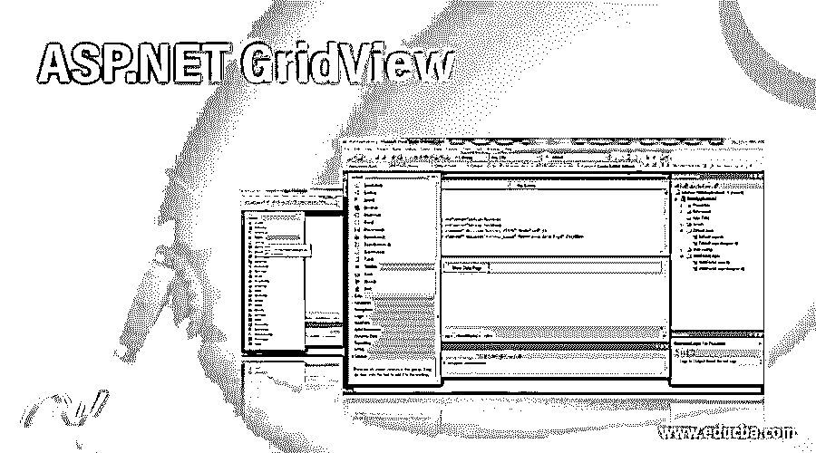

## ASP.NET 网格视图介绍

网格视图是当前 IT 行业非常流行的视图之一。这是当前每个客户对在网格视图中显示他们的屏幕的一个非常普遍的期望。它基本上是基于来自一个数据源的值的表格表示。它可以根据客户的要求控制特定的数据源并显示在屏幕上，主要是将数据源中的每一列视为一个字段，每一行视为该特定列的一条记录。这个控件有各种功能，可以在屏幕上显示多种类型的内容，我们将在本文档中详细介绍。

### ASP.NET 网格视图的语法

ASP.net Gridview 是当前场景中针对特定应用的非常流行的实现之一。网格视图主要处理数据源，控制数据源，以表格的形式显示在屏幕上。这里，每一列主要表示为一个字段，数据源中的每一行表示相应列的一个特定记录。

<small>网页开发、编程语言、软件测试&其他</small>

该网格视图支持多种功能，解释如下:

*   **SQLDataSource:** 主要需要维护绑定。传递数据源有大量的数据，这些数据主要与屏幕中的特定字段相关。该控件有助于将这些字段与数据源可用数据绑定。
*   **排序:**有对数据进行排序的能力。这个网格视图默认提供了一个排序工具，不需要为此编写任何额外的代码。表示数据可以根据屏幕中提供的链接按升序或降序排序。
*   **更新&删除:**可以更新或删除屏幕或数据源中的任何数据。这种能力确保最终用户可以轻松处理屏幕上的数据。这种便利可以基于网格视图表示的一些选择的参数来给出。
*   **分页:**这也是当前行业中非常需要的任何视图的特性。当大量数据进入数据源时，网格视图无法在屏幕上显示全部数据，it 可以默认将数据分成多个页面，并将分页工具提供给最终用户。它还具有搜索任何文本的功能，这有助于用户轻松找到特定的数据。
*   **行选择:**这也是关键的实用工具之一。网格视图为最终用户提供了选择特定行、修改所需数据并保存数据的选项。修改后的数据立即以正确或预期的视图显示在屏幕上。
*   **动态数据调整:**这是当前场景下任何高级屏幕呈现非常需要的特性。在大表格展示中，有一些数据需要动态调整，这意味着原始数据来自数据源，开发人员可能需要根据用户的要求对其进行更改。网格视图为开发人员提供了以简单的方式动态处理多个属性、多个事件和另一个视图的机会。
*   **关键字段:**网格视图提供了多个关键字段，用于呈现或处理来自数据源的大数据。
*   **超链接:**网格视图提供了处理多个数据源的良好工具，特别是在超链接列上。超链接列有验证字段，开发人员可以根据自己的要求使用。
*   **主题&风格:**网格视图提供了多种外观的能力，可以通过网格视图提供的主题&风格工具轻松处理。

### 实现 ASP.NET 网格视图的示例

在 ASP.net 应用程序中创建网格视图演示，开发人员通常需要使用以下特定代码:

`<asp:GridView runat=”Server” ID=”gridViewPre”></asp:GridView>`

整个 GridView 演示可以由一个人在处理仪表板和适当的演示的 ASPX 代码后面完成。

在代码给出的示例中，我们主要致力于执行以下操作:

*   将 GridView 仪表板演示文稿中的数据与特定列绑定。
*   在网格视图中编辑相应的数据。
*   从仪表板中删除特定行。
*   点击编辑后更新特定记录。

**HTML 代码:**

`<html >
<head id="Head1" runat="server">
<title>Untitled Page</title>
</head>
<body>
<form id="form1" runat="server">

<asp:GridView ID="GridView1" runat="server" AutoGenerateColumns="False"
OnRowEditing="GridView1_RowEditing" OnRowUpdating="GridView1_RowUpdating"
OnRowCancelingEdit="GridView1_RowCancelingEdit"
OnRowDeleting="GridView1_RowDeleting">
<Columns>
<asp:TemplateField HeaderText="ID">
<EditItemTemplate>
<asp:TextBox ID="TextBox2" runat="server" Text='<%# DataBinder.Eval(Container.DataItem,"ID") %> '></asp:TextBox>
<asp:RequiredFieldValidator ID="RequiredFieldValidator1" runat="server" ControlToValidate="TextBox2"
ErrorMessage="Enter an ID"></asp:RequiredFieldValidator>
</EditItemTemplate>
<ItemTemplate>
<%# DataBinder.Eval(Container.DataItem,"ID") %>
</ItemTemplate>
</asp:TemplateField>
<asp:TemplateField HeaderText="Name">
<EditItemTemplate>
<asp:TextBox ID="TextBox4" runat="server" Text='<%# DataBinder.Eval(Container.DataItem,"Name") %> '></asp:TextBox>
<asp:RequiredFieldValidator ID="RequiredFieldValidator2" runat="server" ControlToValidate="TextBox4"
ErrorMessage="Enter a Name"></asp:RequiredFieldValidator>
</EditItemTemplate>
<ItemTemplate>
<%# DataBinder.Eval(Container.DataItem,"Name") %>
</ItemTemplate>
</asp:TemplateField>
<asp:CommandField ShowEditButton="True" />
<asp:CommandField ShowDeleteButton="True" />
</Columns>
</asp:GridView>
<asp:Button ID="Button1" runat="server" OnClick="Button1_Click" Text="Button" />

</form>
</body>
</html>
Adding Page:
<body>
<form id="form1" runat="server">

<asp:TextBox ID="TextBox1" runat="server"></asp:TextBox>
<asp:TextBox ID="TextBox2" runat="server"></asp:TextBox>
<asp:Button ID="Button2" runat="server" OnClick="Button2_Click" Text="Add" />
<asp:Button ID="Button1" runat="server" OnClick="Button1_Click" Text="Show Data Page" />

</form>
</body>
Binding:
public void BindMyGridview()
{
if (Session["myDatatable"] != null)
{
DataTable dt = (DataTable)Session["myDatatable"];
if ((dt != null) && (dt.Rows.Count > 0))
{
GridView1.Visible = true;
GridView1.DataSource = dt;
GridView1.DataBind();
}
else
{
GridView1.Visible = false;
}
}
}
Row Updating:
protected void GridView1_RowUpdating(object sender, GridViewUpdateEventArgs e)
{
TextBox TextBoxWithID = (TextBox)GridView1.Rows[e.RowIndex].FindControl("TextBox2");
TextBox TextBoxWithName = (TextBox)GridView1.Rows[e.RowIndex].FindControl("TextBox4");
string NewID = TextBoxWithID.Text.ToString();
string NewName = TextBoxWithName.Text.ToString();
DataTable dt = (DataTable)Session["myDatatable"];
DataRow dr = dt.Rows[e.RowIndex] dr["ID"] = NewID;
dr["Name"] = NewName;
dr.AcceptChanges();
Session["myDatatable"] = dt;
GridView1.EditIndex = -1;
BindMyGridview();
}
Row Deleting:
protected void GridView1_RowDeleting(object sender, GridViewDeleteEventArgs e)
{
DataTable dt = (DataTable)Session["myDatatable"];
DataRow dr = dt.Rows[e.RowIndex];
dt.Rows.Remove(dr);
GridView1.EditIndex = -1;
BindMyGridview();
}`

使用新建>>>项目创建一个 ASP.net 应用程序。

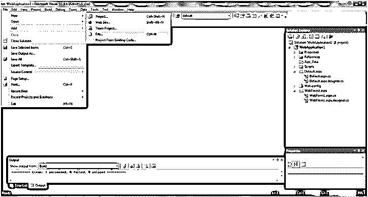

从下拉列表中选择. NET Framework 3.5。

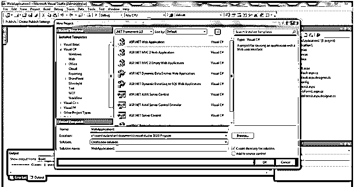

打开页面设计页面，在这里需要设计所有的属性。

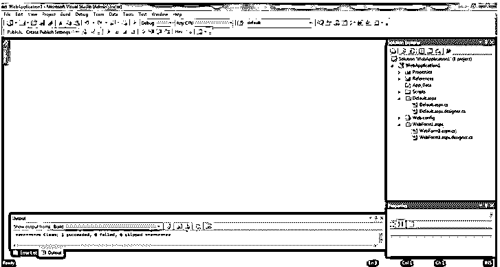

采取一种新的形式进行适当的设计。在表单内部，表格已经设计好了。ID 和名称在特定数据表数据应该显示的地方。

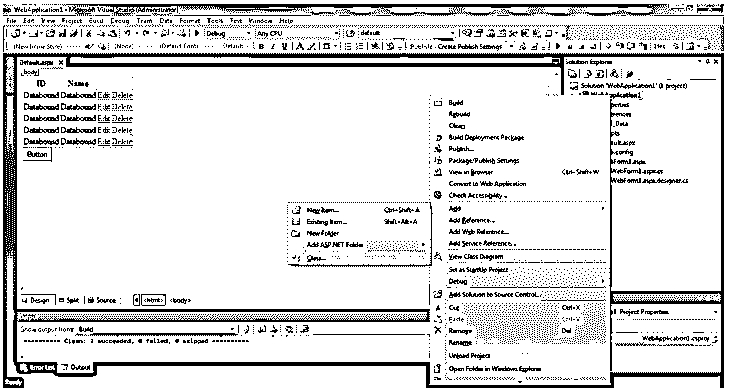

选择特定的在线模板来编写网格视图演示的背景逻辑。

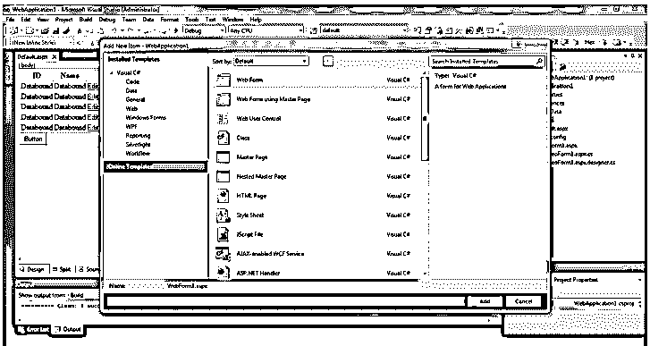

为应用程序准备代码并映射相应的字段以供进一步执行。

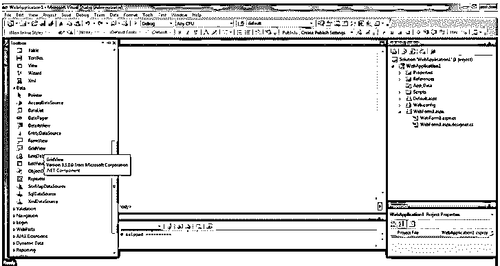

根据需要选择特定的数据源来使用和显示网格视图数据。

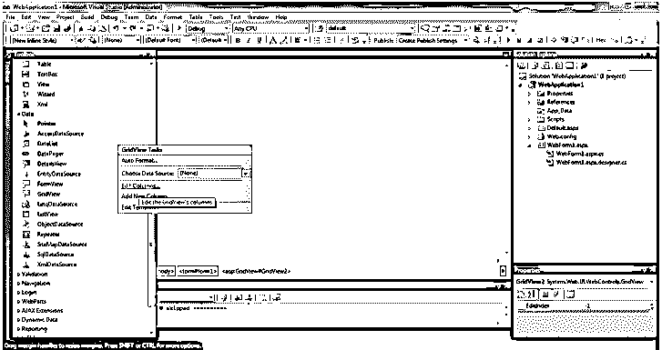

网格视图预览页面，其中 id 和名称已显示，编辑或删除也是为操作而设计的。

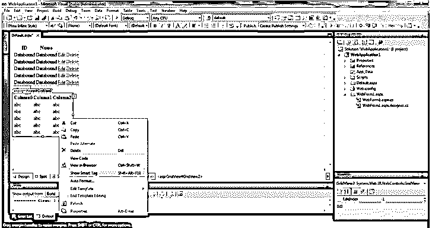

设计仪表板也在预览页面中执行，显示所需的信息。

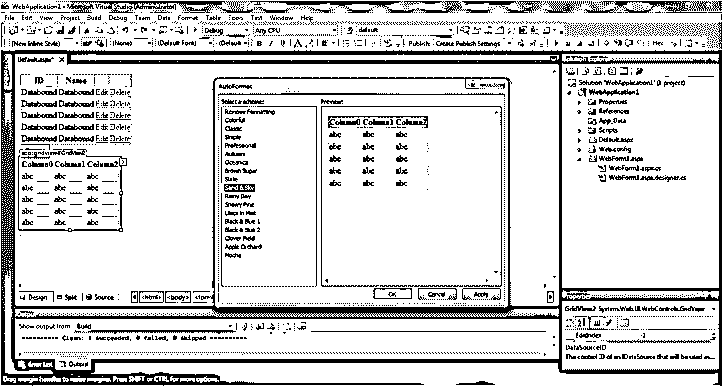

定义按钮点击事件所需的动作。

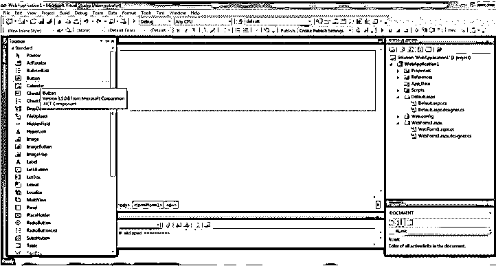

编写准备视图演示的 ASPX 代码。它是根据页面设计自动生成的。

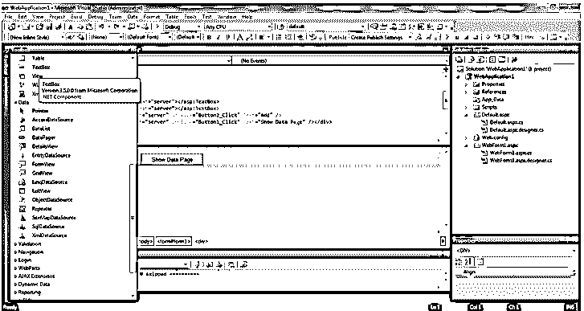

使用文本框来定义字段名称、捕捉值并执行所需的任务。

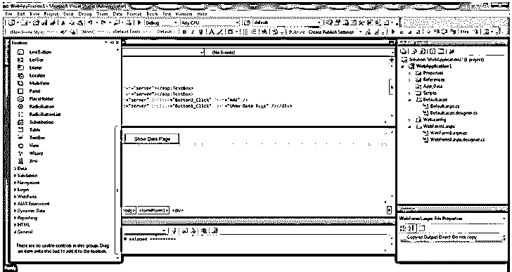

将一个特定的仪表板页面设置为运行应用程序的起始页。

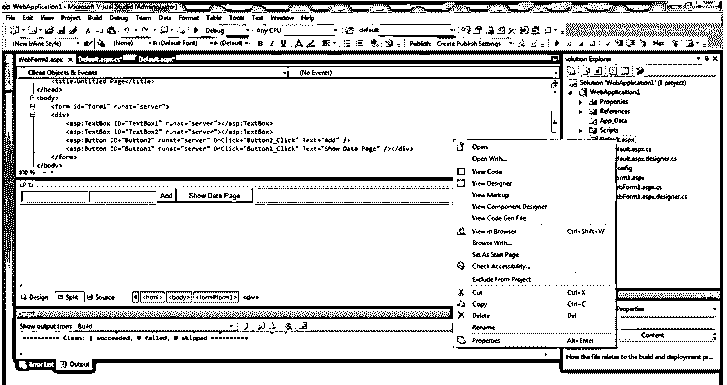

在可用文本框中输入一些值，单击 add 保存这些数据。

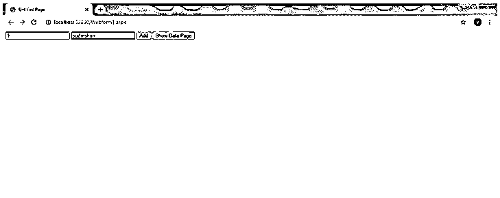

添加多个数据以生成正确的网格视图演示。

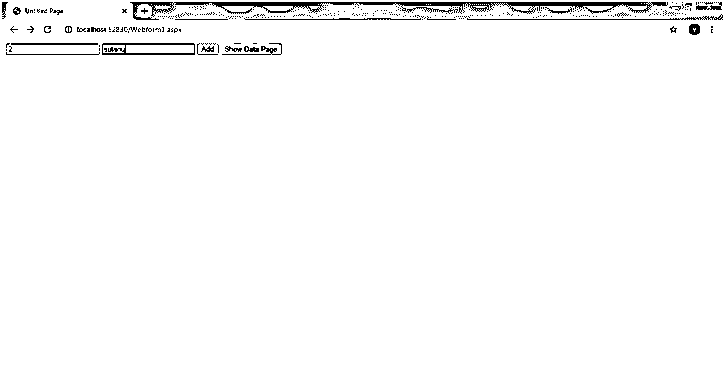

为正确的网格视图仪表板演示添加其他数据。

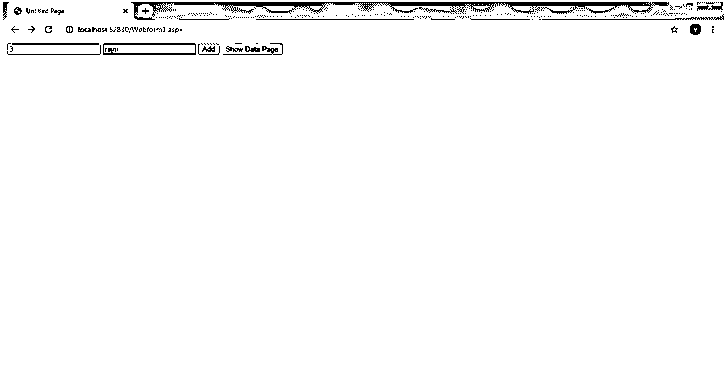

添加一个数据，以便在仪表板中显示更多数据。

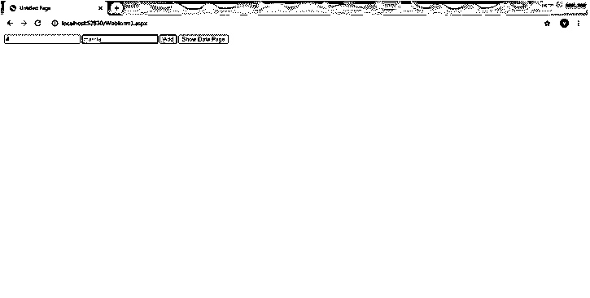

显示网格视图的主仪表板，其中所有添加的数据都正确显示在屏幕上，包括编辑和删除链接。

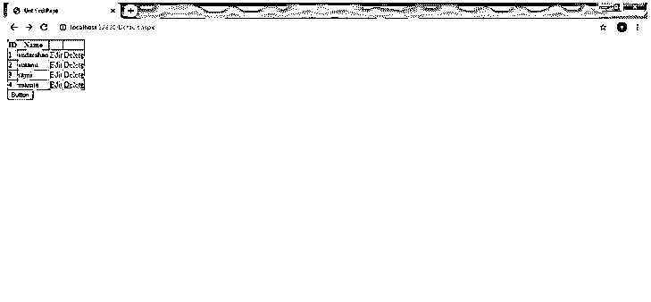

点击编辑，相同的记录进入字段，在那里显示现有的数据。用户可以通过点击更新按钮来更新和保存它。单击“取消”,将再次返回到仪表板页面。

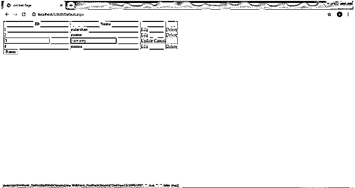

更新后，该页面再次返回到仪表板，并显示正确的网格视图。

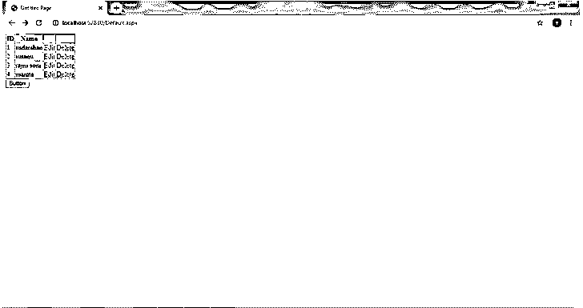

删除按钮用于从网格视图显示中删除一个特定的记录。

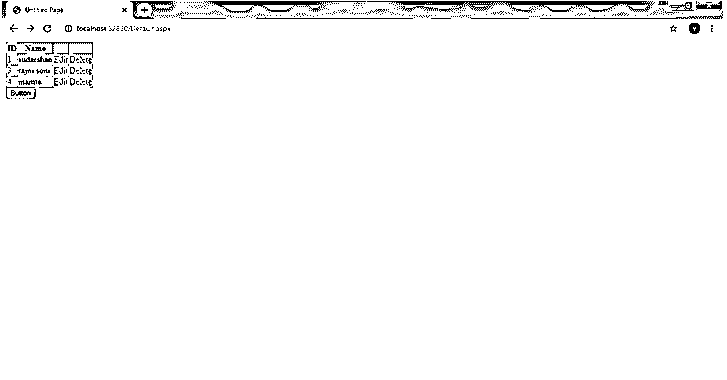

### 结论

ASP.net 网格视图呈现是当前场景中任何客户端的常见和关键需求之一。对于开发人员来说，这种表示或设计页面相对容易，而不是执行普通的设计。该页面有多个要处理和呈现的字段。每个字段实际上都绑定了来自后端代码的相应数据。

### 推荐文章

这是一个指南 ASP.NET GridView。这里我们讨论 ASP.NET 网格视图的介绍以及 html 代码，以便更好地理解网格视图的实现。您也可以看看以下文章，了解更多信息–

1.  [ASP.NET 复选框](https://www.educba.com/asp-dot-net-checkbox/)
2.  [ASP.NET 会话 ID](https://www.educba.com/asp-net-sessionid/)
3.  [ASP.NET 图像](https://www.educba.com/asp-dot-net-image/)
4.  [ASP.NET 数据网格](https://www.educba.com/asp-dot-net-datagrid/)