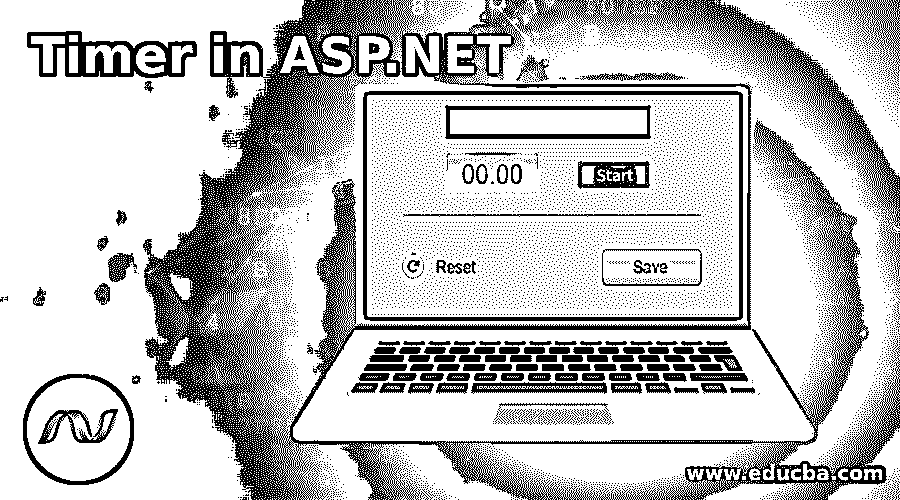
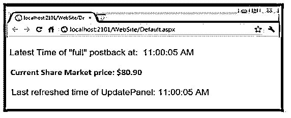
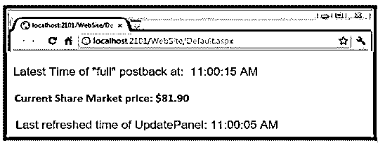

# ASP.NET 的计时器

> 原文：<https://www.educba.com/timer-in-asp-dot-net/>

## ASP.NET 计时器简介

ASP.NET 提供了一个非常重要的功能，叫做定时器。它基本上用于在任何应用中提供特定的时间间隔。ASP.NET 控件中的计时器帮助我们在应用程序中经过一段时间后采取一个动作或执行一个特定的动作。你一定在很多应用程序中看到过，比如你在网站上进行考试，它有一定的时间限制，在此之后，就会发生特定的动作(例如:页面会自动提交)。因此，在这种情况下，开发人员在他的应用程序中使用了计时器控件功能。我们还可以创建一个定时器，这样它就可以恢复或重启。

### 计时器事件

定时器中一些常用且重要的事件。

<small>网页开发、编程语言、软件测试&其他</small>

*   **Tick:** 这是间隔结束时最常用的事件。
*   **Start:** 当开始引发 tick 事件时，将 enabled 设置为 true 来设置值。
*   **Stop:** 将该值设置为 false，将停止引发的 tick 事件。
*   **Close:** 释放定时器使用的资源。
*   **Enabled:** 用于检查定时器是否触发了 tick 事件。
*   **Interval:** 是定时器需要引发事件的时间跨度。
*   **AutoRest:** 它将指示或检查触发滴答事件的时间间隔，即如果我们提供了 10 秒，那么它将检查 10 秒的时间间隔，并查看计时器是否触发了滴答事件。

### ASP.NET 计时器的例子

下面是 ASP 中定时器的例子。网络:

#### 示例#1

定时器控制示例。下面的例子将在每 10 秒后更新一个时间戳。

**代码:**

`<%@ Page Language="C#" AutoEventWireup="true" CodeFile="Default.aspx.cs" Inherits="_Default" %>
<!DOCTYPE html PUBLIC "-//W3C//DTD XHTML 1.1//EN" "http://www.w3.org/TR/xhtml11/DTD/xhtml11.dtd">
<html >
<head runat="server">
<title>Timer Control Example</title>
</head>
<body>
<form id="form1" runat="server">
<asp:ScriptManager ID="ScriptManager1" runat="server" />
<asp:Timerrunat="server" id="UpdateTimer" interval="10000" ontick="UpdateTimer_Tick" />
<asp:UpdatePanelrunat="server" id="TimedPanel" updatemode="Conditional">
<Triggers>
<asp:AsyncPostBackTriggercontrolid="UpdateTimer" eventname="Tick" />
</Triggers>
<ContentTemplate>
<asp:Labelrunat="server" id="DateStampLabel" />
</ContentTemplate>
</asp:UpdatePanel>
</form>
</body>
</html>`

下面是代码隐藏函数，我们需要将它添加到我们的代码隐藏文件中。

**代码:**

`protected void UpdateTimer_Tick(object sender, EventArgs e)
{
DateStampLabel.Text = DateTime.Now.ToString();
}`

**说明**:

这里我们可以看到一个普通的 UpdatePanel，它将携带一个对新的 Timer 控件的触发器引用。这是由于计时器“ticks ”,通过它触发 tick 事件并更新面板。为了设置计时器，使用了“interval”属性，该属性将定义在触发 tick 事件之前出现的毫秒数。我们可以使用另一种方法，在 UpdatePanel 中包含时间。通过这种方法，我们不必定义触发器。但是，对于 UpdatePanel 内部和外部的计时器，它的行为是不同的。

在更新面板完全更新之前，不会重新构造计时器，这发生在计时器位于更新面板内部的情况下。简单地说，如果计时器的时间跨度为 60 秒，更新时间为 5 秒，那么下一个事件将在 65 秒触发，而不是 60 秒。另一方面，如果 timer 在 UpdatePanel 之外，它将在 60 秒时触发，用户在更新之前只能看到 55 秒的内容。

#### 实施例 2

股票市场的例子是在每一秒的市场变化。在下面的例子中，我们在 UpdatePanel 中添加了 2 个与显示相关的 web 控件。

*   一个名为“SharePrice”的标签控件，用于显示股票市场的价格。
*   CurrentPanelTime 是另一个 label 控件，它显示 UpdatePanel 的上次更新时间。

**代码:**

`<asp:ScriptManager ID="MyManager" runat="server">
</asp:ScriptManager>
Latest Time of "full" postback at:
<asp:Label ID="CurrentTime" runat="server"></asp:Label>

<asp:UpdatePanel ID="MyUpdatePanel" runat="server">
<ContentTemplate>
Current Share Market price:
<asp:Label ID="ShrarePrice" runat="server" Font-Bold="True"></asp:Label> 
Last refreshed time of UpdatePanel:
<asp:Label ID="CurrentPanelTime" runat="server"></asp:Label>
 
<asp:Timer ID="MyTimer" runat="server" Interval="10000">
</asp:Timer>
</ContentTemplate>
</asp:UpdatePanel>`

我们向 UpdatePanel 添加了一个 timer 控件，并将其“Interval”属性设置为 10 秒，即 1000 毫秒。这将导致计时器滴答，导致每 10 秒更新一次，并引发其滴答事件。第一次加载页面时以及每当计时器控件引发 tick 事件时，都会调用 UpdateSharePricemethod 在代码隐藏类中，创建一个 Page_Load 事件处理程序，并将两个标签文本设置为当前时间。

现在调用 UpdateSharePrice 方法。Is Postback 为 false，这意味着该页是第一次被访问，而不是在回发时被访问。

**代码:**

`protected void Page_Load(object sender, EventArgs e)
{
CurrentTime.Text = DateTime.Now.ToLongTimeString();
CurrentPanelTime.Text = DateTime.Now.ToLongTimeString();
if (!Page.IsPostBack)
UpdateShrarePrice();
}`

之后，我们需要为“Tick”计时器事件创建一个事件处理程序，并从那里调用 UpdateSharePricemethod。

**代码:**

`protected void MyTimer_Tick(object sender, EventArgs e)
{
// Update the stock price
UpdateShrarePrice();
}`

当我们通过浏览器访问页面时，每隔 10 秒钟计时器就会导致部分页面回发。现在，计算出当前的市场股价，并将在显示屏上更新。

**输出:**

当用户第一次访问时，我们可以看到下面的截图。

用户第一次访问门户时，最晚的“完整”回发时间和刷新时间是相同的。我们可以看到上午 11:00:05 提供的当前股票市场价格。10 秒钟后，页面被更新。我们可以看到“完整”回发的最新时间和刷新时间相差 10 秒。再过 10 秒钟，它将再次更新并获取当前的股票市场价格。

### 结论

ASP.NET 框架中的计时器控制有助于每隔“n”毫秒提供一个回发触发器。通过使用计时器控制功能，我们可以构建更多的应用程序，其中时间约束对应用程序很重要，包括银行应用程序，如出于安全目的的令牌生成。定时器控制使开发者的生活变得容易。

### 推荐文章

这是 ASP.NET 计时器指南。在这里，我们讨论的介绍，事件计时器，并在 ASP.NET 计时器的例子。您也可以看看以下文章，了解更多信息–

1.  [ASP.NET 版本](https://www.educba.com/asp-dot-net-versions/)
2.  [ASP.NET 会话 ID](https://www.educba.com/asp-net-sessionid/)
3.  [JavaScript 中的定时器](https://www.educba.com/timer-in-javascript/)
4.  [Java 中的定时器](https://www.educba.com/timer-in-java/)