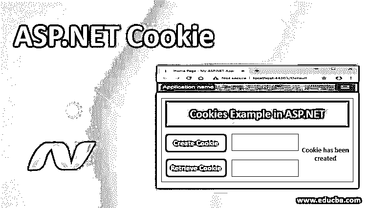
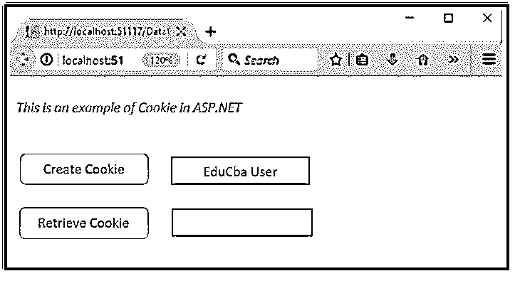
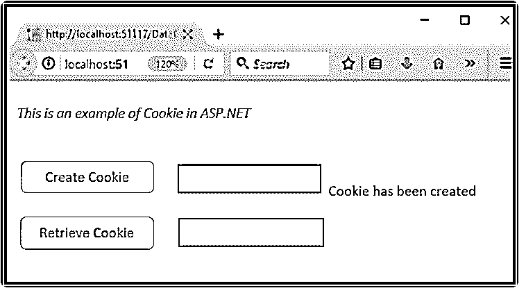
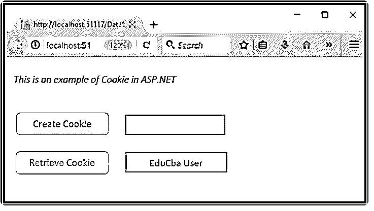
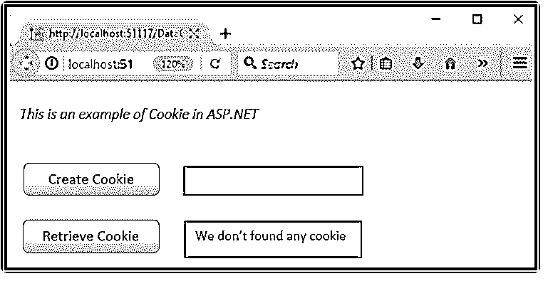

# ASP.NET 饼干

> 原文：<https://www.educba.com/asp-dot-net-cookie/>




## ASP.NET 曲奇简介

下面的文章提供了一个 ASP.NET 曲奇的大纲。ASP.NET cookie 是存储在客户机上的一小段信息。一般来说，它用于在客户机上存储用户名、电话号码、电子邮件 id 等用户信息。cookie 主要分为两种类型，即持久性 cookie 和非持久性 cookie。永久 cookies 包含到期日期。即使在关闭浏览器后，它仍将保留在客户机上。我们可以为 cookie 设置到期日期，这决定了它可以保存多长时间。类似地，非持久性 cookies 也没有截止日期。因此，如果我们不对 cookie 设置任何过期属性，它就被称为非持久 cookie。

**语法:**

<small>网页开发、编程语言、软件测试&其他</small>

回应。cookie 关键字是用户创建的一个 cookie。

```
Response.Cookies(userinfo)= 'value'
```

Userinfo 可能是我们希望保存 cookie 的用户名，value 是我们希望为 userinfo 传递或保存的内容。

### 如何制作 ASP.NET 曲奇？

我们也可以在方便的时候制作饼干。为了制作 ASP.NET 曲奇，我们可以使用“响应”。Cookies”命令。该命令必须出现在标签之前。

*   我们首先需要创建一个 cookie 名称，然后需要将它赋给值。

**代码:**

```
<%
Response.Cookies("UserName")= "EduCba"
%>
```

这里它的 cookies 名是“UserNme ”,赋值是“EduCba”

*   我们可以通过给 cookies 分配属性来设置它的截止日期。

**代码:**

```
<%
Response.Cookies("UserName")= "EduCba"
Response.Cookies("UserName").Expires=#March 24,2020#
%>
```

此 cookie 将于 2020 年 3 月 20 日到期，因为我们在值中提供了到期日期。

*   让我们看看如何检索 cookie 值。为此，我们可以使用“请求”。Cookies”命令来检索它的值。
*   我们需要检索名为“UserName”的 cookie 的值，并将其显示在页面上。

**代码:**

```
<%
Fname=Request.Cookies("UserName")
Response.write("UserName"=  & fname)
%>
```

*   它将输出“用户名=EduCba”。
*   我们还可以创建 cookie 集合，而不是每次都保存和创建一个 cookie。当 cookie 有键时，这很有帮助，这意味着它有多个值。

**代码:**

```
<%
Response.Cookies("UserName")("firstname")="Educba"
Response.Cookies("UserName ")("lastname")="teams"
Response.Cookies("UserName ")("country")="India"
Response.Cookies("UserName ")("email_ID")="educba.teams@gmail.com”
%>
```

因此，通过这些方式，我们可以在 ASP.NET 制作饼干。但是，如果您的浏览器不支持 cookies 该怎么办。如果您的应用程序处理不同的浏览器，cookies 不支持这种浏览器，那么我们将需要使用其他方法。我们需要通过其他方法将信息从一个页面传递到另一个页面。

有两种方法可以做到。

#### 1.向 URL 添加参数

我们可以在下面的 URL 中添加参数。

**代码:**

```
<a href="About-EduCba.asp?fname=EduCba&lname=Teams">Go to About EduCba
Page</a>
```

它将检索文件“About-EduCba.asp”中的值，如下所示。

**代码:**

```
<%
fname=Request.querystring("fname")
lname=Request.querystring("lname")
response.write("<p>Hello " & fname & " " & lname & "!</p>")
response.write("<p>Welcome to EduCba web site!</p>")
%>
```

#### 2.使用表单

我们可以用这种方法来创造。当用户单击提交按钮时，表单将用户输入传递给“About-EduCba”。

**代码:**

```
<form method="post" action="About-EduCba.asp">
First Name: <input type="text" name="fname" value="">
Last Name: <input type="text" name="lname" value="">
<input type="submit" value="Submit">
</form>
```

现在检索“About-EduCba.asp”文件中的值，如下所示。

**代码:**

```
<%
fname=Request.form("fname")
lname=Request.form("lname")
response.write("<p>Hello " & fname & " " & lname & "!</p>")
response.write("<p>Welcome to EduCba web site!</p>")
%>
```

### ASP.NET 饼干的特性

让我们详细讨论一下 ASP.NET 曲奇的一些重要特性。

*   **域:**用于将 cookies 关联到特定的域。
*   安全:cookie 实际上是不安全的东西，因为它将用户的值存储在客户机上。因此，我们可以设置安全标志，使安全 cookie 只能通过此属性设置为 true，即 HTTPs。借助该属性，它将确保 cookie 仅通过受保护的安全通道传递。
*   **Value:** 在 Value 的帮助下，我们可以轻松地操纵每一块 cookie。
*   **Expires:** 假设我们希望某个特定的 cookie 或 cookie 在特定的几天后不再出现，那么我们也可以设置它的到期日期。如果我们设置了过期时间，cookie 的日期将自动过期，存储在 cookie 中的值将不会出现。
*   **Values:** 与 value 属性相同。然而，它只是处理可以用键或值对操作的一堆 cookies。
*   **HasKeys:** 它主要适用于子项，如果它有一个子项，那么它将包含 True。haskey 的默认值为 false。
*   **名称:**表示按键的名称。路径的默认值是服务器根目录，即“/”。
*   **Path:** 用 cookie 提交是虚拟路径。

### ASP.NET 曲奇的例子

让我们举一个例子，了解如何使用它。在本例中，我们将创建一个 cookie，并尝试在过期后检索它。

**代码:**

```
protected void btncreate_Click(object sender, EventArgs e)
{
Response.Cookies["name"].Value = txtcreatecookie.Text;
Response.Cookies["name"].Expires = DateTime.Now.AddMinutes(2);
Label1.Text = "Cookie has been Created";
txtcreatecookie.Text = "";
}
```

在上面的代码中，我们将到期时间设置为 2 分钟。我们已经创建了一个 cookie，并将 textbox 值分配给名称 cookie。

**检索 Cookie 代码:**

```
protected void btnretrieve_Click(object sender, EventArgs e)
{
if (Request.Cookies["name"] == null)
{
txtretrieve.Text = "We don’t found any Cookie";
}
else
{
txtretrieve.Text = Request.Cookies["name"].Value;
}
}
```

当我们试图检索时，cookie 按钮会检查值是否不为空。如果该值不为空，那么它将在结果中显示 cookie 值。由于我们已经将过期时间设置为 2 分钟，2 分钟后 cookie 将过期，其值将为空。因此，2 分钟后，它将显示输出，如“我们没有找到任何 Cookie”。

**输出:**

当我们在文本框中以 EduCba 用户的身份写下它时，它将看起来像下面的代码片段。




现在，我们单击“创建 cookie”按钮来创建一个 Cookie。然后，它会向我们显示如下信息。




现在尝试在两分钟的到期时间内检索它，并单击 retrieve cookie 按钮。




2 分钟后再次尝试检索；它会在框中给我们一个信息，如“我们没有找到任何 Cookie”。




### 结论

我们可以这样总结这篇文章:ASP.NET 饼干在我们日常工作生活中非常重要。它节省了我们重新输入数据的努力，这些数据已经被用户在浏览器中填充了一次。但是，请确保您将通过安全通道发送 cookies，只是为了防止它们通过未加密的请求传递。

### 推荐文章

这是 ASP.NET 曲奇的指南。在这里，我们详细讨论了基本概念以及如何创建 ASP.NET cookie 和属性。您也可以阅读以下文章，了解更多信息——

1.  [ASP.NET 链接按钮](https://www.educba.com/asp-dot-net-linkbutton/)
2.  [ASP.NET 的 ImageButton](https://www.educba.com/imagebutton-in-asp-net/)
3.  [ASP.NET 超链接](https://www.educba.com/asp-dot-net-hyperlink/)
4.  [ASP.NET 的单选按钮](https://www.educba.com/radio-button-in-asp-dot-net/)