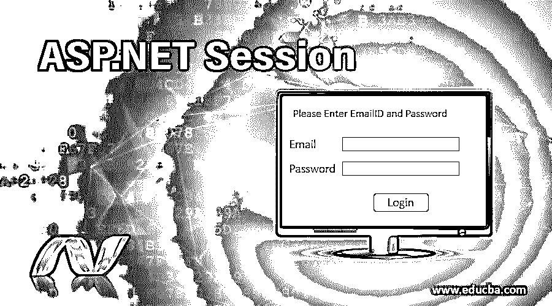
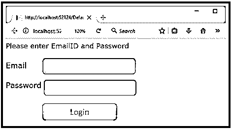
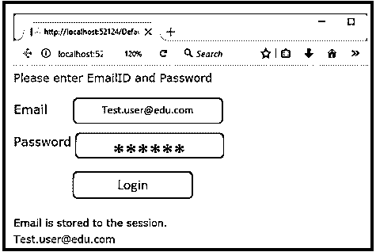

# ASP.NET 会议

> 原文：<https://www.educba.com/asp-dot-net-session/>




## ASP.NET 会议简介

ASP.NET 会话只是一种状态，我们可以从中检索用户的值，并将其存储在网页会话中。在 ASP.NET，确保从一页传递到另一页的信息。每当用户与网站上的任何应用程序进行交互时，首先，它能够启动新的会话，用户可以在网站上进行许多操作，如读写。这些值可以存储在将存储在服务器端的会话对象中。此外，对于该特定用户，它可以在同一网站的任何页面中使用该值。因此，每个值都有一个唯一的 ID。

### ASP.NET 会议什么时候开始？

我们都必须有一个基本的问题，它到底什么时候开始。所以，它会在我们登陆网站时开始。一旦向 web 应用程序发出第一个请求，就会生成 ASP.NET 会话。默认情况下，会话状态为正在进行中。当用户第一次点击任何网站或应用程序时，会话就开始了。如果用户在同一页面上长时间不活动或不做任何事情，服务器会将分配给用户的会话内存放在内存中。现在，如果用户在会话到期后再次点击页面，则会再次创建一个新会话，并为用户请求分配该会话。由于会话变量是服务器端功能，因此网站用户无法访问它。

<small>网页开发、编程语言、软件测试&其他</small>

**让我们看看如何通过以下 4 种方式开始会话:**

**1。**当用户发送或请求在该应用中识别 ASP.NET 文件的 URL 时。Session_OnStart 事件过程包含在该应用程序的 Global.asa 文件中。

**2。**session 对象用于存储用户值。

**3。**每当服务器收到没有任何有效 SessionID cookie 的请求时，就会自动启动一个新的会话。

**4。** <对象>标签被 Global.asa 文件用来初始化一个具有其会话范围的对象。此外，在应用程序中，用户将请求一个. asp 文件。

我们可以说 Session_Start 是在新用户访问或点击应用程序网站时触发的。

### ASP.NET 会议什么时候结束？

我们已经看到了 ASP.NET 会议的确切开始时间，让我们看看它的确切结束时间。

*   我们许多人都经历过这种会议结束的情景。当我们在一个应用程序的网页上停留了很长时间，并且很长时间没有请求或刷新该页面时，会话将自动结束。
*   当 web 服务器崩溃时，用户会话可能会结束。
*   默认情况下，超时值为 20 分钟。
*   如果我们想减少会话超时，我们可以通过设置会话来手动设置它。超时属性。
*   我们可以根据 web 应用程序的需求来设置它的值。更短的会话超时将有助于减少服务器内存资源的压力。
*   例如，如果我们知道用户在应用程序页面上停留的时间不会超过几分钟，那么我们必须减少会话超时。持续时间较长的会话超时会导致打开太多会话，这会影响服务器的内存容量。
*   此外，如果我们想有目的地关闭或结束会话，我们可以使用方法 session。放弃会话对象。
*   假设我们想要退出网页，那么我们可以在应用程序的网页上添加一个退出按钮，将 ACTION 参数设置为. asp 文件的 URL，该文件将包含放弃命令:
*   同样，我们可以通过在。asp 文件。
*   没有任何状态的会话将自动结束。由于无状态会话，它的会话对象不包含任何内容或静态对象。

因此，简而言之，我们可以说，当用户的会话超时、结束或用户从网站离开应用程序的页面时，Session_End 被触发，会话就结束了。

### 实施 ASP.NET 会话的示例

让我们举一个会话的例子，这会让我们有更好的理解。此示例包含创建新会话并存储其邮件 id。

#### 1.Default.aspx

这个 default.aspx 代码将允许用户通过设计用户界面来设计其网站或应用程序。

**代码:**

```
<%@ Page Title="Home Page"Language="C#" AutoEventWireup="true" CodeBehind="Default.aspx.cs"
Inherits="SessionExample._Default"%>
<head>
<style type="text/css">
.auto-style1 {
width: 100%;
}
.auto-style2 {
width: 105px;
}
</style>
</head>
<formid="form1"runat="server">
<p>Please enter EmailID and Password</p>
<tableclass="auto-style1">
<tr>
<tdclass="auto-style2">Email</td>
<td>
<asp:TextBoxID="email" runat="server" TextMode="Email"></asp:TextBox>
</td>
</tr>
<tr>
<tdclass="auto-style2">Password</td>
<td>
<asp:TextBoxID="password" runat="server" TextMode="Password"></asp:TextBox>
</td>
</tr>
<tr>
<tdclass="auto-style2"> </td>
<td>
<asp:ButtonID="login" runat="server" Text="Login" OnClick="login_Click" />
</td>
</tr>
</table>
<br/>
<asp:LabelID="Label3" runat="server"></asp:Label>
<br/>
<asp:LabelID="Label4" runat="server"></asp:Label>
</form>
```

#### 2.Default.aspx.cs

Default.aspx.cs 将允许开发人员编写他们的 C#代码来开发一个应用程序的网站。

**代码:**

```
usingSystem;
usingWeb.UI;
namespaceSessionExample
{
public partial class _Default : Page
{
protected void login_Click(object sender, EventArgs e)
{
if (password.Text=="edu123")
{
// Storing email to Session variable
Session["email"] = email.Text;
}
//check for session variable which should not be empty
if(Session["email"] != null)
{
// I will display the stored email
Text = "Email is stored to the session.";
Text = Session["email"].ToString();
}
}
}
}
```

让我们看看上面示例代码的输出。当用户登录时，它会通过电子邮件将用户的 id 发送到会话。

**输出:**







我们可以在上面的代码片段中看到，电子邮件“Test.user@edu.com”存储在会话中。

### 结论

在这篇文章中，我们了解了 ASP.NET 会话。我希望现在已经很清楚 ASP.NET 会议什么时候开始和结束。借助于一个示例，我们可以更清楚地了解会话到底是什么以及它是如何处理的。任何 web application.ASP.NET web 应用程序在默认情况下都会为用户创建一个用于数据存储的会话。

### 推荐文章

这是 ASP.NET 会议的指南。这里我们讨论会话如何开始和结束？以及 ASP.NET 会话的实现。您也可以浏览我们的其他相关文章，了解更多信息——

1.  [ASP.NET 服务器控件](https://www.educba.com/asp-dot-net-server-controls/)
2.  [ASP.NET 的阿贾克斯](https://www.educba.com/ajax-in-asp-dot-net/)
3.  [ASP.NET 标签](https://www.educba.com/asp-dot-net-label/)
4.  [ASP.NET 复选框](https://www.educba.com/asp-dot-net-checkbox/)