# ASP.NET 视图状态

> 原文：<https://www.educba.com/asp-dot-net-viewstate/>

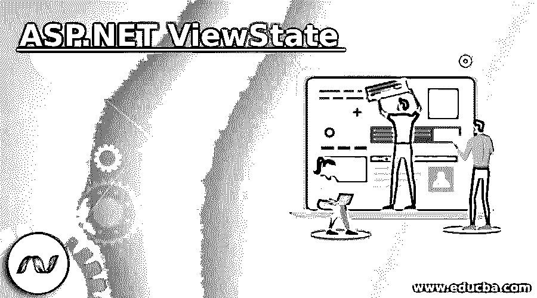

## ASP.NET 视图状态介绍

视图状态通常被定义为在页面中保持适当的控制，假设考虑一个 web 应用程序，请求来自浏览器，然后应用程序处理请求并显示在屏幕上。但是在特定视图或页面控件的屏幕上，所有属性实际上都与适当的控件绑定在一起，这些属性可以很容易地在屏幕的任何地方使用。这是应用程序的状态之一，其中属性数据仅可用于该页面，当我们刷新页面时，它将再次失去控制，就像它仅保存默认视图状态的数据一样。

### ASP.NET 视图状态的语法

ASP.NET 的 ViewState 可以有多个特性，并且其中一个键还是任何 web 应用程序的默认特性。通常任何被认为是无状态的 web 应用程序。这意味着每当任何新的请求到达一个 web 应用程序时，它都会创建一个页面，但是如果我们执行一次往返，整个控件或特定页面会立即丢失，并作为具有新控件的新页面来响应。

<small>网页开发、编程语言、软件测试&其他</small>

ASP.NET web 应用程序的状态控制可以被认为是两种主要状态:

#### 1.客户端的状态管理

*   **视图状态:**控制同一视图或页面内的属性，这是 ASP.NET web 应用的默认状态。
*   **控制状态:**客户端控制器，编写多视图全流程控制器保存数据的逻辑。
*   **隐藏字段状态:**将部分字段保持隐藏，并将属性值转移到下一页。
*   **Cookies 状态:**在 Cookies 中设置特定的值，这些值在浏览器中保存特定的数据，直到不清楚为止。
*   **查询字符串:**将数据从控制器传递到页面通过传递查询字符串，数据在查看页面中很容易得到。

#### 2.服务器端的状态管理

*   **应用程序上下文状态:**数据可以保存在应用程序上下文中，该数据可以在整个应用程序生命周期内可用，或者直到下一次服务器重启。
*   **会话状态:**数据可以存储为会话，该数据将在整个会话生命周期中可用。
*   **配置文件属性:**将一些属性数据存储在一个属性文件中，并在应用程序上下文中传递该值，以便在视图页面中使用。

ViewState 是任何 ASP.NET web 应用程序的默认状态。假设如下，我们已经创建了一个 HTML 页面，并在 ASPX 类中编写了该页面的后端逻辑。现在，当 HTML 页面通过 web 应用程序运行时，服务器创建该类的对象，执行逻辑，返回结果，并完全控制视图或 HTML 页面，然后销毁这些类的对象或引用。现在，HTML 页面可以完全控制显示在屏幕上的响应数据。

**HTML 页面:**

`<html>
<head>
<title>Sample Web Page</title>
</head>
<body>
Name: <asp:textbox id="name" runat="server"></asp:textbox>
 
Password: <asp:textbox id="pass" runat="server"></asp:textbox>
 
<asp:button id="submit_button" runat="server" onclick=" submit_button _Click" text="Submit" />
<asp:button id="Resturn" runat="server" onclick="Return_Click" text="Return" />
</body>
</html>`

**ASPX 代码:**

`public string text1, text2;
protected void submit_button _Click(object sender, EventArgs e)
{
text1 = name.Text;
text2 = pass.Text;
name.Text = pass.Text = string.Empty;
}
protected void Return_Click(object sender, EventArgs e)
{
name.Text = text1;
pass.Text = text2;
}`

### ASP.NET 视图状态的示例

以下是 ASP.NET 视图状态的示例:

在 ASP.NET web 应用程序中，视图状态中存储了各种数据对象。

*   字符串值
*   布尔类型值
*   对象的数组类型
*   对象的数组列表类型
*   哈希表类型的集合
*   可被视为定制类型的任何类型的转换器

在 visual studio 中为 ASP.NET 的视图集项目创建一个新项目。

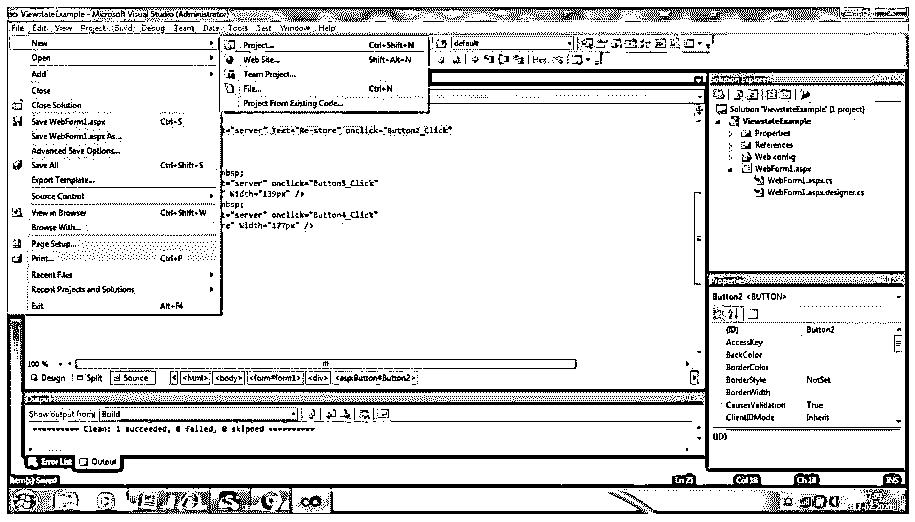

选择 ASP.NET 框架 4 完成应用程序。

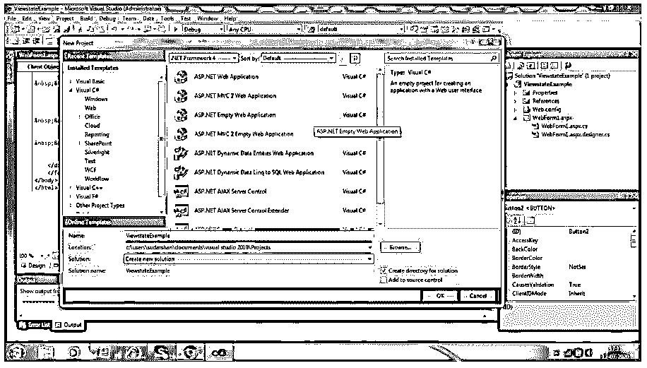

在应用程序中包含 HTML 代码，用于在演示中创建视图。

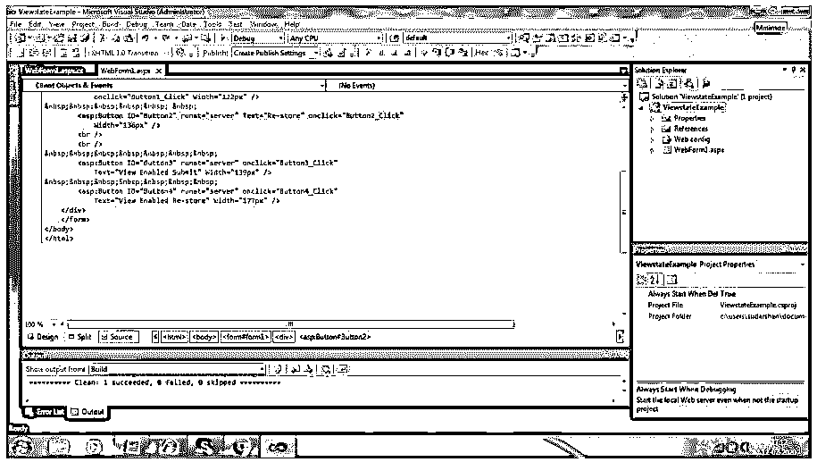

添加特定的项，并在 HTML 页面中用特定的属性映射它。

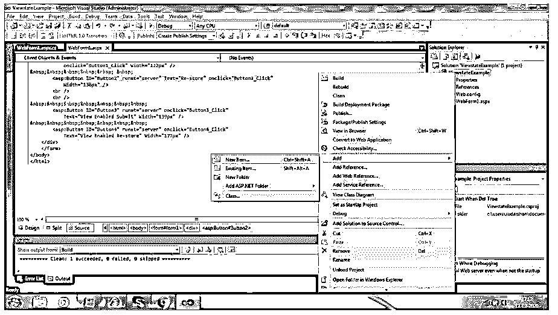

为进一步的设计过程选择一个特定的模板。

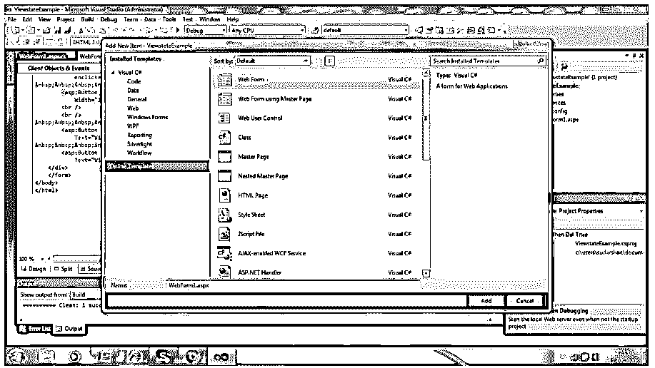

从工具箱中选择 design for WebForm1.aspx。通常两个文本框来在 4 个按钮设计选项来选择。

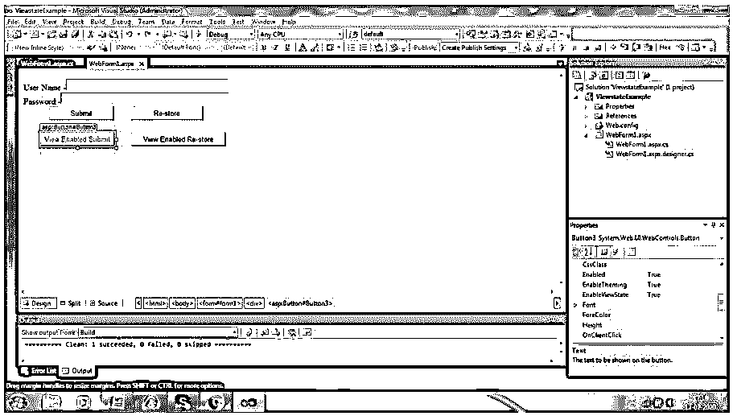

右键单击每个按钮–单击属性–根据给定的设计重命名按钮名称。

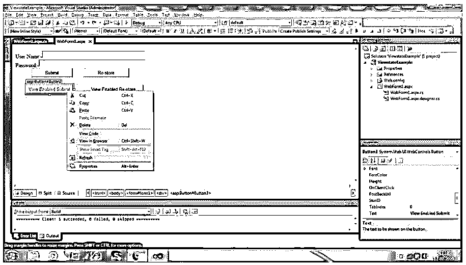

编写 WebForm1。用于处理 web 应用程序中的请求的 ASPX 代码，因此请求可以被推送到 web 应用程序视图，而推数据可以被视为视图状态。

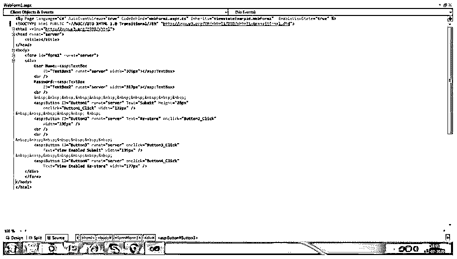

根据可以在视图页面上执行的相同操作，编写处理每个按钮特定事件的相应方法。

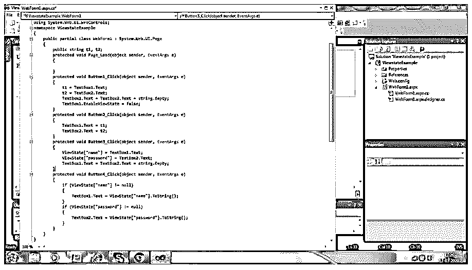

为初始页面的最终呈现设计相应的视图页面。

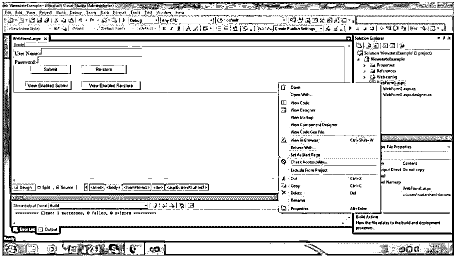

单击“开始调试”按钮，进一步配置事件操作。

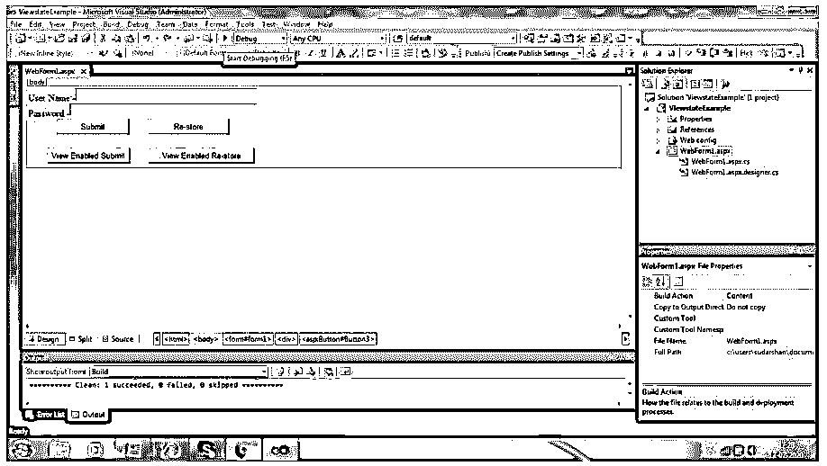

屏幕输出—屏幕带有用户名、密码视图，以及多个按钮，如提交、恢复、查看启用提交和查看启用恢复。

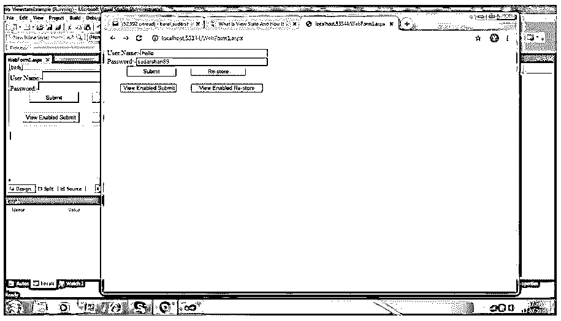

给定一些用户名和密码，然后单击 submit，它会重置整个页面以便进一步输入。

现在，在这种情况下，如果我们单击恢复按钮，它实际上不会给出任何内容，因为视图状态在页面刷新后不会保存任何数据。

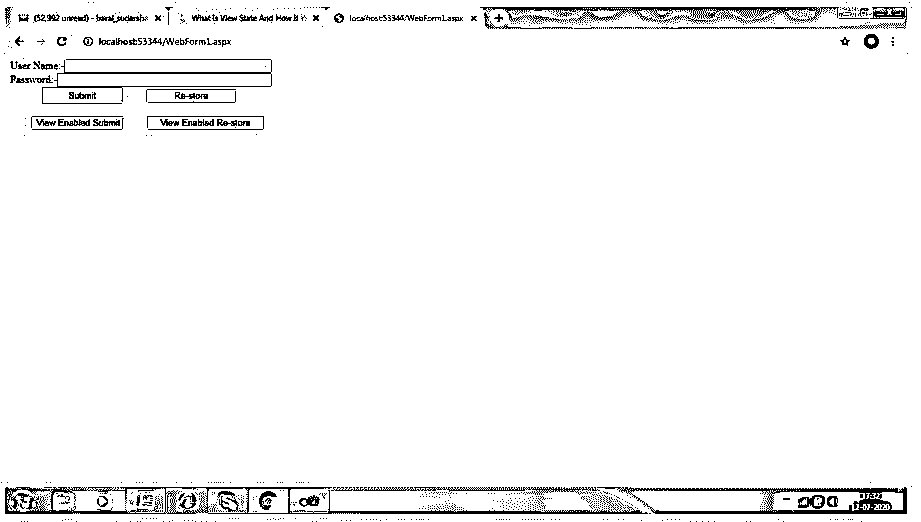

现在，给定用户名和密码后，点击查看启用提交按钮，它会给出所需的结果。

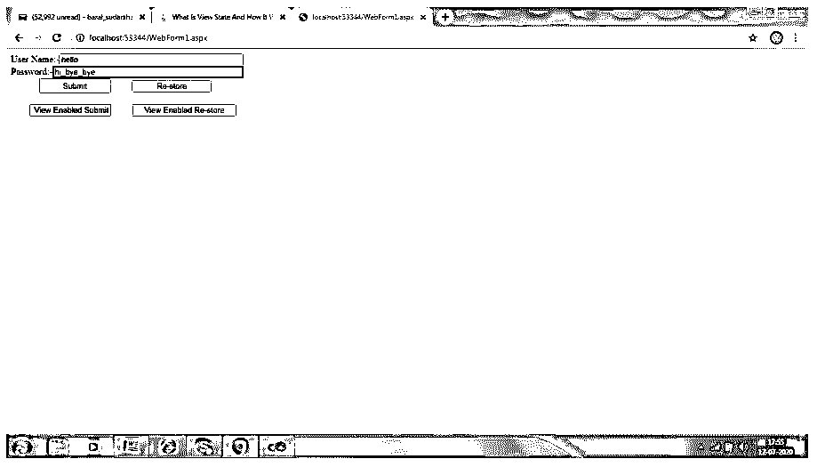

单击查看启用提交按钮文本框被清除。

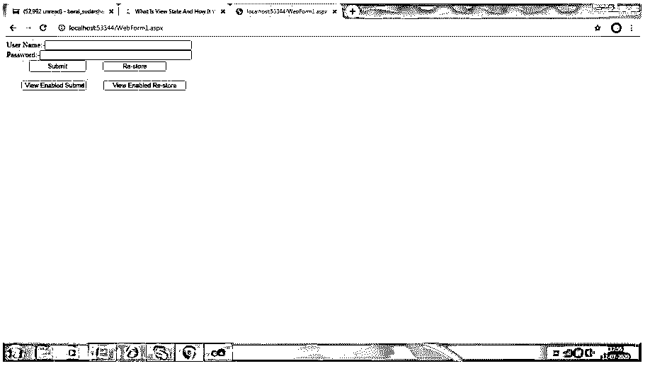

点击视图启用，从视图状态重新存储上次存储的数据，显示如下。基本上，传递用户名和密码已经作为视图状态存储在页面生命中。因此，当单击恢复时，将视图状态中的数据作为用户名和密码传入页面。

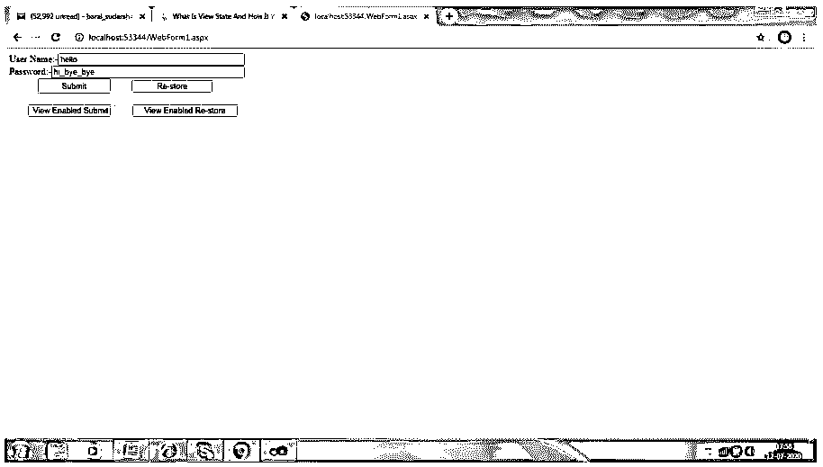

视图状态的一个更重要的功能是可以为网页上的特定文本框启用或禁用它。

有两种方法很容易做到:

1.一个是，它可以禁用一个特定的文本字段由下面的命令。

TextBox11。EnableViewState = false

2.第二种方法是禁用整个页面的视图状态。

**<% Page Language = " c# " enable viewstate = " false "；% >**

### 结论

默认情况下，ASP.NET 视图状态是 web 应用程序附带的一个非常棒的特性。它有优点和缺点，但仍然是 ASP.NET 最受欢迎的功能。在任何 web 应用程序中实现视图状态都非常容易，并且使用视图状态开发不需要特定于服务器的资源。在任何时候，页面加载都确保在相应的页面中加载视图状态结构。然而就 web 安全性而言，应用程序性能视图状态方法有时会被开发人员显式禁用。

### 推荐文章

这是 ASP.NET 视图状态的指南。这里我们分别用例子来讨论 ASP.NET 视图状态的介绍。您也可以看看以下文章，了解更多信息–

1.  [ASP.NET 复选框](https://www.educba.com/asp-dot-net-checkbox/)
2.  [ASP.NET 版本](https://www.educba.com/asp-dot-net-versions/)
3.  [ASP.NET 会话 ID](https://www.educba.com/asp-net-sessionid/)
4.  [ASP.NET 验证摘要](https://www.educba.com/asp-dot-net-validationsummary/)