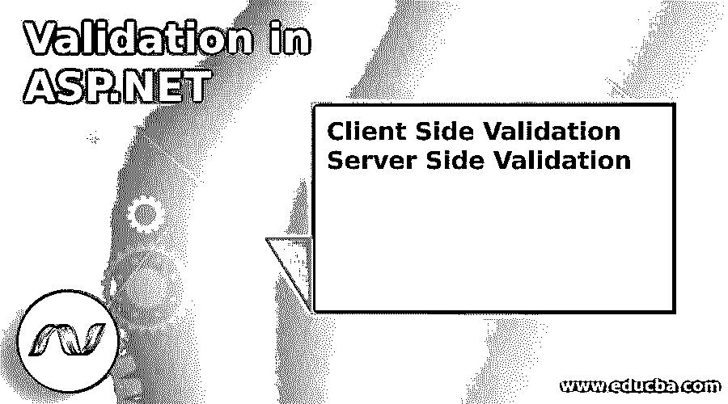

# 在 ASP.NET 验证

> 原文：<https://www.educba.com/validation-in-asp-net/>

## ASP.NET 验证简介

下面的文章提供了一个在 ASP.NET 验证的大纲。验证用于验证用户的数据。每当应用程序接受用户输入时，确保最终用户数据的有效性就变得至关重要。有时用户必须输入某些数据。在某些情况下，用户数据必须采用规范格式。比如电话号码，邮箱，年龄限制等。可能会出现数据必须在某个范围内的情况。对于所有这些情况，如果我们未经验证就接受用户输入，那么就有在数据库中存储错误数据的风险。应用程序也可能以预期的方式结束运行，甚至使系统崩溃。因此，无论何时接受用户的输入，进行验证总是一个值得注意的问题。

### ASP.NET 的验证类型

在 ASP.NET，有两种类型的验证:

<small>网页开发、编程语言、软件测试&其他</small>

*   客户端验证
*   服务器端验证

#### 1.客户端验证

在用户浏览器上执行的验证称为客户端验证。它会在数据发送到服务器之前发生。拥有客户端验证是一个很好的选择，因为用户会立即知道需要修改什么。所以客户机和服务器之间不会有往返。所以从用户的角度来说，给他更快的响应，从开发者的角度来说，节省了服务器宝贵的资源。ASP.NET 提供了一些验证控件来在客户端执行验证。在这个验证控件的帮助下，开发人员无需编写大量代码就可以进行客户端验证。

#### 2.服务器端验证

在服务器计算机上执行的验证称为服务器端验证。服务器端验证的优点是，如果用户以某种方式避免了客户端验证，程序员可以发现服务器的问题。因此，服务器端验证提供了额外的安全性，并保证应用程序不会管理无效数据。服务器端的验证是通过编写用于验证所有用户输入的自定义逻辑来执行的。ASP.NET 提供了一些验证控件，方便了服务端的验证，并为程序员提供了一个框架。Web developer 选择任何类型的验证。但是一般来说，在客户端进行验证和在服务器端进行相同的验证是有好处的。服务器端验证需要一些 web 服务器资源来验证已经验证过的数据，这些数据来自客户端，但它确保了安全性。

### ASP.NET 验证控制

ASP.NET 验证控件验证用户输入的数据。如果数据没有通过验证，它将向用户显示一条错误消息。

*   **CompareValidator:** 这个验证器用一个输入的值验证另一个输入的值。ControlToValidate、ControlToComapre、ValueToCompare 和 ErrorMessage 是 CompareValidator 的属性。
*   **RangeValidator:** 这个验证器确定用户输入的值是否在两个值之间。ControlToValidate、MaximumValue、MinimumValue 和 ErrorMessage 是 RangeValidator 的属性。
*   **RequiredFieldValidator:** 该验证器使输入控件成为必填字段。ControlToValidate 和 ErrorMessage 是 RequiredFieldValidator 的属性。
*   这个验证器允许用户编写一个方法来处理输入值的验证。ControlToValidate、ClientValidationFunction、ErrorMessage 和 ServerValidate 事件是 CustomValidator 的属性。
*   **regular expression validator:**这个验证器确保输入控件的值匹配指定的模式。ControlToValidate、ValidationExpression 和 ErrorMessage 是 RegularExpressionValidator 的属性。
*   这个验证器显示了一个网页上发生的所有验证错误的报告。

### BaseValidator 类

BaseValidator 类为所有验证控件提供核心实现。

该类的属性如下:

*   **BackColor:** 是 CompareValidator 控件的背景色。
*   **EnableClientScript:** 布尔值，表示客户端验证是否启用。
*   **Enabled:** 布尔值，表示是否启用验证。
*   **ControlToValidate:** 它指定要验证的控件的 id。
*   **ForeColor:** 指定控件的前景色。
*   **IsValid:** 表示 ControlToValidate 指定的控件是否确定有效的布尔值。
*   **ErrorMessage:** 验证失败时，在 ValidationSummary 控件中显示的文本。
*   **显示:**显示验证控件的行为。它可以是无、静态或动态。None 用于仅在 ValidationSummary 控件中显示错误信息；如果验证失败，静态显示一条错误消息。即使输入通过验证，页面上也会为消息保留空间。如果验证失败，动态显示错误消息。如果输入通过验证，页面上不会为消息保留空间。

### 结论

在 ASP.NET 的这些验证文章中，我们看到了验证及其两种类型的客户端验证和服务器端验证。我们还看到了在 ASP.NET 中使用的验证控件及其属性。

### 推荐文章

这是一个在 ASP.NET 验证的指南。这里我们讨论一下简介、类型、ASP.NET 验证控件和 BaseValidator 类。您也可以看看以下文章，了解更多信息–

1.  [ASP.NET 单选按钮列表](https://www.educba.com/asp-dot-net-radiobuttonlist/)
2.  [ASP.NET 网格视图](https://www.educba.com/asp-dot-net-gridview/)
3.  [ASP.NET 认证](https://www.educba.com/authentication-in-asp-dot-net/)
4.  [ASP.NET 更新面板](https://www.educba.com/asp-dot-net-updatepanel/)