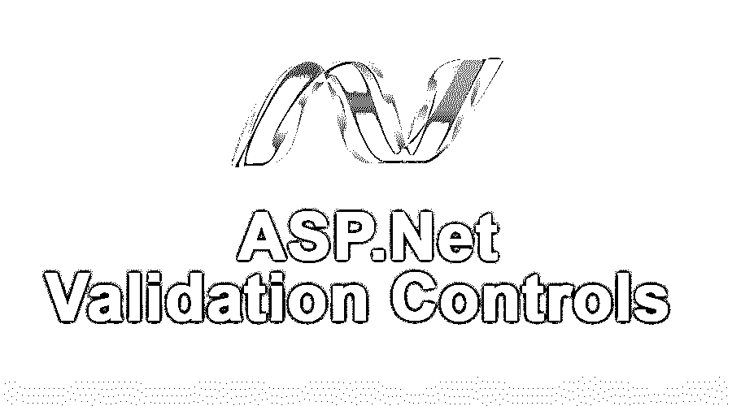

# ASP.Net 验证控制

> 原文：<https://www.educba.com/asp-dot-net-validation-controls/>




## ASP.Net 验证控制概览

ASP.Net 提供了各种验证用户数据的验证控件，以确保用户输入的数据符合条件。[ASP.Net 提供了 RequiredFieldValidator](https://www.educba.com/asp-dot-net-requiredfieldvalidator/) ，RangeValidator，CompareValidator，RegularExpressionValidator，CustomValidator 和 ValidationSummary。当需要特定字段时使用 RequirefFieldValidator，当特定值需要在指定范围内时使用 RangeValidator，[使用 compare validator](https://www.educba.com/asp-net-comparevalidator/)将一个控件的值与另一个控件的固定值进行比较，RegularExpressionValidator 使用正则表达式的模式验证输入值，CustomValidator 允许用户创建自己的验证，ValidationSummary 给出摘要。

### 它们是如何工作的？

为了理解 ASP.Net 验证控件的工作原理，让我们看一下所有控件继承的类。如果您不熟悉继承的[概念，我们建议您在继续之前理解它。](https://www.educba.com/inheritance-in-vb-dot-net/)

<small>网页开发、编程语言、软件测试&其他</small>

#### BaseValidator 类

ASP.Net 中的所有验证控件都继承 BaseValidator 类的属性和方法。它有助于制作一套通用的验证控件。BaseValidator 类的重要属性和方法有:

*   **ControlToValidate—**表示要验证的输入控件。它必须是整个表单中的唯一值。此属性是强制的，因为它用于将输入控件与验证控件相关联。
*   **Enabled—**启用或禁用验证器。
*   **Text–**它保存验证失败时要显示的消息。
*   **error message–**当使用 ValidationSummary 控件或缺少 Text 属性时，将显示该属性中的值。
*   **is valid–**一个布尔属性，表示控件是否有效。
*   **Validate()–**该方法重新验证控件并更新 IsValid

### ASP.Net 验证控制的类型

以下是 ASP.NET 验证控件的类型:

#### 1.RequiredFieldValidator

这是一个基本的验证控件。几乎所有的表单都有一些字段是用户在继续之前必须填写的。必需的字段验证器确保这些字段不为空。

**语法**

```
<asp:RequiredFieldValidator ID="someUniqueId"
runat="server" ControlToValidate ="someUniqueControlId"
ErrorMessage="ErrorToDisplayOnValidationFailure"
InitialValue="aPlaceholderValue">
</asp:RequiredFieldValidator>
```

注意上面语法中的初始值属性。尽管这是一个占位符，但是如果字段的值在失去焦点时没有改变，验证就会失败。

***Note:** Don’t worry much about the runat=” server” attribute. It is used to [indicate to ASP.Net](https://www.educba.com/what-is-asp-dot-net/) that the control is available at the server side as well. Making the control available at the server side helps in accessing the control in the code-behind logic.*

#### 2.RangeValidator

RangeValidator 控件只是指定输入值应该落入的允许范围。这对于数字输入值(如年龄)或日期输入值非常有用。

**语法**

```
<asp:RangeValidator ID="some unique id"
runat="server" ControlToValidate ="someUniqueControlId"
ErrorMessage="ErrorToDisplayOnValidationFailure"
Type="Integer" MinimumValue=”0” MaximumValue=”100”>
</asp:RangeValidator>
```

**该控件有三个附加属性**

*   **Type**–指定输入字段中的数据类型。该值在验证之前被转换为此类型。如果该值无法转换为指定的类型，则会引发异常。可以在 RangeValidator 中比较以下数据类型:
    *   线
    *   整数
    *   两倍
    *   日期
    *   货币
*   **minimum value**–指定该字段可以容纳的最小值。
*   **maximum value**–指定字段可以容纳的最大值。最小值和最大值都是无效的。

#### 3.正则表达式验证器

*   正则表达式，简称 Regex，是定义文本格式的模式。如果文本是相同的格式，Regex 返回 true，否则返回 false。如果不熟悉，建议阅读关于 Regex 的内容。这也将让您了解正则表达式模式是如何形成的，以及如何破译正则表达式模式。
*   因此，RegularExpressionValidator 是一个非常通用的验证控件。它将输入文本与 ValidationExpression 属性中指定的模式进行匹配。

**语法**

```
<asp:RegularExpressionValidator ID="someUniqueId"
runat="server" ControlToValidate ="someUniqueControlId"
ErrorMessage="ErrorToDisplayOnValidationFailure"
ValidationExpression=”aRegexPattern”>
</asp:RegularExpressionValidator>
```

正则表达式模式的一个例子是^[a-z][0-9].这表示文本必须以字母开头，后跟数字。

#### 4.比较验证器

*   CompareValidator 控件将一个控件的值与固定值或另一个控件中的值进行比较。

**语法**

```
<asp:CompareValidator ID="someUniqueId"
runat="server" ControlToValidate ="someUniqueControlId"
ErrorMessage="ErrorToDisplayOnValidationFailure"
Type="string" ControlToCompare=”ControlToValidateIdOfAnotherControl”
ValueToCompare=”aFixedValue” Operator=”Equal”>
</asp:CompareValidator>
```

这个验证器中有三个新属性:

*   **controlto compare**–它保存另一种形式的控件的 ControlToValidate Id。然后比较两个表单字段的值。
*   **valueto compare**–必须与之进行比较的固定值。
*   **运算符**–比较的类型。该属性中允许的值有:
    *   平等的
    *   NotEqual
    *   大于
    *   更大的同等
    *   不到
    *   小于等于
    *   数据类型检查

#### 5.CustomValidator

*   ASP.Net 还允许自由编写自己的验证程序。这减轻了开发人员在客户端验证表单的任务。它还允许进行更复杂的验证。特定于业务或应用程序的验证可以使用自定义验证器来编写。
*   自定义验证代码编写在代码隐藏页的函数中，函数名作为属性传递给 CustomValidator 类。自定义验证可以在客户端或服务器端完成。
*   ClientValidationFunction 属性指定验证将在客户端执行。这种验证代码必须用 JavaScript、VBScript 等脚本语言编写。
*   当必须在服务器端进行验证时，使用 ServerValidate 事件处理程序。服务器端验证例程是用 C#、VB 编写的。Net 或任何其他。网语。

**语法**

```
<asp:CustomValidator ID="someUniqueId"
runat="server" ControlToValidate ="someUniqueControlId"
ErrorMessage="ErrorToDisplayOnValidationFailure"
ClientValidationFunction=”functionName”>
</asp:CustomValidator>
```

#### 6.验证摘要

[ValidationSummary 控件不执行](https://www.educba.com/asp-dot-net-validationsummary/)任何验证。它的目的是在页面上显示所有错误的摘要。

**语法**

```
<asp:ValidationSummary ID="ValidationSummaryControl"
runat="server" DisplayMode=”BulletList” ShowSummary=”true”
HeaderText=”List of Errors” />
```

### 结论

本文涵盖了 ASP .Net 中验证控件的基础知识。一旦您开始构建 web 表单，还会发现更多内容。对于高级编码人员，我们推荐 MSDN 文档来彻底理解这个主题。

### 推荐文章

这是 ASP.Net 验证控制的指南。这里我们分别讨论了 ASP.Net 验证控件的基本概念、类型和语法。您也可以浏览我们推荐的其他文章，了解更多信息——

1.  [ASP.NET 页面生命周期](https://www.educba.com/asp-dot-net-page-life-cycle/)
2.  什么是 ASP.NET？
3.  [ASP.NET 链接按钮](https://www.educba.com/asp-dot-net-linkbutton/)
4.  [ASP.NET MVC 观看包](https://www.educba.com/asp-net-mvc-viewbag/)


