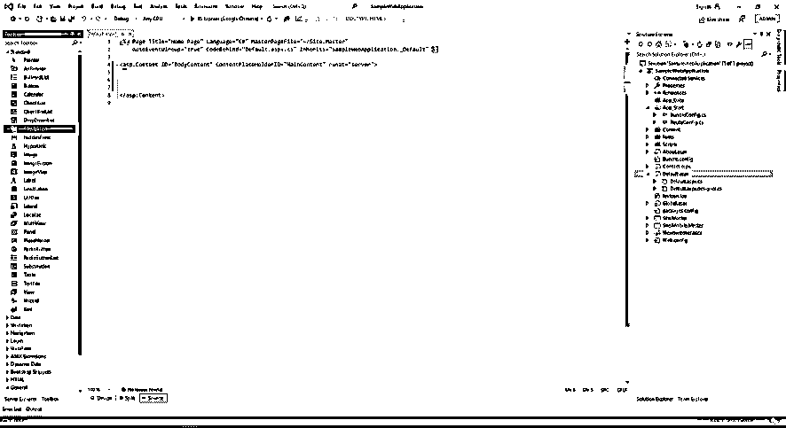
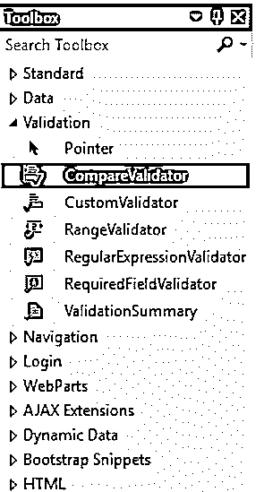
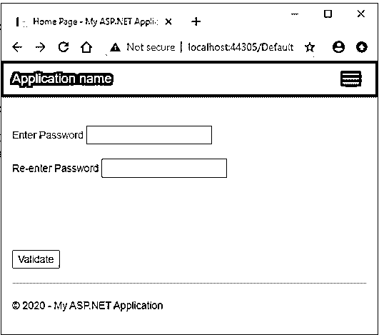
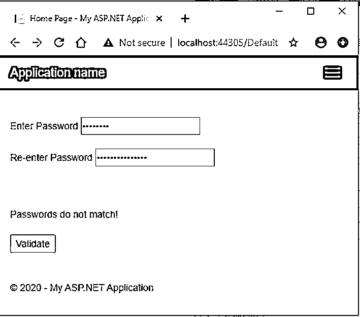
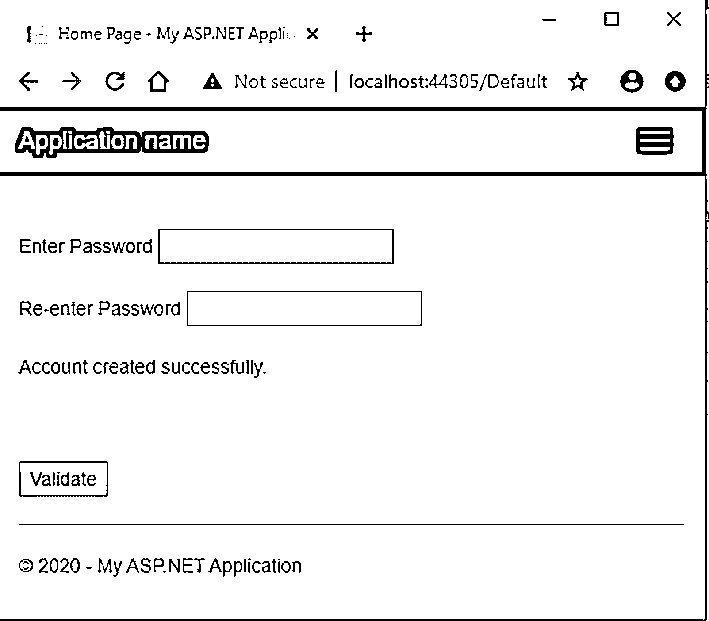

# ASP.Net 比较仪

> 原文：<https://www.educba.com/asp-net-comparevalidator/>


## ASP.Net 比较仪简介

CompareValidator 服务器控件是用于将网页上的用户输入与常数值或另一个用户输入进行比较的控件。它允许应用程序开发人员在网页上实施验证策略，并防止将表单数据发送到服务器，除非验证检查已经通过。为什么我要使用服务器控件这个术语？因为像所有其他服务器控件一样，[ASP.NET 为在服务器上运行的 CompareValidator 控件提供了自己的标签](https://www.educba.com/asp-dot-net-label/)，生成的 HTML 代码作为响应返回给浏览器。因此，从 HTML 的角度考虑，CompareValidator 控件生成 HTML span 标记，该标记默认情况下是隐藏的，并在验证失败时显示一条错误消息。

**语法:**

<small>网页开发、编程语言、软件测试&其他</small>

CompareValidator 控件可以使用 ASP.NET 提供的标记进行编码，也可以使用 Visual Studio IDE 进行拖放。拖放功能最终会生成相同的代码。

ASP.NET 比较验证器的语法最简单的形式是:

```
<asp:CompareValidator
ID="CompareValidatorId" runat="server"
ControlToCompare="ComparerControlId"
ControlToValidate="TargetControlId"
ErrorMessage="ErrorMessage">
</asp:CompareValidator>
```

上面提到的是 CompareValidator 控件所需的基本属性。让我们了解一下每个属性的含义:

*   **ID:**compare validator 控件的唯一 ID。
*   **ControlToCompare:** 其值将用作比较器的控件的 id。如果比较器是一个常数值而不是用户输入，这是一个可选属性。
*   **ControlToValidate:** 要比较其值的控件的 id。强制性财产。
*   **ErrorMessage:** 验证失败时显示的消息。

### 在幕后

那么，CompareValidator 机制是如何工作的呢？当 ASP.NET 引擎遇到控件时，它会在将表单发送到服务器之前在清单中添加一个任务。每当焦点从要验证的控件或要比较的控件上移开时，就会触发验证。如果验证失败，将显示一条错误消息。为了将表单数据发送到服务器，必须通过验证检查。

### ASP.Net 比较器的特性

ASP.NET 比较验证器控件具有某些预定义的属性。这些属性被转换为本机 HTML 代码中的属性。它们有助于定义 CompareValidator 控件的其他行为。下面详细讨论一下常用的几种:

#### 1.背景色，前景色

此属性获取或设置控件的背景色和前景色。

```
<asp:CompareValidator ID="myCompareValidator" ControlToCompare="TextBox_1" ControlToValidate="TextBox_2" ErrorMessage="Error" BackColor="DarkBlue" ForeColor="White" runat="server"> </asp:CompareValidator>
```

#### 2\. BorderColor, BorderStyle and BorderWidth

这些属性获取或设置控件的边框样式。

```
<asp:CompareValidator ID="myCompareValidator" ControlToCompare="TextBox_1" ControlToValidate="TextBox_2" ErrorMessage="Error" BorderWidth="5" BorderColor="Blue" BorderStyle="dashed" runat="server"> </asp:CompareValidator>
```

#### 3.CssClass

此属性获取或设置要应用于控件的 CSS 类。

```
<asp:CompareValidator ID="myCompareValidator" ControlToCompare="TextBox_1" ControlToValidate="TextBox_2" ErrorMessage="Error" CssClass="txtBxClass" runat="server"> </asp:CompareValidator>
```

#### 4.使能够

此属性获取或设置指示控件是启用还是禁用的值。默认值为 true。

```
<asp:CompareValidator ID="myCompareValidator" ControlToCompare="TextBox_1" ControlToValidate="TextBox_2" ErrorMessage="Error" Enabled="false" runat="server"> </asp:CompareValidator>
```

#### 5.字体

此属性获取或设置要在控件中显示的文本的字体。有许多样式和选项，如粗体、斜体、下划线、删除线等。

#### 6.高度、宽度

这些属性获取或设置控件的高度和宽度，以像素为单位。

```
<asp:CompareValidator ID="myCompareValidator" ControlToCompare="TextBox_1" ControlToValidate="TextBox_2" ErrorMessage="Error" Height="100" Width="500" runat="server"> </asp:CompareValidator>
```

#### 7.身份证明

此属性获取或设置控件的唯一标识符属性。

```
<asp:CompareValidator ID="myCompareValidator" ControlToCompare="TextBox_1" ControlToValidate="TextBox_2" ErrorMessage="Error" runat="server"> </asp:CompareValidator>
```

#### 8.类型

此属性获取或设置数据类型，值在比较前以该数据类型进行转换。

```
<asp:CompareValidator ID="myCompareValidator" ControlToCompare="TextBox_1" ControlToValidate="TextBox_2" ErrorMessage="Error" Type="string" runat="server"> </asp:CompareValidator>
```

#### 9.看得见的

此属性确定控件是显示在用户界面上还是隐藏。默认值为 true。

```
<asp:CompareValidator ID="myCompareValidator" ControlToCompare="TextBox_1" ControlToValidate="TextBox_2" ErrorMessage="Error" Visible="false" runat="server"> </asp:CompareValidator>
```

### ASP.Net 比较验证器示例

让我们逐步创建一个 CompareValidator 示例应用程序。

步骤 1: 创建一个新的 ASP.NET web 应用程序项目。这将使用带有 Default.aspx 和 Default.aspx.cs 页面的工作应用程序创建一个 shell 模板。的。控件的代码隐藏页。aspx 页面。

**步骤 2:** 转到 Default.aspx 文件，删除 shell 模板的内容，如下图所示。




**步骤 3:** 在 Visual Studio IDE 的工具箱窗格中，您会注意到一组准备拖放到项目中的验证控件。找到 CompareValidator 控件并将其拖动到 Default.aspx 页中。




**步骤 4:** 一旦放下 CompareValidator 控件，您会注意到 Default.aspx 文件中自动生成的 ASP.NET compare validator 标记。修改代码，如下所示。


或者，您可以跳过拖放部分，自己编写上面的代码。

```
<asp:CompareValidator ID="pass_repass_compare" runat="server"
ControlToCompare="pass_txt"
ControlToValidate="repass_txt"
Type="String"
ForeColor="DarkRed"
ErrorMessage="Passwords do not match!">
</asp:CompareValidator>
```

**步骤 5:** 将下面的代码复制到 Default.aspx 文件中。

```
<%@ Page Title="Home Page" Language="C#" MasterPageFile="~/Site.Master"
AutoEventWireup="true" CodeBehind="Default.aspx.cs" Inherits="SampleWebApplication._Default" %>
<asp:Content ID="BodyContent" ContentPlaceHolderID="MainContent" runat="server">
<br /><br />
<asp:Label ID="pass_lbl" runat="server" Text="Label">Enter Password</asp:Label>
<asp:TextBox ID="pass_txt" TextMode="Password" runat="server"></asp:TextBox>
<br /><br />
<asp:Label ID="repass_lbl" runat="server" Text="Label">Re-enter Password</asp:Label>
<asp:TextBox ID="repass_txt" TextMode="Password" runat="server"></asp:TextBox>
<br /><br />
<asp:Label ID="msg" runat="server" Text=""></asp:Label>
<br /><br />
<asp:CompareValidator ID="pass_repass_compare" runat="server"
ControlToCompare="pass_txt"
ControlToValidate="repass_txt"
Type="String"
ForeColor="DarkRed"
ErrorMessage="Passwords do not match!">
</asp:CompareValidator>
<br /><br />
<asp:Button ID="Validate_btn" runat="server" OnClick="Validate_btn_Click" Text="Validate" />
</asp:Content>
```

**步骤 6:** 将下面的代码复制到 Default.aspx.cs 文件中。

```
using System;
using System.Web.UI;
namespace SampleWebApplication
{
public partial class _Default : Page
{
protected void Validate_btn_Click(object sender, EventArgs e)
{
if (Page.IsValid) {
msg.Text = "Account created successfully.";
}
}
}
}
```

**第七步:**运行应用程序。下面是代码的输出。它有两个文本框和一个验证控件，用于检查两个文本框的值是否匹配。

该文件的代码背后有一个按钮单击函数来验证按钮。仅当 CompareValidator 导致通过时，才调用此方法。




以上是你申请的登陆页面。输入密码，然后重新键入密码。如果两个密码不匹配，将显示一个错误，并且不会调用函数背后的代码。这仅仅意味着除非密码匹配，否则数据不会发送到服务器。




当密码匹配时，将执行函数背后的代码，并显示一条消息。




### 推荐文章

这是 ASP.Net 比较文学指南。在这里，我们讨论了 ASP.Net 比较验证器的介绍和属性，以及示例和语法。您也可以阅读以下文章，了解更多信息——

1.  [ASP.NET 的单选按钮](https://www.educba.com/radio-button-in-asp-dot-net/)
2.  [ASP.NET 的阿贾克斯](https://www.educba.com/ajax-in-asp-dot-net/)
3.  [缓存在。NET 框架](https://www.educba.com/caching-in-asp-dot-net/)
4.  [ASP.NET 按钮](https://www.educba.com/button-in-asp-net/)