# ASP.NET 正则表达式验证器

> 原文：<https://www.educba.com/asp-dot-net-regularexpressionvalidator/>

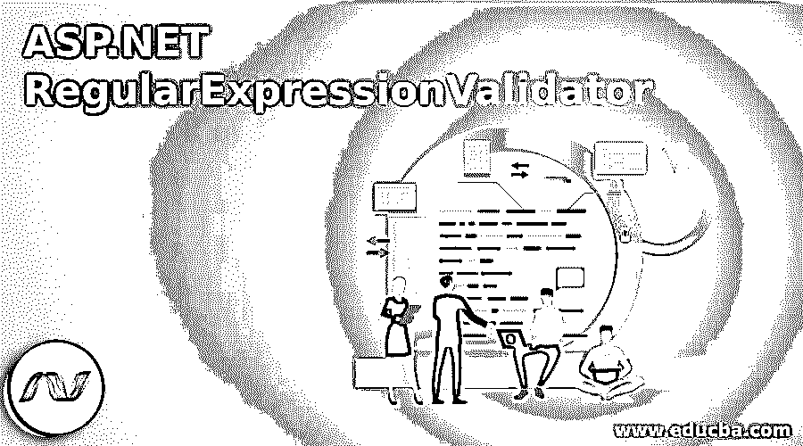

## ASP.NET 正则表达式验证器简介

ASP.NET 正则表达式验证器是最终用户验证来自任何基于 web 或基于桌面的应用程序的输入值的关键功能之一，所有编程语言都有自己对这些功能的使用，类似地，ASP.NET 也有类似的功能来识别同一种正则表达式输入值，它基本上持有一些基于关键应用程序功能的意外或预期模式，并确保在与开发人员根据应用程序业务需求提供的定义模式匹配后返回正确的值。

### 句法

ASP.NET 正则表达式验证器有几种可用的语法。以下是 ASP.NET 中正则表达式的一些流行或常用语法。

<small>网页开发、编程语言、软件测试&其他</small>

*   \b:通常考虑退格。
*   \t:通常为 tab 考虑。
*   \r:正常返回回车。
*   \v:通常表示垂直制表符。
*   \f:通常认为是换页。
*   \n:通常考虑新行。
*   \:视为转义字符。

#### ASP.NET 正则表达式验证器的元字符

不仅是单个字符，ASP.NET 正则表达式验证器的正则表达式也可以考虑字符类。这类字符有一个所谓的名字“元字符”。

*   :空白表示所有字符，不包括\n 表示换行。
*   [abcd]:这一个表示与期望的输入参数匹配的一组字符。
*   [1-8a-nA-N]:这是 ASP.NET 应用程序中非常有趣的正则表达式功能之一。这个总是以指定范围内的特定字符为目标。在这种情况下，1 到 8 之间的任何数字或 A 到 m 之间的任何字母数字字符。在匹配逻辑中，大写字母和小写字母都被考虑。
*   \w:这也用于识别任何类型的必需字母数字字符。它还将下划线视为匹配字符。
*   \W:它表示基本上不是单词的字符。因此，如果任何不是单词的东西作为输入值传递，这种正则表达式可能对 ASP.NET 应用程序有所帮助。
*   \s:这表示任何类型的字符都被认为是空白。如果有人愿意识别空格或新行或制表符，这个字符对开发人员来说可能是有用的。对于标识，新行在 ASP.NET 集成中有一个特定的正则表达式，但是如果开发人员需要逻辑来识别作为输入值传递的所有空格，那么它可以很容易地成为任何 ASP.NET 开发中可用的正则表达式。
*   \S:与早期的正则表达式有一点不同，早期的是小写字母，而这一个是大写字母。在这种情况下，我们能够识别那些非空白的单词类型。
*   \d:这用于识别任何类型的十进制字符。对于任何 ASP dot net 应用程序来说，识别任何类型的十进制字符(如 1.2、1.4 等)都是很常见的。
*   \D:这也正好和上面一个相反。它主要用于识别非十进制字符。它是 ASP dot net 应用程序使用的常见和流行的正则表达式之一。
*   量词:这也是 ASP.NET 应用程序正则表达式功能的关键特性之一。Verities 量词已经被用于识别特定单词在输入值中被提及的次数。量词的例子有:

*:表示匹配零个或更多。

+:表示匹配零或零以上。

?:表示匹配零或最大值。

{N}:表示匹配了 N 个字符。

{N，}:表示匹配了多个字符或 N 个以上的字符。

{N，M}:表示匹配数可以在 N 和 M 之间。

在 ASP.NET 应用程序中使用相同的主要语法是:

`<asp:RegularExpressionValidator ID=”string” runat=”server” ErrorMessage=”string” ValidationExpression=”string” ValidationGroup=”string”>
<asp:RegularExpressionValidator>`

ASP.NET 应用程序的正则表达式有多种属性，可用于不同目的的应用程序需求。

属性包括:

*   访问键:它主要用于控制键盘。简而言之，它可以考虑一个键盘控制的快捷方式。
*   BackColor:主要用于设置背景的颜色。
*   BorderColor:主要在边框中使用给定的一种颜色。
*   字体:用于定义特定的字体，主要用于控制文本。
*   前景色:用于文本颜色设置。
*   文本:主要用于显示文本。
*   工具提示:这是鼠标悬停时显示的文本之一。
*   Visible:主要用于处理文本的可见性。
*   Height:处理特定字段的高度。
*   宽度:处理特定字段的宽度。
*   ErrorMessage:设置在任何验证失败时作为警报出现的特定消息。
*   ControlToValidate:这是 ID 之一，用来控制相同的。
*   ValidationExpression:这是一个关键属性，在这里我们可以推送需要验证的正则表达式。

### 实现 ASP.NET 正则表达式验证器的示例

下面是提到的例子:

#### 示例#1

开发人员已经明确引入了一个特定的电子邮件 ID 文本框，正则表达式将在移动到后端服务器端之前进行默认检查。

**代码:**

`<%@ Page Language="C#" AutoEventWireup="true" CodeBehind="RegularExpressionDemo.aspx.cs"
<!DOCTYPE html>
<html >
<head runat="server">
<title></title>
</head>
<body>
<form id="form1" runat="server">

<table class="auto-style1">
<tr>
<td class="auto-style2">Email_ID</td>
<td>
<asp:TextBox ID="username" runat="server"></asp:TextBox>
<asp:RegularExpressionValidator ID="RegularExpressionValidator1" runat="server" ControlToValidate="username" ErrorMessage="Please enter valid email" ForeColor="Red" ValidateExpression="\w+([-+.']\w+)*@\w+([-.]\w+)*\.\w+([-.]\w+)*">
<asp:RegularExpressionValidator>
</td>
</tr>
<tr>
<td class="auto-style2"></td>
<td>
 
<asp:Button ID="Button1" runat="server" Text="save"/>
</td>
</tr>
</table>

</form>
</body>
</html>`

**输出:**

打开 Microsoft visual studio 2010à单击新建à项目

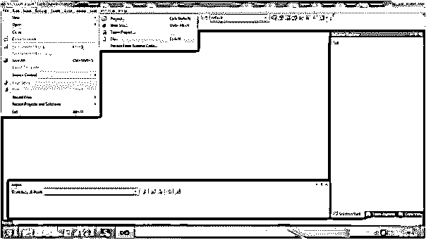

单击 visual C#安装的模板窗格下的“web ”,选择。NET 框架 3.5à精选 ASP.NET Web 应用。

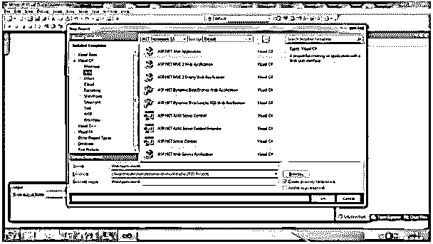

将项目名称写为“regular expression demo”à项目位置à单击“确定”

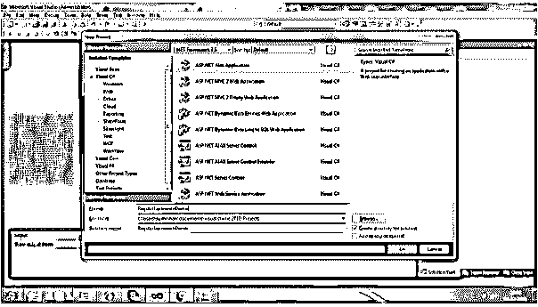

在解决方案资源管理器下找到的新项目

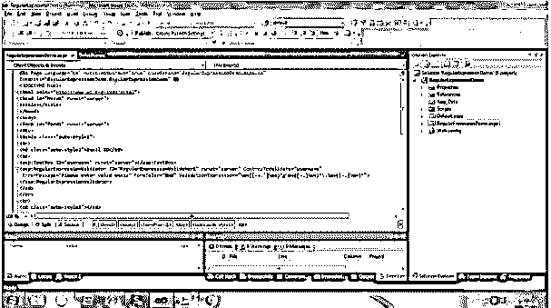

写点击项目点击添加点击“新项目”

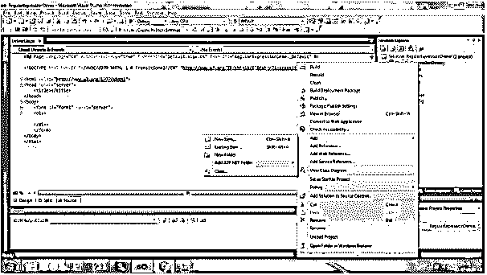

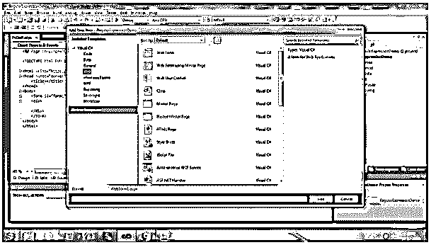

命名为 givenàregular expression demo . aspxà，然后单击添加按钮

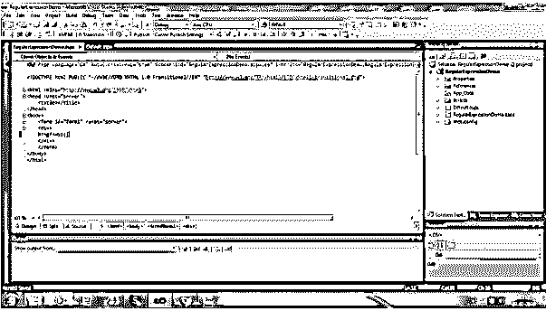

编写代码。aspx 文件

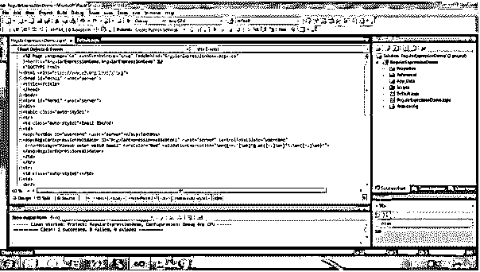

设置。aspx 文件作为起始页。

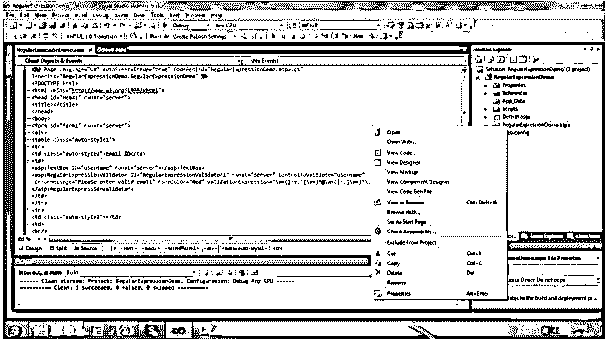

点击绿色按钮或点击 F5 按钮。

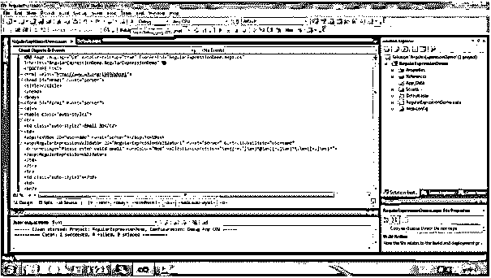

浏览器中出现新的 web 项目

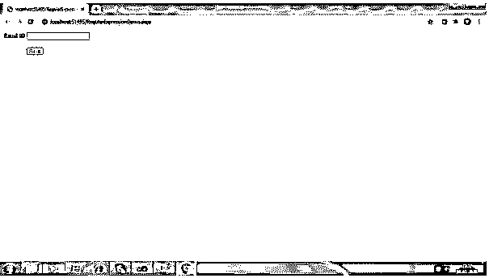

输入无效邮件，点击保存按钮

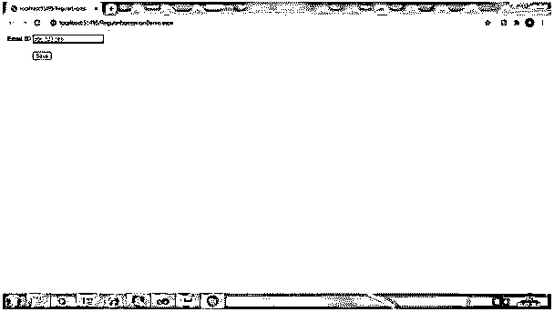

将出现以下错误信息。

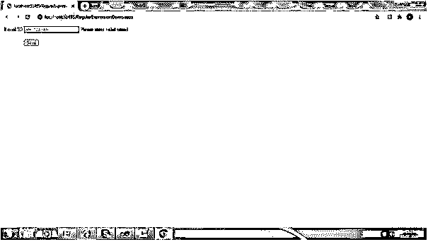

### 结论

正则表达式始终是任何一种基于 web 的应用程序的关键特性之一。对于一些重要的数据处理应用程序来说，它在安全性和避免一些关键漏洞方面提供了很大的效用。这个验证器在 ASP.NET 应用程序中非常有用，因为只需使用特定的标签就可以非常容易地使用它。

### 推荐文章

这是 ASP.NET 正则表达式验证器的指南。在这里，我们讨论一个介绍 ASP.NET 正则表达式验证器的适当语法和例子。您也可以浏览我们的其他相关文章，了解更多信息——

1.  [软件指标](https://www.educba.com/software-metrics/)
2.  [软件设计](https://www.educba.com/software-design/)
3.  [最佳编程语言](https://www.educba.com/best-programming-languages/)
4.  [软件质量保证](https://www.educba.com/software-quality-assurance/)