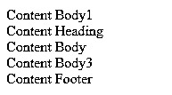
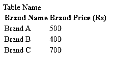
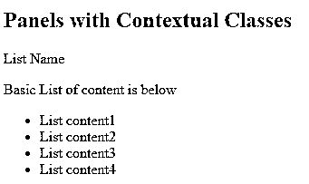

# 引导面板

> 原文：<https://www.educba.com/bootstrap-panels/>


## 自举面板介绍

数据内容必须显示干净、整洁和合适。内容中有空间，彩色的页眉和页脚，内容的边框看起来很吸引人。吸引人的内容易于阅读和理解。引导面板的工作方式与内容完全相似。它用于带有特定填充的内容的边框。它适用于内容、页眉、页脚以及不同的颜色。基本引导面板工作使用”。panel“div 元素中的类，带有这个类”。还需要 panel-default "类。

**举例:**

<small>网页开发、编程语言、软件测试&其他</small>

```
<div class="panel panel-default">
<div class="panel-body"> THIS IS A DEFAULT PANEL </div>
</div>
```

**输出:**


### 引导面板的类型

面板按照不同的分类和目标进行分类，如下所示。内容有标题、正文和页脚部分。为了有目的地制作优雅的内容和风格，专家组提出了这些类别:

#### 1.带有标题的面板

在面板标题中，边框由内容标题和内容正文包围，并带有格式填充。标题面板添加 class = "panel-heading "和内容正文添加 class = "panel-body "。

**代码:**

```
<div class="panel panel-default">
<div class="panel-heading"> Content Heading </div>
<div class="panel-body"> Content Body </div>
</div>
```

**输出:**


您可以添加 class = "panel-title "来单独修改内容的标题。这个类很少使用，因为面板标题类自己修改所有的样式。

#### 2.带页脚的面板

在面板页脚中，边框被内容页脚和内容正文包围，并带有格式填充。页脚面板 add class = "panel-footer "和内容正文 add class = "panel-body "。

**代码:**

```
<div class="panel panel-default">
<div class="panel-body"> Content Body </div>
<div class="panel-footer"> Content Footer </div>
</div>
```

**输出:**


#### 3.面板组

此面板用于一次装订多个面板。它会移除下方面板的边界，并制作一组面板。

**代码:**

```
<div class="panel-group">
<div class="panel panel-default">
<div class="panel-body">Content Body1</div>
</div>
<div class="panel panel-default">
<div class="panel-heading"> Content Heading </div>
<div class="panel-body"> Content Body </div>
</div>
<div class="panel panel-default">
<div class="panel-body"> Content Body3 </div>
<div class="panel-footer"> Content Footer </div></div>
</div>
```

**输出:**




#### 4.带有上下文类的面板

为了得到一个更有意义的上下文引导面板，为上下文设计不同的类。每个上下文相关的类标题都有不同的颜色来显示上下文的影响。下面是这些面板类及其示例和输出，

*   **。panel-default:** 这是用于上下文的默认面板。

**代码:**

```
<div class="panel panel-default">
<div class="panel-heading"> Content Heading </div>
<div class="panel-body"> Content Body </div>
</div>
```

**输出:**


*   **。panel-primary:** 这个用于主上下文的类表示主上下文。

**代码:**

```
<div class="panel panel-primary">
<div class="panel-heading"> Content Heading with panel-primary class /div>
<div class="panel-body"> Content Body2 </div>
</div>
```

**输出:**


*   **。panel-success:** 这个类用在一些上下文有成功的意思的时候。

**代码:**

```
<div class="panel panel-success">
<div class="panel-heading"> Content Heading with panel-success class </div>
<div class="panel-body"> Content Body3 </div>
</div>
```

**输出:**


*   **。panel-info:** 这个类在某些上下文具有信息性时使用。

**代码:**

```
<div class="panel panel-info">
<div class="panel-heading"> Content Heading with panel-info class </div>
<div class="panel-body"> Content Body4</div>
</div>
```

**输出:**


*   **。panel-warning:** 当某些上下文具有警告标志的含义时，使用这个类。

**代码:**

```
<div class="panel panel-warning">
<div class="panel-heading"> Content Heading with panel-warning class </div>
<div class="panel-body"> Content Body5</div>
</div>
```

**输出:**


*   **。panel-danger:** 这个类用在某些上下文有危险的意思，想表示的时候。

**代码:**

```
<div class="panel panel-danger">
<div class="panel-heading"> Content Heading with panel-danger class </div>
<div class="panel-body"> Content Body6</div>
</div>
```

**输出:**


### 引导面板示例

以下是详细解释的例子，

#### 示例#1:简单的引导面板

这是一个简单的引导默认面板示例，其中放置了面板标题、面板页脚和描述体。

**代码:**

```
<div class="container">
<div class="panel panel-default">
<div class="panel-heading"> Content Heading </div>
<div class="panel-body"> Content Body <br/> Panel body for context </div>
<div class="panel-footer"> Content Footer </div>
</div>
</div>
```

**输出:**


#### 示例 2:带有表格的引导面板

*   在这个例子中，使用 bootstrap panel 获得表的输出。这张桌子可以修饰得看起来很优雅。以下示例和输出是使用引导面板的表格。
*   这个例子需要一个 table 类来制作一个表。它使主要和面板标题类保持一个表名。
*   table 类产生了一个 panel body 类。在该表中，放置了表头和表数据。

**代码:**

```
<div class="container">
<div class = "panel panel-primary">
<div class = "panel-heading">Table Name</div>
<table class = "panel-body table ">
<tr>
<th> Brand Name </th>
<th> Brand Price (Rs) </th>
</tr>
<tr>
<td> Brand A </td>
<td> 500 </td>
</tr>
<tr>
<td> Brand B </td>
<td> 400 </td>
</tr>
<tr>
<td> Brand C </td>
<td> 700 </td>
</tr>
```

**输出:**




#### 示例#3:带有列表的引导面板

*   这个例子类似于表格，但是唯一的变化是列表代替了表格。本例中使用了 panel-info 类。
*   面板标题用于列表的名称。
*   这个例子给出了 panel body 类中的无序列表和一个简短的描述。

**代码:**

```
<div class="container">
<h2>Panels with Contextual Classes</h2>
<div class = "panel panel-info">
<div class ="panel-heading">List Name</div>
<div class = "panel-body">
<p> Basic List of content is below</p>
<ul class = "list-group">
<li class = "list-group-item"> List content1 </li>
<li class = "list-group-item"> List content2 </li>
<li class = "list-group-item"> List content3 </li>
<li class = "list-group-item"> List content4 </li>
</ul>
</div>
</div>
</div>
```

**输出:**




### 结论

有时 [Web 应用](https://www.educba.com/what-is-web-application/)的上下文看起来很笨拙，不容易阅读。它适用于填充边框和样式。每个内容都用有意义的上下文进行格式化填充。为了有意义的上下文，使用了许多引导面板类。这使得上下文可读性，吸引力和更有效。

### 推荐文章

这是引导面板的指南。在这里，我们讨论引导面板的介绍和类型，以及各种示例和代码实现。您也可以阅读以下文章，了解更多信息——

1.  [自举排版](https://www.educba.com/bootstrap-typography/)
2.  [引导程序中的图像滑块](https://www.educba.com/image-slider-in-bootstrap/)
3.  [引导雕刻图案](https://www.educba.com/bootstrap-glyphicons/)
4.  [引导下拉菜单](https://www.educba.com/bootstrap-dropdown-menu/)


