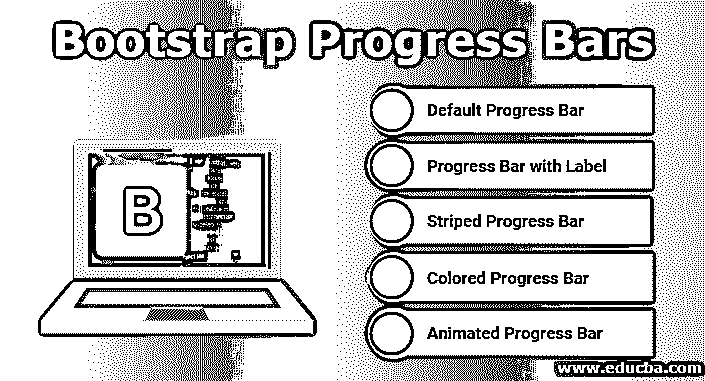

# 引导进度条

> 原文：<https://www.educba.com/bootstrap-progress-bars/>




## 引导进度条介绍

几乎所有的程序员都知道 Bootstrap。它显示进度，多少用户已经做/完成的事情。 [Bootstrap 为](https://www.educba.com/image-slider-in-bootstrap/)提供了一个显示进度条的类。这个类是在引导库下构建的。进度条向用户显示进度状态，即指示他们已经完成了多少任务。进度条可以是加载器、条的形式，也可以是许多其他形式。它显示任务/事件的完成百分比。使用 Bootstrap 提供的类可以在网页上快速实现进度条。

### 什么是引导进度条？

进度条显示当前任务的进度，例如任务完成了多少，还有多少任务未完成。指的是 Bootstrap 创建的进度条。

<small>网页开发、编程语言、软件测试&其他</small>

因此，可以使用父元素中的类“progress”来创建它&最近的子元素将有一个类“progress-bar”。我们可以看到下面的进度条截图。


下面给出了具有不同完成进度状态的进度条的 HTML。这些进度条是使用 bootstrap 创建的。我们可以看到包含引导类“progress”的父元素及其包含由引导库提供的类“progress bar”的子元素。

```
<div class="progress">
<div class="progress-bar" style="width: 60%" >
60% Complete
</div>
</div>
<br>
<div class="progress">
<div class="progress-bar" style="width: 80%">
80% Complete
</div>
</div>
<br>
<div class="progress">
<div class="progress-bar"  style="width: 100%">
100% Complete
</div>
</div>
```

要创建引导进度条/加载器，页面上应该包含引导库。

### 类型

它们可能具有不同的类型和不同的特征。

*   默认进度条，
*   带标签的进度条
*   条纹进度条
*   彩色进度条
*   动画进度条

让我们来详细看看这些类型，如下所述:

#### 1.默认进度条

默认进度条可以使用引导库添加，在父&子元素上使用某些预定义的类来创建默认进度条。上面给出的例子是最适合默认进度条的。


#### 2.带标签的进度条

带标签的进度条类似于默认进度条；它还包含已处理的条上的值。这可以通过在子元素之间添加元素“ 60%完成”来创建。

进度条的高度由父元素的高度控制，父元素包含类“progress”。

例如，在下面给出的例子中，span 元素被添加在子元素之间。此跨度元素将作为进度条上的标签可见。

```
<div class="progress">
<div class="progress-bar" style="width: 60%" >
60% Complete
</div>
</div>
<br>
<div class="progress">
<div class="progress-bar" style="width: 80%">
80% Complete
</div>
</div>
<br>
<div class="progress">
<div class="progress-bar"  style="width: 100%">
100% Complete
</div>
</div>
```

在下面给出的例子中，我们可以看到，增加的跨度作为进度条的值显示在进度条的中间，作为一个标签；这就是为什么它被称为带标签的进度条。


#### 3.条纹进度条

这在观点上有点不同。我们可以看到内部元素中的 bootstrap 类“进度条”像视图一样剥离了元素。下面给出了条形进度条<u>的 HTML。</u>

 <u>```
<div class="progress">
<div class="progress-bar progress-bar-striped" role="progressbar" style="width: 20%" aria-valuenow="20" aria-valuemin="0" aria-valuemax="100">
</div>
</div>
<br>
<div class="progress">
<div class="progress-bar progress-bar-striped" role="progressbar" style="width: 40%" aria-valuenow="40" aria-valuemin="0" aria-valuemax="100">
</div>
</div>
<br>
<div class="progress">
<div class="progress-bar progress-bar-striped" role="progressbar" style="width: 60%" aria-valuenow="60" aria-valuemin="0" aria-valuemax="100">
</div>
</div>
<br>
<div class="progress">
<div class="progress-bar progress-bar-striped" role="progressbar" style="width: 80%" aria-valuenow="80" aria-valuemin="0" aria-valuemax="100">
</div>
</div>
<br>
<div class="progress">
<div class="progress-bar progress-bar-striped" role="progressbar" style="width: 100%" aria-valuenow="100" aria-valuemin="0" aria-valuemax="100">
</div>
</div>
```

下面给出了条纹进度条的看法。


#### 4.彩色进度条

在上面给出的进度条中，不同的颜色可以使用引导类添加到进度条中。下面列出了其中的一些课程

*   BG-成功
*   血糖信息
*   血糖-警告
*   血糖-危险

上面给出的类被称为后台实用程序类。

```
<div class="progress">
<div class="progress-bar progress-bar-striped" role="progressbar" style="width: 20%" aria-valuenow="20" aria-valuemin="0" aria-valuemax="100">
</div>
</div>
<br>
<div class="progress">
<div class="progress-bar progress-bar-striped bg-danger" role="progressbar" style="width: 40%" aria-valuenow="40" aria-valuemin="0" aria-valuemax="100">
</div>
</div>
<br>
<div class="progress">
<div class="progress-bar progress-bar-striped bg-info" role="progressbar" style="width: 60%" aria-valuenow="60" aria-valuemin="0" aria-valuemax="100">
</div>
</div>
<br>
<div class="progress">
<div class="progress-bar progress-bar-striped bg-warning" role="progressbar" style="width: 80%" aria-valuenow="80" aria-valuemin="0" aria-valuemax="100">
</div>
</div>
<br>
<div class="progress">
<div class="progress-bar progress-bar-striped bg-success" role="progressbar" style="width: 100%" aria-valuenow="100" aria-valuemin="0" aria-valuemax="100">
</div>
</div>
```

上面给出的内部 HTML 元素中的类可以给进度条添加颜色，如下图所示。


#### 5.动画进度条

这是指带有动画的进度条。Bootstrap 库提供了类“active”来在进度条中添加动画每当进度状态改变时，进度状态慢慢改变到更新状态。

```
<div class="progress">
<div class="progress-bar progress-bar-striped" role="progressbar" style="width: 20%" aria-valuenow="20" aria-valuemin="0" aria-valuemax="100">
</div>
</div>
<br>
<div class="progress">
<div class="progress-bar progress-bar-striped active" role="progressbar" style="width: 40%" aria-valuenow="40" aria-valuemin="0" aria-valuemax="100">
</div>
</div>
```

如果一个“活动的”类在创建的进度条中是可用的，那么它们的进度状态会变成新的状态。在这种情况下，进度条将慢慢导航到新的状态；进度状态增加或减少。

### 结论

这是表示进度状态的一种更智能、更有效的方式。进度条表示法能描述的信息太多，不是几句话能描述的。在[创建引导进度条](https://www.educba.com/what-is-bootstrap/)<u>之前，在应用中包含引导库是很重要的。</u>

 <u>### 推荐文章

这是一个引导进度条的指南。在这里，我们以简单而详细的方式讨论基本概念、类型以及代码。您也可以浏览我们推荐的其他文章，了解更多信息——

1.  [什么是自举？](https://www.educba.com/what-is-bootstrap/)
2.  [引导组件](https://www.educba.com/bootstrap-components/)
3.  [自举徽章](https://www.educba.com/bootstrap-badge/)
4.  [引导折叠导航条](https://www.educba.com/bootstrap-collapse-navbar/)


</u></u>