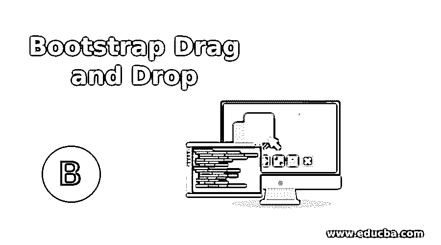
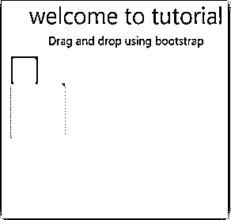
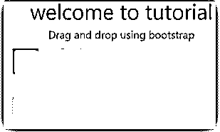
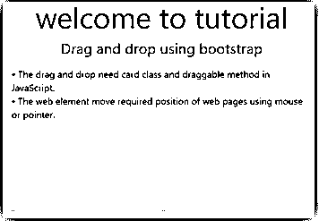
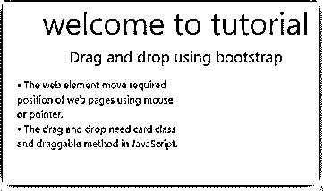
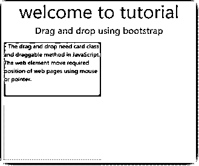
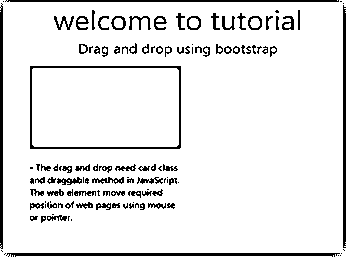

# 引导拖放

> 原文：<https://www.educba.com/bootstrap-drag-and-drop/>




## 引导拖放简介

bootstrap 中的拖放也称为可拖动插件。这是一个图形用户界面。拖放操作指向 web 元素，并使用指针在 web 应用程序页面上移动。拖放需要 JavaScript 中的 card 类和 draggable 方法。拖放是 web 应用程序的动画内容部分，用于吸引人的设计目的。web 元素使用鼠标或指针移动网页的所需位置。

### 句法

拖放语法不仅依赖于 bootstrap，还依赖于 JavaScript。有三种方法可以获得拖放元素。

<small>网页开发、编程语言、软件测试&其他</small>

*   为了拖动元素，我们使用下面的标签和类。

```
draggable ="true"
ondragstart = "dragStart (event)"
```

*   为了删除元素，我们使用下面的标签和类。

```
ondrop ="dragDrop(event)" .
ondragover ="allowDrop(event)".
```

*   在下面的 JavaScript 中，方法用于拖放元素。

```
function allowDrop (ev){..}
function dragStart (ev) {..}
function dragDrop (ev) {..}
```

### **在 Bootstrap 中拖放是如何工作的？**

在 JavaScript 中使用的拖放方法如下。javaScript 中使用了三种方法。

*   **函数 allowDrop (ev){..}–**这用于允许位置放下元素。
*   **函数 dragStart (ev) {..}–**用于选择抓取或拖动的元素。
*   **函数 dragDrop (ev) {..}–**用于设置放置元素的位置。

```
<script>
function allowDrop (ev) {
ev.preventDefault();
}
function dragStart (ev) {
ev.dataTransfer.setData ("text",  ev.target.id);
}
function dragDrop (ev) {
ev.preventDefault ();
var data =  ev.dataTransfer.getData ("text");
ev.target.appendChild (document.getElementById(data));
}
</script>
```

*   在 bootstrap 中，我们使用可拖动标签和其他类。
*   有两个部分:一个是拖动元素，第二个是放下元素。
*   draggable 标记必须为 true。
*   用于拖动元素的 ondragstart 标记。dragStart(事件)帮助设置用于拖动的数据。
*   ondrop 用于将元素放在此位置。
*   用于设置拖动元素的端点或位置的 ondragover 元素。

```
<div id= "colm2" draggable = "true" ondragstart = "dragStart (event)">
</div>
<div id= "colm3" ondrop = "dragDrop(event)" ondragover = "allowDrop(event)">
</div>
```

### 例子

以下是下面提到的例子。

#### 示例#1

使用 bootstrap、javascript 和 CSS 将较小的盒子拖放到较大的盒子中。

**代码:**

```
<!DOCTYPE html>
<html>
<head>
<title> Bootstrap Drag and drop Example </title>
<meta charset ="utf-8">
<meta name ="viewport" content ="width=device-width, initial-scale=1">
<link rel ="stylesheet" href= "https://maxcdn.bootstrapcdn.com/bootstrap/4.4.1/css/bootstrap.min.css">
<script src= "https://ajax.googleapis.com/ajax/libs/jquery/3.4.1/jquery.min.js">
</script>
<script src= "https://cdnjs.cloudflare.com/ajax/libs/popper.js/1.16.0/umd/popper.min.js">
</script>
<script src= "https://maxcdn.bootstrapcdn.com/bootstrap/4.4.1/js/bootstrap.min.js">
</script>
<script>
function allowDrop (ev) {
ev.preventDefault();
}
function dragStart (ev) {
ev.dataTransfer.setData ("text",  ev.target.id);
}
function dragDrop (ev) {
ev.preventDefault ();
var data =  ev.dataTransfer.getData ("text");
ev.target.appendChild (document.getElementById(data));
}
</script>
<style>
#colm1 {
width: 60px;
height: 60px;
background-color: orange;
}
#colm2 {
width: 120px;
height: 120px;
background-color: lightblue;
}
#colm3 {
width: 160px;
height: 160px;
background-color: yellow;
}
p {
font-size:25px;
text-align:center;
}
.main {
font-size:50px;
color:black;
text-align:center;
}
</style>
</head>
<body>
<div class= "container">
<div class = "main"> welcome to tutorial </div>
<p> Drag and drop using bootstrap </p>
<div id = "colm">
<div id="colm1" draggable ="true"  ondragstart = "dragStart (event)">
</div>
<div id= "colm2" draggable = "true" ondragstart = "dragStart (event)">
</div>
<div id= "colm3" ondrop = "dragDrop(event)" ondragover = "allowDrop(event)">
</div>
</div>
</div>
</body>
</html>
```

**拖放前输出**




**拖放后输出**




#### 实施例 2

将简单文本拖放到黄色框中。

**代码:**

```
<!DOCTYPE html>
<html>
<head>
<title> Bootstrap Drag and drop Example </title>
<meta charset ="utf-8">
<meta name ="viewport" content= "width=device-width, initial-scale=1">
<link rel=  "stylesheet" href= "https://maxcdn.bootstrapcdn.com/bootstrap/4.4.1/css/bootstrap.min.css">
<script src= "https://ajax.googleapis.com/ajax/libs/jquery/3.4.1/jquery.min.js">
</script>
<script src= "https://cdnjs.cloudflare.com/ajax/libs/popper.js/1.16.0/umd/popper.min.js">
</script>
<script src= "https://maxcdn.bootstrapcdn.com/bootstrap/4.4.1/js/bootstrap.min.js">
</script>
<script>
function allowDrop (ev) {
ev.preventDefault();
}
function dragStart (ev) {
ev.dataTransfer.setData ("text", ev.target.id);
}
function dragDrop (ev) {
ev.preventDefault ();
var data = ev.dataTransfer.getData ("text");
ev.target.appendChild(document.getElementById(data));
}
</script>
<style>
#colm3 {
width: 260px;
height: 160px;
background-color:  yellow;
}
p {
font-size:25px;
text-align:center;
}
.main {
font-size: 50px;
color: black;
text-align: center;
}
</style>
</head>
<body>
<div class="container">
<div class = "main"> welcome to tutorial </div>
<p> Drag and drop using bootstrap </p>
<div id = "colm">
<div id="colm1" draggable ="true" ondragstart ="dragStart(event)"> •       The drag and drop need card class and draggable method in JavaScript.  </div>
<div id="colm2" draggable ="true" ondragstart ="dragStart(event)"> •       The web element move required position of web pages using mouse or pointer.
</div>
<div id="colm3" ondrop ="dragDrop(event)" ondragover ="allowDrop(event)">
</div>
</div>
</div>
</body>
</html>
```

**拖放前输出**




**拖放后输出**




#### 实施例 3

内容从一个橙色的盒子中拖放到黄色的盒子中。

**代码:**

```
<!DOCTYPE html>
<html>
<head>
<title> Bootstrap Drag and drop Example </title>
<meta charset ="utf-8">
<meta name ="viewport" content= "width=device-width, initial-scale=1">
<link rel=  "stylesheet" href= "https://maxcdn.bootstrapcdn.com/bootstrap/4.4.1/css/bootstrap.min.css">
<script src= "https://ajax.googleapis.com/ajax/libs/jquery/3.4.1/jquery.min.js">
</script>
<script src= "https://cdnjs.cloudflare.com/ajax/libs/popper.js/1.16.0/umd/popper.min.js">
</script>
<script src= "https://maxcdn.bootstrapcdn.com/bootstrap/4.4.1/js/bootstrap.min.js">
</script>
<script>
function allowDrop (ev) {
ev.preventDefault();
}
function dragStart (ev) {
ev.dataTransfer.setData ("text", ev.target.id);
}
function dragDrop (ev) {
ev.preventDefault ();
var data = ev.dataTransfer.getData ("text");
ev.target.appendChild(document.getElementById(data));
}
</script>
<style>
#colmm {
width: 260px;
height: 160px;
background-color:  orange;
}
#colm3 {
width: 260px;
height: 160px;
background-color:  yellow;
}
p {
font-size:25px;
text-align:center;
}
.main {
font-size: 50px;
color: black;
text-align: center;
}
</style>
</head>
<body>
<div class="container">
<div class = "main"> welcome to tutorial </div>
<p> Drag and drop using bootstrap </p>
<div id = "colm">
<div id = "colmm">
<div id="colm1" draggable ="true" ondragstart ="dragStart(event)"> •            The drag and drop need card class and draggable method in JavaScript.
The web element move required position of web pages using mouse or pointer.
</div>
</div> <br>
<div id="colm3" ondrop ="dragDrop(event)" ondragover ="allowDrop(event)">
</div>
</div>
</div>
</body>
</html>
```

**拖放前输出**




**拖放后输出**




### 结论

*   bootstrap 中的拖放是 web 应用程序的动画部分之一。
*   这用于根据需求列出和排序许多内容部分。
*   对于 web 应用程序来说，它使 web 应用程序更具吸引力和趣味性。

### 推荐文章

这是一个引导拖放的指南。在这里，我们讨论如何引导拖放工作与各自的例子。您也可以看看以下文章，了解更多信息–

1.  [引导折叠导航条](https://www.educba.com/bootstrap-collapse-navbar/)
2.  [引导组合框](https://www.educba.com/bootstrap-combobox/)
3.  [自举寻呼机](https://www.educba.com/bootstrap-pager/)
4.  [引导左侧菜单](https://www.educba.com/bootstrap-left-menu/)


