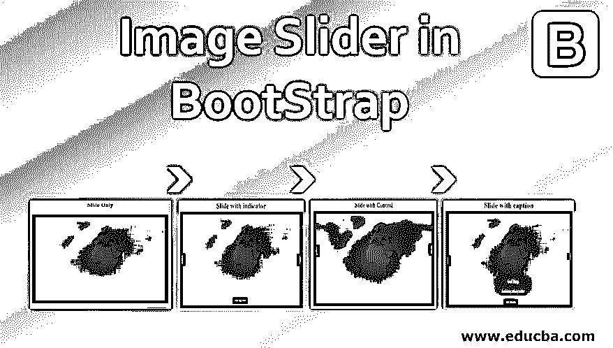
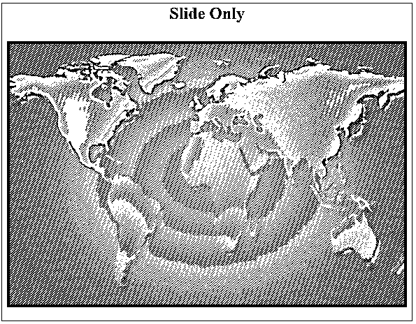
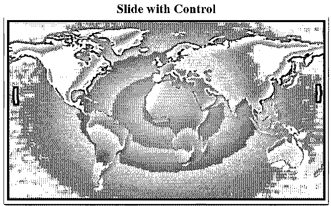
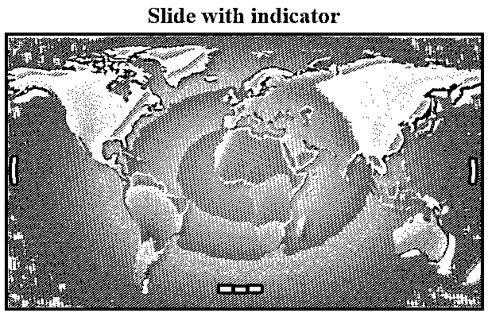
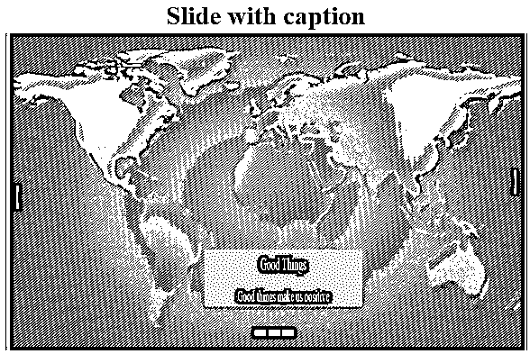

# 引导中的图像滑块

> 原文：<https://www.educba.com/image-slider-in-bootstrap/>




## BootStrap 中的图像滑块介绍

该网站，很多时候需要显示许多图像与一个小空间的标签线和一个方便的方式显示给别人。图像滑块是实现这一要求的最简单的方法。图像滑块是一种使用滑块在一个容器中显示多个图像、图形的方式。它显示像循环方式显示图像一个接一个。引导中的图像滑块也称为引导转盘或幻灯片。有许多方法来显示图像滑块优雅，有吸引力和有意义的。图像滑块主要用于网站看起来有吸引力，抓住用户的注意力。电子商务和一些产品网站的图像滑块是一个在一个空间显示许多产品的要求。

### 引导程序中滑块的描述

我们可以根据自己的方便和需求修改图像滑块。有一个网站所需的以下选项。显示以下关于图像滑块的方式:

<small>网页开发、编程语言、软件测试&其他</small>

#### 1.仅幻灯片

*   图像在间隔时间内自动滑动。
*   class = "carousel "是中包含图像的主要来源。
*   的。用于动画和 CSS 效果的 slide 类。这张幻灯片移动到另一个图像以显示新内容。
*   data-ride ="carousel "属性用于在页面加载到 bootstrap 时立即开始动画显示图像。

#### 2.控制滑动

*   这个滑块带有控制箭头。用户可以通过箭头控制图像。
*   根据控件类，data-slide 属性用于上一个或下一个图像。
*   carousel-control 类与 left 和 right 类以及左右箭头的字形图标一起使用。

#### 3.带指示器的幻灯片

*   指示器使用小圆点或破折号显示页面上显示的图像数量以及该页面上有多少图像。
*   carousel-indicators 类与有序列表

*   列表
*   中使用的数据目标和数据滑动目标属性。
*   data-target 连接到 carousel 类的 id 和 data-slide-to，用于使用点显示多个图像。

#### 4.带标题的幻灯片

*   标题是指与图像相关的简短描述和信息。
*   用户希望在图像上显示标题，然后在属性中使用。
*   必须用于每张图片的每一项。里面的
*   所有图像在中被识别。这个类属于 class= "carousel "。
*   class = "item "用于所有图像。每个图像都有自己的项目类别。
*   一个项目必须动作，因为图像的这个活动项目显示在页面上，否则页面不能显示任何图像。
*   图像滑块主要用于页面的开始，以吸引注意力并看起来很生动，或者希望在容器的一页上显示图库。

### BootStrap 中的图像滑块示例

以下示例和输出是不同的图像滑块:

#### 示例#1

**仅幻灯片:**在本例中，仅幻灯片可见。

**代码:**

```
<!DOCTYPE html>
<html>
<head>
<title>Bootstrap image slider</title>
<meta charset="utf-8">
<meta name= "viewport" content= "width=device-width, initial-scale=1">
<link rel="stylesheet" href="https://maxcdn.bootstrapcdn.com/bootstrap/3.4.0/css/bootstrap.min.css">
<script src="https://ajax.googleapis.com/ajax/libs/jquery/3.4.1/jquery.min.js"></script>
<script src="https://maxcdn.bootstrapcdn.com/bootstrap/3.4.0/js/bootstrap.min.js"></script>
</head>
<body>
<div class="container">
<h2> Slide only </h2>
<div id="SlidesOnly" class="carousel slide" data-ride="carousel">
<div class="carousel-inner">
<div class="carousel-item active">

</div>
<div class="carousel-item">

</div>
<div class="carousel-item">

</div>
</div>
</div>
</div>
</div>
</body>
</html>
```

**输出:**




#### 实施例 2

这个例子展示了如何控制上一个，下一个，当前图像。

**代码:**

```
<!doctype Html>
<html>
<head>
<title>Bootstrap image slider</title>
<meta charset="utf-8">
<meta name="viewport" content="width=device-width, initial-scale=1">
<link rel="stylesheet" href="https://maxcdn.bootstrapcdn.com/bootstrap/3.4.0/css/bootstrap.min.css">
<script src="https://ajax.googleapis.com/ajax/libs/jquery/3.4.1/jquery.min.js"></script>
<script src="https://maxcdn.bootstrapcdn.com/bootstrap/3.4.0/js/bootstrap.min.js"></script>
</head>
<body>
<div class="container">
<h2> Slide with control </h2>
<div id="carouselControls" class="carousel slide" data-ride="carousel">
<div class="carousel-inner">
<div class="carousel-item active">

</div>
<div class="carousel-item">

</div>
<div class="carousel-item">

</div>
</div>
</div>
<a class="carousel-control-prev" href="#carouselControls" role="button" data-slide="prev">

Previous
</a>
<a class="carousel-control-next" href="#carouselControls" role="button" data-slide="next">

Next
</a>
</div>
</div>
</body>
</html>
```

**输出:**




#### 实施例 3

**带指示器的幻灯片**:在本例中，使用圆点显示图像的指示器。

**代码:**

```
<!doctype Html>
<html>
<head>
<title>Bootstrap image slider</title>
<meta charset="utf-8">
<meta name="viewport" content="width=device-width, initial-scale=1">
<link rel="stylesheet" href="https://maxcdn.bootstrapcdn.com/bootstrap/3.4.0/css/bootstrap.min.css">
<script src="https://ajax.googleapis.com/ajax/libs/jquery/3.4.1/jquery.min.js"></script>
<script src="https://maxcdn.bootstrapcdn.com/bootstrap/3.4.0/js/bootstrap.min.js"></script>
</head>
<body>
<div class="container">
<h2> Slide with indicator </h2>
<div id="carouselIndicators" class="carousel slide" data-ride="carousel">
<ol class="carousel-indicators">
<li data-target="#carouselIndicators" data-slide-to="0" class="active"></li>
<li data-target="#carouselIndicators" data-slide-to="1"></li>
<li data-target="#carouselIndicators" data-slide-to="2"></li>
</ol>
<div class="carousel-inner">
<div class="carousel-item active">

</div>
<div class="carousel-item">

</div>
<div class="carousel-item">

</div>
</div>
<a class="carousel-control-prev" href= "#carouselIndicators" role="button" data-slide="prev">

Previous
</a>
<a class="carousel-control-next" href="#carouselIndicators" role="button" data-slide="next">

Next
</a>
</div>
</div>
</body>
</html>
```

**输出:**




#### 实施例 4

**带字幕的幻灯片:**在本例中，可以根据图像显示短信和信息。

**代码:**

```
<!DOCTYPE html>
<html>
<head>
<title>Bootstrap image slider</title>
<meta charset="utf-8">
<meta name="viewport" content="width=device-width, initial-scale=1">
<link rel="stylesheet" href="https://maxcdn.bootstrapcdn.com/bootstrap/3.4.0/css/bootstrap.min.css">
<script src="https://ajax.googleapis.com/ajax/libs/jquery/3.4.1/jquery.min.js"></script>
<script src="https://maxcdn.bootstrapcdn.com/bootstrap/3.4.0/js/bootstrap.min.js"></script>
</head>
<body>
<div class="container">
<h2> Slide with caption </h2>
<div id="Carousel" class="carousel slide" data-ride="carousel">
<ol class="carousel-indicators">
<li data-target="#Carousel" data-slide-to="0" class="active"></li>
<li data-target="#Carousel" data-slide-to="1"></li>
<li data-target="#Carousel" data-slide-to="2"></li>
</ol>
<div class="carousel-inner">
<div class="item active">

<div class="carousel-caption">
<h3> Good Things </h3>
<p> Good things make us positive </p>
</div>
</div>
<div class="item">

<div class="carousel-caption">
<h3> Bad Thing </h3>
<p> bad things is a way of depresion!</p>
</div>
</div>
<div class="item">

<div class="carousel-caption">
<h3>Things for medium</h3>
<p>We love the  our family much more</p>
</div>
</div>
</div>
<a class="left carousel-control" href="#Carousel" data-slide="prev">

Previous
</a>
<a class="right carousel-control" href="#Carousel" data-slide="next">
Next
</a>
</div>
</div>
</body>
</html>
```

**输出:**




### 结论

bootstrap 中的图像滑块是联系网络用户和吸引注意力的传统方式。图像滑块在一页上显示许多图像和相关的简短信息。Bootstrap 有自己的类来使用图像滑块和其他相关字段。仅使用 bootstrap 类，用户可以控制和指示带有标题的图像滑块。

### 推荐文章

这是一个引导图像滑块。在这里，我们讨论的基本概念，描述和不同的例子，图像滑块在引导。您也可以浏览我们的其他相关文章，了解更多信息——

1.  [如何安装引导程序](https://www.educba.com/install-bootstrap/)
2.  [Bootstrap Datepicker](https://www.educba.com/bootstrap-datepicker/)
3.  [引导转盘](https://www.educba.com/bootstrap-carousel/)
4.  [自举余量](https://www.educba.com/bootstrap-margin/)


