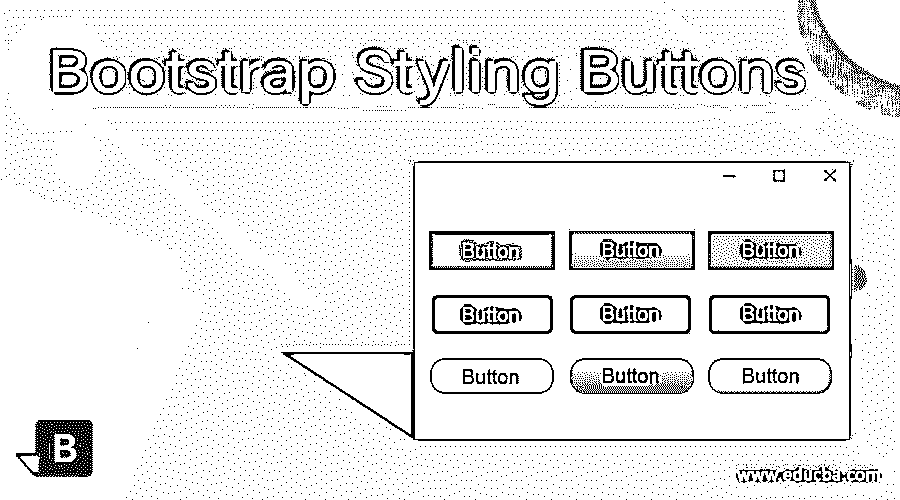
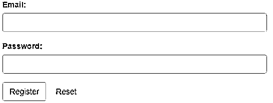
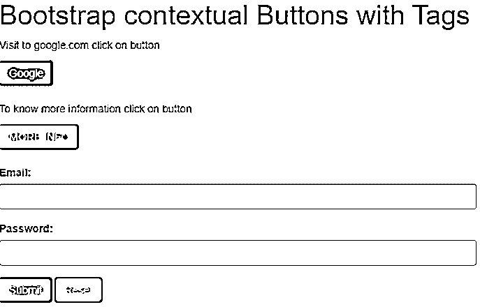

# 引导样式按钮

> 原文：<https://www.educba.com/bootstrap-styling-buttons/>




## 引导样式按钮的定义

bootstrap styling 按钮是一个重要的组件，它通过单击与用户和 web 应用程序进行交互。bootstrap styling 按钮是一个用户界面组件，用作网站或 web 应用程序的导航。引导样式按钮是一个吸引人的点击组件，帮助用户连接 web 应用程序。引导样式按钮有助于用户以最小的尺寸交流和了解信息。

**语法:**

<small>网页开发、编程语言、软件测试&其他</small>

*   基本的引导按钮需要输入类型和类元素来创建按钮。
*   基本的引导按钮语法如下。

```
<button type="button" class="btn">Bootstrap Button </button>
```

*   引导样式按钮需要按钮样式类。
*   引导样式按钮语法如下。

```
<button type="button" class="btn btn-primary"> Bootstrap styling Button </button>
```

*   按钮类与
*   带有输入标签的引导样式按钮的语法如下。

```
<input type="button" class="btn btn-primary" value= " Bootstrap Button with Tag">
```

### 如何在 Bootstrap 中创建样式按钮？

*   bootstrap 需要某些 HTML 和 CSS 元素来获取 bootstrap 偏移量。
    在 web 应用程序中创建 HTML 文件，然后<！html 文件中需要 DOCTYPE html >标签。
*   bootstrap 是一种响应性技术，可以查看各种规模设备的应用程序。
*   下面的标签对响应式网页设计很有用。

```
<meta name = "viewport" content = "width=device-width, initial-scale = 1">
```

*   bootstrap 添加了一些受支持的在线文件，以获得用于高级设计的 bootstrap 元素和实用程序。
*   以下三个文件是用于引导偏移的引导文件。

```
<link rel= "stylesheet" href = "https://maxcdn.bootstrapcdn.com/bootstrap/3.4.1/css/bootstrap.min.css">
<script src = "https://ajax.googleapis.com/ajax/libs/jquery/3.5.1/jquery.min.js">
</script>
<script src = "https://maxcdn.bootstrapcdn.com/bootstrap/3.4.1/js/bootstrap.min.js">
</script>
```

*   引导样式按钮语法用于网页的正文部分。

```
<button type="button" class="btn btn-primary"> Bootstrap styling Button </button>
```

*   引导程序造型按钮的工作程序如下。

```
<!DOCTYPE html>
<html>
<head>
<title> Bootstrap offset Example </title>
<meta name = "viewport" content = "width =device-width, initial-scale= 1">
<link rel ="stylesheet" href = "https://maxcdn.bootstrapcdn.com/bootstrap/3.4.1/css/bootstrap.min.css">
<script src = "https://ajax.googleapis.com/ajax/libs/jquery/3.5.1/jquery.min.js">
</script>
<script src = "https://maxcdn.bootstrapcdn.com/bootstrap/3.4.1/js/bootstrap.min.js">
</script>
</head>
<body>
<div class = "container">
<form>
<div class="form-group">
<label for="email">Email:</label>
<input type="email" class="form-control">
</div>
<div class="form-group">
<label for="pwd">Password:</label>
<input type="password" class="form-control">
</div>
<button type="submit" class="btn btn-success">Register</button>
<input type="submit" class="btn btn-danger"value="Reset" >
</form>
</div>
</body>
</html>
```

### 引导样式按钮的示例

下面是一些例子:

#### 示例#1

基本的引导按钮示例和输出。

```
<!DOCTYPE html>
<html lang="en">
<head>
<title>Bootstrap styling button Example</title>
<meta charset="utf-8">
<meta name="viewport" content="width=device-width, initial-scale=1">
<link rel="stylesheet" href="https://maxcdn.bootstrapcdn.com/bootstrap/3.4.1/css/bootstrap.min.css">
<script src="https://ajax.googleapis.com/ajax/libs/jquery/3.5.1/jquery.min.js">
</script>
<script src="https://maxcdn.bootstrapcdn.com/bootstrap/3.4.1/js/bootstrap.min.js">
</script>
</head>
<body>
<div class="container">
<form>
<div class = "form-group">
<label > Email: </label>
<input type = "email" class="form-control">
</div>
<div class = "form-group">
<label >Password:</label>
<input type="password" class="form-control">
</div>
<button type="submit" class="btn btn-default"> Register </button>
<button type="submit" class="btn "> Reset </button>
</form>
</div>
</body>
</html>
```

**输出:**




**说明:**本例使用了 bootstrap 表单来理解 bootstrap 基本按钮。重置按钮仅使用“btn”类作为基本引导按钮。Register 按钮为 bootstrap 样式按钮使用了“btn btn-default”类。

#### 实施例 2

引导上下文按钮示例和输出。

```
<!DOCTYPE html>
<html lang="en">
<head>
<title>Bootstrap styling button Example</title>
<meta charset="utf-8">
<meta name="viewport" content="width=device-width, initial-scale=1">
<link rel="stylesheet" href="https://maxcdn.bootstrapcdn.com/bootstrap/3.4.1/css/bootstrap.min.css">
<script src="https://ajax.googleapis.com/ajax/libs/jquery/3.5.1/jquery.min.js">
</script>
<script src="https://maxcdn.bootstrapcdn.com/bootstrap/3.4.1/js/bootstrap.min.js">
</script>
</head>
<body>
<nav class="navbar navbar-default">
<div class="container-fluid">
<div class="navbar-header">
<a class="navbar-brand>Navbar</a>
</div>
<ul class="nav navbar-nav">
<li>
<button type="button" class="btn btn-info"" href="#">Home
</button>&nbsp;
</li>
<li>
<button type="button" class="btn btn-primary"" href="#"> contacts </button>
&nbsp;
</li>
<li>
<button type="button" class="btn btn-success"" href="#"> Page1</button>
&nbsp;
</li>
<li>
<button type="button" class="btn btn-warning"" href="#"> Page2 </button>&nbsp;
</li>
</ul>
</div>
</nav>
</body>
</html>
```

**输出:**


**解释:**这个例子使用了一个导航条来理解引导样式按钮。用于设计和吸引人的引导导航条的上下文按钮。

#### 实施例 3

带有标签示例和输出的引导样式按钮。

```
<!DOCTYPE html>
<html lang = "en">
<head>
<title> Bootstrap styling button Example </title>
<meta charset="utf-8">
<meta name = "viewport" content="width=device-width, initial-scale=1">
<link rel = "stylesheet" href = "https://maxcdn.bootstrapcdn.com/bootstrap/3.4.1/css/bootstrap.min.css">
<script src = "https://ajax.googleapis.com/ajax/libs/jquery/3.5.1/jquery.min.js">
</script>
<script src = "https://maxcdn.bootstrapcdn.com/bootstrap/3.4.1/js/bootstrap.min.js">
</script>
</head>
<body>
<div class="container">
<h1> Bootstrap contextual Buttons with Tags</h1>
<p> Visit to google.com click on button</p>
<a href="https://www.google.com/" class="btn btn-primary" role="button"> Google </a><br><br>
<p> To know more information click on button</p>
<button type="button" class="btn btn-info"> MORE INFO </button><br><br>
<form>
<div class = "form-group">
<label > Email: </label>
<input type = "email" class = "form-control">
</div>
<div class = "form-group">
<label > Password: </label>
<input type = "password" class = "form-control">
</div>
<input type="submit" class="btn btn-success" value="Submit">
<input type="button" class="btn btn-warning" value="Reset">
</form>
</div>
</body>
</html>
```

**输出:**




**说明:**中的<一个>、<输入>、<按钮>标签用于创建按钮。

#### 实施例 4

带有尺寸示例和输出的引导样式按钮。

```
<!DOCTYPE html>
<html lang = "en">
<head>
<title> Bootstrap styling button Example </title>
<meta charset="utf-8">
<meta name = "viewport" content="width=device-width, initial-scale=1">
<link rel = "stylesheet" href = "https://maxcdn.bootstrapcdn.com/bootstrap/3.4.1/css/bootstrap.min.css">
<script src = "https://ajax.googleapis.com/ajax/libs/jquery/3.5.1/jquery.min.js">
</script>
<script src = "https://maxcdn.bootstrapcdn.com/bootstrap/3.4.1/js/bootstrap.min.js">
</script>
</head>
<body>
<div class="container">
<h2> Bootstrap Button Sizes </h2>
<button type="button" class="btn btn-success btn-lg">Large button</button>
<button type="button" class="btn btn-primary">Normal button </button>
<button type="button" class="btn btn-danger btn-sm">Small button </button>
<button type="button" class="btn btn-warning btn-xs"> extra Small</button>
</div>
</body>
</html>
```

**输出:**


**解释:**BTN-LG 类为一个大的引导样式按钮工作。btn-sm、btn-xs 适用于小型和超小型按钮。

### 推荐文章

这是一个引导样式按钮的指南。在这里，我们还将讨论 bootstrap 中样式按钮的定义和创建方法。以及不同的示例及其代码实现。您也可以看看以下文章，了解更多信息–

1.  [自举向右浮动](https://www.educba.com/bootstrap-float-right/)
2.  [AngularJS vs Bootstrap](https://www.educba.com/angularjs-vs-bootstrap/)
3.  [引导填充](https://www.educba.com/bootstrap-padding/)
4.  [引导列表组](https://www.educba.com/bootstrap-list-group/)


