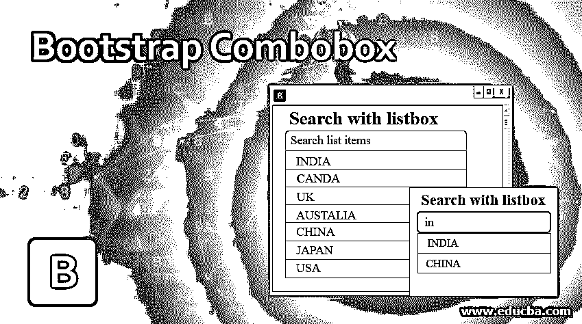
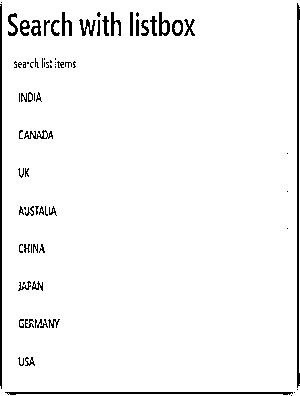
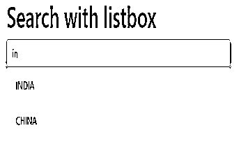
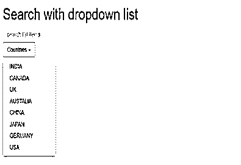
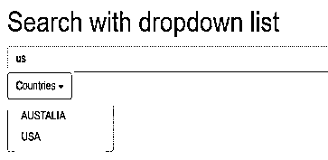
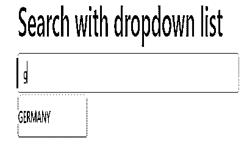
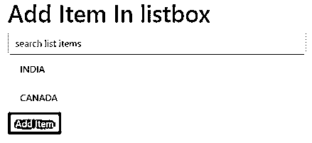
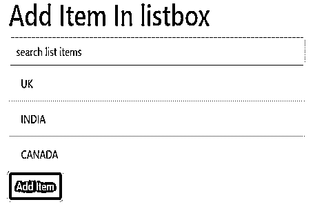

# 引导组合框

> 原文：<https://www.educba.com/bootstrap-combobox/>




## 自举组合框简介

bootstrap 中的组合框是列表框、输入字段和下拉框的组合。下拉列表主要用于带有搜索按钮的组合框。组合框中使用了带有搜索字段的列表框。有时用户可以使用列表框选择多个项目。在 bootstrap 的组合框中，输入字段是可编辑的。您可以根据需要添加值。用户可以从列表中选择值，或者根据需求和要求输入值。开发人员需要 bootstrap 和 JavaScript 一起在 bootstrap 中制作一个组合框。在这个主题中，我们将学习引导组合框。

### 句法

为了理解如何在组合框中工作，我们需要引导列表/下拉列表的语法。如何一起工作搜索和列表/下拉，我们需要基本的 JavaScript 语法。

<small>网页开发、编程语言、软件测试&其他</small>

下面的语法是一个带有引导语法搜索的列表框。

*   列表的引导语法。

```
<div>
<input class = "form-control" id = "listbox" type = "text" placeholder = "search list items">
<ul class ="list-group" id ="listItem">
<li class ="list-group-item">    INDIA </li>
<li class ="list-group-item"> CANADA </li>
</ul>
</div>
```

*   用于搜索的 JavaScript 语法。

```
$(document) .ready(function(){
$("#listbox") .on("keyup", function() {
var values = $(this) .val() .toLowerCase();
$("#listItem li") .filter(function() {
$(this) .toggle($(this) .text() .toLowerCase() .indexOf(values) > -1)
});
});
});
```

#listbox 和# listItem ids 用于搜索列表框。文本属性和 ul 标签使用 id 相互连接。

toLowerCase()用于将字符大写转换为小写，以便显示和搜索。

indexOf(values) > -1 用于从头到尾从左到右检查给定的字符。

### 引导组合框示例

下面是下面提到的例子

#### 示例#1

你可以看到列表框和输入框的组合。

bootstrap 中用于输入搜索框的表单控件类。

用于列表框的列表组和列表组项目。

filter()函数用于使用 JavaScript 搜索给定列表中的项目。

**代码:**

```
<!DOCTYPE html>
<html>
<head>
<title> Bootstrap combobox example </title>
<meta name ="viewport" content="width=device-width, initial-scale=1">
<link rel ="stylesheet" href="https://maxcdn.bootstrapcdn.com/bootstrap/4.4.1/css/bootstrap.min.css">
<script src ="https://ajax.googleapis.com/ajax/libs/jquery/3.4.1/jquery.min.js"></script>
<script src="https://cdnjs.cloudflare.com/ajax/libs/popper.js/1.16.0/umd/popper.min.js"></script>
<script src ="https://maxcdn.bootstrapcdn.com/bootstrap/4.4.1/js/bootstrap.min.js"></script>
</head>
<body>
<div class ="container">
<h1> Search with listbox </h1>
<input class = "form-control" id = "listbox" type = "text" placeholder = "search list items">
<ul class ="list-group" id ="listItem">
<li class ="list-group-item"> INDIA </li>
<li class ="list-group-item"> CANADA </li>
<li class ="list-group-item"> UK </li>
<li class ="list-group-item"> AUSTALIA </li>
<li class ="list-group-item"> CHINA </li>
<li class ="list-group-item"> JAPAN </li>
<li class ="list-group-item"> GERMANY </li>
<li class ="list-group-item"> USA </li>
</ul></div>
<script>
$(document) .ready(function(){
$("#listbox") .on("keyup", function() {
var values = $(this) .val() .toLowerCase();
$("#listItem li") .filter(function() {
$(this) .toggle($(this) .text() .toLowerCase() .indexOf(values) > -1)
});
});
});
</script>
</body>
</html>
```

**输出**

搜索前




搜索后




**描述:**

在搜索之前，输出得到整个列表，但是在搜索之后，只需要输出显示。

这个例子，在搜索框中搜索并显示印度和中国。

#### 实施例 2

下拉列表和用于搜索的输入字段的组合。

dropdown 类用于按钮和输入用于搜索的属性。

**代码:**

```
<!DOCTYPE html>
<html>
<head>
<meta name ="viewport" content ="width=device-width, initial-scale=1">
<link rel= "stylesheet" href= "https://maxcdn.bootstrapcdn.com/bootstrap/3.4.1/css/bootstrap.min.css">
<script src="https://ajax.googleapis.com/ajax/libs/jquery/3.4.1/jquery.min.js">
</script>
<script src= "https://maxcdn.bootstrapcdn.com/bootstrap/3.4.1/js/bootstrap.min.js">
</script>
</head>
<body>
<div class ="container col-3">
<h1> Search with dropdown list  </h1>
<input class ="form-control col-3" id = "listbox" type = "text" placeholder ="search list items">
<div class="dropdown">
<button class = "btn btn-default dropdown-toggle" type = "button" data-toggle =  "dropdown"> Countries
</button>
<ul class ="dropdown-menu" id ="listItem">
<li> <a href="#"> INDIA </a> </li>
<li> <a href="#"> CANADA </a> </li>
<li> <a href="#"> UK </a> </li>
<li> <a href="#"> AUSTALIA </a> </li>
<li> <a href="#"> CHINA </a> </li>
<li> <a href="#"> JAPAN </a> </li>
<li> <a href="#"> GERMANY </a> </li>
<li> <a href="#"> USA </a> </li>
</ul>
</div>
</div>
<script>
$(document) .ready(function(){
$("#listbox") .on("keyup", function() {
var values = $(this) .val() .toLowerCase();
$("#listItem li") .filter(function() {
$(this) .toggle($(this) .text() .toLowerCase() .indexOf(values) > -1)
});
});
});
</script>
</body>
</html>
```

**输出**

搜索前




搜索后




#### 实施例 3

在下拉框中，用户可以直接连接搜索标签并显示所需的值。如果用户可以在搜索框中键入所需的字符，则下拉菜单会自动显示值。

**代码:**

```
<!DOCTYPE html>
<html>
<head>
<title> Bootstrap combobox example </title>
<meta name ="viewport" content="width=device-width, initial-scale=1">
<link rel ="stylesheet" href="https://maxcdn.bootstrapcdn.com/bootstrap/4.4.1/css/bootstrap.min.css">
<script src ="https://ajax.googleapis.com/ajax/libs/jquery/3.4.1/jquery.min.js"></script>
<script src="https://cdnjs.cloudflare.com/ajax/libs/popper.js/1.16.0/umd/popper.min.js"></script>
<script src ="https://maxcdn.bootstrapcdn.com/bootstrap/4.4.1/js/bootstrap.min.js"></script>
</head>
<body>
<div class ="container">
<h1> Search with dropdown list </h1>
<div class="dropdown">
<input class = "form-control dropdown-toggle" id = "listbox" type = "text" data-toggle= "dropdown" placeholder = "search list items">
<ul class ="dropdown-menu" id ="listItem">
<li> <a href="#">         INDIA </a> </li>
<li> <a href="#"> CANADA </a> </li>
<li> <a href="#"> UK </a> </li>
<li>  <a href="#"> AUSTALIA </a> </li>
<li> <a href="#"> CHINA </a> </li>
<li> <a href="#"> JAPAN </a> </li>
<li> <a href="#"> GERMANY </a> </li>
<li> <a href="#"> USA </a> </li>
</ul>
</div>
</div>
<script>
$(document) .ready(function(){
$("#listbox") .on("keyup", function() {
var values = $(this) .val() .toLowerCase();
$("#listItem li") .filter(function() {
$(this) .toggle($(this) .text() .toLowerCase() .indexOf(values) > -1)
});
});
});
</script>
</body>
</html>
```

**输出**




#### 实施例 4

组合框可以根据需要在列表和下拉框中添加项目。参见下面的例子。

**代码:**

```
<!DOCTYPE>
<html>
<head>
<title> Bootstrap combobox example </title>
<meta name ="viewport" content="width=device-width, initial-scale=1">
<link rel ="stylesheet" href="https://maxcdn.bootstrapcdn.com/bootstrap/4.4.1/css/bootstrap.min.css">
<script src ="https://ajax.googleapis.com/ajax/libs/jquery/3.4.1/jquery.min.js">
</script>
<script src= "https://cdnjs.cloudflare.com/ajax/libs/popper.js/1.16.0/umd/popper.min.js">
</script>
<script src=
"https://maxcdn.bootstrapcdn.com/bootstrap/4.4.1/js/bootstrap.min.js">
</script>
</head>
<body>
<div class ="container">
<h1> Add Item In listbox </h1>
<input class = "form-control" id = "listbox" type = "text" placeholder = "search list items">
<ul class ="list-group" id ="listItem">
<li class ="list-group-item"> INDIA </li>
<li class ="list-group-item"> CANADA </li>
</ul>
<button class ="btn btn-primary" id  ="adding" type ="submit"> Add Item in list </button>
</div>
<script>
$(function() {
var add1 = $('#adding');
var listCon = $('#listItem');
add1 .on('click', function() {
event .preventDefault();
input1 = $('#listbox').val();
listCon .prepend('<li class ="list-group-item"> ' + input1 + '</li>');
$('#listbox') .val('');
});
});
</script>
</body>
</html>
```

**输出**

在列表中添加项目之前。




在列表中添加项目后。




### 结论

bootstrap 中的组合框是许多标签和属性在一种形式中的组合。除了 Bootstrap，组合框还需要 JavaScript 或 JQuery。用户可以在列表框或下拉列表中搜索和添加项目。对于列表的添加和搜索项目，输入字段是必需的。

### 推荐文章

这是一个引导组合框的指南。这里我们讨论引导组合框的例子，它解释了用户可以在列表框或下拉列表中搜索和添加项目。您也可以看看以下文章，了解更多信息–

1.  [自举表单布局](https://www.educba.com/bootstrap-form/)
2.  [自举排版](https://www.educba.com/bootstrap-typography/)
3.  [什么是自举？](https://www.educba.com/what-is-bootstrap/)
4.  [引导左侧菜单](https://www.educba.com/bootstrap-left-menu/)


