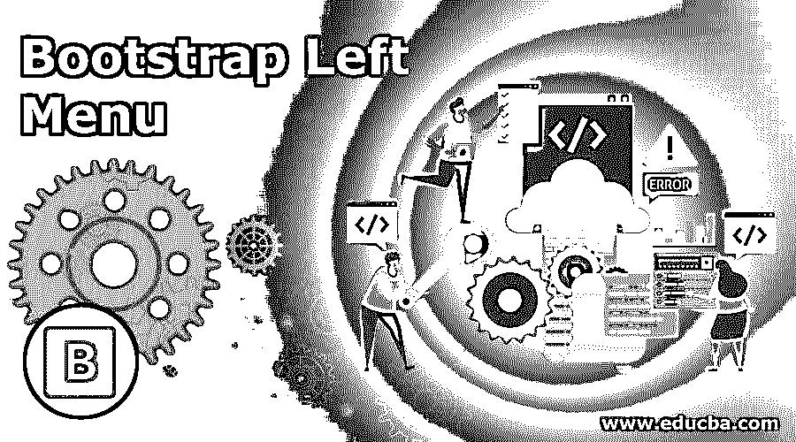
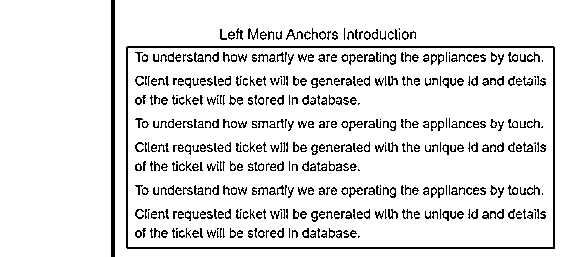
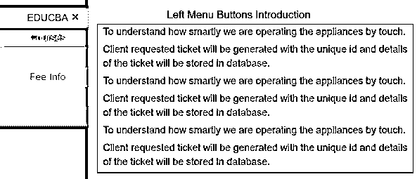
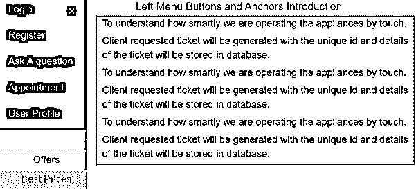

# 引导左侧菜单

> 原文：<https://www.educba.com/bootstrap-left-menu/>




## 引导程序介绍左侧菜单

引导左侧菜单是一个导航菜单。我们可以点击三个等号打开左边的菜单，点击十字标记关闭菜单。我们可以在左侧菜单中添加按钮或锚定标签。左侧菜单用于通过点击按钮或锚定标签立即访问相应的内容。左边的菜单是 nothing，主要是在小屏幕设备上更有用，因为移动屏幕不能有和 PC 一样的空间。较小的设备不显示导航栏，而是显示左侧菜单或右侧菜单来访问所有功能，就像在 PC 中一样。

### 左侧菜单在引导程序中是如何工作的？

这是基于下面的语法。

<small>网页开发、编程语言、软件测试&其他</small>

**语法:**

```
<a href="javascript:void(0)" class="closeButton" onclick="closeLeftMenu()">&times;</a>
☰open
<script>
function openLeftMenu() {
document.getElementById("leftSideMenu").style.width = "255px";
}
function closeLeftMenu() {
document.getElementById("leftSideMenu").style.width = "0";
}
</script>
```

包括在我们的应用程序中，我们必须在应用程序中指定一些预定义的库。他们是

**1。包括视图**

```
<meta name="viewport" content="width=device-width, initial-scale=1">
```

**2。包括 ajax 和 jQuery 库**

```
<script src="https://ajax.googleapis.com/ajax/libs/jquery/3.4.1/jquery.min.js"></script>
```

**3。包括库**

```
<link rel="stylesheet" href="https://maxcdn.bootstrapcdn.com/bootstrap/3.4.1/css/bootstrap.min.css">
```

**4。包括库**

```
<script src="https://maxcdn.bootstrapcdn.com/bootstrap/3.4.1/js/bootstrap.min.js"></script>
```

### 例子

下面是实现左菜单的例子:

#### 1.带有锚定标签的左侧菜单

**代码:**

```
<!DOCTYPE html>
<html>
<head>
<title>Left Menu</title>
<head>
<meta charset="utf-8">
<meta name="viewport" content="width=device-width, initial-scale=1">
<link rel="stylesheet"
href="https://maxcdn.bootstrapcdn.com/bootstrap/3.4.1/css/bootstrap.min.css">
<script
src="https://ajax.googleapis.com/ajax/libs/jquery/3.4.1/jquery.min.js"></script>
<script
src="https://maxcdn.bootstrapcdn.com/bootstrap/3.4.1/js/bootstrap.min.js"></script>
<link rel="stylesheet" href="LeftMenuIntroduction.css">
</head>
<body>
<div id="leftSideMenu" class="leftSideMenuNav">
<a href="javascript:void(0)" class="closeButton"
onclick="closeLeftMenu()">&times;</a>
<a href="#">SBI Bank</a> <a
href="#">Account</a>
<a href="#">Transfer</a>
<a href="#">Appointment</a>
<a href="#">User Profile</a>
</div>
☰
open
<h2>Left Menu Anchors Introduction</h2>
<div class="container">
<p>To understand how smartly we are operating the appliances by
touch.</p>
<p>Client requested ticket will be generated with the unique id
and details of the ticket will be stored in database.</p>
<p>To understand how smartly we are operating the appliances by
touch.</p>
<p>Client requested ticket will be generated with the unique id
and details of the ticket will be stored in database.</p>
<p>To understand how smartly we are operating the appliances by
touch.</p>
<p>Client requested ticket will be generated with the unique id
and details of the ticket will be stored in database.</p>
</div>
<script>
function openLeftMenu() {
document.getElementById("leftSideMenu").style.width = "255px";
}
function closeLeftMenu() {
document.getElementById("leftSideMenu").style.width = "0";
}
</script>
</body>
</html>
```

**CSS 代码:** LeftMenuIntroduction.css

```
h2 {
color: red;
text-align: center;
}
.container
{
border-style: solid;
border-width: 2px;
border-color:maroon;
color: olive;
font-size: 28px;
width: 900px;
margin-left: 280px;
}
.leftSideMenuNav {
background-color: brown;
overflow-x: hidden;
transition: 0.45s;
z-index: 1;
top: 0;
left: 0;
padding-top: 60px;
height: 100%;
width: 0;
position: fixed;
}
.leftSideMenuNav a {
padding: 7px 7px 7px 31px;
text-decoration: none;
display: block;
transition: 0.4s;
font-size: 28px;
color: green;
transition: 0.3s;
}
.leftSideMenuNav a:hover {
color: blue;
}
.leftSideMenuNav .closeButton {
position: absolute;
top: 1;
font-size: 37px;
margin-left : 51px;
right: 26px;
margin-left: 51px;
}
@media screen and (max-height: 452px) {
.leftSideMenuNav {
padding-top: 16px;
}
.leftSideMenuNav a {
font-size: 19px;
}
}
```

**输出:**




#### 2.带按钮的左侧菜单

**代号:**LeftMenuButtons.html

```
<!DOCTYPE html>
<html>
<head>
<title>Left Menu</title>
<head>
<meta charset="utf-8">
<meta name="viewport" content="width=device-width, initial-scale=1">
<link rel="stylesheet"
href="https://maxcdn.bootstrapcdn.com/bootstrap/3.4.1/css/bootstrap.min.css">
<script
src="https://ajax.googleapis.com/ajax/libs/jquery/3.4.1/jquery.min.js"></script>
<script
src="https://maxcdn.bootstrapcdn.com/bootstrap/3.4.1/js/bootstrap.min.js"></script>
<link rel="stylesheet" href="LeftMenuButtons.css">
</head>
<body>
<div id="leftSideMenu" class="leftSideMenuNav">
<a href="javascript:void(0)" class="closeButton"
onclick="closeLeftMenu()">&times;</a>
<button type="button" class="btn btn-default">EDUCBA</button>
<button type="button" class="btn btn-primary">Courses</button>
<button type="button" class="btn btn-success">Join A Course</button>
<button type="button" class="btn btn-info">Fee Info</button>
<button type="button" class="btn btn-success">Faculty</button>
<button type="button" class="btn btn-danger">About EDUCBA</button>
</div>
☰
open
<h2>Left Menu Buttons Introduction</h2>
<div class="container">
<p>To understand how smartly we are operating the appliances by
touch.</p>
<p>Client requested ticket will be generated with the unique id
and details of the ticket will be stored in database.</p>
<p>To understand how smartly we are operating the appliances by
touch.</p>
<p>Client requested ticket will be generated with the unique id
and details of the ticket will be stored in database.</p>
<p>To understand how smartly we are operating the appliances by
touch.</p>
<p>Client requested ticket will be generated with the unique id
and details of the ticket will be stored in database.</p>
</div>
<script>
function openLeftMenu() {
document.getElementById("leftSideMenu").style.width = "255px";
}
function closeLeftMenu() {
document.getElementById("leftSideMenu").style.width = "0";
}
</script>
</body>
</html>
```

**CSS 代码:** LeftMenuButtons.css

```
h2 {
color: blue;
text-align: center;
}
button {
width: 100%;
}
.container
{
border-style: solid;
border-width: 2px;
border-color:fuchsia;
color: green;
font-size: 28px;
width: 900px;
margin-left: 280px;
}
.leftSideMenuNav {
background-color: maroon;
overflow-x: hidden;
transition: 0.45s;
z-index: 1;
top: 0;
left: 0;
padding-top: 60px;
height: 100%;
width: 0;
position: fixed;
}
.leftSideMenuNav button {
padding: 7px 7px 7px 31px;
text-decoration: none;
display: block;
transition: 0.4s;
font-size: 28px;
color: orange;
transition: 0.3s;
}
.leftSideMenuNav a:hover {
color: red;
}
.leftSideMenuNav .closeButton {
position: absolute;
top: 1;
font-size: 37px;
margin-left : 51px;
right: 26px;
margin-left: 51px;
}
@media screen and (max-height: 452px) {
.leftSideMenuNav {
padding-top: 16px;
}
.leftSideMenuNav a {
font-size: 19px;
}
}
```

**输出:**




#### 3.带有按钮和锚点的左侧菜单

**代码:**

```
<!DOCTYPE html>
<html>
<head>
<title>Left Menu</title>
<head>
<meta charset="utf-8">
<meta name="viewport" content="width=device-width, initial-scale=1">
<link rel="stylesheet"
href="https://maxcdn.bootstrapcdn.com/bootstrap/3.4.1/css/bootstrap.min.css">
<script
src="https://ajax.googleapis.com/ajax/libs/jquery/3.4.1/jquery.min.js"></script>
<script
src="https://maxcdn.bootstrapcdn.com/bootstrap/3.4.1/js/bootstrap.min.js"></script>
<link rel="stylesheet" href="LeftMenuButtonsAnchors.css">
</head>
<body>
<div id="leftSideMenu" class="leftSideMenuNav">
<a href="javascript:void(0)" class="closeButton"
onclick="closeLeftMenu()">&times;</a>
<a href="#">Login</a><br>
<a href="#">Register</a><br>
<a href="#">Ask A question</a><br>
<a href="#">Appointment</a><br>
<a href="#">User Profile</a><br>
<button type="button" class="btn btn-primary">EDUCBA Courses</button>
<button type="button" class="btn btn-success">Offers</button>
<button type="button" class="btn btn-info">Best Prices</button>
</div>
☰
open
<h2>Left Menu Buttons and Anchors Introduction</h2>
<div class="container">
<p>To understand how smartly we are operating the appliances by
touch.</p>
<p>Client requested ticket will be generated with the unique id
and details of the ticket will be stored in database.</p>
<p>To understand how smartly we are operating the appliances by
touch.</p>
<p>Client requested ticket will be generated with the unique id
and details of the ticket will be stored in database.</p>
<p>To understand how smartly we are operating the appliances by
touch.</p>
<p>Client requested ticket will be generated with the unique id
and details of the ticket will be stored in database.</p>
</div>
<script>
function openLeftMenu() {
document.getElementById("leftSideMenu").style.width = "255px";
}
function closeLeftMenu() {
document.getElementById("leftSideMenu").style.width = "0"
}
</script>
</body>
</html>
```

**CSS 代码:** LeftMenuButtonsAnchors.css

```
h2 {
color: aqua;
text-align: center;
}
button {
width: 100%;
}
.container
{
border-style: solid;
border-width: 2px;
border-color: gray;
color: green;
font-size: 28px;
width: 900px;
margin-left: 280px;
}
.leftSideMenuNav {
background-color: navy;
overflow-x: hidden;
transition: 0.45s;
z-index: 1;
top: 0;
left: 0;
padding-top: 60px;
height: 100%;
width: 0;
position: fixed;
}
.leftSideMenuNav button {
padding: 7px 7px 7px 31px;
text-decoration: none;
display: block;
transition: 0.4s;
font-size: 28px;
color: olive;
transition: 0.3s;
}
.leftSideMenuNav a {
padding: 7px 7px 7px 31px;
text-decoration: none;
display: block;
transition: 0.4s;
font-size: 28px;
color: olive;
transition: 0.3s;
}
.leftSideMenuNav a:hover {
color: purple;
}
.leftSideMenuNav .closeButton {
position: absolute;
top: 1;
font-size: 37px;
margin-left : 51px;
right: 26px;
margin-left: 51px;
}
@media screen and (max-height: 452px) {
.leftSideMenuNav {
padding-top: 16px;
}
.leftSideMenuNav a {
font-size: 19px;
}
}
```

**输出:**




### 结论

引导程序中的左侧菜单，用于通过单击按钮或锚定标签立即访问内容。默认情况下，应用程序是响应式的，这意味着根据屏幕大小自动调整内容。左侧菜单对于较小的屏幕设备非常有用。

### 推荐文章

这是引导左侧菜单的指南。这里我们讨论语法，它是如何工作的，以及用正确的代码和输出实现的例子。您也可以浏览我们的其他相关文章，了解更多信息——

1.  [自助汉堡菜单](https://www.educba.com/bootstrap-hamburger-menu/)
2.  [自举粘性头](https://www.educba.com/bootstrap-sticky-header/)
3.  [引导折叠侧边栏](https://www.educba.com/bootstrap-collapse-sidebar/)
4.  [自举寻呼机](https://www.educba.com/bootstrap-pager/)


