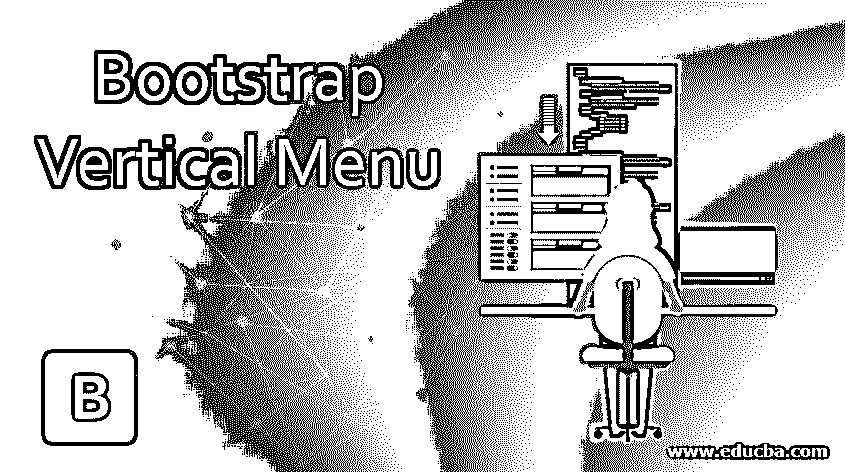
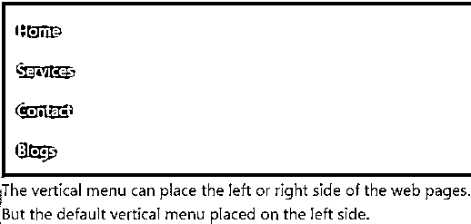

# 引导垂直菜单

> 原文：<https://www.educba.com/bootstrap-vertical-menu/>




## 引导垂直菜单介绍

bootstrap 中的垂直菜单类似于 navbar，但默认的 Navbar 是水平的，垂直菜单垂直放置在网页上。在 Bootstrap4 中，垂直菜单称为侧边栏。bootstrap 中的垂直菜单是固定的，可以根据需要进行响应。垂直菜单可以放在网页的左侧或右侧。但是默认的垂直菜单放在左侧。垂直菜单包含内容标题。如果我们单击联系人菜单，则联系人详细信息将显示在其余页面上。

### 句法

下面的语法是垂直菜单栏。Navbar 和 bg-dark 类用于倒置的垂直条。

<small>网页开发、编程语言、软件测试&其他</small>

**语法#1**

类 nav-link 可以在

```
<nav class ="navbar bg-dark">
<ul class ="navbar-nav">
<li class ="nav-item">
<a  href="#"> Home </a>
</li>
<li class ="nav-item">
<a href="#"> Services </a>
</li>
<li class ="nav-item">
<a  href="#"> Contact </a>
</li>
<li class ="nav-item">
<a  href="#"> Blogs </a>
</li>
</ul>
</nav>
<div class ="container">
The Web Content in details.
</div>
```

**语法#2**

引导网格系统对于引导垂直菜单来说是一种更容易和省时的方法。row 和 col-size 类用于垂直条。看语法理解。

```
<div class="row">
<div class ="col-3">
<nav class ="navbar bg-dark">
<ul class ="nav navbar-nav">
<li class ="nav-item">
<a class ="nav-link" href="#"> Home </a>
</li>
<li class ="nav-item">
<a class ="nav-link" href="#"> Services </a>
</li>
<li class ="nav-item">
<a class ="nav-link" href="#"> Contact </a>
</li>
<li class ="nav-item">
<a class ="nav-link" href="#"> Blogs </a>
</li>
</ul>
</nav>
</div>
<div class="col-9">
The Web Content in detail.
</div>
</div>
```

### 如何创建垂直菜单？

下面我们将学习如何创建垂直菜单:

#### 示例#1

bootstrap 中的基本垂直菜单仅基于。导航类。在

**代码:**

```
<!DOCTYPE>
<html>
<head>
<title> Vertical Menu </title>
<meta name ="viewport" content ="width=device-width, initial-scale=1">
<link rel="stylesheet" href="https://maxcdn.bootstrapcdn.com/bootstrap/4.4.1/css/bootstrap.min.css">
<script src ="https://ajax.googleapis.com/ajax/libs/jquery/3.4.1/jquery.min.js"></script>
<script src ="https://maxcdn.bootstrapcdn.com/bootstrap/4.4.1/js/bootstrap.min.js"></script>
</head>
<body>
<nav class ="navbar bg-dark">
<ul class ="nav navbar-nav">
<li class ="nav-item">
<a class ="nav-link" href="#"> Home </a>
</li>
<li class ="nav-item">
<a class ="nav-link" href="#"> Services </a>
</li>
<li class ="nav-item">
<a class ="nav-link" href="#"> Contact </a>
</li>
<li class ="nav-item">
<a class ="nav-link" href="#"> Blogs </a>
</li>
</ul>
</nav>
<div class ="container">
<p> The vertical menu can place the left or right side of the web pages. <br> But the default vertical menu placed on the left side. </P>
</div>
</body>
</html>
```

**输出:**




**说明:**bootstrap 中默认的垂直菜单占用空间，否则我们需要使用 collapse 类。为了克服这个缺点，自举使用网格系统。它在垂直方向上是固定的，同时也是响应性的工作，并管理网页的空间。

#### 实施例 2

要了解更多关于竖条的信息，请展示下面的例子。

**代码:**

```
<!DOCTYPE>
<html>
<head>
<title> Vertical Menu </title>
<meta name ="viewport" content ="width=device-width, initial-scale=1">
<link rel="stylesheet" href="https://maxcdn.bootstrapcdn.com/bootstrap/4.4.1/css/bootstrap.min.css">
<script src ="https://ajax.googleapis.com/ajax/libs/jquery/3.4.1/jquery.min.js"></script>
<script src ="https://maxcdn.bootstrapcdn.com/bootstrap/4.4.1/js/bootstrap.min.js"></script>
</head>
<body>
<div class="row">
<div class="col-3">
<nav class ="navbar bg-dark">
<ul class ="nav navbar-nav">
<li class ="nav-item">
<a class ="nav-link" href="#"> Home </a>
</li>
<li class ="nav-item">
<a class ="nav-link" href="#"> Services </a>
</li>
<li class ="nav-item">
<a class ="nav-link" href="#"> Contact </a>
</li>
<li class ="nav-item">
<a class ="nav-link" href="#"> Blogs </a>
</li>
</ul>
</nav>
</div>
<div class="col-9">
<div class="container">
The Web Content in detail.
</div>
<div class ="container">
<p> The vertical menu can place the left or right side of the web pages. <br> But the default vertical menu placed on the left side. </P>
</div>
</div>
</div>
</body>
</html>
```

**输出:**


**解释:**我们正在使用上面的示例网格系统。该列分为 col-3 和 col-9 两部分，以获得垂直栏。垂直导航条放在第三栏的网格中，其他网络应用[放在第九栏的区域中。](https://www.educba.com/what-is-web-application/)

### 例子

以下是垂直菜单的示例:

#### 示例#1

引导程序中基本的左侧垂直菜单如下。这是用网格系统创建的默认垂直菜单栏。

**代码:**

```
<!DOCTYPE>
<html>
<head>
<title> Vertical Menu </title>
<meta name ="viewport" content ="width=device-width, initial-scale=1">
<link rel="stylesheet" href="https://maxcdn.bootstrapcdn.com/bootstrap/4.4.1/css/bootstrap.min.css">
<script src ="https://ajax.googleapis.com/ajax/libs/jquery/3.4.1/jquery.min.js"></script>
<script src ="https://maxcdn.bootstrapcdn.com/bootstrap/4.4.1/js/bootstrap.min.js"></script>
</head>
<body>
<div class="row">
<div class="col-3">
<nav class ="navbar bg-light">
<ul class ="nav navbar-nav">
<li class ="nav-item">
<a class ="nav-link" href="#"> Home </a>
</li>
<li class ="nav-item">
<a class ="nav-link" href="#"> Services </a>
</li>
<li class ="nav-item">
<a class ="nav-link" href="#"> Contact </a>
</li>
<li class ="nav-item">
<a class ="nav-link" href="#"> Blogs </a>
</li>
</ul>
</nav>
</div>
<div class="col-9">
<div class="container">
The Web Content in detail.
</div>
<div class ="container">
<p> The vertical menu can place the left or right side of the web pages. <br> But the default vertical menu placed on the left side. </P>
</div>
</div>
</div>
</body>
</html>
```

**输出:**


#### 实施例 2

垂直菜单位于网页的右侧。点击按钮后，屏幕上显示垂直菜单。这看起来既生动又优雅。这种垂直菜单很吸引人，而且节省空间。

**代码:**

```
<!DOCTYPE>
<html>
<head>
<title> Vertical Menu </title>
<meta name ="viewport" content ="width=device-width, initial-scale=1">
<link rel="stylesheet" href="https://maxcdn.bootstrapcdn.com/bootstrap/4.4.1/css/bootstrap.min.css">
<script src ="https://ajax.googleapis.com/ajax/libs/jquery/3.4.1/jquery.min.js"></script>
<script src ="https://maxcdn.bootstrapcdn.com/bootstrap/4.4.1/js/bootstrap.min.js"></script>
</head>
<body>
<div class="row">
<div class="col-9">
<div class="container">
The Web Content in detail.
</div>
<div class ="container">
<p> The vertical menu can place the left or right side of the web pages. <br> But the default vertical menu placed on the left side. </P>
</div>
</div>
<div class="col-3">
<nav class ="navbar bg-light">
<ul class ="nav navbar-nav">
<li class ="nav-item">
<a class ="nav-link" href="#"> Home </a>
</li>
<li class ="nav-item">
<a class ="nav-link" href="#"> Services </a>
</li>
<li class ="nav-item">
<a class ="nav-link" href="#"> Contact </a>
</li>
<li class ="nav-item">
<a class ="nav-link" href="#"> Blogs </a>
</li>
</ul>
</nav>
</div>
</div>
</body>
</html>
```

**输出:**


#### 实施例 3

下面的垂直菜单使用折叠类进行响应。

**代码:**

```
<!DOCTYPE>
<html>
<head>
<title> Vertical Menu </title>
<meta name ="viewport" content ="width=device-width, initial-scale=1">
<link rel="stylesheet" href="https://maxcdn.bootstrapcdn.com/bootstrap/4.4.1/css/bootstrap.min.css">
<script src ="https://ajax.googleapis.com/ajax/libs/jquery/3.4.1/jquery.min.js"></script>
<script src ="https://maxcdn.bootstrapcdn.com/bootstrap/4.4.1/js/bootstrap.min.js"></script>
</head>
<body>
<div class="row">
<div class="col-3">
<nav class ="navbar bg-light">
<button class="navbar-toggler" type="button" data-toggle="collapse" data-target="#colp">

</button>
<div class="collapse navbar-collapse" id="colp">
<ul class ="nav navbar-nav">
<li class ="nav-item">
<a class ="nav-link" href="#"> Home </a>
</li>
<li class ="nav-item">
<a class ="nav-link" href="#"> Services </a>
</li>
<li class ="nav-item">
<a class ="nav-link" href="#"> Contact </a>
</li>
<li class ="nav-item">
<a class ="nav-link" href="#"> Blogs </a>
</li>
</ul>
</div>
</nav>
</div>
<div class="col-9">
<div class="container">
The Web Content in detail.
</div>
<div class ="container">
<p> The vertical menu can place the left or right side of the web pages. <br> But the default vertical menu placed on the left side. </P>
</div>
</div>
</div>
</body>
</html>
```

**输出:**


### 结论

开发人员很容易设计垂直菜单。垂直菜单及其详细内容同时显示。因此对用户来说很容易。垂直菜单是有吸引力的，优雅的，并且在网页上的空间易于管理。

### 推荐文章

这是一个引导垂直菜单的指南。这里我们分别用例子讨论基本概念、语法以及如何创建垂直菜单。您也可以浏览我们的其他相关文章，了解更多信息——

1.  [什么是自举？](https://www.educba.com/what-is-bootstrap/)
2.  [引导雕刻图案](https://www.educba.com/bootstrap-glyphicons/)
3.  [引导组件](https://www.educba.com/bootstrap-components/)
4.  [自举表单布局](https://www.educba.com/bootstrap-form/)


