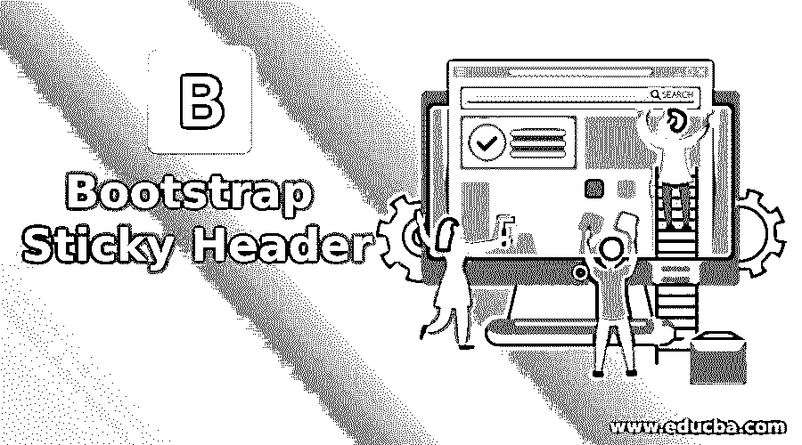
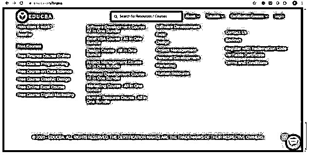
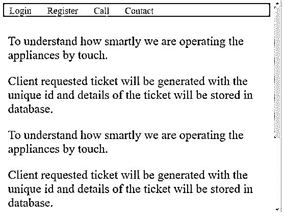
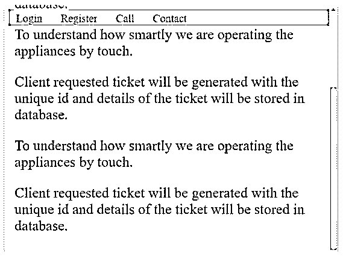

# 自举粘性头

> 原文：<https://www.educba.com/bootstrap-sticky-header/>




## 自举粘滞头简介

当导航条想固定在顶部位置，甚至页面向下滚动到底部时，使用引导程序中的粘性标题。这意味着导航栏总是固定在顶部。现在几乎所有的网站都有一天的粘性标题功能，因为很难从导航栏中选择不同的选项。当我们向下滚动页面时，导航栏无法显示，然后我们必须再次转到顶部并选择选项。这会浪费用户时间，因此开发者在 bootstrap 中提出了粘性头的概念。

**演示:** **前向下滚动到底部**

<small>网页开发、编程语言、软件测试&其他</small>


**向下滚动到底部后:**




*   正如你所看到的，在这两种情况下，导航栏只在顶部。

### 为什么 Bootstrap 超过 HTML？

*   在 HTML 中，开发人员必须编写每一个类、id、链接、按钮等。级联样式。
*   而在 Bootstrap 中，大多数预定义的类、链接和按钮等。使用它们自己的级联样式来降低代码复杂性。

**Note: **Bootstrap files also saved with .html extension.

### Bootstrap 中的 Sticky Header 是如何工作的？

粘性标题就是导航条，如果我们想让导航条粘在顶部(粘性标题)，那么在 JavaScript 文件中使用 offsetTop。

**语法:**

```
var stickyHeader = navbar.offsetTop;
function getMyStickyHeader() {
if (window.pageYOffset >= stickyHeader { // window.pageYOffset takes vertical movement of the page
navbar.classList.add("stickyHeader "); //sticks the navigation bar at top if we scroll the page
} else {
navbar.classList.remove("stickyHeader "); // removes sticky navigation bar feature if we scroll the page to the top
}
}
```

包括引导功能，我们必须在应用程序中指定一些预定义的库。

它们如下:

*   包括引导视图

```
<meta name="viewport" content="width=device-width, initial-scale=1">
```

*   包括 ajax 和 jQuery 库

```
<script src="https://ajax.googleapis.com/ajax/libs/jquery/3.4.1/jquery.min.js"></script>
```

*   包括引导库

```
<link rel="stylesheet" href="https://maxcdn.bootstrapcdn.com/bootstrap/3.4.1/css/bootstrap.min.css">
```

*   包括引导库

```
<script src="https://maxcdn.bootstrapcdn.com/bootstrap/3.4.1/js/bootstrap.min.js"></script>
```

### 引导程序粘性头示例

以下是给出的例子:

#### 示例#1

没有导航类的粘性头示例。

**代码:**

```
<!DOCTYPE html>
<html>
<head>
<meta name="viewport" content="width=device-width, initial-scale=1">
<style>
body {
font-size: 29px;
}
#navbar {
background-color: orange;
}
#navbar a {
color: blue ;
text-align: center;
padding: 12px 15px;
text-decoration: none;
font-size: 22px;
}
.content {
padding: 12px;
}
.stickyHeader {
position: fixed;
width: 100%;
}
</style>
</head>
<body>
<div id="navbar" class="navbar navbar-inverse">
<a class="active" href="javascript:void(0)">Home</a>
<a href="javascript:void(0)">News</a>
<a href="javascript:void(0)">Contact</a>
</div>
<div class="content">
<p>To understand how smartly we are operating the appliances by
touch.</p>
<p>Client requested ticket will be generated with the unique id
and details of the ticket will be stored in database.</p>
<p>To understand how smartly we are operating the appliances by
touch.</p>
<p>Client requested ticket will be generated with the unique id
and details of the ticket will be stored in database.</p>
<p>To understand how smartly we are operating the appliances by
touch.</p>
<p>Client requested ticket will be generated with the unique id
and details of the ticket will be stored in database.</p>
</div>
<script>
window.onscroll = function() {getMyStickyHeader()};
var navbar = document.getElementById("navbar");
var stickyHeader = navbar.offsetTop;
function getMyStickyHeader() {
if (window.pageYOffset >= stickyHeader) {
navbar.classList.add("stickyHeader")
} else {
navbar.classList.remove("stickyHeader");
}
}
</script>
</body>
</html>
```

**输出:**







**说明:**

前滚后滚导航条仍然只在顶部位置。

#### 实施例 2

没有导航类的粘性头示例。

**代码:**

```
<!DOCTYPE html>
<html lang="en">
<head>
<title>Sticky Header</title>
<meta charset="utf-8">
<meta name="viewport" content="width=device-width, initial-scale=1">
<link rel="stylesheet"
href="https://maxcdn.bootstrapcdn.com/bootstrap/3.4.1/css/bootstrap.min.css">
<script
src="https://ajax.googleapis.com/ajax/libs/jquery/3.4.1/jquery.min.js"></script>
<script
src="https://maxcdn.bootstrapcdn.com/bootstrap/3.4.1/js/bootstrap.min.js"></script>
</head>
<style>
body {
font-size: 29px;
}
#navbar a {
text-align: center;
padding: 12px 15px;
text-decoration: none;
font-size: 22px;
}
.content {
padding: 12px;
}
.stickyHeader {
position: fixed;
width: 100%;
}
</style>
<body>
<nav id="navbar" class="navbar navbar-inverse">
<div class="container-fluid">
<ul class="nav navbar-nav">
<li><a href="#">EDCBA Training</a></li>
<li><a href="#">Java Course</a></li>
<li><a href="#">Python Course</a></li>
<li><a href="#">C Course</a></li>
<button type="button">Register</button>
<button type="button">Locate</button>
</ul>
</div>
</nav>
<div class="content">
<p>To understand how smartly we are operating the appliances by
touch.</p>
<p>Client requested ticket will be generated with the unique id
and details of the ticket will be stored in database.</p>
<p>To understand how smartly we are operating the appliances by
touch.</p>
<p>Client requested ticket will be generated with the unique id
and details of the ticket will be stored in database.</p>
<p>To understand how smartly we are operating the appliances by
touch.</p>
<p>Client requested ticket will be generated with the unique id
and details of the ticket will be stored in database.</p>
</div>
<script>
window.onscroll = function() {
getMyStickyHeader()
};
var navbar = document.getElementById("navbar");
var stickyHeader = navbar.offsetTop;
function getMyStickyHeader() {
if (window.pageYOffset >= stickyHeader) {
navbar.classList.add("stickyHeader")
} else {
navbar.classList.remove("stickyHeader");
}
}
</script>
</body>
</html>
```

**输出:**


**说明:**

前滚后滚导航条仍然只在顶部位置。

#### 实施例 3

没有导航类的粘性头示例。

**代码:**

```
<!DOCTYPE html>
<html lang="en">
<head>
<title>Sticky Header</title>
<meta charset="utf-8">
<meta name="viewport" content="width=device-width, initial-scale=1">
<link rel="stylesheet"
href="https://maxcdn.bootstrapcdn.com/bootstrap/3.4.1/css/bootstrap.min.css">
<script
src="https://ajax.googleapis.com/ajax/libs/jquery/3.4.1/jquery.min.js"></script>
<script
src="https://maxcdn.bootstrapcdn.com/bootstrap/3.4.1/js/bootstrap.min.js"></script>
</head>
<style>
body {
font-size: 29px;
}
#navbar a {
text-align: center;
padding: 12px 15px;
text-decoration: none;
font-size: 22px;
}
.content {
padding: 12px;
}
.stickyHeader {
position: fixed;
width: 100%;
}
</style>
<body>
<nav id="navbar" class="navbar navbar-default">
<div class="container-fluid">
<ul class="nav navbar-nav">
<li><a href="#">Account</a></li>
<li><a href="#">Transfer</a></li>
<li><a href="#">Appointment</a></li>
<li><a href="#">User Profile</a></li>
<button type="button" class="btn btn-primary">Login</button>
<button type="button" class="btn btn-danger">Check My Balance</button>
</ul>
</div>
</nav>
<div class="content">
<p>To understand how smartly we are operating the appliances by
touch.</p>
<p>Client requested ticket will be generated with the unique id
and details of the ticket will be stored in database.</p>
<p>To understand how smartly we are operating the appliances by
touch.</p>
<p>Client requested ticket will be generated with the unique id
and details of the ticket will be stored in database.</p>
<p>To understand how smartly we are operating the appliances by
touch.</p>
<p>Client requested ticket will be generated with the unique id
and details of the ticket will be stored in database.</p>
</div>
<script>
window.onscroll = function() {
getMyStickyHeader()
};
var navbar = document.getElementById("navbar");
var stickyHeader = navbar.offsetTop;
function getMyStickyHeader() {
if (window.pageYOffset >= stickyHeader) {
navbar.classList.add("stickyHeader")
} else {
navbar.classList.remove("stickyHeader");
}
}
</script>
</body>
</html>
```

**输出:**


**说明:**

前滚后滚导航条仍然只在顶部位置。

### 结论

粘性标题用于固定顶部的导航栏，即使我们向下滚动页面，也可以访问导航标题的所有元素。

### 推荐文章

这是一个引导粘性头的指南。在这里，我们讨论基本概念，例子，以及如何粘头工作在引导？您也可以看看以下文章，了解更多信息–

1.  [引导组件](https://www.educba.com/bootstrap-components/)
2.  [引导下拉菜单](https://www.educba.com/bootstrap-dropdown-menu/)
3.  [引导响应](https://www.educba.com/bootstrap-responsive/)
4.  [自举徽章](https://www.educba.com/bootstrap-badge/)


