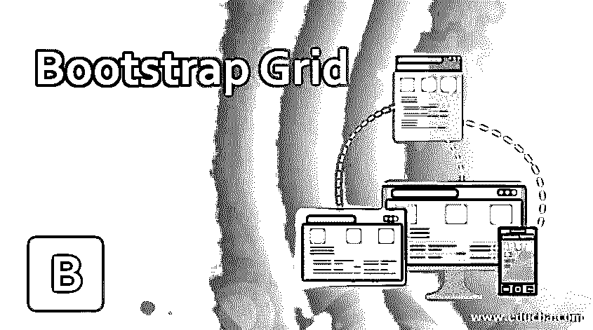

# 自举网格

> 原文：<https://www.educba.com/bootstrap-grid/>




## 引导网格简介

Bootstrap 中的网格被定义为网页上类似盒子的结构(行和列)所占据的面积。每种网络技术和网页都必须被一些网格划分，以精确地对齐元素。它在页面上有 12 列。根据列的大小，我们可以对齐元素。如果我们不想一次或单独使用所有 12 个列，那么我们可以一起使用一些列来创建宽列。根据需要，网格可以垂直或水平划分。调整屏幕大小时，行和列会自动重新排列。因此，引导网格系统在默认情况下是有响应的。

**实时示例:**当我们通过精确的计算并排插入元素的侧面时，网格概念起着至关重要的作用。

<small>网页开发、编程语言、软件测试&其他</small>

### Bootstrap 中网格类的类型

bootstrap 中有 4 个网格类:

*   **MD:** 当屏幕尺寸等于 992 像素或宽度大于 992 像素时使用此型号。示例:用于平板电脑大小的小型笔记本电脑
*   **LG:** 当屏幕尺寸等于 1200 像素或宽度大于 1200 像素时使用此型号。示例:用于笔记本电脑和台式机
*   当屏幕尺寸等于 768 像素或宽度大于 768 像素时，使用此型号。示例:用于平板电脑
*   **XS:** 当屏幕尺寸小于 768 像素宽时使用这种型号。示例:用于移动电话

**Note:** All the above types are used for more responsive and dynamic pages on those devices.

### 网格在 Bootstrap 中是如何工作的？

它基于任何 HTML 标记的 class 属性中给定的值工作或可以完成。

**语法:**

```
<div class="row">
<div class="col-*-*"></div>
<div class="col-*-*"></div>
</div>
<div class="row">
<div class="col-*-*"></div>
<div class="col-*-*"></div>
<div class="col-*-*"></div>
</div>
<div class="row">
...
</div>
```

**说明:**首先我们要创建一个具有 class="row "属性的行。然后，使用 class="col-*-* "属性添加所需数量的列。

**Note:** We can take up to 12 columns in each row with class=” col-*-*” attribute.

包括引导功能，我们必须在应用程序中指定一些预定义的库。它们是:

**1。包括引导视图**

```
<meta name="viewport" content="width=device-width, initial-scale=1">
```

**2。包括 ajax 和 jQuery 库**

```
<script src="https://ajax.googleapis.com/ajax/libs/jquery/3.4.1/jquery.min.js"></script>
```

**3。包括引导库**

```
<link rel="stylesheet" href="https://maxcdn.bootstrapcdn.com/bootstrap/3.4.1/css/bootstrap.min.css">
```

**4。包括引导库**

```
<script src="https://maxcdn.bootstrapcdn.com/bootstrap/3.4.1/js/bootstrap.min.js"></script>
```

### 引导网格示例

以下是引导网格的示例:

#### 1.一排十二个格子

**代码:**

```
<!DOCTYPE html>
<html lang="en">
<head>
<title>Grid Example</title>
<meta charset="utf-8">
<meta name="viewport" content="width=device-width, initial-scale=1">
<link rel="stylesheet"
href="https://maxcdn.bootstrapcdn.com/bootstrap/3.4.1/css/bootstrap.min.css">
<script
src="https://ajax.googleapis.com/ajax/libs/jquery/3.4.1/jquery.min.js"></script>
<script
src="https://maxcdn.bootstrapcdn.com/bootstrap/3.4.1/js/bootstrap.min.js"></script>
<!-- CSS Styles -->
<style type="text/css">
h1 {
color: green;
}
p {
color: brown;
background: orange;
border: 2 solid pink;
font-size: 20px;
}
#a1 {
color: white;
background: brown;
font-size: 20px;
}
#a2 {
color: white;
background: gray;
font-size: 20px;
}
#a3 {
color: white;
background: aqua;
font-size: 20px;
}
#a4 {
color: white;
background: purple;
font-size: 20px;
}
#a5 {
color: white;
background: gray;
font-size: 20px;
}
#a6 {
color: white;
background: maroon;
font-size: 20px;
}
#a7 {
color: white;
background: navy;
font-size: 20px;
}
#a8 {
color: white;
background: lime;
font-size: 20px;
}
#a9 {
color: white;
background: orange;
font-size: 20px;
}
#a10 {
color: white;
background: yellow;
font-size: 20px;
}
#a11 {
color: white;
background: teal;
font-size: 20px;
}
#a12 {
color: white;
background: blue;
font-size: 20px;
}
</style>
</head>
<body>
<div class="container-fluid">
<!-- class="container-fluid" provides full width page -->
<h1>Demonstrate 12 grids in a column</h1>
<div class="row">
<div id="a1" class="col-sm-1"">Grid 1</div>
<div id="a2" class="col-sm-1"">Grid 2</div>
<div id="a3" class="col-sm-1"">Grid 3</div>
<div id="a4" class="col-sm-1"">Grid 4</div>
<div id="a5" class="col-sm-1"">Grid 5</div>
<div id="a6" class="col-sm-1"">Grid 6</div>
<div id="a7" class="col-sm-1"">Grid 7</div>
<div id="a8" class="col-sm-1"">Grid 8</div>
<div id="a9" class="col-sm-1"">Grid 9</div>
<div id="a10" class="col-sm-1"">Grid 10</div>
<div id="a11" class="col-sm-1"">Grid 11</div>
<div id="a12" class="col-sm-1"">Grid 12</div>
</div>
</div>
</body>
</html>
```

**输出:**


**解释:**上例的第一点是，对于笔记本电脑，我们使用“sm”表示柱网。第二点是我们在一列中只有 12 个网格。

#### 2.将 4 个网格添加到单个网格中

**代码:**

```
<!DOCTYPE html>
<html lang="en">
<head>
<title>Grid Example</title>
<meta charset="utf-8">
<meta name="viewport" content="width=device-width, initial-scale=1">
<link rel="stylesheet"
href="https://maxcdn.bootstrapcdn.com/bootstrap/3.4.1/css/bootstrap.min.css">
<script
src="https://ajax.googleapis.com/ajax/libs/jquery/3.4.1/jquery.min.js"></script>
<script
src="https://maxcdn.bootstrapcdn.com/bootstrap/3.4.1/js/bootstrap.min.js"></script>
<!-- CSS Styles -->
<style type="text/css">
h1 {
color: green;
}
p {
color: brown;
background: orange;
border: 2 solid pink;
font-size: 20px;
}
#a1 {
color: white;
background: brown;
font-size: 20px;
}
#a2 {
color: white;
background: gray;
font-size: 20px;
}
#a3 {
color: white;
background: aqua;
font-size: 20px;
}
#a4 {
color: white;
background: purple;
font-size: 20px;
}
</style>
</head>
<body>
<div class="container-fluid">
<!-- class="container-fluid" provides full width page -->
<h1>Introduction to adding 4 grids into single entity</h1>
<p>Bootstrap Grid has 12 columns across the page. Based on the
columns size we can align the elements.</p>
<p>If we don't want to use all 12 columns at a time or
individually then we can use some of the columns together to create
broad columns.</p>
<div class="row">
<div id="a1" class="col-sm-3"">Adding 1-3 grids into single
grid</div>
<div id="a2" class="col-sm-3">Adding 4-6 grids into single grid</div>
<div id="a3" class="col-sm-3">Adding 7-9 grids into single grid</div>
<div id="a4" class="col-sm-3">Adding 10-12 grids into single
grid</div>
</div>
</div>
</body>
</html>
```

**输出:**


#### 3.不均匀网格

**代码:**

```
<!DOCTYPE html>
<html lang="en">
<head>
<title>Grid Example</title>
<meta charset="utf-8">
<meta name="viewport" content="width=device-width, initial-scale=1">
<link rel="stylesheet"
href="https://maxcdn.bootstrapcdn.com/bootstrap/3.4.1/css/bootstrap.min.css">
<script
src="https://ajax.googleapis.com/ajax/libs/jquery/3.4.1/jquery.min.js"></script>
<script
src="https://maxcdn.bootstrapcdn.com/bootstrap/3.4.1/js/bootstrap.min.js"></script>
<!-- CSS Styles -->
<style type="text/css">
h1 {
color: green;
}
#a1 {
color: white;
background: olive;
font-size: 20px;
}
#a2 {
color: white;
background: maroon;
font-size: 20px;
}
#a3 {
color: white;
background: fuchsia;
font-size: 20px;
}
</style>
</head>
<body>
<div class="container-fluid">
<!-- class="container-fluid" provides full width page -->
<h1>Demo Unequal Area Grids</h1>
<div class="row">
<div id="a1" class="col-sm-3"">Adding 1-3 grids into single
grid</div>
<div id="a2" class="col-sm-4">Adding 4-7 grids into single grid</div>
<div id="a3" class="col-sm-5">Adding 8-12 grids into single
grid</div>
</div>
</div>
</body>
</html>
```

**输出:**


**解释:**我们可以看到所有的网格都有不同的大小。

#### 4.两行网格

**代码:**

```
<!DOCTYPE html>
<html lang="en">
<head>
<title>Grid Example</title>
<meta charset="utf-8">
<meta name="viewport" content="width=device-width, initial-scale=1">
<link rel="stylesheet"
href="https://maxcdn.bootstrapcdn.com/bootstrap/3.4.1/css/bootstrap.min.css">
<script
src="https://ajax.googleapis.com/ajax/libs/jquery/3.4.1/jquery.min.js"></script>
<script
src="https://maxcdn.bootstrapcdn.com/bootstrap/3.4.1/js/bootstrap.min.js"></script>
<!-- CSS Styles -->
<style type="text/css">
h1 {
color: green;
}
#a1 {
color: white;
background: olive;
font-size: 20px;
}
#a2 {
color: white;
background: maroon;
font-size: 20px;
}
#a3 {
color: white;
background: fuchsia;
font-size: 20px;
}
#a4 {
color: white;
background:  purple;
font-size: 20px;
}
#a5 {
color: white;
background: red;
font-size: 20px;
}
#a6 {
color: white;
background: silver;
font-size: 20px;
}
</style>
</head>
<body>
<div class="container-fluid">
<!-- class="container-fluid" provides full width page -->
<h1>Demo Unequal Area Grids</h1>
<div class="row">
<div id="a1" class="col-sm-3"">Adding 1-3 grids</div>
<div id="a2" class="col-sm-4">Adding 4-7 grids</div>
<div id="a3" class="col-sm-5">Adding 8-12 grids</div>
</div>
<div class="row">
<div id="a4" class="col-sm-2"">Adding 1-2 grids</div>
<div id="a5" class="col-sm-6">Adding 3-8 grids</div>
<div id="a6" class="col-sm-4">Adding 9-12 grids</div>
</div>
</div>
</body>
</html>
```

**输出:**


### 结论

每行只有 12 列。我们可以根据需要添加任意数量的网格，也可以在多行中添加不同大小的网格。

### 推荐文章

这是一个引导网格的指南。在这里，我们讨论了 bootstrap grid 的基本概念、类型、工作原理、特性以及带有适当代码和输出的示例。您也可以浏览我们的其他相关文章，了解更多信息——

1.  [自举网格系统](https://www.educba.com/bootstrap-grid-system/)
2.  [引导命令](https://www.educba.com/bootstrap-commands/)
3.  [引导下拉菜单](https://www.educba.com/bootstrap-dropdown-menu/)
4.  [引导响应](https://www.educba.com/bootstrap-responsive/)


