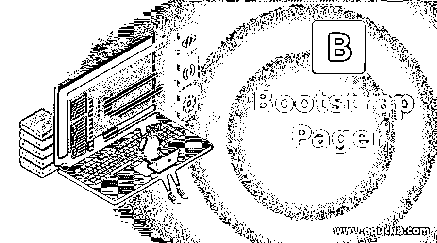
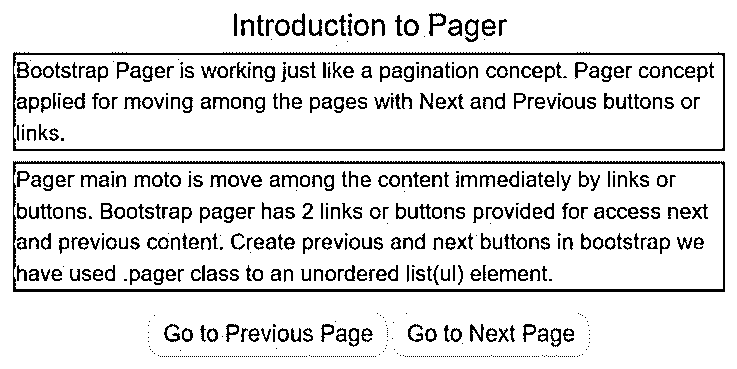
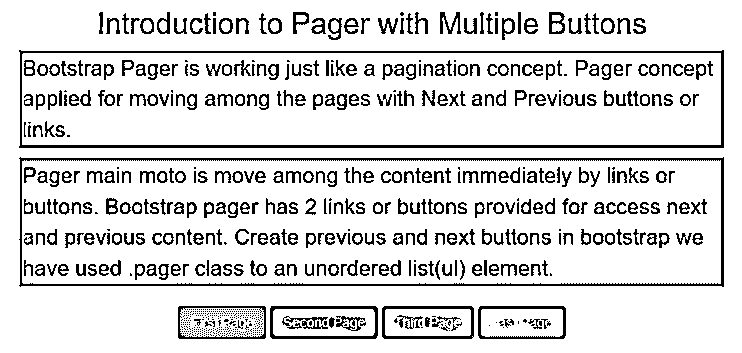
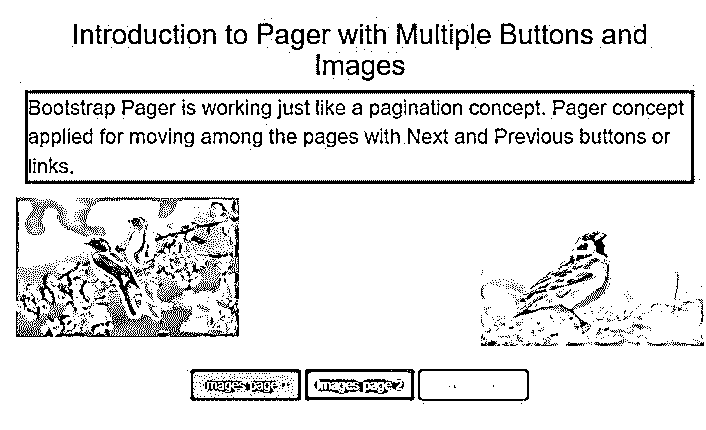

# 引导寻呼机

> 原文：<https://www.educba.com/bootstrap-pager/>




## 引导寻呼机简介

引导分页器的工作原理就像分页概念一样。应用于在具有下一页和上一页按钮或链接的页面间移动的分页器概念。寻呼机的主要功能是通过链接或按钮在内容之间快速移动。它有 2 个链接或按钮提供访问下一个和上一个内容。在我们使用的引导程序中创建上一个和下一个按钮。分页类添加到无序列表(

### 为什么 Bootstrap 超过 HTML？

*   在 HTML 开发人员需要为每个 id，链接，类，按钮等写所有的样式。
*   在 bootstrap 的情况下，我们有所有预定义的类来获得默认样式，这比我们的自定义逻辑更准确。通过使用 bootstrap 预定义的类，我们可以节省编写 CSS 样式的时间。

**Note: **In general we are using .html extension for saving bootstrap files. Because bootstrap also extended from HTML.

### 我们为什么要使用自举寻呼机？

**实时场景:**

<small>网页开发、编程语言、软件测试&其他</small>

*   让我们以亚马逊网站或 Flipkart 网站为例，展示它们数据库中的可用产品。假设他们有 100 万件产品。如果他们试图一次展示所有的商品，顾客必须等待更多的时间，比如一天才能看到所有的商品清单。

我们应该如何处理这种情况？

*   我们可以使用链接按钮列表一次显示 50 到 100 个项目，而不是一次显示所有项目。如果客户对前 50 到 100 件产品不满意，那么他将转向下 50 到 100 件产品，以此类推。这个概念被称为寻呼机。

**寻呼机语法:**

```
<ul class="pager"> //bootstrap default class for pager
<li><a href="#">Go Back to Previous Page</a></li>
<li><a href="#">Go Next Page</a></li>
</ul>
```

*   在应用程序中访问所有预定义的引导类时，我们必须在代码中使用一些预定义的引导库。

它们是以下一种:

**1。包括引导视图**

```
<meta name="viewport" content="width=device-width, initial-scale=1">
```

**2。包括 ajax 和 jQuery 库**

```
<script src="https://ajax.googleapis.com/ajax/libs/jquery/3.4.1/jquery.min.js"></script>
```

**3。包括引导库**

```
<link rel="stylesheet" href="https://maxcdn.bootstrapcdn.com/bootstrap/3.4.1/css/bootstrap.min.css">
```

**4。包括引导库**

```
<script src="https://maxcdn.bootstrapcdn.com/bootstrap/3.4.1/js/bootstrap.min.js"></script>
```

### 例子

下面是一些例子:

#### 示例#1

上一页和下一页链接页。

**代码:**

```
<!DOCTYPE html>
<html>
<head>
<meta charset="ISO-8859-1">
<title>Pager</title>
<meta charset="utf-8">
<meta name="viewport" content="width=device-width, initial-scale=1">
<link rel="stylesheet"
href="https://maxcdn.bootstrapcdn.com/bootstrap/3.4.1/css/bootstrap.min.css">
<script
src="https://ajax.googleapis.com/ajax/libs/jquery/3.4.1/jquery.min.js"></script>
<script
src="https://maxcdn.bootstrapcdn.com/bootstrap/3.4.1/js/bootstrap.min.js"></script>
```

**CSS 代码**

```
<style>
h2 {
color: red;
text-align: center;
}
p {
color: green;
font-size: 22px;
border-style: solid;
border-color: violet;
}
a {
color: brown;
font-size: 23px;
}
</style>
</head>
<body>
<div class="container">
<h2>Introduction to Pager</h2>
<p>Bootstrap Pager is working just like a pagination concept.
Pager concept applied for moving among the pages with Next and
Previous buttons or links.
<p>Pager main moto is move among the content immediately by links
or buttons. Bootstrap pager has 2 links or buttons provided for
access next and previous content. Create previous and next buttons in
bootstrap we have used .pager class to an unordered list(ul) element.</p>
<ul class="pager">
<li><a href="https://www.educba.com/">Go to Previous Page</a></li>
<li><a
href="https://www.educba.com/category/software-development/software-development-tutorials/java-tutorial/">Go
to Next Page</a></li>
</ul>
</div>
</body>
</html>
```

**输出:**




**说明:**

*   从上面的输出中，我们可以得出结论，pager 通过 bootstrap 的默认值为 2 个链接提供默认样式。

#### 实施例 2

带按钮的寻呼机。

**代码:**

```
<!DOCTYPE html>
<html>
<head>
<meta charset="ISO-8859-1">
<title>Pager</title>
<meta charset="utf-8">
<meta name="viewport" content="width=device-width, initial-scale=1">
<link rel="stylesheet"
href="https://maxcdn.bootstrapcdn.com/bootstrap/3.4.1/css/bootstrap.min.css">
<script
src="https://ajax.googleapis.com/ajax/libs/jquery/3.4.1/jquery.min.js"></script>
<script
src="https://maxcdn.bootstrapcdn.com/bootstrap/3.4.1/js/bootstrap.min.js"></script>
```

**CSS 代码**

```
<style>
h2 {
color: navy;
text-align: center;
}
p {
color: maroon;
font-size: 22px;
border-style: solid;
border-color: blue;
}
</style>
</head>
<body>
<div class="container">
<h2>Introduction to Pager with Multiple Buttons</h2>
<p>Bootstrap Pager is working just like a pagination concept.
Pager concept applied for moving among the pages with Next and
Previous buttons or links.
<p>Pager main moto is move among the content immediately by links
or buttons. Bootstrap pager has 2 links or buttons provided for
access next and previous content. Create previous and next buttons in
bootstrap we have used .pager class to an unordered list(ul) element.</p>
<ul class="pager">
<li><button type="button" class="btn btn-primary">First
Page</button></li>
<li><button type="button" class="btn btn-success">Second
Page</button></li>
<li><button type="button" class="btn btn-warning">Third
Page</button></li>
<li><button type="button" class="btn btn-danger">Last
Page</button></li>
</ul>
</div>
</body>
</html>
```

**输出:**




**说明:**

*   从上面的输出中，我们可以得出结论，pager 通过 bootstrap 的默认值为 4 个按钮提供默认样式。

#### 实施例 3

带有按钮和图像的寻呼机。

**代码:**

```
<!DOCTYPE html>
<html>
<head>
<meta charset="ISO-8859-1">
<title>Pager</title>
<meta charset="utf-8">
<meta name="viewport" content="width=device-width, initial-scale=1">
<link rel="stylesheet"
href="https://maxcdn.bootstrapcdn.com/bootstrap/3.4.1/css/bootstrap.min.css">
<script
src="https://ajax.googleapis.com/ajax/libs/jquery/3.4.1/jquery.min.js"></script>
<script
src="https://maxcdn.bootstrapcdn.com/bootstrap/3.4.1/js/bootstrap.min.js"></script>
```

**CSS 代码:**

```
<style>
h2 {
color: navy;
text-align: center;
}
p {
color: maroon;
font-size: 22px;
border-style: solid;
border-color: blue;
}
* {
box-sizing: border-box;
}
.row {
display: flex;
}
.column {
flex: 33.33%;
padding: 5px;
}
</style>
</head>
<body>
<div class="container">
<h2>Introduction to Pager with Multiple Buttons and Images</h2>
<p>Bootstrap Pager is working just like a pagination concept.
Pager concept applied for moving among the pages with Next and
Previous buttons or links.</p>
<div class="row">
<div class="column">

</div>
<div class="column"></div>
<div class="column">

</div>
</div>
<ul class="pager">
<li><button type="button" class="btn btn-primary">Images
page 1</button></li>
<li><button type="button" class="btn btn-success">Images
page 2</button></li>
<li><button type="button" class="btn btn-warning">Images
page 3</button></li>
</ul>
</div>
</body>
</html>
```

**输出:**




**说明:**

*   根据上面的输出，我们可以得出结论，pager 通过 bootstrap 的默认值为 3 个按钮图像提供默认样式。

### 结论

它就像一个分页，用于通过按钮或所有页面之间的链接来访问内容。寻呼机可以通过。bootstrap 中的 pager 类，为链接和按钮提供默认样式。

### 推荐文章

这是一个引导页的指南。在这里，我们讨论介绍，为什么引导 HTML，为什么我们使用引导页，以及例子。您也可以看看以下文章，了解更多信息–

1.  [自举折叠](https://www.educba.com/bootstrap-collapse/)
2.  [引导垂直菜单](https://www.educba.com/bootstrap-vertical-menu/)
3.  [引导雕刻图案](https://www.educba.com/bootstrap-glyphicons/)
4.  引导程序中的[复选框](https://www.educba.com/checkbox-in-bootstrap/)


