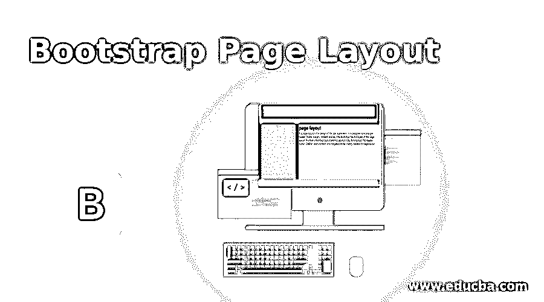
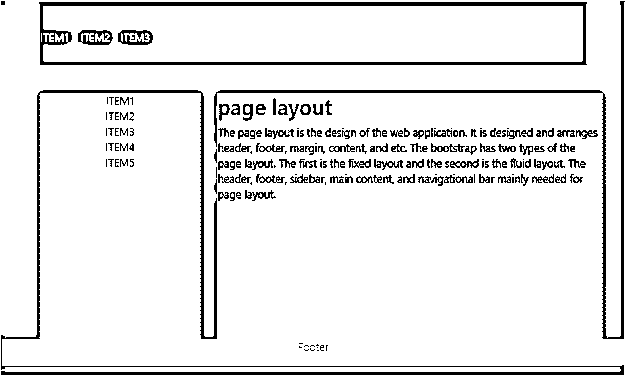
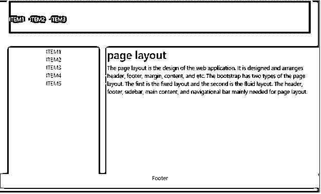
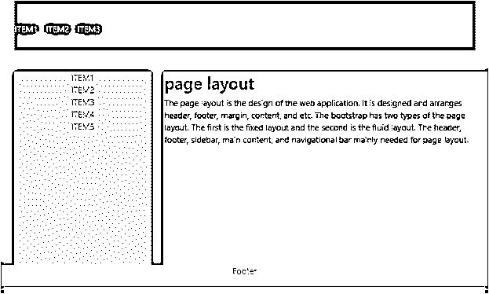
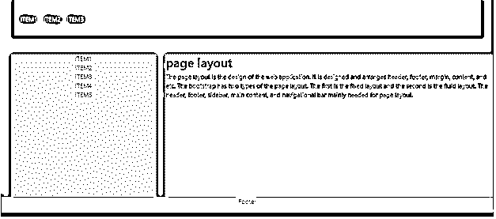

# 引导页面布局

> 原文：<https://www.educba.com/bootstrap-page-layout/>




## 引导页面布局介绍

页面布局是 web 应用程序的设计。它设计和安排页眉、页脚、页边距、内容等。它使用 bootstrap 管理 web 应用程序上的文本、图像和许多对象。它有两种类型的页面布局。第一种是固定布局，第二种是流动布局。固定布局具有特定的宽度尺寸，但是流体布局具有 100%的应用全宽度。页面布局主要需要的页眉、页脚、侧边栏、主要内容和导航栏。

### 句法

页面布局语法如下。

<small>网页开发、编程语言、软件测试&其他</small>

1.固定自举布局

```
<div class ="container">
<!—-
The header, footer, sidebar, main content, and navigational bar mainly needed for page layout.
-->
</div>
```

2.流体自举布局

```
<div class ="container-fluid">
<!—-
The header, footer, sidebar, main content, and navigational bar mainly needed for page layout.
-->
</div>
```

3.使用断点的响应页面布局。用于特定屏幕宽度设备的容器-(断点)类。

```
<div class ="container-sm">
<!—-
The header, footer, sidebar, main content, and navigational bar mainly needed for page layout.
-->
</div>
```

### Bootstrap 页面布局是如何工作的？

容器类用于理解布局。容器内部使用的侧边栏、导航栏、网格系统和页脚。通过演示了解 works 页面布局如何显示下面的语法。

```
<div class ="container">
<nav class ="navbar navbar-expand-sm bg-dark">
<ul class ="navbar-nav">
<li class ="nav-item">
<a class ="nav-link" href="#"> ITEM1 </a>
</li>
<li class ="nav-item">
<a class ="nav-link" href="#"> ITEM2 </a>
</li>
<li class ="nav-item">
<a class ="nav-link" href ="#"> ITEM3 </a>
</li>
</ul>
</nav>
<div class ="row">
<div class ="col-sm-4"> <div class ="sidenav">
<a href="#"> ITEM1 </a> <br>
<a href="#"> ITEM2 </a> <br>
<a href="#"> ITEM3 </a> <br>
<a href="#"> ITEM4 </a> <br>
<a href="#"> ITEM5 </a>
</div>
</div>
<div class ="col-sm-8">
<h2> page layout </h2>
<p> The page layout is the design of the web application. It is designed and arranges header, footer, margin, content, and etc.
The bootstrap has two types of the page layout. The first is the fixed layout and the second is the fluid layout.
The header, footer, sidebar, main content, and navigational bar mainly needed for page layout.</p>
</div>
</div>
<div class ="footer">
<p>Footer</p>
</div>
</div>
```

### 引导页面布局示例

下面是下面提到的例子:

#### 示例#1

固定页面布局示例如下。

**代码:**

```
<!DOCTYPE html>
<html >
<head>
<title> Bootstrap page layout Example </title>
<meta charset ="utf-8">
<meta name ="viewport" content ="width=device-width, initial-scale=1">
<link rel ="stylesheet" href ="https://maxcdn.bootstrapcdn.com/bootstrap/4.4.1/css/bootstrap.min.css">
<script src= "https://ajax.googleapis.com/ajax/libs/jquery/3.4.1/jquery.min.js">
</script>
<script src= "https://cdnjs.cloudflare.com/ajax/libs/popper.js/1.16.0/umd/popper.min.js">
</script>
<script src= "https://maxcdn.bootstrapcdn.com/bootstrap/4.4.1/js/bootstrap.min.js">
</script>
<style>
body
{
background-color :grey;
}
.sidenav {
Background : lightgrey;
Height :230px;
margin-top :5px;
text-align :center;
}
.col-sm-8{
background-color :lightblue;
padding :1px;
margin-top :5px;
}
.footer {
position : fixed;
left : 0;
width : 100%;
background-color : orange;
color : black;
text-align : center;
}
</style>
</head>
<body>
<div class ="container">
<nav  class ="navbar navbar-expand-sm bg-dark">
<ul class= "navbar-nav">
<li class= "nav-item">
<a class= "nav-link" href="#"> ITEM1 </a>
</li>
<li class= "nav-item">
<a class= "nav-link" href="#"> ITEM2 </a>
</li>
<li class= "nav-item">
<a class= "nav-link" href="#"> ITEM3 </a>
</li>
</ul>
</nav>
<div class= "row">
<div class= "col-sm-4"> <div class="sidenav">
<a href="#"> ITEM1 </a> <br>
<a href="#"> ITEM2 </a> <br>
<a href="#"> ITEM3 </a> <br>
<a href="#"> ITEM4 </a> <br>
<a href="#"> ITEM5 </a>
</div>
</div>
<div class= "col-sm-8">
<h2> page layout </h2>
<p> The page layout is the design of the web application. It is designed and arranges header, footer, margin, content, and etc.
The bootstrap has two types of the page layout. The first is the fixed layout and the second is the fluid layout.
The header, footer, sidebar, main content, and navigational bar mainly needed for page layout.</p>
</div>
</div>
<div class= "footer">
<p>Footer</p>
</div>
</div>
</body>
</html>
```

**输出:**




#### 实施例 2

以下示例是带有输出的流体布局。

**代码:**

```
<!DOCTYPE html>
<html >
<head>
<title> Bootstrap page layout Example </title>
<meta charset ="utf-8">
<meta name ="viewport" content ="width=device-width, initial-scale=1">
<link rel ="stylesheet" href ="https://maxcdn.bootstrapcdn.com/bootstrap/4.4.1/css/bootstrap.min.css">
<script src= "https://ajax.googleapis.com/ajax/libs/jquery/3.4.1/jquery.min.js">
</script>
<script src= "https://cdnjs.cloudflare.com/ajax/libs/popper.js/1.16.0/umd/popper.min.js">
</script>
<script src= "https://maxcdn.bootstrapcdn.com/bootstrap/4.4.1/js/bootstrap.min.js">
</script>
<style>
body
{
background-color :grey;
}
.sidenav {
Background : lightgrey;
Height :230px;
margin-top :5px;
text-align :center;
}
.col-sm-8{
background-color :lightblue;
padding :1px;
margin-top :5px;
}
.footer {
position : fixed;
left : 0;
width : 100%;
background-color : orange;
color : black;
text-align : center;
}
</style>
</head>
<body>
<div class ="container-fluid">
<nav  class ="navbar navbar-expand-sm bg-dark">
<ul class= "navbar-nav">
<li class= "nav-item">
<a class= "nav-link" href="#"> ITEM1 </a>
</li>
<li class= "nav-item">
<a class= "nav-link" href="#"> ITEM2 </a>
</li>
<li class= "nav-item">
<a class= "nav-link" href="#"> ITEM3 </a>
</li>
</ul>
</nav>
<div class= "row">
<div class= "col-sm-4"> <div class="sidenav">
<a href="#"> ITEM1 </a> <br>
<a href="#"> ITEM2 </a> <br>
<a href="#"> ITEM3 </a> <br>
<a href="#"> ITEM4 </a> <br>
<a href="#"> ITEM5 </a>
</div>
</div>
<div class= "col-sm-8">
<h2> page layout </h2>
<p> The page layout is the design of the web application. It is designed and arranges header, footer, margin, content, and etc.
The bootstrap has two types of the page layout. The first is the fixed layout and the second is the fluid layout.
The header, footer, sidebar, main content, and navigational bar mainly needed for page layout.</p>
</div>
</div>
<div class= "footer">
<p>Footer</p>
</div>
</div>
</body>
</html>
```

**输出:**




#### 实施例 3

下面的例子是一个带有断点的固定布局。

**代码:**

```
<!DOCTYPE html>
<html >
<head>
<title> Bootstrap page layout Example </title>
<meta charset ="utf-8">
<meta name ="viewport" content ="width=device-width, initial-scale=1">
<link rel ="stylesheet" href ="https://maxcdn.bootstrapcdn.com/bootstrap/4.4.1/css/bootstrap.min.css">
<script src= "https://ajax.googleapis.com/ajax/libs/jquery/3.4.1/jquery.min.js">
</script>
<script src= "https://cdnjs.cloudflare.com/ajax/libs/popper.js/1.16.0/umd/popper.min.js">
</script>
<script src= "https://maxcdn.bootstrapcdn.com/bootstrap/4.4.1/js/bootstrap.min.js">
</script>
<style>
body
{
background-color :grey;
}
.sidenav {
Background : lightgrey;
Height :230px;
margin-top :5px;
text-align :center;
}
.col-sm-8{
background-color :lightblue;
padding :1px;
margin-top :5px;
}
.footer {
position : fixed;
left : 0;
width : 100%;
background-color : orange;
color : black;
text-align : center;
}
</style>
</head>
<body>
<div class ="container-lg">
<nav  class ="navbar navbar-expand-sm bg-dark">
<ul class= "navbar-nav">
<li class= "nav-item">
<a class= "nav-link" href="#"> ITEM1 </a>
</li>
<li class= "nav-item">
<a class= "nav-link" href="#"> ITEM2 </a>
</li>
<li class= "nav-item">
<a class= "nav-link" href="#"> ITEM3 </a>
</li>
</ul>
</nav>
<div class= "row">
<div class= "col-sm-4"> <div class="sidenav">
<a href="#"> ITEM1 </a> <br>
<a href="#"> ITEM2 </a> <br>
<a href="#"> ITEM3 </a> <br>
<a href="#"> ITEM4 </a> <br>
<a href="#"> ITEM5 </a>
</div>
</div>
<div class= "col-sm-8">
<h2> page layout </h2>
<p> The page layout is the design of the web application. It is designed and arranges header, footer, margin, content, and etc.
The bootstrap has two types of the page layout. The first is the fixed layout and the second is the fluid layout.
The header, footer, sidebar, main content, and navigational bar mainly needed for page layout.</p>
</div>
</div>
<div class= "footer">
<p>Footer</p>
</div>
</div>
</body>
</html>
```

**小屏幕输出:**




**大屏幕输出:**




### 结论

页面布局是每个 web 应用程序必不可少的一部分。bootstrap 中的布局使 web 应用程序对每个用户来说更加友好和易于理解。

### 推荐文章

这是一个引导页面布局的指南。在这里，我们将讨论引导页面布局如何与编程示例一起工作。您也可以浏览我们推荐的其他文章，了解更多信息——

1.  [引导导航条](https://www.educba.com/bootstrap-navigation-bar/)
2.  [自举粘滞页脚](https://www.educba.com/bootstrap-sticky-footer/)
3.  [引导切换按钮](https://www.educba.com/bootstrap-toggle-button/)
4.  [自助汉堡菜单](https://www.educba.com/bootstrap-hamburger-menu/)


