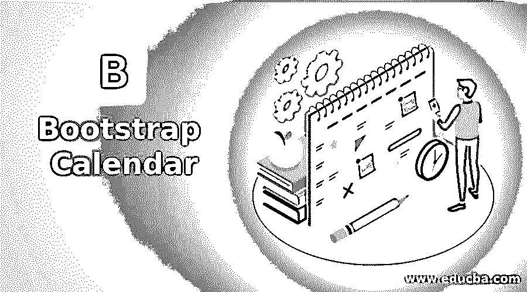
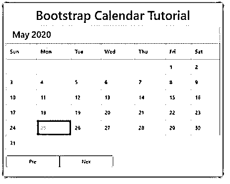
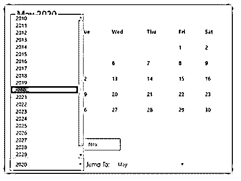
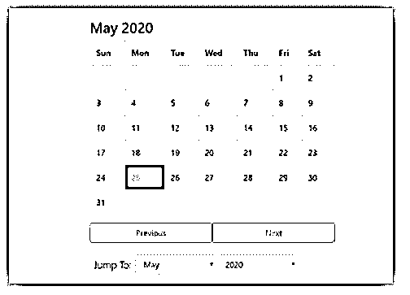

# 引导日历

> 原文：<https://www.educba.com/bootstrap-calendar/>




## 引导日历简介

以下文章提供了引导日历的概要。bootstrap 有许多高级插件、类和标签，使 web 应用程序对用户友好。这是一个扩展插件，用于在 web 应用程序中制作日历。它具有带事件管理的日历的所有功能。它有助于根据日历日期创建新事件、管理事件和修改事件。这是一个简单的日期日历挑选与日期日历事件管理插件的网络应用程序。

**语法:**

<small>网页开发、编程语言、软件测试&其他</small>

它总是会出现 JavaScript。

我们有 bootstrap 和 JavaScript 基本语法。

**引导语法:**

```
<div class="container" id="monthyear">
<table id="calendar">
<thead>
<tr>
<th>weekdays</th>
</tr>
</thead>
<tbody id="calendarBody">
</tbody>
</table>
</div>
```

**JavaScript 的语法:**

```
<script>
variable td = new Dateforcalendar();
variablecrntmnt = td.getMonth();
variable cy = td.getFullYear();
variablemonthyear = document.getElementById("monthyear");
showCalendar(crntmnt, cy);
</script>
```

### 它是如何工作的？

日历布局和格式。

**代码:**

```
<div class="card">
<h3 class="card-header" id="mandyr"></h3>
<table class="table table-bordered table-responsive-sm" id="calendar">
<thead>
<tr>
<th>Sunday</th>
<th>Monday</th>
<th>Tuesday</th>
<th>Wednesday</th>
<th>Thursday</th>
<th>Friday</th>
<th>Saturday</th>
</tr>
</thead>
<tbody id="calendarBody">
</tbody>
</table>
<div class="form-inline">
<button class="btnbtn-outline-primary col-sm-3" id="pre" onclick="pre()">Pre</button>
<button class="btnbtn-outline-primary col-sm-3" id="nex" onclick="nex()">Nex</button>
</div>
<br/>
</label><div col-sm-4" name="year" id="year" onchange="jumpp()">
<div col-sm-4" name="month" id="month" onchange="jumpp()">
</div>
```

JavaScript 产生了这样的事件。

日历的基本日期、月份和年份显示程序。

**代码:**

```
variable td = new Dateforcalendar();
variablecrntmnt = td.getMonth();
variable cy = td.getFullYear();
variablesy = document.getElementById("year");
variableselectMonth = document.getElementById("month");
variable monthtw = ["January", "February", "March", "April", "May", "June", "July", "August", "September", "October", "November", "December"];
variablemandyr = document.getElementById("mandyr");
showCalendar(crntmnt, cy);
```

使用 JavaScript 和 bootstrap 显示日历的日期的表体。

**代码:**

```
function showCalendar(month, year) {
variablefrstday = (new Dateforcalendar(year, month)).getDay();
variabledayinmonth = 32 - new Dateforcalendar(year, month, 32).getDateforcalendar();
variabletables = document.getElementById("calendarBody");
tables.innerHTML = "";
mandyr.innerHTML = monthtw[month] + " " + year;
sy.value = year;
selectMonth.value = month;
variabledateforcalendar = 1;
for (variablei = 0; i< 6; i++) {
variabledateforcalendardateforcalendarrowss = document.createElement("tr");
for (variable j = 0; j < 7; j++) {
if (i === 0 && j <frstday) {
variabledateforcalendardateforcalendarcells = document.createElement("td");
variabledateforcalendardateforcalendarcellsText = document.createTextNode("");
dateforcalendardateforcalendarcells.appendChild(dateforcalendardateforcalendarcellsText);
dateforcalendardateforcalendarrowss.appendChild(dateforcalendardateforcalendarcells);
}
else if (dateforcalendar>dayinmonth) {
break;
}
else {
variabledateforcalendardateforcalendarcells = document.createElement("td");
variabledateforcalendardateforcalendarcellsText = document.createTextNode(dateforcalendar);
if (dateforcalendar === td.getDateforcalendar() && year === td.getFullYear() && month === td.getMonth()) {
dateforcalendardateforcalendarcells.classList.add("bg-info");
}
dateforcalendardateforcalendarcells.appendChild(dateforcalendardateforcalendarcellsText);
dateforcalendardateforcalendarrowss.appendChild(dateforcalendardateforcalendarcells);
dateforcalendar++;
}
}
tables.appendChild(dateforcalendardateforcalendarrowss);
}
}
```

### 引导日历示例

下面是提到的例子:

#### 示例#1

**代码:**

```
<!DOCTYPE html>
<html>
<head>
<meta charset="UTF-8">
<title> Calendar </title>
<meta name="viewport" content="width=device-width, initial-scarde=1, shrink-to-fit=no">
<link rel="stylesheet" href="https://stackpath.bootstrapcdn.com/bootstrap/4.1.0/css/bootstrap.min.css"
</head>
<body>
<div class="container col-lg-4 ">
<br>
<center><h1> Bootstrap Calendar Tutorial </h1></center>
<div class="card">
<h3 class="card-header" id="mandyr"></h3>
<table class="table table-bordered table-responsive-sm" id="calendar">
<thead>
<tr>
<th>Sun</th>
<th>Mon</th>
<th>Tue</th>
<th>Wed</th>
<th>Thu</th>
<th>Fri</th>
<th>Sat</th>
</tr>
</thead>
<tbody id="calendarBody">
</tbody>
</table>
<div class="form-inline">
<button class="btnbtn-outline-success col-sm-3" id="pre" onclick="pre()">Pre</button>
<button class="btnbtn-outline-success col-sm-3" id="nex" onclick="nex()">Nex</button>
</div>
<br/>
</label><div col-sm-4" name="year" id="year" onchange="jumpp()">
</div>
<div col-sm-4" name="month" id="month" onchange="jumpp()">
</div>
</div>
</div>
<script>
variable td = new Dateforcalendar();
variablecrntmnt = td.getMonth();
variable cy = td.getFullYear();
variablesy = document.getElementById("year");
variableselectMonth = document.getElementById("month");
variable monthtw = ["January", "February", "March", "April", "May", "June", "July", "August", "September", "October", "November", "December"];
variablemandyr = document.getElementById("mandyr");
showCalendar(crntmnt, cy);
function pre() {
cy = (crntmnt === 0) ? cy - 1 : cy;
crntmnt = (crntmnt === 0) ?11 :crntmnt - 1;
showCalendar(crntmnt, cy);
}
function nex() {
cy = (crntmnt === 11) ? cy + 1 : cy;
crntmnt = (crntmnt + 1) % 12;
showCalendar(crntmnt, cy);
}
function jumpp() {
cy = parseInt(sy.value);
crntmnt = parseInt(selectMonth.value);
showCalendar(crntmnt, cy);
}
function showCalendar(month, year) {
variablefirstday = (new Dateforcalendar(year, month)).getDay();
variabledysinmnth = 32 - new Dateforcalendar(year, month, 32).getDateforcalendar();
variabletbl = document.getElementById("calendarBody"); // body of the calendar
tbl.innerHTML = "";
mandyr.innerHTML = monthtw[month] + " " + year;
sy.value = year;
selectMonth.value = month;
variabledateforcalendar = 1;
for (variablei = 0; i< 6; i++) {
variabledateforcalendardateforcalendarrows = document.createElement("tr");
for (variable j = 0; j < 7; j++) {
if (i === 0 && j <firstday) {
variabledateforcalendardateforcalendarcell = document.createElement("td");
variabledateforcalendardateforcalendarcellText = document.createTextNode("");
dateforcalendardateforcalendarcell.appendChild(dateforcalendardateforcalendarcellText);
dateforcalendardateforcalendarrows.appendChild(dateforcalendardateforcalendarcell);
}
else if (dateforcalendar>dysinmnth) {
break;
}
else {
variabledateforcalendardateforcalendarcell = document.createElement("td");
variabledateforcalendardateforcalendarcellText = document.createTextNode(dateforcalendar);
if (dateforcalendar === td.getDateforcalendar() && year === td.getFullYear() && month === td.getMonth()) {
dateforcalendardateforcalendarcell.classList.add("bg-info");
}
dateforcalendardateforcalendarcell.appendChild(dateforcalendardateforcalendarcellText);
dateforcalendardateforcalendarrows.appendChild(dateforcalendardateforcalendarcell);
dateforcalendar++;
}
}
tbl.appendChild(dateforcalendardateforcalendarrows); // appending each dateforcalendardateforcalendarrows into calendar body.
}
}
</script>
<script src="https://code.jquery.com/jquery-3.3.1.slim.min.js">
</script>
<script src="https://cdnjs.cloudflare.com/ajax/libs/popper.js/1.14.0/umd/popper.min.js"></script>
<script src="https://stackpath.bootstrapcdn.com/bootstrap/4.1.0/js/bootstrap.min.js">
</script>
</body>
</html>
```

**输出:**




#### 实施例 2

用跳转方法举例并输出。

**代码:**

```
<!DOCTYPE html>
<html lang="en">
<head>
<meta charset="UTF-8">
<title>Calendar</title>
<meta name="viewport" content="width=device-width, initial-scarde=1, shrink-to-fit=no">
<link rel="stylesheet" href="https://stackpath.bootstrapcdn.com/bootstrap/4.1.0/css/bootstrap.min.css"
</head>
<body>
<div class="container col-lg-4 ">
<div class="card">
<h3 class="card-header" id="mandyr"></h3>
<table class="table table-bordered table-responsive-sm" id="calendar">
<thead>
<tr>
<th>Sun</th>
<th>Mon</th>
<th>Tue</th>
<th>Wed</th>
<th>Thu</th>
<th>Fri</th>
<th>Sat</th>
</tr>
</thead>
<tbody id="calendarBody">
</tbody>
</table>
<div class="form-inline">
<button class="btnbtn-outline-primary col-sm-3" id="pre" onclick="pre()">Pre</button>
<button class="btnbtn-outline-primary col-sm-3" id="nex" onclick="nex()">Nex</button>
</div>
<br/>
<form class="form-inline">
<label for="year"></label><select class="form-control col-sm-4" name="year" id="year" onchange="jumpp()">
<option value=2010>2010</option>
<option value=2011>2011</option>
<option value=2012>2012</option>
<option value=2013>2013</option>
<option value=2014>2014</option>
<option value=2015>2015</option>
<option value=2016>2016</option>
<option value=2017>2017</option>
<option value=2018>2018</option>
<option value=2019>2019</option>
<option value=2020>2020</option>
<option value=2021>2021</option>
<option value=2022>2022</option>
<option value=2023>2023</option>
<option value=2024>2024</option>
<option value=2025>2025</option>
<option value=2026>2026</option>
<option value=2027>2027</option>
<option value=2028>2028</option>
<option value=2029>2029</option>
<option value=2030>2030</option>
</select>
<label class="lead mr-2 ml-2" for="month">Jump To: </label>
<select class="form-control col-sm-4" name="month" id="month" onchange="jumpp()">
<option value=0>Jan</option>
<option value=1>Feb</option>
<option value=2>Mar</option>
<option value=3>Apr</option>
<option value=4>May</option>
<option value=5>Jun</option>
<option value=6>Jul</option>
<option value=7>Aug</option>
<option value=8>Sep</option>
<option value=9>Oct</option>
<option value=10>Nov</option>
<option value=11>Dec</option>
</select>
</form>
</div>
</div>
<script>
variable td = new Dateforcalendar();
variablecrntmnt = td.getMonth();
variable cy = td.getFullYear();
variablesy = document.getElementById("year");
variableselectMonth = document.getElementById("month");
variable  monthtw = ["January", "February", "March", "April", "May", "June", "July", "August", "September", "October", "November", "December"];
variablemandyr = document.getElementById("mandyr");
showCalendar(crntmnt, cy);
function pre() {
cy = (crntmnt === 0) ? cy - 1 : cy;
crntmnt = (crntmnt === 0) ?11 :crntmnt - 1;
showCalendar(crntmnt, cy);
}
function nex() {
cy = (crntmnt === 11) ? cy + 1 : cy;
crntmnt = (crntmnt + 1) % 12;
showCalendar(crntmnt, cy);
}
function jumpp() {
cy = parseInt(sy.value);
crntmnt = parseInt(selectMonth.value);
showCalendar(crntmnt, cy);
}
function showCalendar(month, year) {
variablefirstday = (new Dateforcalendar(year, month)).getDay();
variabledaysinmonth = 32 - new Dateforcalendar(year, month, 32).getDateforcalendar();
variabletbl = document.getElementById("calendarBody");
tbl.innerHTML = "";
mandyr.innerHTML = monthtw[month] + " " + year;
sy.value = year;
selectMonth.value = month;
variabledateforcalendar = 1;
for (variablei = 0; i< 6; i++) {
variabledateforcalendarrow = document.createElement("tr");
for (variable j = 0; j < 7; j++) {
if (i === 0 && j <firstday) {
variabledateforcalendarcell = document.createElement("td");
variabledateforcalendarcellText = document.createTextNode("");
dateforcalendarcell.appendChild(dateforcalendarcellText);
dateforcalendarrow.appendChild(dateforcalendarcell);
}
else if (dateforcalendar>daysinmonth) {
break;
}
else {
variabledateforcalendarcell = document.createElement("td");
variabledateforcalendarcellText = document.createTextNode(dateforcalendar);
if (dateforcalendar === td.getDateforcalendar() && year === td.getFullYear() && month === td.getMonth()) {
dateforcalendarcell.classList.add("bg-info");
}
dateforcalendarcell.appendChild(dateforcalendarcellText);
dateforcalendarrow.appendChild(dateforcalendarcell);
dateforcalendar++;
}
}
tbl.appendChild(dateforcalendarrow);  }
}
</script>
<script src="https://code.jquery.com/jquery-3.3.1.slim.min.js">
</script>
<script src="https://cdnjs.cloudflare.com/ajax/libs/popper.js/1.14.0/umd/popper.min.js">
</script>
<script src="https://stackpath.bootstrapcdn.com/bootstrap/4.1.0/js/bootstrap.min.js">
</script>
</body>
</html>
```

**带跳转事件的输出:**




#### 实施例 3

没有卡片示例和输出。

**代码:**

```
<!DOCTYPE html>
<html lang="en">
<head>
<meta charset="UTF-8">
<title>Calendar</title>
<meta name="viewport" content="width=device-width, initial-scarde=1, shrink-to-fit=no">
<link rel="stylesheet" href="https://stackpath.bootstrapcdn.com/bootstrap/4.1.0/css/bootstrap.min.css"
</head>
<body>
<div class="container col-lg-4 ">
<div class="cal"&gt
<h3 class="cal-header" id="mandyr"></h3>
<table class="table table-bordered table-responsive-sm" id="calendar">
<thead>
<tr>
<th>Sun</th>
<th>Mon</th>
<th>Tue</th>
<th>Wed</th>
<th>Thu</th>
<th>Fri</th>
<th>Sat</th>
</tr>
</thead>
<tbody id="calendarBody">
</tbody>
</table>
<div class="form-inline">
<button class="btnbtn-outline-primary col-sm-3" id="pre" onclick="pre()">Pre</button>
<button class="btnbtn-outline-primary col-sm-3" id="nex" onclick="nex()">Nex</button>
</div>
<br/>
<form class="form-inline">
<label for="year"></label><select class="form-control col-sm-4" name="year" id="year" onchange="jumpp()">
<option value=2015>2015</option>
<option value=2016>2016</option>
<option value=2017>2017</option>
<option value=2018>2018</option>
<option value=2019>2019</option>
<option value=2020>2020</option>
<option value=2021>2021</option>
<option value=2022>2022</option>
<option value=2023>2023</option>
<option value=2024>2024</option>
<option value=2025>2025</option>
</select>
<label class="lead mr-2 ml-2" for="month">Jump To: </label>
<select class="form-control col-sm-4" name="month" id="month" onchange="jumpp()">
<option value=0>Jan</option>
<option value=1>Feb</option>
<option value=2>Mar</option>
<option value=3>Apr</option>
<option value=4>May</option>
<option value=5>Jun</option>
<option value=6>Jul</option>
<option value=7>Aug</option>
<option value=8>Sep</option>
<option value=9>Oct</option>
<option value=10>Nov</option>
<option value=11>Dec</option>
</select>
</form>
</div>
</div>
<script>
variable td = new Dateforcalendar();
variable crntmnt = td.getMonth();
variable cy = td.getFullYear();
variable sy = document.getElementById("year");
variable selectMonth = document.getElementById("month");
variable monthtw =["January", "February", "March", "April", "May", "June", "July", "August", "September", "October", "November", "December"];
variable mandyr = document.getElementById("mandyr");
showCalendar(crntmnt, cy);
function pre() {
cy = (crntmnt === 0) ? cy - 1 : cy;
crntmnt = (crntmnt === 0) ?11 :crntmnt - 1;
showCalendar(crntmnt, cy);
}
function nex() {
cy = (crntmnt === 11) ? cy + 1 : cy;
crntmnt = (crntmnt + 1) % 12;
showCalendar(crntmnt, cy);
}
function jumpp() {
cy = parseInt(sy.value);
crntmnt = parseInt(selectMonth.value);
showCalendar(crntmnt, cy);
}
function showCalendar(month, year) {
variable firstday = (new Dateforcalendar(year, month)).getDay();
variable daysinmonth = 32 - new Dateforcalendar(year, month, 32).getDateforcalendar();
variable tbl = document.getElementById("calendarBody");
tbl.innerHTML = "";
mandyr.innerHTML = monthtw[month] + " " + year;
sy.value = year;
selectMonth.value = month;
variable dateforcalendar = 1;
for (variable i = 0; i< 6; i++) {
variable dateforcalendarrow = document.createElement("tr");
for (variable j = 0; j < 7; j++) {
if (i === 0 && j <firstday) {
variable dateforcalendarcell = document.createElement("td");
variable dateforcalendarcellText = document.createTextNode("");
dateforcalendarcell.appendChild(dateforcalendarcellText);
dateforcalendarrow.appendChild(dateforcalendarcell);
}
else if (dateforcalendar>daysinmonth) {
break;
}
else {
variable dateforcalendarcell = document.createElement("td");
variable dateforcalendarcellText = document.createTextNode(dateforcalendar);
if (dateforcalendar === td.getDateforcalendar() && year === td.getFullYear() && month === td.getMonth()) {
dateforcalendarcell.classList.add("bg-info");
}
dateforcalendarcell.appendChild(dateforcalendarcellText);
dateforcalendarrow.appendChild(dateforcalendarcell);
dateforcalendar++;
}
}
tbl.appendChild(dateforcalendarrow);    }
}
</script>
<script src= "https://code.jquery.com/jquery-3.3.1.slim.min.js">
</script>
<script src= "https://cdnjs.cloudflare.com/ajax/libs/popper.js/1.14.0/umd/popper.min.js">
</script>
<script src="https://stackpath.bootstrapcdn.com/bootstrap/4.1.0/js/bootstrap.min.js">
</script>
</body>
</html>
```

**输出:**




### 结论

它可用于轻量级 web 应用程序。这是一种先进的多用途技术日历。它有助于管理事件的日期并按时显示。

### 推荐文章

这是一个引导日历的指南。在这里，我们讨论了引导日历的介绍，日历是如何工作的，并给出了相应的例子。您也可以看看以下文章，了解更多信息–

1.  [包装引导程序](https://www.educba.com/wrap-bootstrap/)
2.  [自举容器流体](https://www.educba.com/bootstrap-container-fluid/)
3.  [自举网格](https://www.educba.com/bootstrap-grid/)
4.  [引导响应](https://www.educba.com/bootstrap-responsive/)


