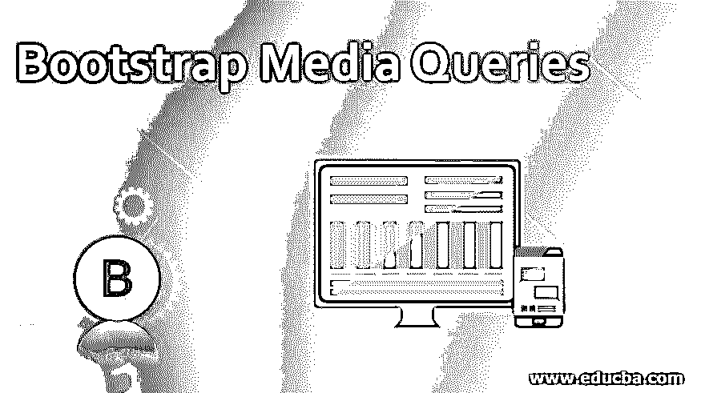
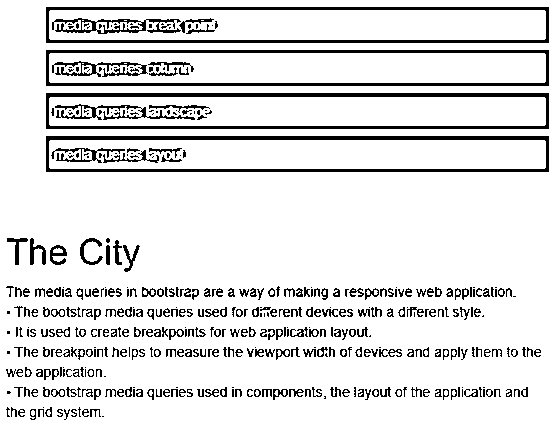
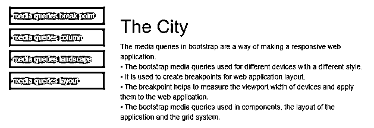

# 引导媒体查询

> 原文：<https://www.educba.com/bootstrap-media-queries/>




## 引导媒体查询简介

bootstrap 中的媒体查询是创建响应性 web 应用程序的一种方式。它用于不同风格的不同设备。它用于为 web 应用程序布局创建断点。断点有助于测量设备的视区宽度，并将它们应用到 web 应用程序。它用于组件、应用程序的布局和网格系统。

### 句法

媒体查询语法有多种用途。

<small>网页开发、编程语言、软件测试&其他</small>

下面的标签是 bootstrap 中媒体查询的语法。

```
@media
```

根据大小或断点，所有语法如下。

#### 1.小型设备

以下语法用于电话设备或 576px 及以上屏幕宽度的设备。

```
@media (min – width: 576px) {
Web design tag
}
```

#### 2.媒体设备

以下语法用于平板设备或 768px 及以上屏幕宽度设备。

```
@media (min – width: 768px) {
Web design tag
}
```

#### 3.大型设备

以下语法用于笔记本电脑和台式机设备以及 992px 及以上屏幕宽度的设备。

```
@media (min – width: 992px) {
Web design tag
}
```

#### 4.超大设备

以下语法用于大型桌面设备和 1200px 及以上屏幕宽度的设备。

```
@media (min – width: 1200px) {
Web design tag
}
```

### 引导媒体查询如何工作？

用于断点的媒体查询，以生成响应性 web 应用程序。web 应用程序中断点设置所需的最小宽度或最大宽度。

style 标记内使用的媒体查询。所有的 CSS 标签都根据要求写在媒体查询下。断点媒体查询在下面工作。

```
<!DOCTYPE>
<html>
<head>
<style>
@media(min-width: 576px) {
p {
background-color: orange;
color: black;
}
}
@media (min-width: 1200px) {
p {
background-color: Yellow;
color: black;
}
}
</style>
</head>
<body>
<p>The bootstrap media queries used in components, the layout of the application and the grid system. <br></p>
</body>
</html>
```

*   用于网格系统的媒体查询中的列。

```
<!DOCTYPE html>
<html>
<head>
<meta name="viewport" content="width=device-width, initial-scale=1.0">
<style>
.col-3 {width: 25%;}
.col-6 {width: 50%;}
.col-9 {width: 75%;}
@media only screen and (max-width: 768px) {
[class*="col-"] {
width: 90%;
}
}
</style>
</head>
<body>
<div class="row">
<div class="col-3 menu">
<ul>
<li> media queries break point </li>
<li> media queries column </li>
</ul>
</div>
<div class="col-6">
<p>The bootstrap media queries used for different devices with a different style.
</p>
</div>
</div>
</body>
</html>
```

### 例子

下面举几个例子

#### 示例#1

这用于断点，以创建响应性 web 应用程序。

断点可以利用器件的标准宽度或根据应用的要求来制作。

**代码:**

```
<!DOCTYPE html>
<html>
<head>
<meta name ="viewport" content ="width=device-width, initial-scale=1.0">
<link rel="stylesheet" href= "https://maxcdn.bootstrapcdn.com/bootstrap/3.4.1/css/bootstrap.min.css">
<script src= "https://ajax.googleapis.com/ajax/libs/jquery/3.4.1/jquery.min.js">  </script>
<script  src="https://maxcdn.bootstrapcdn.com/bootstrap/3.4.1/js/bootstrap.min.js">
</script>
<style>
@media(min-width: 576px) {
p {
background-color: orange;
color: black;
}
}
@media (min-width: 1200px) {
p {
background-color: Yellow;
color: black;
}
}
</style>
</head>
<body>
<p>
The media queries in bootstrap are a way of making a responsive web application. <br>
The bootstrap media queries used for different devices with a different style. <br>
It is used to create breakpoints for web application layout. <br>
The breakpoint helps to measure the viewport width of devices and apply them to the web application. <br>
The bootstrap media queries used in components, the layout of the application and the grid system. <br>
</p>
</body>
</html>
```

**小屏幕的输出**


**大屏幕的输出**


#### 实施例 2

用于网格系统的列媒体查询。div 标签的列可以使用媒体查询。

**代码:**

```
<!DOCTYPE html>
<html>
<head>
<meta name="viewport" content="width=device-width, initial-scale=1.0">
<link rel = "stylesheet"     href=   "https://maxcdn.bootstrapcdn.com/bootstrap/3.4.1/css/bootstrap.min.css">
<script src= "https://ajax.googleapis.com/ajax/libs/jquery/3.4.1/jquery.min.js">  </script>
<script
src = "https://maxcdn.bootstrapcdn.com/bootstrap/3.4.1/js/bootstrap.min.js">
</script>
<style>
* {
box-sizing: border-box;
}
[class*="col-"] {
float: left;
padding: 15px;
}
.menu li {
padding: 8px;
margin-bottom: 7px;
background-color: grey;
color: white;
}
.col-3 {width: 25%;}
.col-6 {width: 50%;}
.col-9 {width: 75%;}
@media only screen and (max-width: 768px) {
[class*="col-"] {
width: 90%;
}
}
</style>
</head>
<body>
<div class="row">
<div class="col-3 menu">
<ul>
<li> media queries break point </li>
<li> media queries column </li>
<li> media queries landscape </li>
<li> media queries layout </li>
</ul>
</div>
<div class="col-6">
<h1>The City</h1>
<p> The media queries in bootstrap are a way of making a responsive web application. <br>
The bootstrap media queries used for different devices with a different style. <br>
It is used to create breakpoints for web application layout. <br>
The breakpoint helps to measure the viewport width of devices and apply them to the web application. <br>
The bootstrap media queries used in components, the layout of the application and the grid system. <br>
</p>
</div>
</body>
</html>
```

**小屏幕的输出**




**大屏幕的输出**




#### 实施例 3

使用媒体查询隐藏元素。

如果屏幕的最小宽度是 576 像素，则相应的元素被隐藏。

**代码:**

```
<!DOCTYPE html>
<html>
<head>
<meta name="viewport" content="width=device-width, initial-scale=1">
<link rel="stylesheet" href= "https://maxcdn.bootstrapcdn.com/bootstrap/3.4.1/css/bootstrap.min.css">
<script src= "https://ajax.googleapis.com/ajax/libs/jquery/3.4.1/jquery.min.js">  </script>
<script  src="https://maxcdn.bootstrapcdn.com/bootstrap/3.4.1/js/bootstrap.min.js">
</script>
<style>
div.quer  {
background-color: orange;
padding: 15px;
}
@media (max-width: 576px) {
div.quer {
display: none;
}
}
</style>
</head>
<body>
<h2> Hide elements Using media queries </h2>
<div class="quer"> Bootstrap Media Queries </div>
<p>
The media queries in bootstrap are a way of making a responsive web application. <br>
The bootstrap media queries used for different devices with a different style. <br>
It is used to create breakpoints for web application layout. <br>
The breakpoint helps to measure the viewport width of devices and apply them to the web application. <br>
The bootstrap media queries used in components, the layout of the application and the grid system. <br>
</p>
</body>
</html>
```

**原始输出**


**媒体查询输出**


### 结论

自举媒体查询是布局和响应 web 应用的有效方法。它用于许多设备的不同屏幕宽度的不同样式表。这有助于创建优雅或生动的 web 应用程序。

### 推荐文章

这是引导媒体查询指南。在这里，我们讨论引导介质查询的例子，并解释它是如何工作的。您也可以看看以下文章，了解更多信息–

1.  [引导折叠侧边栏](https://www.educba.com/bootstrap-collapse-sidebar/)
2.  [引导程序中的导航条](https://www.educba.com/navbar-in-bootstrap/)
3.  [引导雕刻图案](https://www.educba.com/bootstrap-glyphicons/)
4.  引导程序中的[复选框](https://www.educba.com/checkbox-in-bootstrap/)


