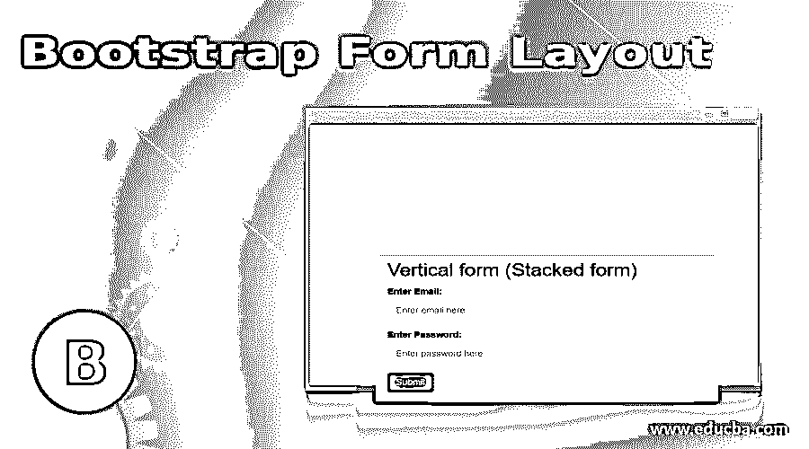
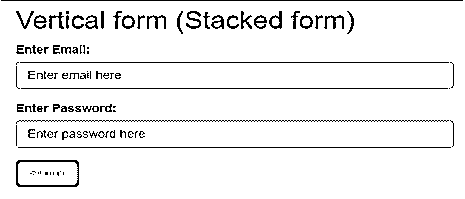

# 引导表单布局

> 原文：<https://www.educba.com/bootstrap-form-layout/>




## 引导表单布局介绍

bootstrap 表单布局是使用 bootstrap 在网页上排列用户表单。这是一个按照 web 应用程序帮助引导类的设计。bootstrap3 中有三种类型的表单布局，即垂直布局、水平布局和内嵌布局。bootstrap4 中有两种类型的窗体布局，即垂直布局(堆叠窗体)和内嵌布局。以垂直顺序设置的标签和引导表单属性称为垂直引导表单布局或堆叠表单。表单标签及其引导属性以水平顺序设置，称为水平表单布局。所有表单标签及其引导属性设置在一行中，称为内嵌表单布局。这是用来使网站的形式优雅和有吸引力。

### 句法

以下语法是三种表单布局。

<small>网页开发、编程语言、软件测试&其他</small>

#### 1.垂直布局形式(堆叠形式)

**语法:**

```
<form>
<div class ="form-group">
<label for ="username">User Name: </label>
<input class ="form-control"type ="text" id="username" />
</div>
</form>
```

**说明:**

*   垂直窗体布局是一种基本的窗体布局。这是一个使用表单类的普通引导表单。
*   在主标签中使用的类 form-group，用于表格布局的间距目的。
*   在<input>标签中使用的类 form-control 用于控制表单的所有输入属性。

#### 2.水平布局形式

**语法:**

```
<form class = "form-horizontal">
<div class = "form-group">
<label for ="username"class = "control-label col-md-4">User Name: </label>
<input class ="form-control col-md-8"type ="text" id="username" />
</div>
</form>
```

**说明:**

*   基本引导类的窗体组和窗体控件包含在水平引导窗体布局中。
*   类别 form-horizontal 在

    <form>标签中用于设置一个水平表单布局。</form>

*   class= "control-label "在<label>标签中用于控制它们的<input>标签的标签。</label>
*   用于上述中等尺寸显示屏的网格系统(col-md-*)。
*   标签中使用的 col-md-4 和 col-md-8 以及它们的输入标签分别用于表格-组放置水平格式。

#### 3.嵌入式表单布局

**语法:**

```
<form class = "form-inline">
<div class = "form-group">
<label for ="search">Search Here: </label>
<input class ="form-control"type ="search" id="search" />
</div>
</form>
```

**说明:**

*   class = "form-inline "在

    <form>标签中使用，在一行中设置所有的标签、标记和属性。</form>

*   在主标签中用于间隔目的的类形式组。
*   在<input>标签中使用的类 form-control 用于控制引导表的所有输入属性。

### 如何在 Bootstrap 中设置表单布局？

**第一步:**

*   bootstrap 窗体布局首先设置 bootstrap CSS 和 Js 文件。
*   HTML 文件头部分的引导文件集。
*   bootstrap3 支持文件如下。

```
<link rel = "stylesheet" href ="https://maxcdn.bootstrapcdn.com/bootstrap/3.4.1/css/bootstrap.min.css">
<script src = "https://ajax.googleapis.com/ajax/libs/jquery/3.5.1/jquery.min.js"></script>
<script src = "https://maxcdn.bootstrapcdn.com/bootstrap/3.4.1/js/bootstrap.min.js"></script>
```

下面是 bootstrap4 支持的文件。

```
<link rel="stylesheet" href="https://maxcdn.bootstrapcdn.com/bootstrap/4.5.0/css/bootstrap.min.css">
<script src="https://ajax.googleapis.com/ajax/libs/jquery/3.5.1/jquery.min.js"></script>
<script src="https://cdnjs.cloudflare.com/ajax/libs/popper.js/1.16.0/umd/popper.min.js">
</script>
<script src="https://maxcdn.bootstrapcdn.com/bootstrap/4.5.0/js/bootstrap.min.js">
</script>
```

**第二步:**

*   引导类有助于根据设计要求设置表单布局。
*   下面的方式来设置三个自举表单的布局。

#### 1.垂直表单布局

**代码:**

```
<form>
<div class = "form-group">
<label for = "eml"> Enter Email: </label>
<input class = "form-control" type = "email" id = "eml" name = "eml"
placeholder = "Enter email here">
</div>
<input class = "btnbtn-warning" type = "submit" >
</form>
```

**步骤:**

*   放置在标签中的窗体组类。
*   放置在<input>标签中的表单控件类。
*   用于输入标记中提交按钮的 btnbtn-warning 类。

#### 2.水平表单布局

水平窗体布局使用 class = "form-horizontal"。

**代码:**

```
<form class = "form-horizontal">
<div class = "form-group">
<label class = "control-label col-md-4" for="eml"> Enter Email: </label>
<div class = "col-md-8">
<input class = "form-control" type = "email" id = "eml" name = "eml"
placeholder = "Enter email here" >
</div>
</div>
<div class = "form-group">
<div class = "col-md-offset-4 col-md-8">
<input class = "btnbtn-warning" type = "submit">
</div>
</div>
</form>
```

**步骤:**

*   放置在

    <form>标签中的表单水平类。</form>

*   放置在标签中的窗体组类。
*   放置在<label>标签中的控件标签类。</label>
*   放置在<input>标签中的表单控件类。
*   用于输入标记中提交按钮的 btnbtn-warning 类。

#### 3.嵌入式表单布局

内联表单布局在

<form>组件中使用 class = "form-inline"。</form>

**代码:**

```
<form class="form-inline">
<div class = "form-group">
<label for = "eml"> Enter Email: </label>
<input class = "form-control" type = "email" id = "eml" name = "eml"
placeholder = "Enter email here">
</div>
<input class = "btnbtn-warning" type = "submit" >
</form>
```

**步骤:**

*   放置在

    <form>标签中的表单内联类。</form>

*   放置在标签中的窗体组类。
*   放置在<input>标签中的表单控件类。
*   btnbtn-warning 类用于输入标记中的提交按钮。

### 实现引导表单布局的示例

以下是不同的例子:

#### 示例# 1–垂直表单布局

**代码:**

```
<!DOCTYPE html>
<html>
<head>
<title> Bootstrap form layout Example </title>
<meta charset = "utf-8">
<meta name = "viewport" content = "width=device-width, initial-scale=1">
<link rel = "stylesheet" href = "https://maxcdn.bootstrapcdn.com/bootstrap/3.4.1/css/bootstrap.min.css">
<script src = "https://ajax.googleapis.com/ajax/libs/jquery/3.5.1/jquery.min.js">
</script>
<script src = "https://maxcdn.bootstrapcdn.com/bootstrap/3.4.1/js/bootstrap.min.js">
</script>
</head>
<body>
<div class = "container">
<h2> Vertical form (Stacked form) </h2>
<form>
<div class = "form-group">
<label for = "eml"> Enter Email: </label>
<input class = "form-control" type = "email" id = "eml" name = "eml" placeholder = "Enter email here">
</div>
<div class = "form-group">
<label for = "password"> Enter Password: </label>
<input class = "form-control" type = "password" id = "password" name = "password" placeholder = "Enter password here" >
</div>
<input class = "btnbtn-warning" type = "submit" >
</form>
</div>
</body>
</html>
```

**输出:**




**说明:**

*   上面的输出可以显示垂直表单布局的工作情况。
*   电子邮件标签、输入类型、密码标签、输入类型和提交按钮以垂直格式放置。

#### 示例 2–水平表单布局

**代码:**

```
<!DOCTYPE html>
<html>
<head>
<title> Bootstrap form layout Example </title>
<meta charset = "utf-8">
<meta name = "viewport" content = "width=device-width, initial-scale=1">
<link rel = "stylesheet" href = "https://maxcdn.bootstrapcdn.com/bootstrap/3.4.1/css/bootstrap.min.css">
<script src = "https://ajax.googleapis.com/ajax/libs/jquery/3.5.1/jquery.min.js">
</script>
<script src = "https://maxcdn.bootstrapcdn.com/bootstrap/3.4.1/js/bootstrap.min.js">
</script>
</head>
<body>
<div class="container">
<h2><center> Horizontal bootstrap form layout </center></h2>
<form class = "form-horizontal">
<div class = "form-group">
<label class = "control-label col-md-4" for="eml"> Enter Email: </label>
<div class = "col-md-8">
<input class = "form-control" type = "email" id = "eml" name = "eml" placeholder = "Enter email here" >
</div>
</div>
<div class = "form-group">
<label class = "control-label col-md-4" for = "password"> Enter Password: </label>
<div class = "col-md-8">
<input class = "form-control" type = "password" id = "password" name = "password" placeholder = "Enter password here" >
</div>
</div>
<div class = "form-group">
<div class = "col-md-offset-4 col-md-8">
<input class = "btnbtn-warning" type = "submit">
</div>
</div>
</form>
</div>
</body>
</html>
```

**输出:**


**说明:**

*   上面的输出可以显示水平表单布局的工作情况。
*   电子邮件标签及其输入类型以水平格式放置。
*   以垂直格式放置的电子邮件和密码的表单组。

#### 示例# 3–嵌入式表单布局

**代码:**

```
<!DOCTYPE html>
<html>
<head>
<title> Bootstrap form layout Example </title>
<meta charset = "utf-8">
<meta name = "viewport" content = "width=device-width, initial-scale=1">
<link rel = "stylesheet" href = "https://maxcdn.bootstrapcdn.com/bootstrap/3.4.1/css/bootstrap.min.css">
<script src = "https://ajax.googleapis.com/ajax/libs/jquery/3.5.1/jquery.min.js">
</script>
<script src = "https://maxcdn.bootstrapcdn.com/bootstrap/3.4.1/js/bootstrap.min.js">
</script>
</head>
<body>
<div class = "container">
<h2> Inline bootstrap form layout </h2>
<form class="form-inline">
<div class = "form-group">
<label for = "eml"> Enter Email: </label>
<input class = "form-control" type = "email" id = "eml" name = "eml" placeholder = "Enter email here">
</div>
<div class = "form-group">
<label for = "password"> Enter Password: </label>
<input class = "form-control" type = "password" id = "password" name = "password" placeholder = "Enter password here" >
</div>
<input class = "btnbtn-warning" type = "submit" >
</form>
</div>
</body>
</html>
```

**输出:**


**说明:**

*   上面的输出可以展示内联表单布局的工作方式。
*   电子邮件标签、他们的输入类型、密码标签、他们的输入类型和提交按钮放在一行中。

### 结论

*   表单布局有自己的风格和不同的表单设计方法。
*   这使得表单在 web 应用程序中更具用户友好性和吸引力。
*   这使得表单可以根据网站或 web 应用程序进行调整。

### 推荐文章

这是一个引导表单布局的指南。这里我们讨论 Bootstrap 表单布局的介绍，以及如何用代码实现在 Bootstrap 中设置表单布局。您也可以浏览我们推荐的其他文章，了解更多信息——

1.  [引导程序中的图像滑块](https://www.educba.com/image-slider-in-bootstrap/)
2.  [自举搜索框](https://www.educba.com/bootstrap-search-box/)
3.  [引导程序块引用](https://www.educba.com/bootstrap-blockquote/)
4.  [自举容器流体](https://www.educba.com/bootstrap-container-fluid/)


