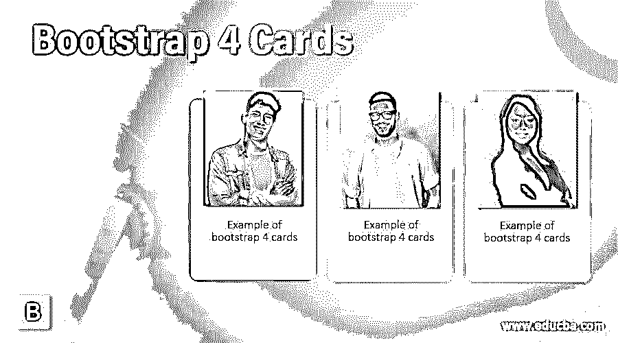
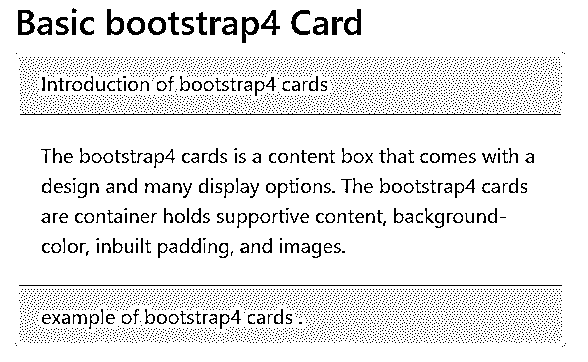
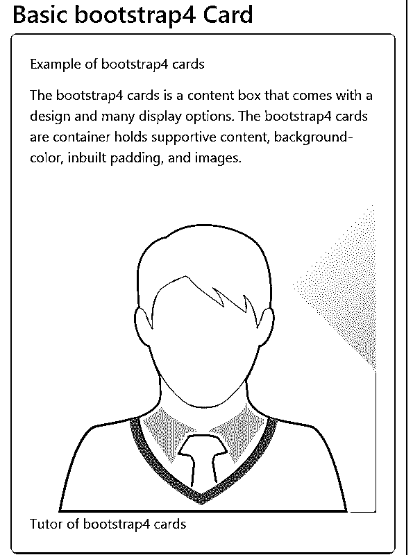
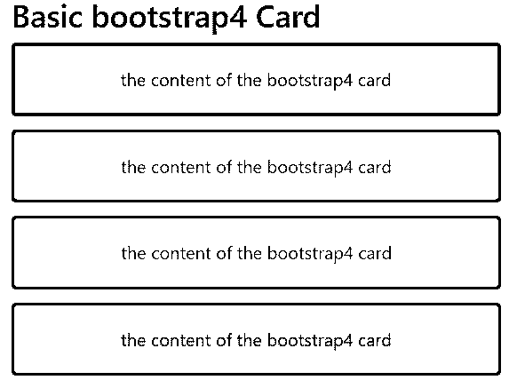

# 自举 4 张卡

> 原文：<https://www.educba.com/bootstrap-4-cards/>




## 自举 4 卡简介

bootstrap 4 卡是信息容器，具有许多支持组件，如页眉和页脚。bootstrap 4 卡是一个内容盒，带有一个设计和许多显示选项。这 4 张卡是包含支持内容、背景颜色、内置填充和图像的容器。4 卡是一个网络应用程序的迷你容器，减少了空间和大小。这 4 张卡是可根据设计和内容大小进行调节和拉伸的盒子。

### 句法

1.基本的 Bootstrap 4 卡语法需要下面的两个类。

<small>网页开发、编程语言、软件测试&其他</small>

*   用于制作 4 张卡片容器的卡片类别。
*   用于在容器内部创建内容的卡体类。

```
<div class = "card">
<div class = "card-body"> the content of the bootstrap 4 card. </div>
</div>
```

2.4 卡的页眉和页脚语法如下。

```
<div class = "card">
<div class = "card-header"> the header of the bootstrap 4 card. </div>
<div class = "card-body"> the content of the bootstrap 4 card. </div>
<div class = "card-footer"> the footer of the bootstrap 4 card. </div>
</div>
```

*   card-header 类创建 bootstrap 4 卡的标题。
*   card-footer 类创建 4 张卡片的页脚。

3.下面是 4 张卡的标题和文本语法。

```
<div class = "card">
<div class = "card-body"> the content of the bootstrap 4 card.
<h1 class = "card-title"> Title </h1>
<p class = "card-text"> the information of the card body. </p>
</div>
</div>
```

*   放在卡体类中的卡标题和卡文本类。
*   card-title 类是内容体的标题，card-text 是内容体的描述。

4.bootstrap 4 卡图像语法如下。

*   card-img-top 或 card-img-bottom 类带有标签。
*   图像类放在顶部或底部位置的卡片类中。

```
<div class = "card"> the content of the bootstrap 4 card.


</div>
```

### Bootstrap 4 卡是如何工作的？

下面是下面提到的步骤

**第一步:**

*   首先，在 bootstrap 4 中为 web 应用程序创建网页。

**第二步:**

*   有两种方法添加引导支持文件，如下所示。
*   引导文件从各自的网站下载，并在 head 部分保留链接。
*   bootstrap 4 支持文件也添加在网页的头部。下面是这个支持文件。

```
<link rel = "stylesheet" href="https://maxcdn.bootstrapcdn.com/bootstrap/4.5.0/css/bootstrap.min.css">
<script src = "https://ajax.googleapis.com/ajax/libs/jquery/3.5.1/jquery.min.js">
</script>
<script src = "https://cdnjs.cloudflare.com/ajax/libs/popper.js/1.16.0/umd/popper.min.js">
</script>
<script src = "https://maxcdn.bootstrapcdn.com/bootstrap/4.5.0/js/bootstrap.min.js">
</script>
```

**第三步:**

*   Bootstrap 4 可响应多种尺寸的设备。bootstrap 4 框架具有移动优先的响应优先级。
*   为响应式 web 应用程序在标题部分添加了以下标签。

```
<meta name = "viewport" content = "width = device-width, initial-scale =1">
```

**第四步:**

*   放在 HTML 文件主体部分的 4 卡语法。

```
<div class = "card">
<div class = "card-body"> the content of the bootstrap 4 card. </div>
</div>
```

*   下面是 4 个卡片工作步骤的组合。

```
<!DOCTYPE html>
<html>
<head>
<title> Bootstrap 4 card </title>
<meta name = "viewport" content = "width=device-width, initial-scale = 1">
<link rel = "stylesheet" href="https://maxcdn.bootstrapcdn.com/bootstrap/4.5.0/css/bootstrap.min.css">
<script src = "https://ajax.googleapis.com/ajax/libs/jquery/3.5.1/jquery.min.js"></script>
<script src = "https://cdnjs.cloudflare.com/ajax/libs/popper.js/1.16.0/umd/popper.min.js"></script>
<script src = "https://maxcdn.bootstrapcdn.com/bootstrap/4.5.0/js/bootstrap.min.js"></script>
</head>
<body>
<div class = "container-fluid">
<h3>Basic bootstrap 4 card</h3>
<div class = "card">
<div class = "card-body"> the content of the bootstrap 4 card. </div>
</div>
</div>
</body>
</html>
```

### Bootstrap 4 卡示例

下面是 Bootstrap 4 卡的示例:

#### 示例#1

下面是 4 张有页眉和页脚的卡片示例和输出。

**代码:**

```
<!DOCTYPE html>
<html>
<head>
<title> Bootstrap 4 card </title>
<meta name = "viewport" content = "width=device-width, initial-scale = 1">
<link rel = "stylesheet" href="https://maxcdn.bootstrapcdn.com/bootstrap/4.5.0/css/bootstrap.min.css">
<script src = "https://ajax.googleapis.com/ajax/libs/jquery/3.5.1/jquery.min.js"></script>
<script src = "https://cdnjs.cloudflare.com/ajax/libs/popper.js/1.16.0/umd/popper.min.js"></script>
<script src = "https://maxcdn.bootstrapcdn.com/bootstrap/4.5.0/js/bootstrap.min.js"></script>
<style>
body{
background-color:yellow;
}
</style>
</head>
<body>
<div class = "container-fluid">
<h3>Basic bootstrap 4 card</h3>
<div class = "card">
<div class="card-header"> Introduction of bootstrap 4 cards </div>
<div class = "card-body"> The bootstrap 4 cards is a content box that comes with a design and many display options.
The bootstrap 4 cards are container holds supportive content, background-color, inbuilt padding, and images. </div>
<div class="card-footer"> example of bootstrap 4 cards .</div>
</div>
</div>
</body>
</html>
```

**输出:**




#### 实施例 2

下面是带有图像、标题和文本示例及输出的 4 张卡片。

**代码:**

```
<!DOCTYPE html>
<html>
<head>
<title> Bootstrap 4 card </title>
<meta name = "viewport" content = "width=device-width, initial-scale = 1">
<link rel = "stylesheet" href="https://maxcdn.bootstrapcdn.com/bootstrap/4.5.0/css/bootstrap.min.css">
<script src = "https://ajax.googleapis.com/ajax/libs/jquery/3.5.1/jquery.min.js"></script>
<script src = "https://cdnjs.cloudflare.com/ajax/libs/popper.js/1.16.0/umd/popper.min.js"></script>
<script src = "https://maxcdn.bootstrapcdn.com/bootstrap/4.5.0/js/bootstrap.min.js"></script>
<style>
body{
background-color:orange;
}
</style>
</head>
<body>
<div class = "container-fluid">
<h3>Basic bootstrap 4 card</h3>
<div class = "card">
<div class = "card-body">
<div class="card-title"> Example of bootstrap 4 cards </div>
<div class="card-text">The bootstrap 4 cards is a content box that comes with a design and many display options.
The bootstrap 4 cards are container holds supportive content, background-color, inbuilt padding, and images. </div>

<div class="card-text"> Tutor of bootstrap 4 cards </div>
</div>
</div>
</div>
</body>
</html>
```

**输出:**




#### 实施例 3

下面是 4 张有上下文和卡片列示例及输出的卡片。

**代码:**

```
<!DOCTYPE html>
<html>
<head>
<title> Bootstrap 4 card </title>
<meta name = "viewport" content = "width=device-width, initial-scale = 1">
<link rel = "stylesheet" href="https://maxcdn.bootstrapcdn.com/bootstrap/4.5.0/css/bootstrap.min.css">
<script src = "https://ajax.googleapis.com/ajax/libs/jquery/3.5.1/jquery.min.js"></script>
<script src = "https://cdnjs.cloudflare.com/ajax/libs/popper.js/1.16.0/umd/popper.min.js"></script>
<script src = "https://maxcdn.bootstrapcdn.com/bootstrap/4.5.0/js/bootstrap.min.js"></script>
<style>
body{
background-color:pink;
}
</style>
</head>
<body>
<div class = "container-fluid">
<h3>Basic bootstrap 4 card</h3>
<div class="card-columns">
<div class="card bg-primary">
<div class="card-body ">
<p class="card-text">the content of the bootstrap 4 card </p>
</div>
</div>
<div class="card bg-success">
<div class="card-body ">
<p class="card-text">the content of the bootstrap 4 card</p>
</div>
</div>
<div class="card bg-secondary">
<div class="card-body">
<p class="card-text">the content of the bootstrap 4 card</p>
</div>
</div>
<div class="card bg-info">
<div class="card-body text-center">
<p class="card-text">the content of the bootstrap 4 card</p>
</div>
</div>
</div>
</div>
</body>
</html>
```

**输出:**




**描述:**

*   card-columns 类用于使用 4 网格系统创建等量的分区。
*   用所需的上下文类放置在 card-columns 类中的 card 类。
*   布局和边距会根据列的数量和大小自动调整。

#### 实施例 4

下面是带有卡组示例和输出的 4 张卡。

**代码:**

```
<!DOCTYPE html>
<html>
<head>
<title> Bootstrap 4 card </title>
<meta name = "viewport" content = "width=device-width, initial-scale = 1">
<link rel = "stylesheet" href="https://maxcdn.bootstrapcdn.com/bootstrap/4.5.0/css/bootstrap.min.css">
<script src = "https://ajax.googleapis.com/ajax/libs/jquery/3.5.1/jquery.min.js"></script>
<script src = "https://cdnjs.cloudflare.com/ajax/libs/popper.js/1.16.0/umd/popper.min.js"></script>
<script src = "https://maxcdn.bootstrapcdn.com/bootstrap/4.5.0/js/bootstrap.min.js"></script>
<style>
body{
background-color:aqua;
}
</style>
</head>
<body>
<div class = "container-fluid">
<h3>Basic bootstrap 4 card</h3>
<div class="card-group">
<div class="card bg-light">
<div class="card-body ">
<p class="card-text">the content of the bootstrap 4 card </p>
</div>
</div>
<div class="card bg-warning">
<div class="card-body">
<p class="card-text">the content of the bootstrap 4 card</p>
</div>
</div>
<div class="card bg-dark">
<div class="card-body">
<p class="card-text">the content of the bootstrap 4 card</p>
</div>
</div>
<div class="card bg-danger">
<div class="card-body">
<p class="card-text">the content of the bootstrap 4 card</p>
</div>
</div>
</div>
</div>
</body>
</html>
```

**输出:**


**描述:**

*   卡组类用于将两张以上的 4 张卡组成一组。
*   卡组创建 4 张卡的相等宽度和高度尺寸。
*   卡组类删除 4 张卡的边距。

### 结论

bootstrap 4 卡使开发人员能够轻松地在 web 应用程序上应用。这 4 张卡是吸引人的、优雅的、节省空间的组件。此外，4 卡具有用于设计目的的内置 CSS 应用程序。

### 推荐文章

这是一个引导 4 张卡的指南。在这里，我们将讨论 Bootstrap 4 Cards 的工作原理和示例，以及代码和输出。您也可以看看以下文章，了解更多信息–

1.  [引导向导](https://www.educba.com/bootstrap-wizard/)
2.  [自举搜索框](https://www.educba.com/bootstrap-search-box/)
3.  [包装引导程序](https://www.educba.com/wrap-bootstrap/)
4.  [自举余量](https://www.educba.com/bootstrap-margin/)


