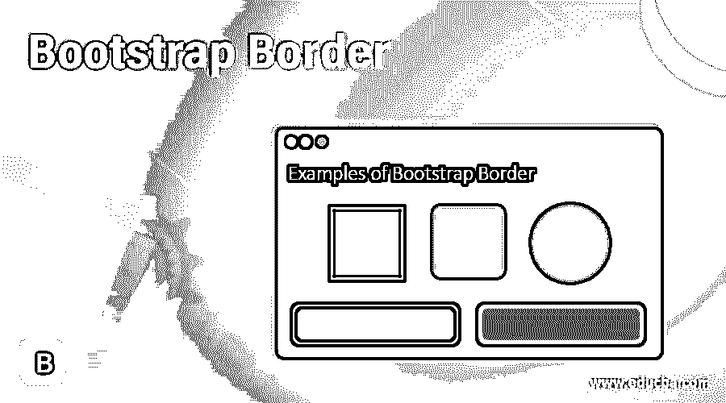
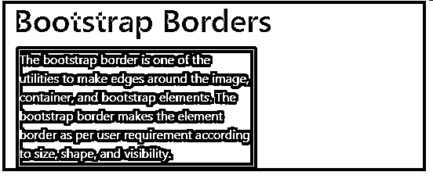
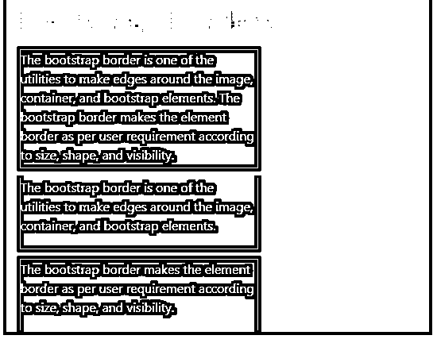
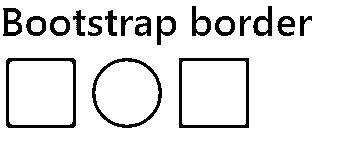
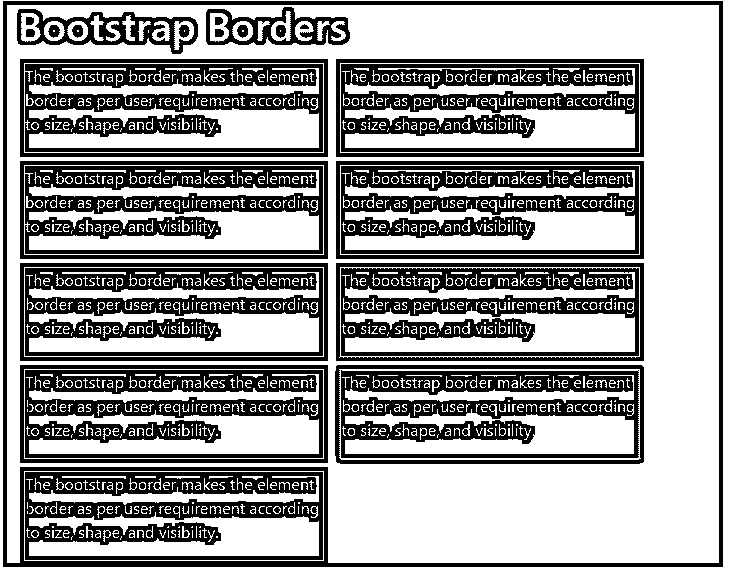

# 引导边框

> 原文：<https://www.educba.com/bootstrap-border/>




## 引导边界介绍

bootstrap 提供了许多实用程序来改进设计并制作一个有吸引力的 web 应用程序。bootstrap border 是在图像、容器和元素周围制作边缘的工具之一。边框根据大小、形状和可见性，按照用户要求制作元素边框。边框在所需元素的末端提供了一条设计线。

**语法**

<small>网页开发、编程语言、软件测试&其他</small>

基本语法如下。

```
 Element content inside of border container. 
```

*   border 类用于在容器周围创建边框。

*   上下文边框语法如下。

```
 Element content inside of border container. 
```

*   主要是与 border 类一起使用的上下文之一。
*   border-primary 类与 border 类一起用来表示主要边框。

边框半径语法如下。

```
 Element content inside of border container. 
```

*   用户可以使用圆形类或圆形类来表示边框的形状。
*   lg、sm 分别是大的和小的边界半径的大小。
*   移除边框的语法如下。

```
 Element content inside of border container. 
```

*   用于移除容器边框顶部的 border-top-0 类

### Border 在 Bootstrap 中是如何工作的？

引导支持文件包含在头文件中。该文件路径如下。

```
<link rel = "stylesheet" href = "https://maxcdn.bootstrapcdn.com/bootstrap/4.5.2/css/bootstrap.min.css">
<script src = "https://ajax.googleapis.com/ajax/libs/jquery/3.5.1/jquery.min.js">
</script>
<script src =     "https://cdnjs.cloudflare.com/ajax/libs/popper.js/1.16.0/umd/popper.min.js">
</script>
<script src = "https://maxcdn.bootstrapcdn.com/bootstrap/4.5.2/js/bootstrap.min.js">
</script>
```

用于网页正文部分的 bootstrap border 类。

```
 Element content inside of border container. 
```

基本的引导边界步骤如下。

```
<!DOCTYPE html>
<html>
<head>
<meta name = "viewport" content = "width = device-width, initial-scale = 1">
<link rel = "stylesheet" href = "https://maxcdn.bootstrapcdn.com/bootstrap/4.5.2/css/bootstrap.min.css">
<script src = "https://ajax.googleapis.com/ajax/libs/jquery/3.5.1/jquery.min.js">
</script>
<script src =     "https://cdnjs.cloudflare.com/ajax/libs/popper.js/1.16.0/umd/popper.min.js">
</script>
<script src = "https://maxcdn.bootstrapcdn.com/bootstrap/4.5.2/js/bootstrap.min.js">
</script>
<style>
.border {
display: inline-block;
width: 70px;
height: 70px;
}
</style>
</head>
<body>
<div class = "container">
<h3> Borders </h3>
 element of container 
</div>
</body>
</html>
```

span 标签中使用的 border 类和 span size 使用 CSS 进行调整。

### 引导边框示例

下面提到了不同的例子:

#### 示例#1

基本的边界示例和输出。

**代码:**

```
<!DOCTYPE html>
<html>
<head>
<title> Bootstrap Border Example </title>
<meta charset="utf-8">
<meta name="viewport" content="width=device-width, initial-scale=1">
<link rel="stylesheet" href="https://maxcdn.bootstrapcdn.com/bootstrap/4.5.2/css/bootstrap.min.css">
<script src="https://ajax.googleapis.com/ajax/libs/jquery/3.5.1/jquery.min.js"></script>
<script src="https://cdnjs.cloudflare.com/ajax/libs/popper.js/1.16.0/umd/popper.min.js"></script>
<script src="https://maxcdn.bootstrapcdn.com/bootstrap/4.5.2/js/bootstrap.min.js"></script>
<style>
.border {
display: inline-block;
width: 300px;
height: 150px;
margin: 6px;
color:yellow;
}
.container{
background-color:purple;
}
</style>
</head>
<body>
<div class="container">
<h1> Bootstrap Borders </h1>
 The bootstrap border is one of the utilities to make edges around the image, container, and bootstrap elements.
The bootstrap border makes the element border as per user requirement according to size, shape, and visibility.
</div>
</body>
</html>
```

**输出:**




#### 实施例 2

bootstrap border 类用于移除边框示例和输出。

**代码:**

```
<!DOCTYPE html>
<html>
<head>
<title> Bootstrap Border Example </title>
<meta charset="utf-8">
<meta name="viewport" content="width=device-width, initial-scale=1">
<link rel="stylesheet" href="https://maxcdn.bootstrapcdn.com/bootstrap/4.5.2/css/bootstrap.min.css">
<script src="https://ajax.googleapis.com/ajax/libs/jquery/3.5.1/jquery.min.js"></script>
<script src="https://cdnjs.cloudflare.com/ajax/libs/popper.js/1.16.0/umd/popper.min.js"></script>
<script src="https://maxcdn.bootstrapcdn.com/bootstrap/4.5.2/js/bootstrap.min.js"></script>
<style>
#border1 {
display: inline-block;
width: 300px;
height: 150px;
margin: 6px;
color:yellow;
}
.container{
background-color:blue;
}
.border{
display: inline-block;
width: 300px;
height: 90px;
margin: 6px;
color:yellow;
}
</style>
</head>
<body>
<div class="container">
<h1> Bootstrap Borders </h1>
 The bootstrap border is one of the utilities to make edges around the image, container, and bootstrap elements.
The bootstrap border makes the element border as per user requirement according to size, shape, and visibility.
 The bootstrap border is one of the utilities to make edges around the image, container, and bootstrap elements. 
 The bootstrap border makes the element border as per user requirement according to size, shape, and visibility. 
</div>
</body>
</html>
```

**输出:**




**描述**

*   第一块是基本边框。
*   第二块是显示顶面，用于移除边框。
*   移除底部边框的第三个块显示。

#### 实施例 3

边界半径示例和输出。

**代码:**

```
<!DOCTYPE html>
<html>
<head>
<title>Bootstrap border Example</title>
<meta charset="utf-8">
<meta name="viewport" content="width=device-width, initial-scale=1">
<link rel="stylesheet" href="https://maxcdn.bootstrapcdn.com/bootstrap/4.5.2/css/bootstrap.min.css">
<script src="https://ajax.googleapis.com/ajax/libs/jquery/3.5.1/jquery.min.js"></script>
<script src="https://cdnjs.cloudflare.com/ajax/libs/popper.js/1.16.0/umd/popper.min.js"></script>
<script src="https://maxcdn.bootstrapcdn.com/bootstrap/4.5.2/js/bootstrap.min.js"></script>
<style>
div {
display: inline-block;
width: 70px;
height: 70px;
margin: 6px;
background-color:grey;
}
</style>
</head>
<body>
<h1> Bootstrap border </h1>
<div class="rounded"> </div>
<div class="rounded-circle"> </div>
<div class="rounded-0"> </div>
</body>
</html>
```

**输出:**




**描述:**

*   第一个容器是圆角边框。
*   第二个容器是圆形边框。
*   第三个容器正在移除圆角半径边框。

#### 实施例 4

上下文边界示例和输出。

**代码:**

```
<!DOCTYPE html>
<html>
<head>
<title> Bootstrap Border Example </title>
<meta charset="utf-8">
<meta name="viewport" content="width=device-width, initial-scale=1">
<link rel="stylesheet" href="https://maxcdn.bootstrapcdn.com/bootstrap/4.5.2/css/bootstrap.min.css">
<script src = "https://ajax.googleapis.com/ajax/libs/jquery/3.5.1/jquery.min.js">
</script>
<script src = "https://cdnjs.cloudflare.com/ajax/libs/popper.js/1.16.0/umd/popper.min.js">
</script>
<script src = "https://maxcdn.bootstrapcdn.com/bootstrap/4.5.2/js/bootstrap.min.js">
</script>
<style>
#border1 {
display: inline-block;
width: 300px;
height: 150px;
margin: 6px;
color:yellow;
}
.container{
background-color:black;
}
.border{
display: inline-block;
width: 300px;
height: 90px;
margin: 6px;
}
</style>
</head>
<body>
<div class="container">
<h1> Bootstrap Borders </h1>
The bootstrap border makes the element border as per user requirement according to size, shape, and visibility.
The bootstrap border makes the element border as per user requirement according to size, shape, and visibility.
The bootstrap border makes the element border as per user requirement according to size, shape, and visibility.
The bootstrap border makes the element border as per user requirement according to size, shape, and visibility.
The bootstrap border makes the element border as per user requirement according to size, shape, and visibility.
The bootstrap border makes the element border as per user requirement according to size, shape, and visibility.
The bootstrap border makes the element border as per user requirement according to size, shape, and visibility.
The bootstrap border makes the element border as per user requirement according to size, shape, and visibility.
The bootstrap border makes the element border as per user requirement according to size, shape, and visibility.
</div>
</body>
</html>
```

**描述:**

*   不同类型的上下文在下面的输出中。
*   用不同的颜色代表不同的意思。

**输出:**




### 结论

它是制作一个有吸引力的 web 应用程序的有用工具。边界对于许多容器、图像来说是有用的，以更明显地显示分区。此外，边框有助于使 web 应用程序看起来优雅、用户友好。

### 推荐文章

这是一个引导边界的指南。在这里，我们讨论 Border 如何在 Bootstrap 和示例中工作，以及代码和输出。您也可以看看以下文章，了解更多信息–

1.  [引导向导](https://www.educba.com/bootstrap-wizard/)
2.  [引导转盘](https://www.educba.com/bootstrap-carousel/)
3.  [自举余量](https://www.educba.com/bootstrap-margin/)
4.  [引导组合框](https://www.educba.com/bootstrap-combobox/)


