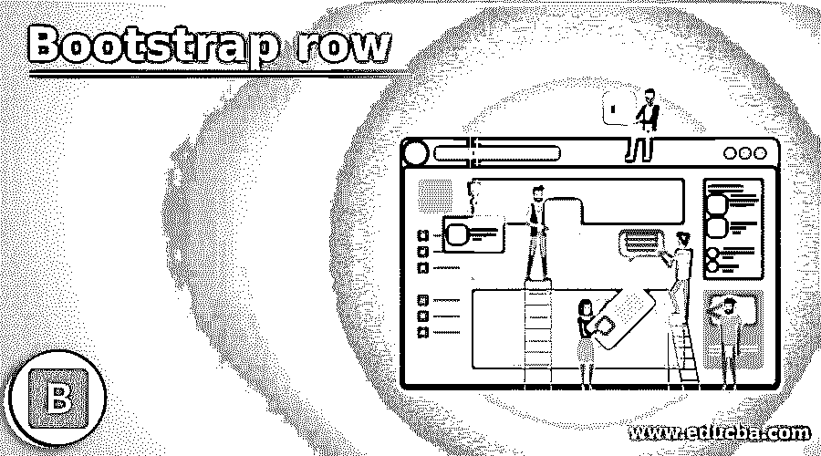
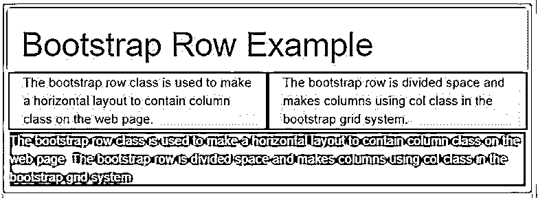
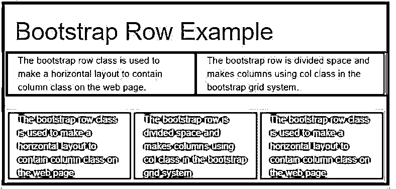

# 引导行

> 原文：<https://www.educba.com/bootstrap-row/>




## 引导行介绍

引导行是引导网格系统中保存列类的基本元素。它用于 web 应用程序的容器类中的水平分区。bootstrap row 类用于在网页上创建包含 column 类的水平布局。在 bootstrap 网格系统中，使用 col 类划分空间并生成列。

**语法**

<small>网页开发、编程语言、软件测试&其他</small>

*   在每一个网页上做一个吸引人又似是而非的 web 应用都是有用的。
*   容器和容器流体包含一个或多个单行类。
*   基本的引导行使用 row 类，语法如下。

```
<div class = "container">
<div class = "row">
...
</div>
</div>
```

*   row 类包含列，它构成了一个响应性的网站或 web 应用程序。

```
<div class = "container">
<div class = "row">
<div class = "col-sm-8"></div>
<div class = "col-sm-8"></div>
</div>
</div>
```

*   这些列用于小屏幕设备，构成网页中行的两个部分。
*   在一个容器中使用了多行类，语法如下。

```
<div class = "container">
<div class = "row">
<div class = "col-sm-8"></div>
<div class = "col-sm-8"></div>
</div>
<div class = "row">
<div class="col-sm-4"></div>
<div class = "col-sm-4"></div>
<div class = "col-sm-4"></div>
</div>
</div>
```

### row 在 Bootstrap 中是如何工作的？

bootstrap 需要某些 HTML 和 CSS 元素来获取 bootstrap 偏移量。

*   HTML 文件是在 web 应用程序中创建的，HTML 文件中需要标签。

bootstrap 是一种响应性技术，可以查看各种规模设备的应用程序。

下面的标签对响应式网页设计很有用。

```
<meta name = "viewport" content = "width=device-width, initial-scale = 1">
```

bootstrap 添加了一些受支持的在线文件，以获得用于高级设计的 bootstrap 元素和实用程序。

以下三个文件是用于引导偏移的引导文件。

```
<link rel= "stylesheet" href = "https://maxcdn.bootstrapcdn.com/bootstrap/3.4.1/css/bootstrap.min.css">
<script src = "https://ajax.googleapis.com/ajax/libs/jquery/3.5.1/jquery.min.js">
</script>
<script src = "https://maxcdn.bootstrapcdn.com/bootstrap/3.4.1/js/bootstrap.min.js">
</script>
```

该语法用于网页的正文部分。

```
<div class = "container">
<div class = "row">
...
</div>
</div>
```

自举偏移工作程序如下。

```
<!DOCTYPE html>
<html>
<head>
<title> Bootstrap offset Example </title>
<meta name = "viewport" content = "width =device-width, initial-scale= 1">
<link rel ="stylesheet" href =          "https://maxcdn.bootstrapcdn.com/bootstrap/3.4.1/css/bootstrap.min.css">
<script src = "https://ajax.googleapis.com/ajax/libs/jquery/3.5.1/jquery.min.js">
</script>
<script src = "https://maxcdn.bootstrapcdn.com/bootstrap/3.4.1/js/bootstrap.min.js">
</script>
</head>
<body>
<div class = "container">
<div class = "row">
<div class = "col-sm-6"> column1 </div>
<div class = "col-sm-6">column2 </div>
</div>
</div>
</body>
</html>
```

### 例子

下面提到了不同的例子:

#### 示例#1

基本的引导行示例和输出如下。

**代码:**

```
<!DOCTYPE html>
<html>
<head>
<title> Bootstrap Row Example </title>
<meta charset = "utf-8">
<meta name = "viewport" content = "width=device-width, initial-scale=1">
<link rel = "stylesheet" href = "https://maxcdn.bootstrapcdn.com/bootstrap/3.4.1/css/bootstrap.min.css">
<script src = "https://ajax.googleapis.com/ajax/libs/jquery/3.5.1/jquery.min.js">
</script>
<script src = "https://maxcdn.bootstrapcdn.com/bootstrap/3.4.1/js/bootstrap.min.js">
</script>
</head>
<body>
<div class = "container-fluid">
<h1> Bootstrap Row Example </h1>
<div class = "row" style = "background-color: lightgrey">
The bootstrap row class is used to make a horizontal layout to contain column class on the web page.
The bootstrap row is divided space and makes columns using col class in the bootstrap grid system.
</div>
</div>
</body>
</html>
```

**输出:**


**说明:**

*   这是有反应的，以浅灰色显示。
*   row 类放在 container-fluid 类的内部，并应用背景颜色样式。

#### 实施例 2

列示例和输出如下。

**代码:**

```
<!DOCTYPE html>
<html>
<head>
<title> Bootstrap Row Example </title>
<meta charset = "utf-8">
<meta name = "viewport" content = "width=device-width, initial-scale=1">
<link rel = "stylesheet" href = "https://maxcdn.bootstrapcdn.com/bootstrap/3.4.1/css/bootstrap.min.css">
<script src = "https://ajax.googleapis.com/ajax/libs/jquery/3.5.1/jquery.min.js">
</script>
<script src = "https://maxcdn.bootstrapcdn.com/bootstrap/3.4.1/js/bootstrap.min.js">
</script>
</head>
<body>
<div class = "container-fluid">
<h1> Bootstrap Row Example </h1>
<div class = "row" style = "background-color: lightgrey">
<div class = "col-sm-6" style = "border: 2px solid red">
The bootstrap row class is used to make a horizontal layout to contain column class on the web page.
</div>
<div class = "col-sm-6" style = "border: 2px solid red">
The bootstrap row is divided space and makes columns using col class in the bootstrap grid system.
</div>
</div>
</div>
</body>
</html>
```

**输出:**


**说明:**

*   根据设备大小，该行可以包含多于两列和少于十二列。

#### 实施例 3

一个以上的引导行示例和输出。

**代码:**

```
<!DOCTYPE html>
<html>
<head>
<title> Bootstrap Row Example </title>
<meta charset = "utf-8">
<meta name = "viewport" content = "width=device-width, initial-scale=1">
<link rel = "stylesheet" href="https://maxcdn.bootstrapcdn.com/bootstrap/3.4.1/css/bootstrap.min.css">
<script src = "https://ajax.googleapis.com/ajax/libs/jquery/3.5.1/jquery.min.js">
</script>
<script src = "https://maxcdn.bootstrapcdn.com/bootstrap/3.4.1/js/bootstrap.min.js">
</script>
</head>
<body>
<div class = "container-fluid" style = "border: 5px solid cyan">
<h1> Bootstrap Row Example </h1>
<div class = "row" style = "background-color: lightgrey">
<div class = "col-sm-6" style = "border: 2px solid red">
The bootstrap row class is used to make a horizontal layout to contain column class on the web page.
</div>
<div class = "col-sm-6" style = "border: 2px solid red">
The bootstrap row is divided space and makes columns using col class in the bootstrap grid system.
</div>
</div>
<div class = "row" style = "background-color: grey; color: white; border: 2px solid yellow">
The bootstrap row class is used to make a horizontal layout to contain column class on the web page.
The bootstrap row is divided space and makes columns using col class in the bootstrap grid system.
</div>
</div>
</body>
</html>
```

**输出:**




**说明:**

*   row 类放在 container-fluid 类的内部，该类有一个青色的粗边框。
*   输出中第一行是浅灰色，第二行是灰色。

#### 实施例 4

不同引导行中的多列示例和输出。

**代码:**

```
<!DOCTYPE html>
<html>
<head>
<title> Bootstrap Row Example </title>
<meta charset = "utf-8">
<meta name = "viewport" content = "width=device-width, initial-scale=1">
<link rel = "stylesheet" href="https://maxcdn.bootstrapcdn.com/bootstrap/3.4.1/css/bootstrap.min.css">
<script src = "https://ajax.googleapis.com/ajax/libs/jquery/3.5.1/jquery.min.js">
</script>
<script src = "https://maxcdn.bootstrapcdn.com/bootstrap/3.4.1/js/bootstrap.min.js">
</script>
</head>
<body>
<div class = "container-fluid" style = "border: 5px solid green">
<h1> Bootstrap Row Example </h1>
<div class = "row" style = "background-color: lightgrey; border: 2px solid red">
<div class = "col-sm-6" style = "border: 2px solid red">
The bootstrap row class is used to make a horizontal layout to contain column class on the web page.
</div>
<div class = "col-sm-6" style = "border: 2px solid red">
The bootstrap row is divided space and makes columns using col class in the bootstrap grid system.
</div>
</div>
<br>
<div class = "row" style = "background-color: grey; color: white ; border: 2px solid yellow">
<div class = "col-sm-4" style = "border: 2px solid yellow">
The bootstrap row class is used to make a horizontal layout to contain column class on the web page.
</div>
<div class = "col-sm-4" style = "border: 2px solid yellow">
The bootstrap row is divided space and makes columns using col class in the bootstrap grid system.
</div>
<div class = "col-sm-4" style = "border: 2px solid yellow">
The bootstrap row class is used to make a horizontal layout to contain column class on the web page.
</div>
</div>
</div>
</body>
</html>
```

**输出:**




### 结论

它是 web 应用程序中间隔和调整元素、图像的重要部分。它用于使 web 应用程序对用户友好和有吸引力。它使格式化和似是而非的网络应用。

### 推荐文章

这是引导行的指南。这里我们讨论引言；row 在 bootstrap 中是如何工作的？和示例。您也可以看看以下文章，了解更多信息–

1.  [引导页面布局](https://www.educba.com/bootstrap-page-layout/)
2.  [自举输入类型](https://www.educba.com/bootstrap-input-type/)
3.  [引导所见即所得](https://www.educba.com/bootstrap-wysiwyg/)
4.  [引导左侧菜单](https://www.educba.com/bootstrap-left-menu/)


