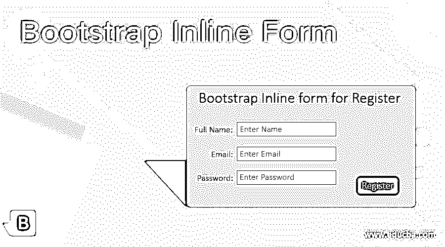

# 引导内嵌表单

> 原文：<https://www.educba.com/bootstrap-inline-form/>




## 引导程序内联形式的定义

自举内嵌表单对于 web 应用程序用户和创建者之间的交流非常有用。引导内联表单与标签和元素一起显示在一行中。它水平显示元素、属性和标签，左侧对齐。这是一个在最小空间和最小尺寸的 web 应用程序中在用户和开发者之间进行交互的组件。这对于使用按钮从用户那里获取信息非常有用。

**语法:**

<small>网页开发、编程语言、软件测试&其他</small>

*   内嵌表单在 HTML 页面的 body 部分使用 form 标记。
*   “form-inline”类对于内联表单是必不可少的。
*   “form-inline”类放在

    <form>元素的内部。</form>

*   下面是基本的内嵌表单语法，包括表单标签和内嵌表单类。

```
<form class = "form-inline"> form tags and attributes </form>
```

*   内联表单使用<input>标签及其属性进行用户输入。

```
<form class = "form-inline">
```

*   “form-control”类对于控制输入信息很有用。它在<input>标签的内部。

```
<input type = "search" class = "form-control" placeholder = "search here">
</form>
```

*   内联表单需要<button>标签和它们所需的类来进行信息收集。</button>

```
<form class = "form-inline">
<input type = "search" class = "form-control" placeholder = "search here">
<button type = "submit" class = "btn btn-info"> Search </button>
</form>
```

*   Bootstrap3 使用 class="form-group "进行验证，并调整属性和标记。

```
<form class = "form-inline">
<div class="form-group">
<input type = "search" class = "form-control" placeholder = "search here">
</div>
<button type = "submit" class = "btn btn-info"> Search </button>
</form>
```

### 内联表单如何在 Bootstrap 中工作？

有两种方法可以处理内嵌表单。

#### 方法 1

*   bootstrap3 支持文件添加在 HTML 页面的 head 部分。

```
<meta name = "viewport" content = "width=device-width, initial-scale=1">
<link rel = "stylesheet" href = "https://maxcdn.bootstrapcdn.com/bootstrap/3.4.1/css/bootstrap.min.css">
<script src = "https://ajax.googleapis.com/ajax/libs/jquery/3.5.1/jquery.min.js">
</script>
<script src = "https://maxcdn.bootstrapcdn.com/bootstrap/3.4.1/js/bootstrap.min.js">
</script>
```

*   bootstrap3 内联表单语法放在 HTML 页面的 body 部分。

```
<form class = "form-inline">
<div class = "form-group">
<input type = "search" class = "form-control" placeholder = "search here">
</div>
<button type = "submit" class = "btn btn-info"> Search </button>
</form>
```

#### 方法 2

bootstrap4 支持文件添加在 HTML 页面的 head 部分。

```
<link rel = "stylesheet" href = "https://maxcdn.bootstrapcdn.com/bootstrap/4.5.2/css/bootstrap.min.css">
<script src = "https://ajax.googleapis.com/ajax/libs/jquery/3.5.1/jquery.min.js">
</script>
<script src = "https://cdnjs.cloudflare.com/ajax/libs/popper.js/1.16.0/umd/popper.min.js">
</script>
<script src = "https://maxcdn.bootstrapcdn.com/bootstrap/4.5.2/js/bootstrap.min.js">
</script>
```

*   bootstrap4 内联表单语法放在 html 页面的 body 部分。

```
<form class = "form-inline">
<input type = "search" class = "form-control" placeholder = "search here">
<button type = "submit" class = "btn btn-info"> Search </button>
</form>
```

*   bootstrap4 内联表单工作方法组合如下。

```
<!DOCTYPE html>
<html>
<head>
<title>Bootstrap inline form Example</title>
<meta charset="utf-8">
<meta name = "viewport" content = "width=device-width, initial-scale=1">
<link rel = "stylesheet" href = "https://maxcdn.bootstrapcdn.com/bootstrap/4.5.2/css/bootstrap.min.css">
<script src = "https://ajax.googleapis.com/ajax/libs/jquery/3.5.1/jquery.min.js">
</script>
<script src = "https://cdnjs.cloudflare.com/ajax/libs/popper.js/1.16.0/umd/popper.min.js">
</script>
<script src = "https://maxcdn.bootstrapcdn.com/bootstrap/4.5.2/js/bootstrap.min.js">
</script>
</head>
<body>
<div class="container">
<h2> Bootstrap Inline form for login </h2>
<form class = "form-inline">
<input type = "search" class = "form-control" placeholder = "search here">
<button type = "submit" class = "btn btn-info"> Search </button>
</form>
</div>
</body>
</html>
```

### 例子

登录示例和输出的 bootstrap4 内联表单。

#### 示例#1

**代码:**

```
<!DOCTYPE html>
<html>
<head>
<title>Bootstrap inline form Example</title>
<meta charset="utf-8">
<meta name = "viewport" content = "width=device-width, initial-scale=1">
<link rel = "stylesheet" href = "https://maxcdn.bootstrapcdn.com/bootstrap/4.5.2/css/bootstrap.min.css">
<script src = "https://ajax.googleapis.com/ajax/libs/jquery/3.5.1/jquery.min.js">
</script>
<script src = "https://cdnjs.cloudflare.com/ajax/libs/popper.js/1.16.0/umd/popper.min.js">
</script>
<script src = "https://maxcdn.bootstrapcdn.com/bootstrap/4.5.2/js/bootstrap.min.js">
</script>
</head>
<body>
<div class="container">
<h2> Bootstrap Inline form for login </h2>
<form class="form-inline">
<label for="userid"> UserId: </label>
<input type="text" class="form-control" placeholder="Enter userId" id="userid">
<label for="password"> Password: </label>
<input type="password" class="form-control" placeholder="Enter password" id="password">
<button type="submit" class="btn btn-primary"> Login </button>
</form>
</div>
</body>
</html>
```

**输出:**


#### 实施例 2

带边距的内联形式示例和输出。

**代码:**

```
<!DOCTYPE html>
<html>
<head>
<title> Bootstrap inline form Example
</title>
<meta charset="utf-8">
<meta name = "viewport" content = "width=device-width, initial-scale=1">
<link rel = "stylesheet" href = "https://maxcdn.bootstrapcdn.com/bootstrap/4.5.2/css/bootstrap.min.css">
<script src = "https://ajax.googleapis.com/ajax/libs/jquery/3.5.1/jquery.min.js">
</script>
<script src = "https://cdnjs.cloudflare.com/ajax/libs/popper.js/1.16.0/umd/popper.min.js">
</script>
<script src = "https://maxcdn.bootstrapcdn.com/bootstrap/4.5.2/js/bootstrap.min.js">
</script>
</head>
<body>
<div class = "container">
<h2> Bootstrap Inline form for Register </h2>
<form class = "form-inline">
<label for = "user" class = "mr-md-3"> FullName: </label>
<input type = "text" class = "form-control mt-2 mr-md-3" placeholder = "Enter Name" id = "user">
<label for = "email" class = "mr-md-3"> Email :</label>
<input type = "email" class = "form-control mt-2 mr-md-3" placeholder = "Enter email" id = "email">
<label for = "pass" class = "mr-md-3"> Password: </label>
<input type = "password" class = "form-control mt-2 mr-md-3" placeholder = "Enter password" id = "pass">
<button type = "submit" class = "btn btn-info mt-2"> Register </button>
</form>
</div>
</body>
</html>
```

**输出:**


**描述:**

“mt-2”类对于输入标签中的 size2 的 top martin 很有用。“mr-md-3”类适用于输入标签中尺寸为 3 的中型屏幕设备。

#### 实施例 3

bootstrap3 内联窗体示例和输出。

**代码:**

```
<!DOCTYPE html>
<html >
<head>
<title> Bootstrap inline form Example </title>
<meta charset="utf-8">
<meta name = "viewport" content = "width=device-width, initial-scale=1">
<link rel = "stylesheet" href = "https://maxcdn.bootstrapcdn.com/bootstrap/3.4.1/css/bootstrap.min.css">
<script src = "https://ajax.googleapis.com/ajax/libs/jquery/3.5.1/jquery.min.js">
</script>
<script src = "https://maxcdn.bootstrapcdn.com/bootstrap/3.4.1/js/bootstrap.min.js">
</script>
</head>
<body>
<div class = "container">
<h2> Bootstrap Inline form</h2>
<form class = "form-inline">
<div class = "form-group">
<label> Email: </label>
<input type = "email" class = "form-control" id = "email" placeholder = "Enter Email Id here.">
</div>
<button type = "button" class = "btn btn-success"> SubScribe </button>
</form>
</div>
</body>
</html>
```

**输出:**


#### 实施例 4

带有 sr-only 类示例和输出的 bootstrap 内联形式。

**代码:**

```
<!DOCTYPE html>
<html>
<head>
<title> Bootstrap Inline Form Example </title>
<meta name = "viewport" content = "width=device-width, initial-scale=1">
<link rel = "stylesheet" href = "https://maxcdn.bootstrapcdn.com/bootstrap/3.4.1/css/bootstrap.min.css">
<script src = "https://ajax.googleapis.com/ajax/libs/jquery/3.5.1/jquery.min.js">
</script>
<script src = "https://maxcdn.bootstrapcdn.com/bootstrap/3.4.1/js/bootstrap.min.js">
</script>
</head>
<body>
<div class = "container">
<h2> Bootstrap Inline form </h2>
<form class = "form-inline">
<div class = "form-group">
<label class = "sr-only" for = "user"> UserName: </label>
<input type = "text" class = "form-control" id = "user" placeholder = "Enter User Name" >
</div>
<div class="form-group">
<label class = "sr-only" for = "password"> Password: </label>
<input type = "password" class = "form-control" id = "password" placeholder="Enter password">
</div>
<button type = "submit" class = "btn btn-primary"> Sine In </button>
</form>
</div>
</body>
</html>
```

**输出:**


**描述:**

class = "sr-only "用于隐藏用户的名称，并且仅用于 web 应用程序的重组。

### 结论

*   这是交流和收集用户信息的最简单的方式。
*   它有助于在 web 应用程序中以最小的空间和内存与用户进行交互。

### 推荐文章

这是一个引导内联表单的指南。这里我们讨论定义、方法、内联表单如何在 Bootstrap 中工作，以及代码实现的例子。您也可以看看以下文章，了解更多信息–

1.  [引导多选](https://www.educba.com/bootstrap-multiselect/)
2.  [引导排序表](https://www.educba.com/bootstrap-sort-table/)
3.  [引导列表组](https://www.educba.com/bootstrap-list-group/)
4.  [引导页面布局](https://www.educba.com/bootstrap-page-layout/)


